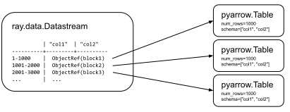

.. _data_key_concepts:

============
Key Concepts
============

.. _datastream_concept:

----------
Datastream
----------

A :term:`Datastream <Datastream (object)>` operates over a sequence of Ray object references to :term:`blocks <Block>`.
Each block holds a set of items in an `Arrow table <https://arrow.apache.org/docs/python/data.html#tables>`_,
`pandas DataFrame <https://pandas.pydata.org/docs/reference/frame.html>`_, or Python list.
Having multiple blocks in a datastream allows for parallel transformation and ingest.

For ML use cases, Datastream also natively supports mixing :ref:`Tensors <data_tensor_support>` and tabular data.

The following figure visualizes a datastream with three blocks, each holding 1000 rows. Note that certain blocks
may not be computed yet. Normally, callers iterate over datastream blocks in a streaming fashion, so that not all
blocks need to be materialized in the cluster memory at once.

..
  https://docs.google.com/drawings/d/1PmbDvHRfVthme9XD7EYM-LIHPXtHdOfjCbc1SCsM64k/edit

Reading Data
============

Datastream uses Ray tasks to read data from remote storage in parallel. Each read task reads one or more files and produces an output block:

.. image:: images/datastream-read.svg
   :align: center

..
  https://docs.google.com/drawings/d/15B4TB8b5xN15Q9S8-s0MjW6iIvo_PrH7JtV1fL123pU/edit

You can manually specify the number of read tasks, but the final parallelism is always capped by the number of files in the underlying datastream.

For an in-depth guide on creating datastreams, read :ref:`Loading Data <creating_datastreams>`.

Transforming Data
=================

Datastream uses either Ray tasks or Ray actors to transform data blocks. By default, it uses tasks.

To use Actors, pass an :class:`ActorPoolStrategy` to ``compute`` in methods like
:meth:`~ray.data.Datastream.map_batches`. :class:`ActorPoolStrategy` creates an autoscaling
pool of Ray actors. This allows you to cache expensive state initialization
(e.g., model loading for GPU-based tasks).

.. image:: images/datastream-map.svg
   :align: center
..
  https://docs.google.com/drawings/d/12STHGV0meGWfdWyBlJMUgw7a-JcFPu9BwSOn5BjRw9k/edit

For an in-depth guide on transforming datastreams, read :ref:`Transforming Data <transforming_datastreams>`.

Shuffling Data
==============

Operations like :meth:`~ray.data.Datastream.sort` and :meth:`~ray.data.Datastream.groupby`
require blocks to be partitioned by value or *shuffled*. Datastream uses tasks to shuffle blocks in a map-reduce
style: map tasks partition blocks by value and then reduce tasks merge co-partitioned
blocks.

Call :meth:`~ray.data.Datastream.repartition` to change the number of blocks in a :class:`~ray.data.Datastream`.
Repartition has two modes:

* ``shuffle=False`` - performs the minimal data movement needed to equalize block sizes
* ``shuffle=True`` - performs a full distributed shuffle

.. image:: images/datastream-shuffle.svg
   :align: center

..
  https://docs.google.com/drawings/d/132jhE3KXZsf29ho1yUdPrCHB9uheHBWHJhDQMXqIVPA/edit

Datastream can shuffle multi-terabyte datasets, leveraging the Ray object store for disk spilling. For an in-depth guide on shuffle performance, read :ref:`Performance Tips and Tuning <shuffle_performance_tips>`.
Note that operations like shuffle materialize the entire Datastream prior to their execution (shuffle execution is not streamed through memory).

Iteration and materialization
=============================

Most transformations on a datastream are lazy. They don't execute until you iterate over the datastream or call
:meth:`Datastream.materialize() <ray.data.Datastream.materialize>`. When a Datastream is materialized, its
type becomes a `MaterializedDatastream`, which indicates that all its blocks are materialized in Ray
object store memory.

Datastream transformations are executed in a streaming way, incrementally on the data and
with operators processed in parallel, see :ref:`Streaming Execution <streaming_execution>`.

Datastreams and MaterializedDatastreams can be freely passed between Ray tasks, actors, and libraries without
incurring copies of the underlying block data (pass by reference semantics).

Fault tolerance
===============

Datastream performs *lineage reconstruction* to recover data. If an application error or
system failure occurs, Datastream recreates lost blocks by re-executing tasks. If ``compute=ActorPoolStrategy(size=n)`` is used, then Ray
will restart the actor used for computing the block prior to re-executing the task. 

Fault tolerance is not supported if the original worker process that created the Datastream dies.
This is because the creator stores the metadata for the :ref:`objects <object-fault-tolerance>` that comprise the Datastream.
