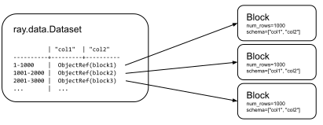
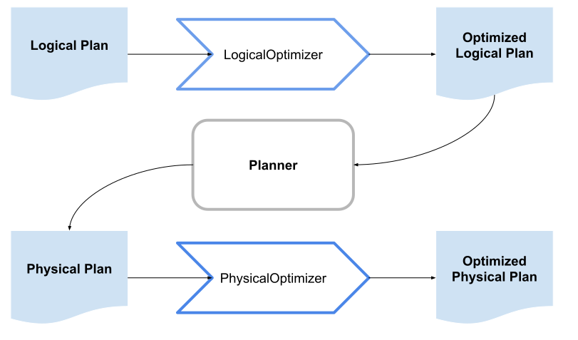
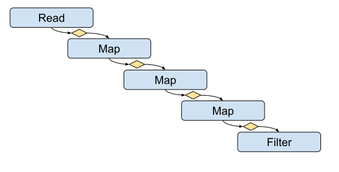

.. _data_key_concepts:

=======================
How does Ray Data work?
=======================

This page provides a conceptual overview of the architecture and execution model for Ray Data. Understanding these technical details can be useful when designing, debugging, and optimizing Ray applications.

To get started working with Ray Data, see :ref:`Ray Data basics<data_quickstart>`.

For recommendations on optimizing Ray Data workloads, see :ref:`Performance tips and tuning<data_performance_tips>`.

How does Ray Data relate to the rest of Ray?
============================================

Ray Data is one of the Ray AI Libraries. Ray AI libraries build on top of Ray Core primitives to provide developer-friendly APIs for completing common data, ML, and AI tasks. To learn about Ray Core primitives, see :ref:`Ray Core key concepts<core-key-concepts>`.

The follow diagram provides a high-level view of the Ray framework:

.. image:: ../ray-overview/images/map-of-ray.svg
   :align: center
   :alt: Ray framework architecture

Ray Data contains operators focused on the following key tasks:

- Loading data from storage.
- Ingesting data from connected systems.
- Exchanging data from other framework and data structures.
- Transforming and preprocessing data.
- Performing offline batch inference.
- Persisting results to storage or integrated systems.
- Pipelining data for Ray Train.

Ray Data uses the :class:`~ray.data.Dataset` abstraction to map common data operations to Ray Core primitives. 

Ray Train is optimized to work on Ray Datasets. See :ref:`Process large datasets as streams<streaming-execution>`. 

How does Ray Data distribute data?
---------------------------------- 

Ray Data holds the :class:`~ray.data.Dataset` on the process that triggers execution (which is usually the entrypoint of the program, referred to as the :term:`driver`) and stores the blocks as objects in Ray's shared-memory :ref:`object store <objects-in-ray>`.

The following figure visualizes a dataset with three blocks, each holding 1000 rows.

..
  https://docs.google.com/drawings/d/1kOYQqHdMrBp2XorDIn0u0G_MvFj-uSA4qm6xf9tsFLM/edit

.. _dataset_conceptual:

What is a Ray Dataset?
----------------------

Use Datasets to interact with data. The following are examples

* 

`Dataset` is the main user-facing Python API. It represents a distributed data collection and define data loading and processing operations. Users typically use the API by:

1. Create a :class:`Dataset <ray.data.Dataset>` from external storage or in-memory data.
2. Apply transformations to the data.
3. Write the outputs to external storage or feed the outputs to training workers.

The Dataset API is lazy, meaning that operations aren't executed until you materialize or consume the dataset,
like :meth:`~ray.data.Dataset.show`. This allows Ray Data to optimize the execution plan
and execute operations in a pipelined streaming fashion.

What does a block represent in Ray?
-----------------------------------

Ray Data uses _blocks_ to represent subsets of data in a Dataset. Most users of Ray Data 

Blocks have the following characteristics:

* Each record or row in a Dataset is only present in one block.
* Blocks are distributed across the cluster for independent processing.
* Blocks are processed in parallel and sequentially, depending on the operations present in an application.

If you're troubleshooting or optimizing Ray Data workloads, consider the following details and special cases:

* The number of row or records in a block varies base on the size of each record. Most blocks are between 1 MiB and 128 MiB.
  * Ray automatically splits blocks into smaller blocks if they exceed the max block size by 50% or more.
  * A block might only contain a single record if your data is very wide or contains a large record such as an image, vector, or tensor. Ray Data has built-in optimizations for handling large data efficiently, and you should test workloads with built-in defaults before trying to manually optimize your workload.
  * You can configure block size and splitting behaviors. See :ref:`Block size and performance<block_size>`.
* Ray uses :ref:`Arrow tables<https://arrow.apache.org/docs/cpp/tables.html>` to internally represent blocks of data.
  * Ray Data falls back to pandas DataFrames for data that cannot be safely represented using Arrow tables. See :ref:`Arrow and pandas type differences<https://arrow.apache.org/docs/python/pandas.html#type-differences>`.
  * Block format doesn't affect the of data type returned by APIs such as :meth:`~ray.data.Dataset.iter_batches`.

.. _plans:

How does Ray Data plan and execute operations?
----------------------------------------------

Ray Data uses a two-phase planning process to execute operations efficiently. When you write a program using the Dataset API, Ray Data first builds a *logical plan* - a high-level description of what operations to perform. When execution begins, it converts this into a *physical plan* that specifies exactly how to execute those operations.

This diagram illustrates the complete planning process:

.. https://docs.google.com/drawings/d/1WrVAg3LwjPo44vjLsn17WLgc3ta2LeQGgRfE8UHrDA0/edit

The building blocks of these plans are operators:

* Logical plans consist of *logical operators* that describe *what* operation to perform. For example, ``ReadOp`` specifies what data to read.
* Physical plans consist of *physical operators* that describe *how* to execute the operation. For example, ``TaskPoolMapOperator`` launches Ray tasks to actually read the data.

Here is a simple example of how Ray Data builds a logical plan. As you chain operations together, Ray Data constructs the logical plan behind the scenes:

.. testcode::
    import ray

    dataset = ray.data.range(100)
    dataset = dataset.add_column("test", lambda x: x["id"] + 1)
    dataset = dataset.select_columns("test")

You can inspect the resulting logical plan by printing the dataset:

.. code-block::

    Project
    +- MapBatches(add_column)
       +- Dataset(schema={...})

When execution begins, Ray Data optimizes the logical plan, then translate it into a physical plan - a series of operators that implement the actual data transformations. During this translation:

1. A single logical operator may become multiple physical operators. For example, ``ReadOp`` becomes both ``InputDataBuffer`` and ``TaskPoolMapOperator``.
2. Both logical and physical plans go through optimization passes. For example, ``OperatorFusionRule`` combines map operators to reduce serialization overhead.

Physical operators work by:

* Taking in a stream of block references
* Performing their operation (either transforming data with Ray Tasks/Actors or manipulating references)
* Outputting another stream of block references

For more details on Ray Tasks and Actors, see :ref:`Ray Core Concepts <core-key-concepts>`.

.. note:: A dataset's execution plan only runs when you materialize or consume the dataset through operations like :meth:`~ray.data.Dataset.show`.

.. _streaming-execution:

Process large datasets as streams
---------------------------------

Ray Data uses a *streaming execution model* to efficiently process large datasets. With streaming execution, Ray processes data in a streaming fashion through a pipeline of operations rather than materializing the entire dataset in memory at once. 

* The physical plan represents each operator as a stage in a pipeline.
* Each stage has an input queue of blocks of data to process.
* Each stage writes results as blocks of data in an output queue.
* Output queues become input queues for the next stage in the pipeline.
* Each block of data is processed independently at each stage.
* Any stage with data present in its input queue is eligible for scheduling.

The streaming execution model  

Because many frameworks supported by Ray Train also support this streaming execution model, Ray can optimize a physical plan for streaming execution from data loading and preprocessing steps all the way through model training. Offline batch inference also uses streaming execution, allowing for efficient model predictions on large datasets with reduced memory and compute requirements.

.. note::

   Models, frameworks, or algorithms that must materialize the entire dataset to calculate results are not optimized for streaming execution.
   
   Ray Train provides integrations with many common ML and AI frameworks to efficiently distribute training and support streaming execution for model training. See :ref:`Ray Train<train-docs>`.

The following is a simple code example  demonstrate the streaming execution model. , applies a map and filter transformation, and then calls the ``show`` action to trigger the pipeline:

.. testcode::

    import ray

    # Create a dataset with 1K rows
    ds = ray.data.read_csv("s3://anonymous@air-example-data/iris.csv")

    # Define a pipeline of operations
    ds = ds.map(lambda x: {"target1": x["target"] * 2})
    ds = ds.map(lambda x: {"target2": x["target1"] * 2})
    ds = ds.map(lambda x: {"target3": x["target2"] * 2})
    ds = ds.filter(lambda x: x["target3"] % 4 == 0)

    # Data starts flowing when you call a method like show()
    ds.show(5)

The following is a simplified view of the resultant logical plan:

.. code-block::

    Filter(<lambda>)
    +- Map(<lambda>)
       +- Map(<lambda>)
          +- Map(<lambda>)
             +- Dataset(schema={...})

This logical plan maps to the following streaming topology:

.. https://docs.google.com/drawings/d/10myFIVtpI_ZNdvTSxsaHlOhA_gHRdUde_aHRC9zlfOw/edit

In the streaming execution model, operators are connected in a pipeline, with each operator's output queue feeding directly into the input queue of the next downstream operator. This creates an efficient flow of data through the execution plan.

The streaming execution model provides significant advantages for data processing.

In particular, the pipeline architecture enables multiple stages to execute concurrently, improving overall performance and resource utilization. For example, if the map operator requires GPU resources, the streaming execution model can execute the map operator concurrently with the filter operator (which may run on CPUs), effectively utilizing the GPU through the entire duration of the pipeline.

To summarize, Ray Data's streaming execution model can efficiently process datasets that are much larger than available memory while maintaining high performance through parallel execution across the cluster.

.. note::
   Operations that need to evaluate, compare, or aggregate the entire dataset create processing bottlenecks for streaming execution. Examples include :meth:`ds.sort() <ray.data.Dataset.sort>` and :meth:`ds.groupby() <ray.data.Dataset.groupby>`.
   
   Ray must materialize the entire dataset to complete these operations, which interupts stream pipeline processing and might lead to significant spill or out-of-memory errors.

   Consider refactoring workloads to remove unnecessary operations that require full dataset materialization. For example, the distributed model used by Ray does not persist ordered results between stages or guarantee that sorting is preserved on write. For many workloads, removing a :meth:`ds.sort() <ray.data.Dataset.sort>` operation can eliminate significant overhead without impacting results in any way.
   
You can read more about the streaming execution model in this `blog post <https://www.anyscale.com/blog/streaming-distributed-execution-across-cpus-and-gpus>`__.
