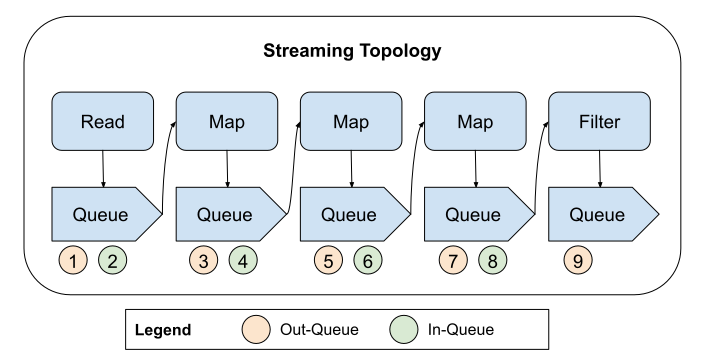

.. _data_key_concepts:

Key Concepts
============

Datasets and blocks
-------------------

There are two main concepts in Ray Data:

* Datasets
* Blocks

`Datasets` is the main user-facing Python API. They represent a distributed data collection and define data loading and processing operations. Users typically use the API by:

1. Create a :class:`Dataset <ray.data.Dataset>` from external storage or in-memory data.
2. Apply transformations to the data.
3. Write the outputs to external storage or feed the outputs to training workers.

The Dataset API is lazy, meaning that operations aren't executed until you call an action
like :meth:`~ray.data.Dataset.show`. This allows Ray Data to optimize the execution plan
and execute operations in parallel.

*Blocks* are the basic unit of data that Ray Data operates on. A block is a contiguous
subset of rows from a dataset.

The following figure visualizes a dataset with three blocks, each holding 1000 rows.
Ray Data holds the :class:`~ray.data.Dataset` on the process that triggers execution
(which is usually the entrypoint of the program, referred to as the *driver*)
and stores the blocks as objects in Ray's shared-memory
:ref:`object store <objects-in-ray>`. Underneath the hood, blocks are represented as
Pandas Dataframes or Arrow tables.

..
  https://docs.google.com/drawings/d/1kOYQqHdMrBp2XorDIn0u0G_MvFj-uSA4qm6xf9tsFLM/edit

Plans and operators
-------------------

When a user writes a program using the Dataset API, a *logical plan* is constructed underneath the hood.

A *logical plan* represents a sequence of data transformations, each of which is represented by a *logical operator*. For example, a ``Map`` operator represents applying a function to each row of the dataset, and a ``Project`` operator represents selecting a subset of columns from the dataset.

Here is an example of a Ray Data program and its corresponding logical plan:

.. code-block:: python

    dataset = ray.data.read_csv("s3://my-bucket/my-file.csv")
    dataset = dataset.map(lambda x: x + 1)
    dataset = dataset.select_columns("col1")

The logical plan for this program, which you can expect by calling ``print(dataset)``, is:

.. code-block::

    Project
    +- Map(<lambda>)
       +- Dataset(schema={...})

When a dataset's execution plan is executed, the logical plan is optimized and transformed into a *physical plan* that in turn is also optimized. A *physical plan* is a graph of *physical operators*, which contain actual implementation of the data transformation and may also handle orchestration and execution across different Ray actors/workers. Read more about Ray actors and workers in :ref:`Ray Core Concepts <core-key-concepts>`.

Note that a dataset's execution plan is executed when a dataset is materialized or consumed.

See the below diagram for the planning process:

.. image:: images/get_execution_plan.png
   :width: 600
   :align: center

.. _streaming_execution_model:

Streaming execution model
-------------------------

Ray Data uses a *streaming execution model* to efficiently process large datasets.

Rather than materializing the entire dataset in memory at once,
Ray Data can process data in a streaming fashion through a pipeline of operations.

This is useful for inference and training workloads where the dataset can be too large to fit in memory and the workload doesn't require the entire dataset to be in memory at once.

Here is an example of how the streaming execution model works. Below we create a dataset with 1K rows, apply a map and filter transformation, and then call the ``show`` action to trigger the pipeline:

.. code-block:: python

    import ray

    # Create a dataset with 1K rows
    ds = ray.data.read_csv("s3://my-bucket/my-file.csv")

    # Define a pipeline of operations
    ds = ds.map(lambda x: {"col1": x["col1"] * 2})
    ds = ds.map(lambda x: {"col2": x["col2"] * 2})
    ds = ds.map(lambda x: {"col3": x["col3"] * 2})
    ds = ds.filter(lambda x: x["col1"] % 4 == 0)

    # Data starts flowing when you call an action like show()
    ds.show(5)

This will create a logical plan like the following:

.. code-block::

    Filter(<lambda>)
    +- Map(<lambda>)
       +- Map(<lambda>)
          +- Map(<lambda>)
             +- Dataset(schema={...})

The streaming topology will look like the following:

In the streaming execution model, operators are connected in a pipeline, with each operator's output queue feeding directly into the input queue of the next downstream operator. This creates an efficient flow of data through the execution plan.

The streaming execution model provides significant advantages for data processing.

In particular, the pipeline architecture enables multiple stages to execute concurrently, improving overall performance and resource utilization. For example, if the map operator requires GPU resources, the streaming execution model can execute the map operator concurrently with the filter operator (which may be run on CPUs), allowing the GPU to be utilized through the entire duration of the pipeline.

To summarize, Ray Data's streaming execution model can efficiently process datasets that are much larger than available memory while maintaining high performance through parallel execution across the cluster.

.. note::
   Operations like :meth:`ds.sort() <ray.data.Dataset.sort>` and :meth:`ds.groupby() <ray.data.Dataset.groupby>` require materializing data, which may impact memory usage for very large datasets.

