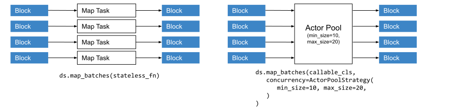
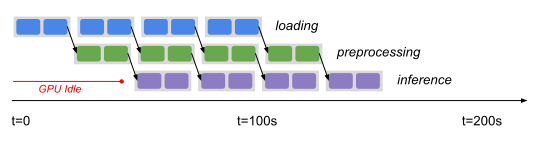

.. _data_key_concepts:

============
Key Concepts
============

.. _dataset_concept:

--------
Datasets
--------

A Dataset consists of a list of Ray object references to *blocks*.
Each block holds a set of items in either `Arrow table format <https://arrow.apache.org/docs/python/data.html#tables>`__
or a Python list (for non-tabular data).
For ML use cases, Datasets also natively supports mixing :ref:`Tensor <datasets_tensor_support>` and tabular data.
Having multiple blocks in a dataset allows for parallel transformation and ingest.

Informally, we refer to:

* A Dataset with Arrow blocks as a *Tabular Dataset*,
* A Dataset with Python list blocks as a *Simple Dataset*, and
* A Tabular Dataset with one or more tensor-type columns as a *Tensor Dataset*.

The following figure visualizes a tabular dataset with three blocks, each block holding 1000 rows each:

.. image:: images/dataset-arch.svg

..
  https://docs.google.com/drawings/d/1PmbDvHRfVthme9XD7EYM-LIHPXtHdOfjCbc1SCsM64k/edit

Since a Dataset is just a list of Ray object references, it can be freely passed between Ray tasks,
actors, and libraries like any other object reference.
This flexibility is a unique characteristic of Ray Datasets.

Reading Data
============

Datasets uses Ray tasks to read data from remote storage. When reading from a file-based datasource (e.g., S3, GCS), it creates a number of read tasks proportional to the number of CPUs in the cluster. Each read task reads its assigned files and produces an output block:

.. image:: images/dataset-read.svg
   :align: center

..
  https://docs.google.com/drawings/d/15B4TB8b5xN15Q9S8-s0MjW6iIvo_PrH7JtV1fL123pU/edit

The parallelism can also be manually specified, but the final parallelism for a read is always capped by the number of files in the underlying dataset. See the :ref:`Creating Datasets Guide <creating_datasets>` for an in-depth guide
on creating datasets.

Transforming Data
=================

Datasets can use either Ray tasks or Ray actors to transform datasets. By default, tasks are used. Actors can be specified using ``compute=ActorPoolStrategy()``, which creates an autoscaling pool of Ray actors to process transformations. Using actors allows for expensive state initialization (e.g., for GPU-based tasks) to be cached:

..
  https://docs.google.com/drawings/d/12STHGV0meGWfdWyBlJMUgw7a-JcFPu9BwSOn5BjRw9k/edit

See the :ref:`Transforming Datasets Guide <transforming_datasets>` for an in-depth guide
on transforming datasets.

Shuffling Data
==============

Certain operations like *sort* or *groupby* require data blocks to be partitioned by value, or *shuffled*. Datasets uses tasks to implement distributed shuffles in a map-reduce style, using map tasks to partition blocks by value, and then reduce tasks to merge co-partitioned blocks together.

You can also change just the number of blocks of a Dataset using :meth:`~ray.data.Dataset.repartition`.
Repartition has two modes:

1. ``shuffle=False`` - performs the minimal data movement needed to equalize block sizes
2. ``shuffle=True`` - performs a full distributed shuffle

.. image:: images/dataset-shuffle.svg
   :align: center

..
  https://docs.google.com/drawings/d/132jhE3KXZsf29ho1yUdPrCHB9uheHBWHJhDQMXqIVPA/edit

Datasets shuffle can scale to processing hundreds of terabytes of data. See the :ref:`Performance Tips Guide <shuffle_performance_tips>` for an in-depth guide on shuffle performance.

Fault tolerance
===============

Datasets relies on :ref:`task-based fault tolerance <task-fault-tolerance>` in Ray core. Specifically, a Dataset will be automatically recovered by Ray in case of failures. This works through *lineage reconstruction*: a Dataset is a collection of Ray objects stored in shared memory, and if any of these objects are lost, then Ray will recreate them by re-executing the tasks that created them.

There are a few cases that are not currently supported:

* If the original worker process that created the Dataset dies. This is because the creator stores the metadata for the :ref:`objects <object-fault-tolerance>` that comprise the Dataset.
* When ``compute=ActorPoolStrategy()`` is specified for transformations.

.. _dataset_pipeline_concept:

-----------------
Dataset Pipelines
-----------------

Dataset pipelines allow Dataset transformations to be executed incrementally on *windows* of the base data, instead of on all of the data at once. This can be used for streaming data loading into ML training, or to execute batch transformations on large datasets without needing to load the entire dataset into cluster memory.

..
  https://docs.google.com/drawings/d/1A_nWvignkdvs4GPRShCNYcnb1T--iQoSEeS4uWRVQ4k/edit

Dataset pipelines can be read in a streaming fashion by one consumer, or split into multiple sub-pipelines and read in parallel by multiple consumers for distributed training. See the :ref:`Dataset Pipelines Guide <pipelining_datasets>` for an in-depth guide on pipelining compute.
