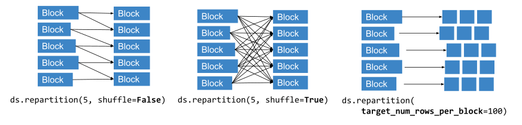

.. _data_key_concepts:

============
Key Concepts
============

.. _dataset_concept:

--------
Datasets
--------

A :term:`Dataset <Dataset (object)>` contains a list of Ray object references to :term:`blocks <Block>`.
Each block holds a set of items in an `Arrow table <https://arrow.apache.org/docs/python/data.html#tables>`_,
`pandas DataFrame <https://pandas.pydata.org/docs/reference/frame.html>`_, or Python list.
Having multiple blocks in a dataset allows for parallel transformation and ingest.

For ML use cases, Datasets also natively supports mixing :ref:`Tensors <datasets_tensor_support>` and tabular data.

There are three types of datasets:

* :term:`Simple datasets <Simple Dataset>` -- Datasets that represent a collection of Python objects
* :term:`Tabular datasets <Tabular Dataset>` -- Datasets that represent columnar data
* :term:`Tensor datasets <Tensor Dataset>` -- Datasets that represent a collection of ndarrays

The following figure visualizes a tabular dataset with three blocks, each holding 1000 rows:

.. image:: images/dataset-arch.svg

..
  https://docs.google.com/drawings/d/1PmbDvHRfVthme9XD7EYM-LIHPXtHdOfjCbc1SCsM64k/edit

Since a Dataset is just a list of Ray object references, it can be freely passed between Ray tasks,
actors, and libraries like any other object reference.
This flexibility is a unique characteristic of Ray Datasets.

Reading Data
============

Datasets uses Ray tasks to read data from remote storage in parallel. Each read task reads one or more files and produces an output block:

.. image:: images/dataset-read.svg
   :align: center

..
  https://docs.google.com/drawings/d/15B4TB8b5xN15Q9S8-s0MjW6iIvo_PrH7JtV1fL123pU/edit

You can manually specify the number of read tasks, but the final parallelism is always capped by the number of files in the underlying dataset.

For an in-depth guide on creating datasets, read :ref:`Creating Datasets <creating_datasets>`.

Transforming Data
=================

Datasets uses either Ray tasks or Ray actors to transform data blocks. By default, Datasets uses tasks.

To use Actors, pass an :class:`ActorPoolStrategy` to ``compute`` in methods like
:meth:`~ray.data.Dataset.map_batches`. :class:`ActorPoolStrategy` creates an autoscaling
pool of Ray actors. This allows you to cache expensive state initialization
(e.g., model loading for GPU-based tasks).

.. image:: images/dataset-map.svg
   :align: center
..
  https://docs.google.com/drawings/d/12STHGV0meGWfdWyBlJMUgw7a-JcFPu9BwSOn5BjRw9k/edit

For an in-depth guide on transforming datasets, read :ref:`Transforming Datasets <transforming_datasets>`.

Shuffling Data
==============

Operations like :meth:`~ray.data.Dataset.sort` and :meth:`~ray.data.Dataset.groupby`
require blocks to be partitioned by value or *shuffled*. Datasets uses tasks to shuffle blocks in a map-reduce
style: map tasks partition blocks by value and then reduce tasks merge co-partitioned
blocks.

Call :meth:`~ray.data.Dataset.repartition` to change the number of blocks in a :class:`~ray.data.Dataset`.
Repartition has two modes:

* ``shuffle=False`` - performs the minimal data movement needed to equalize block sizes
* ``shuffle=True`` - performs a full distributed shuffle

..
  https://docs.google.com/drawings/d/132jhE3KXZsf29ho1yUdPrCHB9uheHBWHJhDQMXqIVPA/edit

Datasets can shuffle hundreds of terabytes of data. For an in-depth guide on shuffle performance, read :ref:`Performance Tips and Tuning <shuffle_performance_tips>`.

Execution mode
==============

Most transformations are lazy. They don't execute until you consume a dataset or call
:meth:`Dataset.fully_executed() <ray.data.Dataset.fully_executed>`.

For an in-depth guide on Datasets execution, read :ref:`Execution <datasets_execution>`.

Fault tolerance
===============

Datasets performs *lineage reconstruction* to recover data. If an application error or
system failure occurs, Datasets recreates lost blocks by re-executing tasks.

Fault tolerance isn't supported in two cases:

* If the original worker process that created the Dataset dies. This is because the creator stores the metadata for the :ref:`objects <object-fault-tolerance>` that comprise the Dataset.
* If  you specify ``compute=ActorPoolStrategy()`` for transformations. This is because Datasets relies on :ref:`task-based fault tolerance <task-fault-tolerance>`.
