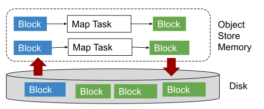

.. _data_advanced:

Memory Management
=================

This section deals with how Datasets manages execution and object store memory.

Execution Memory
~~~~~~~~~~~~~~~~

During execution, certain types of intermediate data must fit in memory. This includes the input block of a task, as well as at least one of the output blocks of the task (when a task has multiple output blocks, only one needs to fit in memory at any given time). The input block consumes object stored shared memory (Python heap memory for non-Arrow data). The output blocks consume Python heap memory (prior to putting in the object store) as well as object store memory (after being put in the object store).

This means that large block sizes can lead to potential out-of-memory situations. To
avoid OOM errors, Datasets can split blocks during map and read tasks into pieces
smaller than the target max block size. In some cases, this splitting is not possible
(e.g., if a single item in a block is extremely large, or the function given to
:meth:`ds.map_batches() <ray.data.Dataset.map_batches>` returns a very large batch). To
avoid these issues, make sure no single item in your Datasets is too large, and always
call :meth:`ds.map_batches() <ray.data.Dataset.map_batches>` with batch size small enough such that the output batch can comfortably fit into memory.

.. note::

  Block splitting is off by default. See the :ref:`performance section <data_performance_tips>` on how to enable block splitting (beta).

Object Store Memory
~~~~~~~~~~~~~~~~~~~

Datasets uses the Ray object store to store data blocks, which means it inherits the memory management features of the Ray object store. This section discusses the relevant features:

**Object Spilling**: Since Datasets uses the Ray object store to store data blocks, any blocks that can't fit into object store memory are automatically spilled to disk. The objects are automatically reloaded when needed by downstream compute tasks:

..
  https://docs.google.com/drawings/d/1H_vDiaXgyLU16rVHKqM3rEl0hYdttECXfxCj8YPrbks/edit

**Locality Scheduling**: Ray will preferentially schedule compute tasks on nodes that already have a local copy of the object, reducing the need to transfer objects between nodes in the cluster.

**Reference Counting**: Dataset blocks are kept alive by object store reference counting as long as there is any Dataset that references them. To free memory, delete any Python references to the Dataset object.

**Load Balancing**: Datasets uses Ray scheduling hints to spread read tasks out across the cluster to balance memory usage.

Lazy Execution Mode
~~~~~~~~~~~~~~~~~~~

.. note::

  Lazy execution mode is experimental. If you run into any issues, please reach
  out on `Discourse <https://discuss.ray.io/>`__ or open an issue on the
  `Ray GitHub repo <https://github.com/ray-project/ray>`__.

By default, all Datasets operations are eager (except for data reading, which is
semi-lazy; see the :ref:`deferred reading docs <dataset_deferred_reading>`), executing
each stage synchronously. This provides a simpler iterative development and debugging
experience, allowing you to inspect up-to-date metadata (schema, row count, etc.) after
each operation, greatly improving the typical "Getting Started" experience.

However, this eager execution mode can result in less optimal (i.e. slower) execution
and increased memory utilization compared to what's possible with a lazy execution mode.
That's why Datasets offers a lazy execution mode, which you can transition to after
you're done prototyping your Datasets pipeline.

Lazy execution mode can be enabled by calling
:meth:`ds = ds.experimental_lazy() <ray.data.Dataset.experimental_lazy()>`, which
returns a dataset whose all subsequent operations will be **lazy**. These operations
won't be executed until the dataset is consumed (e.g. via
:meth:`ds.take() <ray.data.Dataset.take>`,
:meth:`ds.iter_batches() <ray.data.Dataset.iter_batches>`,
:meth:`ds.to_torch() <ray.data.Dataset.to_torch>`, etc.) or if
:meth:`ds.fully_executed() <ray.data.Dataset.fully_executed>` is called to manually
trigger execution.

The big optimizations that lazy execution enables are **automatic stage fusion** and
**block move semantics**.

Automatic Stage Fusion
~~~~~~~~~~~~~~~~~~~~~~

Automatic fusion of stages/operations can significantly lower the Ray task overhead of
Datasets workloads, since a chain of reading and many map-like transformations will be
condensed into a single stage of Ray tasks; this results in less data needing to be put
into Ray's object store and transferred across nodes, and therefore resulting in lower
memory utilization and faster task execution.

Datasets will automatically fuse together lazy operations that are compatible:

* Same compute pattern: embarrassingly parallel map vs. all-to-all shuffle
* Same compute strategy: Ray tasks vs Ray actors
* Same resource specification, e.g. ``num_cpus`` or ``num_cpus`` requests

Read and subsequent map-like transformations
(e.g. :meth:`ds.map_batches() <ray.data.Dataset.map_batches>`,
:meth:`ds.filter() <ray.data.Dataset.filter>`, etc.) will usually be fused together.
All-to-all transformations such as
:meth:`ds.random_shuffle() <ray.data.Dataset.random_shuffle>` can be fused with earlier
map-like stages, but not later stages.

.. note::

  For eager mode Datasets, reads are semi-lazy, so the transformation stage right after
  the read stage (that triggers the full data read) will fuse with the read stage. Note
  that this currently incurs re-reading of any already-read blocks (a fix for this is
  currently in progress.)

You can tell if stage fusion is enabled by checking the :ref:`Dataset stats <data_performance_tips>` and looking for fused stages (e.g., ``read->map_batches``).

.. code-block::

    Stage N read->map_batches->shuffle_map: N/N blocks executed in T
    * Remote wall time: T min, T max, T mean, T total
    * Remote cpu time: T min, T max, T mean, T total
    * Output num rows: N min, N max, N mean, N total

Block Move Semantics
~~~~~~~~~~~~~~~~~~~~

In addition to fusing together stages, lazy execution mode further optimizes memory
utilization by eagerly releasing the data produced by intermediate operations in a
chain.

For example, if you have a chain of ``read_parquet() -> map_batches() -> filter()`` operations:

.. literalinclude:: ./doc_code/key_concepts.py
  :language: python
  :start-after: __block_move_begin__
  :end-before: __block_move_end__

that, for the sake of this example, aren't fused together, Datasets can eagerly release
the outputs of the ``read_parquet()`` stage and the ``map_batches()`` stage before the
subsequent stage (``map_batches()`` and ``filter()``, respectively) have finished. This
was not possible in eager mode, since every operation materialized the data and returned
the references back to the user. But in lazy execution mode, we know that the outputs of
the ``read_parquet()`` and ``map_batches()`` stages are only going to be used by the
downstream stages, so we can more aggressively release them.

Dataset Pipelines and Stage Fusion
~~~~~~~~~~~~~~~~~~~~~~~~~~~~~~~~~~

To avoid unnecessary data movement in the distributed setting,
:class:`DatasetPipelines <ray.data.dataset_pipelines.DatasetPipeline>` will always use
these lazy execution optimizations (stage fusion and block move semantics)
under-the-hood. Because a ``DatasetPipeline`` doesn't support creating more than one
``DatasetPipeline`` from a ``DatasetPipeline`` (i.e. no fan-out), we can clear block
data extra aggressively.

.. note::

  When creating a pipeline (i.e. calling :meth:`ds.window() <ray.data.Dataset.window>`
  or :meth:`ds.repeat() <ray.data.Dataset.repeat>`) immediately after a read stage, any
  already read data will be dropped, and the read stage will be absorbed into the
  pipeline and be made fully lazy. This allows you to easily create ML ingest pipelines
  that re-read data from storage on every epoch, as well as streaming batch inference
  pipelines that window all the way down to the file reading.

.. literalinclude:: ./doc_code/key_concepts.py
  :language: python
  :start-after: __dataset_pipelines_execution_begin__
  :end-before: __dataset_pipelines_execution_end__
