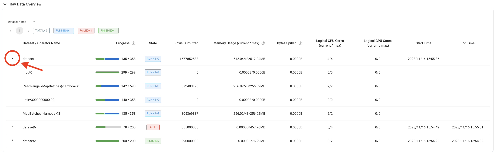

.. _monitoring-your-workload:

Monitoring Your Workload
========================

This section helps you debug and monitor the execution of your :class:`~ray.data.Dataset` by viewing the:

* :ref:`Ray Data dashboard <ray-data-dashboard>`
* :ref:`Ray Data logs <ray-data-logs>`
* :ref:`Ray Data stats <ray-data-stats>`

.. _ray-data-dashboard:

Ray Data dashboard
------------------

Ray Data emits Prometheus metrics in real-time while a Dataset is executing. These metrics are tagged by both dataset and operator, and are displayed in multiple views across the Ray dashboard.

.. note::
   Most metrics are only available for physical operators that use the map operation. For example, physical operators created by :meth:`~ray.data.Dataset.map_batches`, :meth:`~ray.data.Dataset.map`, and :meth:`~ray.data.Dataset.flat_map`.

Ray Data overview
~~~~~~~~~~~~~~~~~

For an overview of all datasets that have been running on your cluster, see the Ray Data Overview in the :ref:`jobs view <dash-jobs-view>`. This table appears once the first dataset starts executing on the cluster, and shows dataset details such as:

* execution progress (measured in blocks)
* execution state (running, failed, or finished)
* dataset start/end time
* dataset-level metrics (for example, sum of rows processed over all operators)

.. image:: images/data-overview-table.png
   :align: center

For a more fine-grained overview, each dataset row in the table can also be expanded to display the same details for individual operators.

.. tip::

    To evaluate a dataset-level metric where it's not appropriate to sum the values of all the individual operators, it may be more useful to look at the operator-level metrics of the last operator. For example, to calculate a dataset's throughput, use the "Rows Outputted" of the dataset's last operator, because the dataset-level metric contains the sum of rows outputted over all operators.

Ray dashboard metrics
~~~~~~~~~~~~~~~~~~~~~

For a time-series view of these metrics, see the Ray Data section in the :ref:`Metrics view <dash-metrics-view>`. This section contains time-series graphs of all metrics emitted by Ray Data. Execution metrics are grouped by dataset and operator, and iteration metrics are grouped by dataset.

The metrics recorded include:

* Bytes spilled by objects from object store to disk
* Bytes of objects allocated in object store
* Bytes of objects freed in object store
* Current total bytes of objects in object store
* Logical CPUs allocated to dataset operators
* Logical GPUs allocated to dataset operators
* Bytes outputted by dataset operators
* Rows outputted by dataset operators
* Input blocks received by data operators
* Input blocks/bytes processed in tasks by data operators
* Input bytes submitted to tasks by data operators
* Output blocks/bytes/rows generated in tasks by data operators
* Output blocks/bytes taken by downstream operators
* Output blocks/bytes from finished tasks
* Submitted tasks
* Running tasks
* Tasks with at least one output block
* Finished tasks
* Failed tasks
* Operator internal inqueue size (in blocks/bytes)
* Operator internal outqueue size (in blocks/bytes)
* Size of blocks used in pending tasks
* Freed memory in object store 
* Spilled memory in object store
* Time spent generating blocks
* Time spent in task submission backpressure
* Time spent to initialize iteration.
* Time user code is blocked during iteration.
* Time spent in user code during iteration.

.. image:: images/data-dashboard.png
   :align: center

To learn more about the Ray dashboard, including detailed setup instructions, see :ref:`Ray Dashboard <observability-getting-started>`.

.. _ray-data-logs:

Ray Data logs
-------------
During execution, Ray Data periodically logs updates to `ray-data.log`.

Every five seconds, Ray Data logs the execution progress of every operator in the dataset. For more frequent updates, set `RAY_DATA_TRACE_SCHEDULING=1` so that the progress is logged after each task is dispatched.

.. code-block:: text

   Execution Progress:
   0: - Input: 0 active, 0 queued, 0.0 MiB objects, Blocks Outputted: 200/200
   1: - ReadRange->MapBatches(<lambda>): 10 active, 190 queued, 381.47 MiB objects, Blocks Outputted: 100/200

When an operator completes, the metrics for that operator are also logged.

.. code-block:: text

   Operator InputDataBuffer[Input] -> TaskPoolMapOperator[ReadRange->MapBatches(<lambda>)] completed. Operator Metrics:
   {'num_inputs_received': 20, 'bytes_inputs_received': 46440, 'num_task_inputs_processed': 20, 'bytes_task_inputs_processed': 46440, 'num_task_outputs_generated': 20, 'bytes_task_outputs_generated': 800, 'rows_task_outputs_generated': 100, 'num_outputs_taken': 20, 'bytes_outputs_taken': 800, 'num_outputs_of_finished_tasks': 20, 'bytes_outputs_of_finished_tasks': 800, 'num_tasks_submitted': 20, 'num_tasks_running': 0, 'num_tasks_have_outputs': 20, 'num_tasks_finished': 20, 'obj_store_mem_freed': 46440, 'obj_store_mem_spilled': 0, 'block_generation_time': 1.191296085, 'cpu_usage': 0, 'gpu_usage': 0, 'ray_remote_args': {'num_cpus': 1, 'scheduling_strategy': 'SPREAD'}}

This log file can be found locally at `/tmp/ray/{SESSION_NAME}/logs/ray-data.log`. It can also be found on the Ray Dashboard under the head node's logs in the :ref:`Logs view <dash-logs-view>`.

.. _ray-data-stats:

Ray Data stats
--------------
To see detailed stats on the execution of a dataset you can use the :meth:`~ray.data.Dataset.stats` method.

Operator stats
~~~~~~~~~~~~~~
For each operator, a summary on the individual operator's execution stats will be included. This operator will operator
on many different blocks, so some stats will show the min, max, mean, and sum of the stat aggregated over all the blocks. 
The following are descriptions of the various stats included at the operator level:

* **Remote wall time**: The wall time is the start to finish time for an operator. It might include time where the operator
  is not processing data, sleeping, waiting for I/O, etc.
* **Remote cpu time**: The cpu time is the process time for an operator which will exclude time slept. This will include 
  both user and system CPU time.
* **UDF time**: The UDF time is time spent in functions defined by the user. This will include functions passed into Ray 
  Data methods including :meth:`~ray.data.Dataset.map`, :meth:`~ray.data.Dataset.map_batches`, :meth:`~ray.data.Dataset.filter`,
  etc. You can use this to track how much time is spent in functions you define and how much time could be gained by optimizing 
  those functions.
* **Memory usage**: The memory usage per block is shown in MiB. 
* **Output stats**: The output includes stats on the number of rows output and size of output in bytes per block. The number of
  output rows per task are also included. All of this together will give you insight into how much data is being output at a per
  block and per task level.
* **Task Stats**: The scheduling of tasks to nodes is shown which will allow you to see if you are utilizing all of your nodes
  as expected.
* **Throughput**: Throughput for the operator is calculated and for a point of comparison an estimate of the throughput of the 
  same task on a single node is computed. This estimate assumes the total time of the work remains the same, but there is no 
  concurrency. Throughput is also calculated at the dataset level including a single node estimate.

Iterator stats
~~~~~~~~~~~~~~
If the data is iterated over, iteration stats are also generated. Even if you are not directly iterating over the data, there might be iteration stats included e.g. if you 
call :meth:`~ray.data.Dataset.take_all`. Some of the stats included at the iterator level are:

* **Iterator initialization**: The time spent initializing the iterator to be used. This is internal to Ray Data.
* **Time user thread is blocked**: The time spent producing data in the iterator. Often this will be the primary execution of a
  dataset if it has not previously been materialized. 
* **Time in user thread**: The time spent in the user thread that is iterating over the dataset outside of the Ray Data code.
  If this time is high consider optimizing the body of the loop that is iterating over the dataset.
* **Batch iteration stats**: Stats are also included about the prefetching of batches. These times should be internal to Ray
  Data code, but by tuning how prefetching is performed this might be further optimized.

Example stats
~~~~~~~~~~~~~
For a concrete example, below is a stats output from :doc:`Image Classification Batch Inference with PyTorch ResNet18 </data/examples/pytorch_resnet_batch_prediction>`:

.. code-block:: text

   Operator 1 ReadImage->Map(preprocess_image): 384 tasks executed, 386 blocks produced in 9.21s                         
   * Remote wall time: 33.55ms min, 2.22s max, 1.03s mean, 395.65s total                                                       
   * Remote cpu time: 34.93ms min, 3.36s max, 1.64s mean, 632.26s total
   * UDF time: 535.1ms min, 2.16s max, 975.7ms mean, 376.62s total
   * Peak heap memory usage (MiB): 556.32 min, 1126.95 max, 655 mean
   * Output num rows per block: 4 min, 25 max, 24 mean, 9469 total
   * Output size bytes per block: 6060399 min, 105223020 max, 31525416 mean, 12168810909 total
   * Output rows per task: 24 min, 25 max, 24 mean, 384 tasks used
   * Tasks per node: 32 min, 64 max, 48 mean; 8 nodes used
   * Operator throughput:
         * Ray Data throughput: 1028.5218637702708 rows/s
         * Estimated single node throughput: 23.932674100499128 rows/s

   Operator 2 MapBatches(ResnetModel): 14 tasks executed, 48 blocks produced in 27.43s
   * Remote wall time: 523.93us min, 7.01s max, 1.82s mean, 87.18s total
   * Remote cpu time: 523.23us min, 6.23s max, 1.76s mean, 84.61s total
   * UDF time: 4.49s min, 17.81s max, 10.52s mean, 505.08s total
   * Peak heap memory usage (MiB): 4025.42 min, 7920.44 max, 5803 mean
   * Output num rows per block: 84 min, 334 max, 197 mean, 9469 total
   * Output size bytes per block: 72317976 min, 215806447 max, 134739694 mean, 6467505318 total
   * Output rows per task: 319 min, 720 max, 676 mean, 14 tasks used
   * Tasks per node: 3 min, 4 max, 3 mean; 4 nodes used
   * Operator throughput:
         * Ray Data throughput: 345.1533728632648 rows/s
         * Estimated single node throughput: 108.62003864820711 rows/s

   Dataset iterator time breakdown:
   * Total time overall: 38.53s
      * Total time in Ray Data iterator initialization code: 16.86s
      * Total time user thread is blocked by Ray Data iter_batches: 19.76s
      * Total execution time for user thread: 1.9s
   * Batch iteration time breakdown (summed across prefetch threads):
      * In ray.get(): 70.49ms min, 2.16s max, 272.8ms avg, 13.09s total
      * In batch creation: 3.6us min, 5.95us max, 4.26us avg, 204.41us total
      * In batch formatting: 4.81us min, 7.88us max, 5.5us avg, 263.94us total

   Dataset throughput:
         * Ray Data throughput: 1026.5318925757008 rows/s
         * Estimated single node throughput: 19.611578909587674 rows/s
