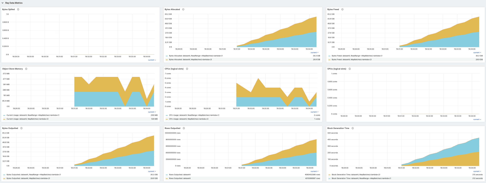

.. _monitoring-your-workload:

Monitoring Your Workload
========================

This section helps you debug and monitor the execution of your :class:`~ray.data.Dataset` by viewing the:

* :ref:`Ray Data progress bars <ray-data-progress-bars>`
* :ref:`Ray Data dashboard <ray-data-dashboard>`
* :ref:`Ray Data logs <ray-data-logs>`
* :ref:`Ray Data stats <ray-data-stats>`

.. _ray-data-progress-bars:

Ray Data progress bars
----------------------

When you execute a :class:`~ray.data.Dataset`, Ray Data displays a set of progress bars in the console. These progress bars show various execution and progress-related metrics, including the number of rows completed/remaining, resource usage, and task/actor status. See the annotated image for a breakdown of how to interpret the progress bar outputs: 

Some additional notes on progress bars:

* The progress bars are updated every second; resource usage, metrics, and task/actor status may take up to 5 seconds to update.
* When the tasks section contains the label `[backpressure]`, it indicates that the operator is *backpressured*, meaning that the operator won't submit more tasks until the downstream operator is ready to accept more data.
* The global resource usage is the sum of resources used by all operators, active and requested (includes pending scheduling and pending node assignment).

Configuring the progress bar
~~~~~~~~~~~~~~~~~~~~~~~~~~~~
Depending on your use case, you may not be interested in the full progress bar output, or wish to turn them off altogether. Ray Data provides several ways to accomplish this:

* Disabling operator-level progress bars: Set `DataContext.get_current().enable_operator_progress_bars = False`. This only shows the global progress bar, and omits operator-level progress bars.
* Disabling all progress bars: Set `DataContext.get_current().enable_progress_bars = False`. This disables all progress bars from Ray Data related to dataset execution.
* Disabling `ray_tqdm`: Set `DataContext.get_current().use_ray_tqdm = False`. This configures Ray Data to use the base `tqdm` library instead of the custom distributed `tqdm` implementation, which could be useful when debugging logging issues in a distributed setting.

For operator names longer than a threshold of 100 characters, Ray Data truncates the names by default, to prevent the case when the operator names are long and the progress bar is too wide to fit on the screen.

* To turn off this behavior and show the full operator name, set `DataContext.get_current().enable_progress_bar_name_truncation = False`.
* To change the threshold of truncating the name, update the constant `ray.data._internal.progress_bar.ProgressBar.MAX_NAME_LENGTH = 42`.

.. _ray-data-dashboard:

Ray Data dashboard
------------------

Ray Data emits Prometheus metrics in real-time while a Dataset is executing. These metrics are tagged by both dataset and operator, and are displayed in multiple views across the Ray dashboard.

.. note::
   Most metrics are only available for physical operators that use the map operation. For example, physical operators created by :meth:`~ray.data.Dataset.map_batches`, :meth:`~ray.data.Dataset.map`, and :meth:`~ray.data.Dataset.flat_map`.

Jobs: Ray Data overview
~~~~~~~~~~~~~~~~~~~~~~~

For an overview of all datasets that have been running on your cluster, see the Ray Data Overview in the :ref:`jobs view <dash-jobs-view>`. This table appears once the first dataset starts executing on the cluster, and shows dataset details such as:

* execution progress (measured in blocks)
* execution state (running, failed, or finished)
* dataset start/end time
* dataset-level metrics (for example, sum of rows processed over all operators)

For a more fine-grained overview, each dataset row in the table can also be expanded to display the same details for individual operators.

.. image:: images/data-overview-table-expanded.png
   :align: center

.. tip::

    To evaluate a dataset-level metric where it's not appropriate to sum the values of all the individual operators, it may be more useful to look at the operator-level metrics of the last operator. For example, to calculate a dataset's throughput, use the "Rows Outputted" of the dataset's last operator, because the dataset-level metric contains the sum of rows outputted over all operators.

Ray dashboard metrics
~~~~~~~~~~~~~~~~~~~~~

For a time-series view of these metrics, see the Ray Data section in the :ref:`Metrics view <dash-metrics-view>`. This section contains time-series graphs of all metrics emitted by Ray Data. Execution metrics are grouped by dataset and operator, and iteration metrics are grouped by dataset.

The metrics recorded include:

* Bytes spilled by objects from object store to disk
* Bytes of objects allocated in object store
* Bytes of objects freed in object store
* Current total bytes of objects in object store
* Logical CPUs allocated to dataset operators
* Logical GPUs allocated to dataset operators
* Bytes outputted by dataset operators
* Rows outputted by dataset operators
* Input blocks received by data operators
* Input blocks/bytes processed in tasks by data operators
* Input bytes submitted to tasks by data operators
* Output blocks/bytes/rows generated in tasks by data operators
* Output blocks/bytes taken by downstream operators
* Output blocks/bytes from finished tasks
* Submitted tasks
* Running tasks
* Tasks with at least one output block
* Finished tasks
* Failed tasks
* Operator internal inqueue size (in blocks/bytes)
* Operator internal outqueue size (in blocks/bytes)
* Size of blocks used in pending tasks
* Freed memory in object store
* Spilled memory in object store
* Time spent generating blocks
* Time spent in task submission backpressure
* Time spent to initialize iteration.
* Time user code is blocked during iteration.
* Time spent in user code during iteration.

To learn more about the Ray dashboard, including detailed setup instructions, see :ref:`Ray Dashboard <observability-getting-started>`.

.. _ray-data-logs:

Ray Data logs
-------------
During execution, Ray Data periodically logs updates to `ray-data.log`.

Every five seconds, Ray Data logs the execution progress of every operator in the dataset. For more frequent updates, set `RAY_DATA_TRACE_SCHEDULING=1` so that the progress is logged after each task is dispatched.

.. code-block:: text

   Execution Progress:
   0: - Input: 0 active, 0 queued, 0.0 MiB objects, Blocks Outputted: 200/200
   1: - ReadRange->MapBatches(<lambda>): 10 active, 190 queued, 381.47 MiB objects, Blocks Outputted: 100/200

When an operator completes, the metrics for that operator are also logged.

.. code-block:: text

   Operator InputDataBuffer[Input] -> TaskPoolMapOperator[ReadRange->MapBatches(<lambda>)] completed. Operator Metrics:
   {'num_inputs_received': 20, 'bytes_inputs_received': 46440, 'num_task_inputs_processed': 20, 'bytes_task_inputs_processed': 46440, 'num_task_outputs_generated': 20, 'bytes_task_outputs_generated': 800, 'rows_task_outputs_generated': 100, 'num_outputs_taken': 20, 'bytes_outputs_taken': 800, 'num_outputs_of_finished_tasks': 20, 'bytes_outputs_of_finished_tasks': 800, 'num_tasks_submitted': 20, 'num_tasks_running': 0, 'num_tasks_have_outputs': 20, 'num_tasks_finished': 20, 'obj_store_mem_freed': 46440, 'obj_store_mem_spilled': 0, 'block_generation_time': 1.191296085, 'cpu_usage': 0, 'gpu_usage': 0, 'ray_remote_args': {'num_cpus': 1, 'scheduling_strategy': 'SPREAD'}}

This log file can be found locally at `/tmp/ray/{SESSION_NAME}/logs/ray-data/ray-data.log`. It can also be found on the Ray Dashboard under the head node's logs in the :ref:`Logs view <dash-logs-view>`.

.. _ray-data-stats:

Ray Data stats
--------------
To see detailed stats on the execution of a dataset you can use the :meth:`~ray.data.Dataset.stats` method.

Operator stats
~~~~~~~~~~~~~~
The stats output includes a summary on the individual operator's execution stats for each operator. Ray Data calculates this
summary across many different blocks, so some stats show the min, max, mean, and sum of the stats aggregated over all the blocks.
The following are descriptions of the various stats included at the operator level:

* **Remote wall time**: The wall time is the start to finish time for an operator. It includes the time where the operator
  isn't processing data, sleeping, waiting for I/O, etc.
* **Remote CPU time**: The CPU time is the process time for an operator which excludes time slept. This time includes both
  user and system CPU time.
* **UDF time**: The UDF time is time spent in functions defined by the user. This time includes functions you pass into Ray
  Data methods, including :meth:`~ray.data.Dataset.map`, :meth:`~ray.data.Dataset.map_batches`, :meth:`~ray.data.Dataset.filter`,
  etc. You can use this stat to track the time spent in functions you define and how much time optimizing those functions could save.
* **Memory usage**: The output displays memory usage per block in MiB.
* **Output stats**: The output includes stats on the number of rows output and size of output in bytes per block. The number of
  output rows per task is also included. All of this together gives you insight into how much data Ray Data is outputting at a per
  block and per task level.
* **Task Stats**: The output shows the scheduling of tasks to nodes, which allows you to see if you are utilizing all of your nodes
  as expected.
* **Throughput**: The summary calculates the throughput for the operator, and for a point of comparison, it also computes an estimate of
  the throughput of the same task on a single node. This estimate assumes the total time of the work remains the same, but with no
  concurrency. The overall summary also calculates the throughput at the dataset level, including a single node estimate.

Iterator stats
~~~~~~~~~~~~~~
If you iterate over the data, Ray Data also generates iteration stats. Even if you aren't directly iterating over the data, you
might see iteration stats, for example, if you call :meth:`~ray.data.Dataset.take_all`. Some of the stats that Ray Data includes
at the iterator level are:

* **Iterator initialization**: The time Ray Data spent initializing the iterator. This time is internal to Ray Data.
* **Time user thread is blocked**: The time Ray Data spent producing data in the iterator. This time is often the primary execution of a
  dataset if you haven't previously materialized it.
* **Time in user thread**: The time spent in the user thread that's iterating over the dataset outside of the Ray Data code.
  If this time is high, consider optimizing the body of the loop that's iterating over the dataset.
* **Batch iteration stats**: Ray Data also includes stats about the prefetching of batches. These times are internal to Ray
  Data code, but you can further optimize this time by tuning the prefetching process.

Verbose stats
~~~~~~~~~~~~~~
By default, Ray Data only logs the most important high-level stats. To enable verbose stats outputs, include
the following snippet in your Ray Data code:

.. testcode::

   from ray.data import DataContext

   context = DataContext.get_current()
   context.verbose_stats_logs = True

By enabling verbosity Ray Data adds a few more outputs:

* **Extra metrics**: Operators, executors, etc. can add to this dictionary of various metrics. There is
  some duplication of stats between the default output and this dictionary, but for advanced users this stat provides more
  insight into the dataset's execution.
* **Runtime metrics**: These metrics are a high-level breakdown of the runtime of the dataset execution. These stats are a per
  operator summary of the time each operator took to complete and the fraction of the total execution time that the operator took
  to complete. As there are potentially multiple concurrent operators, these percentages don't necessarily sum to 100%. Instead,
  they show how long running each of the operators is in the context of the full dataset execution.

Example stats
~~~~~~~~~~~~~
As a concrete example, below is a stats output from :doc:`Image Classification Batch Inference with PyTorch ResNet18 </data/examples/pytorch_resnet_batch_prediction>`:

.. code-block:: text

   Operator 1 ReadImage->Map(preprocess_image): 384 tasks executed, 386 blocks produced in 9.21s
   * Remote wall time: 33.55ms min, 2.22s max, 1.03s mean, 395.65s total
   * Remote cpu time: 34.93ms min, 3.36s max, 1.64s mean, 632.26s total
   * UDF time: 535.1ms min, 2.16s max, 975.7ms mean, 376.62s total
   * Peak heap memory usage (MiB): 556.32 min, 1126.95 max, 655 mean
   * Output num rows per block: 4 min, 25 max, 24 mean, 9469 total
   * Output size bytes per block: 6060399 min, 105223020 max, 31525416 mean, 12168810909 total
   * Output rows per task: 24 min, 25 max, 24 mean, 384 tasks used
   * Tasks per node: 32 min, 64 max, 48 mean; 8 nodes used
   * Operator throughput:
         * Ray Data throughput: 1028.5218637702708 rows/s
         * Estimated single node throughput: 23.932674100499128 rows/s

   Operator 2 MapBatches(ResnetModel): 14 tasks executed, 48 blocks produced in 27.43s
   * Remote wall time: 523.93us min, 7.01s max, 1.82s mean, 87.18s total
   * Remote cpu time: 523.23us min, 6.23s max, 1.76s mean, 84.61s total
   * UDF time: 4.49s min, 17.81s max, 10.52s mean, 505.08s total
   * Peak heap memory usage (MiB): 4025.42 min, 7920.44 max, 5803 mean
   * Output num rows per block: 84 min, 334 max, 197 mean, 9469 total
   * Output size bytes per block: 72317976 min, 215806447 max, 134739694 mean, 6467505318 total
   * Output rows per task: 319 min, 720 max, 676 mean, 14 tasks used
   * Tasks per node: 3 min, 4 max, 3 mean; 4 nodes used
   * Operator throughput:
         * Ray Data throughput: 345.1533728632648 rows/s
         * Estimated single node throughput: 108.62003864820711 rows/s

   Dataset iterator time breakdown:
   * Total time overall: 38.53s
      * Total time in Ray Data iterator initialization code: 16.86s
      * Total time user thread is blocked by Ray Data iter_batches: 19.76s
      * Total execution time for user thread: 1.9s
   * Batch iteration time breakdown (summed across prefetch threads):
      * In ray.get(): 70.49ms min, 2.16s max, 272.8ms avg, 13.09s total
      * In batch creation: 3.6us min, 5.95us max, 4.26us avg, 204.41us total
      * In batch formatting: 4.81us min, 7.88us max, 5.5us avg, 263.94us total

   Dataset throughput:
         * Ray Data throughput: 1026.5318925757008 rows/s
         * Estimated single node throughput: 19.611578909587674 rows/s

For the same example with verbosity enabled, the stats output is:

.. code-block:: text

   Operator 1 ReadImage->Map(preprocess_image): 384 tasks executed, 387 blocks produced in 9.49s
   * Remote wall time: 22.81ms min, 2.5s max, 999.95ms mean, 386.98s total
   * Remote cpu time: 24.06ms min, 3.36s max, 1.63s mean, 629.93s total
   * UDF time: 552.79ms min, 2.41s max, 956.84ms mean, 370.3s total
   * Peak heap memory usage (MiB): 550.95 min, 1186.28 max, 651 mean
   * Output num rows per block: 4 min, 25 max, 24 mean, 9469 total
   * Output size bytes per block: 4444092 min, 105223020 max, 31443955 mean, 12168810909 total
   * Output rows per task: 24 min, 25 max, 24 mean, 384 tasks used
   * Tasks per node: 39 min, 60 max, 48 mean; 8 nodes used
   * Operator throughput:
         * Ray Data throughput: 997.9207015895857 rows/s
         * Estimated single node throughput: 24.46899945870273 rows/s
   * Extra metrics: {'num_inputs_received': 384, 'bytes_inputs_received': 1104723940, 'num_task_inputs_processed': 384, 'bytes_task_inputs_processed': 1104723940, 'bytes_inputs_of_submitted_tasks': 1104723940, 'num_task_outputs_generated': 387, 'bytes_task_outputs_generated': 12168810909, 'rows_task_outputs_generated': 9469, 'num_outputs_taken': 387, 'bytes_outputs_taken': 12168810909, 'num_outputs_of_finished_tasks': 387, 'bytes_outputs_of_finished_tasks': 12168810909, 'num_tasks_submitted': 384, 'num_tasks_running': 0, 'num_tasks_have_outputs': 384, 'num_tasks_finished': 384, 'num_tasks_failed': 0, 'block_generation_time': 386.97945193799995, 'task_submission_backpressure_time': 7.263684450000142, 'obj_store_mem_internal_inqueue_blocks': 0, 'obj_store_mem_internal_inqueue': 0, 'obj_store_mem_internal_outqueue_blocks': 0, 'obj_store_mem_internal_outqueue': 0, 'obj_store_mem_pending_task_inputs': 0, 'obj_store_mem_freed': 1104723940, 'obj_store_mem_spilled': 0, 'obj_store_mem_used': 12582535566, 'cpu_usage': 0, 'gpu_usage': 0, 'ray_remote_args': {'num_cpus': 1, 'scheduling_strategy': 'SPREAD'}}

   Operator 2 MapBatches(ResnetModel): 14 tasks executed, 48 blocks produced in 28.81s
   * Remote wall time: 134.84us min, 7.23s max, 1.82s mean, 87.16s total
   * Remote cpu time: 133.78us min, 6.28s max, 1.75s mean, 83.98s total
   * UDF time: 4.56s min, 17.78s max, 10.28s mean, 493.48s total
   * Peak heap memory usage (MiB): 3925.88 min, 7713.01 max, 5688 mean
   * Output num rows per block: 125 min, 259 max, 197 mean, 9469 total
   * Output size bytes per block: 75531617 min, 187889580 max, 134739694 mean, 6467505318 total
   * Output rows per task: 325 min, 719 max, 676 mean, 14 tasks used
   * Tasks per node: 3 min, 4 max, 3 mean; 4 nodes used
   * Operator throughput:
         * Ray Data throughput: 328.71474145609153 rows/s
         * Estimated single node throughput: 108.6352856660782 rows/s
   * Extra metrics: {'num_inputs_received': 387, 'bytes_inputs_received': 12168810909, 'num_task_inputs_processed': 0, 'bytes_task_inputs_processed': 0, 'bytes_inputs_of_submitted_tasks': 12168810909, 'num_task_outputs_generated': 1, 'bytes_task_outputs_generated': 135681874, 'rows_task_outputs_generated': 252, 'num_outputs_taken': 1, 'bytes_outputs_taken': 135681874, 'num_outputs_of_finished_tasks': 0, 'bytes_outputs_of_finished_tasks': 0, 'num_tasks_submitted': 14, 'num_tasks_running': 14, 'num_tasks_have_outputs': 1, 'num_tasks_finished': 0, 'num_tasks_failed': 0, 'block_generation_time': 7.229860895999991, 'task_submission_backpressure_time': 0, 'obj_store_mem_internal_inqueue_blocks': 13, 'obj_store_mem_internal_inqueue': 413724657, 'obj_store_mem_internal_outqueue_blocks': 0, 'obj_store_mem_internal_outqueue': 0, 'obj_store_mem_pending_task_inputs': 12168810909, 'obj_store_mem_freed': 0, 'obj_store_mem_spilled': 0, 'obj_store_mem_used': 1221136866.0, 'cpu_usage': 0, 'gpu_usage': 4}

   Dataset iterator time breakdown:
   * Total time overall: 42.29s
      * Total time in Ray Data iterator initialization code: 20.24s
      * Total time user thread is blocked by Ray Data iter_batches: 19.96s
      * Total execution time for user thread: 2.08s
   * Batch iteration time breakdown (summed across prefetch threads):
      * In ray.get(): 73.0ms min, 2.15s max, 246.3ms avg, 11.82s total
      * In batch creation: 3.62us min, 6.6us max, 4.39us avg, 210.7us total
      * In batch formatting: 4.75us min, 8.67us max, 5.52us avg, 264.98us total

   Dataset throughput:
         * Ray Data throughput: 468.11051989434594 rows/s
         * Estimated single node throughput: 972.8197093015862 rows/s

   Runtime Metrics:
   * ReadImage->Map(preprocess_image): 9.49s (46.909%)
   * MapBatches(ResnetModel): 28.81s (142.406%)
   * Scheduling: 6.16s (30.448%)
   * Total: 20.23s (100.000%)
