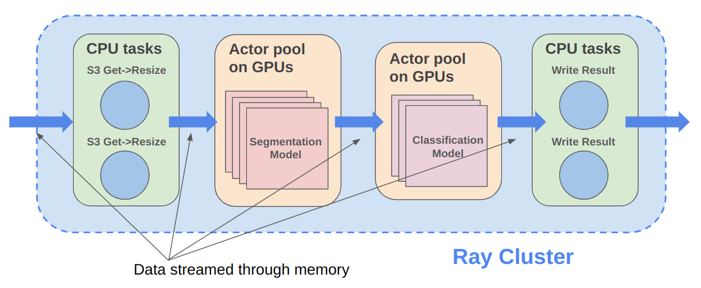

.. _data_overview:

Ray Data Overview
=================

.. _data-intro:

.. image:: images/dataset.svg

..
  https://docs.google.com/drawings/d/16AwJeBNR46_TsrkOmMbGaBK7u-OPsf_V8fHjU-d2PPQ/edit

Ray Data is a scalable data processing library for ML workloads, particularly suited for the following workloads:

-  :ref:`Offline batch inference <batch_inference_overview>`
-  :ref:`Data preprocessing and ingest for ML training <ml_ingest_overview>`

It provides flexible and performant APIs for distributed data processing:

- Simple transformations such as maps (:meth:`~ray.data.Dataset.map_batches`)
- Global and grouped aggregations (:meth:`~ray.data.Dataset.groupby`)
- Shuffling operations (:meth:`~ray.data.Dataset.random_shuffle`, :meth:`~ray.data.Dataset.sort`, :meth:`~ray.data.Dataset.repartition`).

Ray Data is built on top of Ray, so it scales effectively to large clusters and offers scheduling support for both CPU and GPU resources. Ray Data uses `streaming execution <https://www.anyscale.com/blog/streaming-distributed-execution-across-cpus-and-gpus>`__ to efficiently process large datasets.

.. note::

    Ray Data doesn't have a SQL interface and isn't meant as a replacement for generic
    ETL pipelines like Spark.

Why choose Ray Data?
--------------------

.. dropdown:: Faster and cheaper for modern deep learning applications

    Ray Data is designed for deep learning applications that involve both CPU preprocessing and GPU inference. Through its powerful streaming :ref:`Dataset <dataset_concept>` primitive, Ray Data streams working data from CPU preprocessing tasks to GPU inferencing or training tasks, allowing you to utilize both sets of resources concurrently.

    By using Ray Data, your GPUs are no longer idle during CPU computation, reducing overall cost of the batch inference job.

.. dropdown:: Cloud, framework, and data format agnostic

    Ray Data has no restrictions on cloud provider, ML framework, or data format.

    Through the :ref:`Ray cluster launcher <cluster-index>`, you can start a Ray cluster on AWS, GCP, or Azure clouds. You can use any ML framework of your choice, including PyTorch, HuggingFace, or Tensorflow. Ray Data also does not require a particular file format, and supports a :ref:`wide variety of formats <loading_data>` including CSV, Parquet, and raw images.

.. dropdown:: Out of the box scaling

    Ray Data is built on Ray, so it easily scales to many machines. Code that works on one machine also runs on a large cluster without any changes.

.. dropdown:: Python first

    With Ray Data, you can express your inference job directly in Python instead of
    YAML or other formats, allowing for faster iterations, easier debugging, and a native developer experience.

.. _batch_inference_overview:

Offline Batch Inference
-----------------------

.. tip::

    `Get in touch <https://forms.gle/sGX7PQhheBGL6yxQ6>`_ to get help using Ray Data, the industry's fastest and cheapest solution for offline batch inference.

Offline batch inference is a process for generating model predictions on a fixed set of input data. Ray Data offers an efficient and scalable solution for batch inference, providing faster execution and cost-effectiveness for deep learning applications. For more details on how to use Ray Data for offline batch inference, see the :ref:`batch inference user guide <batch_inference_home>`.

..
 https://docs.google.com/presentation/d/1l03C1-4jsujvEFZUM4JVNy8Ju8jnY5Lc_3q7MBWi2PQ/edit#slide=id.g230eb261ad2_0_0

How does Ray Data compare to X for offline inference?
~~~~~~~~~~~~~~~~~~~~~~~~~~~~~~~~~~~~~~~~~~~~~~~~~~~~~

.. dropdown:: Batch Services: AWS Batch, GCP Batch

    Cloud providers such as AWS, GCP, and Azure provide batch services to manage compute infrastructure for you. Each service uses the same process: you provide the code, and the service runs your code on each node in a cluster. However, while infrastructure management is necessary, it is often not enough. These services have limitations, such as a lack of software libraries to address optimized parallelization, efficient data transfer, and easy debugging. These solutions are suitable only for experienced users who can write their own optimized batch inference code.

    Ray Data abstracts away not only the infrastructure management, but also the sharding your dataset, the parallelization of the inference over these shards, and the transfer of data from storage to CPU to GPU.

.. dropdown:: Online inference solutions: Bento ML, Sagemaker Batch Transform

    Solutions like `Bento ML <https://www.bentoml.com/>`_, `Sagemaker Batch Transform <https://docs.aws.amazon.com/sagemaker/latest/dg/batch-transform.html>`_, or :ref:`Ray Serve <rayserve>` provide APIs to make it easy to write performant inference code and can abstract away infrastructure complexities. But they are designed for online inference rather than offline batch inference, which are two different problems with different sets of requirements. These solutions introduce additional complexity like HTTP, and cannot effectively handle large datasets leading inference service providers like `Bento ML to integrating with Apache Spark <https://modelserving.com/blog/unifying-real-time-and-batch-inference-with-bentoml-and-spark>`_ for offline inference.

    Ray Data is built for offline batch jobs, without all the extra complexities of starting servers or sending HTTP requests.

    For a more detailed performance comparison between Ray Data and Sagemaker Batch Transform, see `Offline Batch Inference: Comparing Ray, Apache Spark, and SageMaker <https://www.anyscale.com/blog/offline-batch-inference-comparing-ray-apache-spark-and-sagemaker>`_.

.. dropdown:: Distributed Data Processing Frameworks: Apache Spark

    Ray Data handles many of the same batch processing workloads as `Apache Spark <https://spark.apache.org/>`_, but with a streaming paradigm that is better suited for GPU workloads for deep learning inference.

    For a more detailed performance comarison between Ray Data and Apache Spark, see `Offline Batch Inference: Comparing Ray, Apache Spark, and SageMaker <https://www.anyscale.com/blog/offline-batch-inference-comparing-ray-apache-spark-and-sagemaker>`_.

Batch inference case studies
~~~~~~~~~~~~~~~~~~~~~~~~~~~~
- `Sewer AI speeds up object detection on videos 3x using Ray Data <https://www.anyscale.com/blog/inspecting-sewer-line-safety-using-thousands-of-hours-of-video>`_
- `Spotify's new ML platform built on Ray, using Ray Data for batch inference <https://engineering.atspotify.com/2023/02/unleashing-ml-innovation-at-spotify-with-ray/>`_

.. _ml_ingest_overview:

Preprocessing and ingest for ML training
----------------------------------------

Use Ray Data to load and preprocess data for distributed :ref:`ML training pipelines <train-docs>` in a streaming fashion.
Ray Data serves as a last-mile bridge from storage or ETL pipeline outputs to distributed
applications and libraries in Ray. Don't use it as a replacement for more general data
processing systems. For more details on how to use Ray Data for preprocessing and ingest for ML training, see :ref:`Data loading for ML training <data-ingest-torch>`.

.. image:: images/dataset-loading-1.png
   :width: 650px
   :align: center

..
  https://docs.google.com/presentation/d/1l03C1-4jsujvEFZUM4JVNy8Ju8jnY5Lc_3q7MBWi2PQ/edit

How does Ray Data compare to X for ML training ingest?
~~~~~~~~~~~~~~~~~~~~~~~~~~~~~~~~~~~~~~~~~~~~~~~~~~~~~~

.. dropdown:: PyTorch Dataset and DataLoader

    * **Framework-agnostic:** Datasets is framework-agnostic and portable between different distributed training frameworks, while `Torch datasets <https://pytorch.org/docs/stable/data.html>`__ are specific to Torch.
    * **No built-in IO layer:** Torch datasets do not have an I/O layer for common file formats or in-memory exchange with other frameworks; users need to bring in other libraries and roll this integration themselves.
    * **Generic distributed data processing:** Datasets is more general: it can handle generic distributed operations, including global per-epoch shuffling, which would otherwise have to be implemented by stitching together two separate systems. Torch datasets would require such stitching for anything more involved than batch-based preprocessing, and does not natively support shuffling across worker shards. See our `blog post <https://www.anyscale.com/blog/deep-dive-data-ingest-in-a-third-generation-ml-architecture>`__ on why this shared infrastructure is important for 3rd generation ML architectures.
    * **Lower overhead:** Datasets is lower overhead: it supports zero-copy exchange between processes, in contrast to the multi-processing-based pipelines of Torch datasets.

.. dropdown:: TensorFlow Dataset

    * **Framework-agnostic:** Datasets is framework-agnostic and portable between different distributed training frameworks, while `TensorFlow datasets <https://www.tensorflow.org/api_docs/python/tf/data/Dataset>`__ is specific to TensorFlow.
    * **Unified single-node and distributed:** Datasets unifies single and multi-node training under the same abstraction. TensorFlow datasets presents `separate concepts <https://www.tensorflow.org/api_docs/python/tf/distribute/DistributedDataset>`__ for distributed data loading and prevents code from being seamlessly scaled to larger clusters.
    * **Generic distributed data processing:** Datasets is more general: it can handle generic distributed operations, including global per-epoch shuffling, which would otherwise have to be implemented by stitching together two separate systems. TensorFlow datasets would require such stitching for anything more involved than basic preprocessing, and does not natively support full-shuffling across worker shards; only file interleaving is supported. See our `blog post <https://www.anyscale.com/blog/deep-dive-data-ingest-in-a-third-generation-ml-architecture>`__ on why this shared infrastructure is important for 3rd generation ML architectures.
    * **Lower overhead:** Datasets is lower overhead: it supports zero-copy exchange between processes, in contrast to the multi-processing-based pipelines of TensorFlow datasets.

.. dropdown:: Petastorm

    * **Supported data types:** `Petastorm <https://github.com/uber/petastorm>`__ only supports Parquet data, while Ray Data supports many file formats.
    * **Lower overhead:** Datasets is lower overhead: it supports zero-copy exchange between processes, in contrast to the multi-processing-based pipelines used by Petastorm.
    * **No data processing:** Petastorm does not expose any data processing APIs.

.. dropdown:: NVTabular

    * **Supported data types:** `NVTabular <https://github.com/NVIDIA-Merlin/NVTabular>`__ only supports tabular (Parquet, CSV, Avro) data, while Ray Data supports many other file formats.
    * **Lower overhead:** Datasets is lower overhead: it supports zero-copy exchange between processes, in contrast to the multi-processing-based pipelines used by Petastorm.
    * **Heterogeneous compute:** NVTabular doesn't support mixing heterogeneous resources in dataset transforms (e.g. both CPU and GPU transformations), while Ray Data supports this.

ML ingest case studies
~~~~~~~~~~~~~~~~~~~~~~
- `Predibase speeds up image augmentation for model training using Ray Data <https://predibase.com/blog/ludwig-v0-7-fine-tuning-pretrained-image-and-text-models-50x-faster-and>`_
- `Spotify's new ML platform built on Ray, using Ray Data for feature preprocessing <https://engineering.atspotify.com/2023/02/unleashing-ml-innovation-at-spotify-with-ray/>`_
