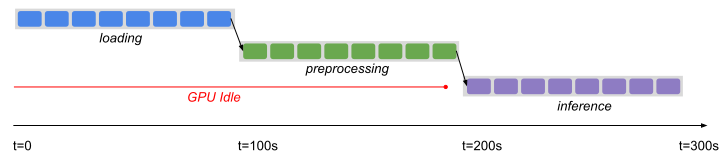
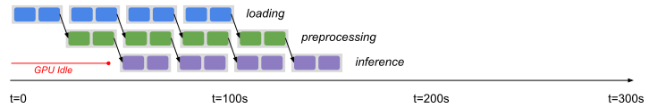
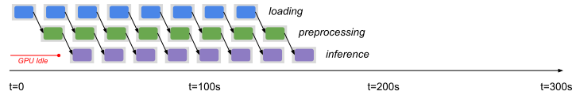
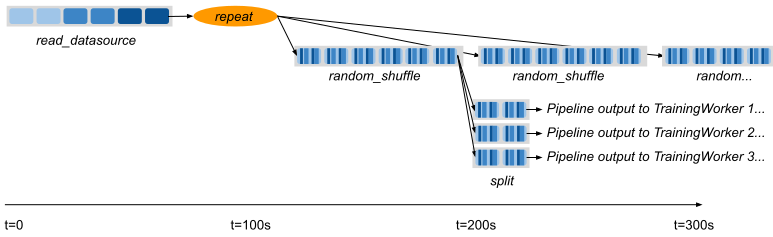

.. _pipelining_datasets:

==================
Pipelining Compute 
==================

Dataset pipelines allow Dataset transformations to be executed incrementally on *windows* of the base data, instead of on all of the data at once. This can be used for streaming data loading into ML training, or to execute batch transformations on large datasets without needing to load the entire dataset into cluster memory.

Dataset pipelines can be read in a streaming fashion by one consumer, or split into multiple sub-pipelines and read in parallel by multiple consumers for distributed traininmg.

Creating a DatasetPipeline
==========================

A `DatasetPipeline <package-ref.html#datasetpipeline-api>`__ can be constructed in two ways: either by pipelining the execution of an existing Dataset (via :meth:`~ray.data.Dataset.window`), or generating repeats of an existing Dataset (via :meth:`~ray.data.Dataset.repeat`). Similar to Datasets, you can freely pass DatasetPipelines between Ray tasks, actors, and libraries. Get started with this synthetic data example:

.. code-block:: python

    import ray

    def func1(i: int) -> int:
        return i + 1

    def func2(i: int) -> int:
        return i * 2

    def func3(i: int) -> int:
        return i % 3

    # Create a dataset and then create a pipeline from it.
    base = ray.data.range(1000000)
    print(base)
    # -> Dataset(num_blocks=200, num_rows=1000000, schema=<class 'int'>)
    pipe = base.window(blocks_per_window=10)
    print(pipe)
    # -> DatasetPipeline(num_windows=20, num_stages=1)

    # Applying transforms to pipelines adds more pipeline stages.
    pipe = pipe.map(func1)
    pipe = pipe.map(func2)
    pipe = pipe.map(func3)
    print(pipe)
    # -> DatasetPipeline(num_windows=20, num_stages=4)

    # Output can be pulled from the pipeline concurrently with its execution.
    num_rows = 0
    for row in pipe.iter_rows():
        num_rows += 1
    # ->
    # Stage 0:  55%|█████████████████████████                |11/20 [00:02<00:00,  9.86it/s]
    # Stage 1:  50%|██████████████████████                   |10/20 [00:02<00:01,  9.45it/s]
    # Stage 2:  45%|███████████████████                      | 9/20 [00:02<00:01,  8.27it/s]
    # Stage 3:  35%|████████████████                         | 8/20 [00:02<00:02,  5.33it/s]
    print("Total num rows", num_rows)
    # -> Total num rows 1000000

You can also create a DatasetPipeline from a custom iterator over dataset creators using :meth:`~ray.data.DatasetPipeline.from_iterable`. For example, this is how you would implement :meth:`~ray.data.Dataset.repeat` and :meth:`~ray.data.Dataset.window` using :meth:`~ray.data.DatasetPipeline.from_iterable`:

.. code-block:: python

    import ray
    from ray.data.dataset_pipeline import DatasetPipeline

    # Equivalent to ray.data.range(1000).repeat(times=4)
    source = ray.data.range(1000)
    pipe = DatasetPipeline.from_iterable(
        [lambda: source, lambda: source, lambda: source, lambda: source])

    # Equivalent to ray.data.range(1000).window(blocks_per_window=10)
    splits = ray.data.range(1000, parallelism=200).split(20)
    pipe = DatasetPipeline.from_iterable([lambda s=s: s for s in splits])

Transforming Pipeline Windows
=============================

While most Dataset operations are per-row (e.g., map, filter), some operations apply to the Dataset as a whole (e.g., sort, shuffle). Per-row operations apply to rows in the pipeline independently in the same way they do in a normal Dataset. However, when used in a pipeline, holistic transforms like shuffle are applied separately to each window in the pipeline:

.. code-block:: python

    # Example of randomly shuffling each window of a pipeline.
    ray.data.from_items([0, 1, 2, 3, 4]) \
        .repeat(2) \
        .random_shuffle_each_window() \
        .show_windows()
    # ->
    # ----- Epoch 0 ------
    # === Window 0 ===
    # 4
    # 3
    # 1
    # 0
    # 2
    # ----- Epoch 1 ------
    # === Window 1 ===
    # 2
    # 1
    # 4
    # 0
    # 3

You can also apply arbitrary transformations to each window using :meth:`DatasetPipeline.foreach_window() <ray.data.DatasetPipeline.foreach_window>`:

.. code-block:: python

    # Equivalent transformation using .foreach_window()
    ray.data.from_items([0, 1, 2, 3, 4]) \
        .repeat(2) \
        .foreach_window(lambda w: w.random_shuffle()) \
        .show_windows()
    # ->
    # ----- Epoch 0 ------
    # === Window 0 ===
    # 1
    # 0
    # 4
    # 2
    # 3
    # ----- Epoch 1 ------
    # === Window 1 ===
    # 4
    # 2
    # 0
    # 3
    # 1

Example: Pipelined Batch Inference
==================================

In this example, we pipeline the execution of a three-stage Dataset application to minimize GPU idle time. Let's take a look at a simple batch inference example:

.. code-block:: python

    def preprocess(image: bytes) -> bytes:
        return image

    class BatchInferModel:
        def __init__(self):
            self.model = ImageNetModel()
        def __call__(self, batch: pd.DataFrame) -> pd.DataFrame:
            return self.model(batch)

    # Load data from storage.
    ds: Dataset = ray.data.read_binary_files("s3://bucket/image-dir")

    # Preprocess the data.
    ds = ds.map(preprocess)

    # Apply GPU batch inference to the data.
    ds = ds.map_batches(BatchInferModel, compute="actors", batch_size=256, num_gpus=1)

    # Save the output.
    ds.write_json("/tmp/results")

Ignoring the output, the above script has three separate stages: loading, preprocessing, and inference. Assuming we have a fixed-sized cluster, and that each stage takes 100 seconds each, the cluster GPUs will be idle for the first 200 seconds of execution:

..
  https://docs.google.com/drawings/d/1UMRcpbxIsBRwD8G7hR3IW6DPa9rRSkd05isg9pAEx0I/edit

Enabling Pipelining
~~~~~~~~~~~~~~~~~~~

We can optimize this by *pipelining* the execution of the dataset with the :meth:`~ray.data.Dataset.window` call, which returns a DatasetPipeline instead of a Dataset object. The pipeline supports similar transformations to the original Dataset:

.. code-block:: python

    # Convert the Dataset into a DatasetPipeline.
    pipe: DatasetPipeline = ray.data \
        .read_binary_files("s3://bucket/image-dir") \
        .window(blocks_per_window=2)

    # The remainder of the steps do not change.
    pipe = pipe.map(preprocess)
    pipe = pipe.map_batches(BatchInferModel, compute="actors", batch_size=256, num_gpus=1)
    pipe.write_json("/tmp/results")

Here we specified ``blocks_per_window=2``, which means that the Dataset is split into smaller sub-Datasets of two blocks each. Each transformation or *stage* of the pipeline is operating over these two-block Datasets in parallel. This means batch inference processing can start as soon as two blocks are read and preprocessed, greatly reducing the GPU idle time:

Pipelined Writes
~~~~~~~~~~~~~~~~

When calling ``write_<datasource>()`` on a pipeline, data is written separately for each window. This means that in the above example, JSON files will start being written as soon as the first window is finished, in a incremental / pipelined way.

Tuning Parallelism
~~~~~~~~~~~~~~~~~~

Tune the throughput vs latency of your pipeline with the ``blocks_per_window`` setting. As a rule of thumb, higher parallelism settings perform better, however ``blocks_per_window == num_blocks`` effectively disables pipelining, since the DatasetPipeline will only contain a single Dataset. The other extreme is setting ``blocks_per_window=1``, which minimizes the latency to initial output but only allows one concurrent transformation task per stage:

You can also specify the size of each window using ``bytes_per_window``. In this mode, Datasets will determine the size of each window based on the target byte size, giving each window at least 1 block but not otherwise exceeding the target bytes per window. This mode can be useful to limit the memory usage of a pipeline. As a rule of thumb, the cluster memory should be at least 2-5x the window size to avoid spilling.

.. code-block:: python

    # Create a DatasetPipeline with up to 10GB of data per window.
    pipe: DatasetPipeline = ray.data \
        .read_binary_files("s3://bucket/image-dir") \
        .window(bytes_per_window=10e9)
    # -> INFO -- Created DatasetPipeline with 73 windows: 9120MiB min, 9431MiB max, 9287MiB mean
    # -> INFO -- Blocks per window: 10 min, 16 max, 14 mean
    # -> INFO -- ✔️  This pipeline's per-window parallelism is high enough to fully utilize the cluster.
    # -> INFO -- ✔️  This pipeline's windows likely fit in object store memory without spilling.

Datasets will warn you if the windows are too large or each window has insufficient parallelism (too few blocks). Check out the reported statistics for window size and blocks per window to ensure efficient pipeline execution.

Pipelines for ML Ingest
=======================

Dataset pipelines can also be used for streaming data loading into distributed training in Ray.

.. note::

    Ray Train is the standard libary for distributed training in Ray. Train will automatically create
    and split DatasetPipelines for you. See :ref:`Configuring Training Datasets <air-ingest>`
    for the recommended way to get started with distributed training.

Splitting pipelines for distributed ingest
~~~~~~~~~~~~~~~~~~~~~~~~~~~~~~~~~~~~~~~~~~

Similar to how you can split a Dataset with :meth:`Dataset.split() <ray.data.Dataset.split>`, you can also split a DatasetPipeline with the same method call :meth:`DatasetPipeline.split() <ray.data.DatasetPipeline.split>`. This returns a number of DatasetPipeline shards that share a common parent pipeline. Each shard can be passed to a remote task or actor.

**Code**:

.. code-block:: python

    # Create a pipeline that loops over its source dataset indefinitely.
    pipe: DatasetPipeline = ray.data \
        .read_parquet("s3://bucket/dir") \
        .repeat() \
        .random_shuffle_each_window()

    @ray.remote(num_gpus=1)
    class TrainingWorker:
        def __init__(self, rank: int, shard: DatasetPipeline):
            self.rank = rank
            self.shard = shard
        ...

    shards: List[DatasetPipeline] = pipe.split(n=3)
    workers = [TrainingWorker.remote(rank, s) for rank, s in enumerate(shards)]
    ...

**Pipeline**:

Handling Epochs
~~~~~~~~~~~~~~~

It's common in ML training to want to divide data ingest into epochs, or repetitions over the original source dataset.
DatasetPipeline provides a convenient :meth:`DatasetPipeline.iter_epochs() <ray.data.DatasetPipeline.iter_epochs>` method that can be used to split up the pipeline into epoch-delimited pipeline segments.
Epochs are defined by the last call to ``.repeat()`` in a pipeline, for example:

.. code-block:: python

    pipe = ray.data.from_items([0, 1, 2, 3, 4]) \
        .repeat(3) \
        .random_shuffle_each_window()
    for i, epoch in enumerate(pipe.iter_epochs()):
        print("Epoch {}", i)
        for row in epoch.iter_rows():
            print(row)
    # ->
    # Epoch 0
    # 2
    # 1
    # 3
    # 4
    # 0
    # Epoch 1
    # 3
    # 4
    # 0
    # 2
    # 1
    # Epoch 2
    # 3
    # 2
    # 4
    # 1
    # 0

Note that while epochs commonly consist of a single window, they can also contain multiple windows if ``.window()`` is used or there are multiple ``.repeat()`` calls.
