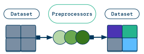

.. _air-preprocessors:

Using Preprocessors
===================

Data preprocessing is a common technique for transforming raw data into features for a machine learning model.
In general, you may want to apply the same preprocessing logic to your offline training data and online inference data.

This page covers *preprocessors*, which are a higher level API on top of existing Ray Data operations like `map_batches`,
targeted towards tabular and structured data use cases.

If you are working with tabular data, you should use Ray Data preprocessors. However, the recommended way to perform preprocessing 
for unstructured data is to :ref:`use existing Ray Data operations <transforming_data>` instead of preprocessors. 

.. https://docs.google.com/drawings/d/1ZIbsXv5vvwTVIEr2aooKxuYJ_VL7-8VMNlRinAiPaTI/edit

Overview
--------

The :class:`Preprocessor <ray.data.preprocessor.Preprocessor>` class has four public methods:

#. :meth:`fit() <ray.data.preprocessor.Preprocessor.fit>`: Compute state information about a :class:`Dataset <ray.data.Dataset>` (e.g., the mean or standard deviation of a column)
   and save it to the :class:`Preprocessor <ray.data.preprocessor.Preprocessor>`. This information is used to perform :meth:`transform() <ray.data.preprocessor.Preprocessor.transform>`, and the method is typically called on a
   training dataset.
#. :meth:`transform() <ray.data.preprocessor.Preprocessor.transform>`: Apply a transformation to a :class:`Dataset <ray.data.Dataset>`.
   If the :class:`Preprocessor <ray.data.preprocessor.Preprocessor>` is stateful, then :meth:`fit() <ray.data.preprocessor.Preprocessor.fit>` must be called first. This method is typically called on training,
   validation, and test datasets.
#. :meth:`transform_batch() <ray.data.preprocessor.Preprocessor.transform_batch>`: Apply a transformation to a single :class:`batch <ray.train.predictor.DataBatchType>` of data. This method is typically called on online or offline inference data.
#. :meth:`fit_transform() <ray.data.preprocessor.Preprocessor.fit_tranform>`: Syntactic sugar for calling both :meth:`fit() <ray.data.preprocessor.Preprocessor.fit>` and :meth:`transform() <ray.data.preprocessor.Preprocessor.transform>` on a :class:`Dataset <ray.data.Dataset>`.

To show these methods in action, let's walk through a basic example. First, we'll set up two simple Ray ``Dataset``\s.

.. literalinclude:: doc_code/preprocessors.py
    :language: python
    :start-after: __preprocessor_setup_start__
    :end-before: __preprocessor_setup_end__

Next, ``fit`` the ``Preprocessor`` on one ``Dataset``, and then ``transform`` both ``Dataset``\s with this fitted information.

.. literalinclude:: doc_code/preprocessors.py
    :language: python
    :start-after: __preprocessor_fit_transform_start__
    :end-before: __preprocessor_fit_transform_end__

Finally, call ``transform_batch`` on a single batch of data.

.. literalinclude:: doc_code/preprocessors.py
    :language: python
    :start-after: __preprocessor_transform_batch_start__
    :end-before: __preprocessor_transform_batch_end__

The most common way of using a preprocessor is by using it on a :ref:`Ray Data dataset <data>`, which is then passed to a Ray Train :ref:`Trainer <train-docs>`. See also:

* Ray Train's data preprocessing and ingest section for :ref:`PyTorch <data-ingest-torch>`
* Ray Train's data preprocessing and ingest section for :ref:`LightGBM/XGBoost <data-ingest-gbdt>`

Types of preprocessors
----------------------

Built-in preprocessors
~~~~~~~~~~~~~~~~~~~~~~

Ray Data provides a handful of preprocessors out of the box.

**Generic preprocessors**

.. autosummary::
  :nosignatures:

    ray.data.preprocessors.BatchMapper
    ray.data.preprocessors.Chain
    ray.data.preprocessors.Concatenator
    ray.data.preprocessor.Preprocessor
    ray.data.preprocessors.SimpleImputer

**Categorical encoders**

.. autosummary::
  :nosignatures:

    ray.data.preprocessors.Categorizer
    ray.data.preprocessors.LabelEncoder
    ray.data.preprocessors.MultiHotEncoder
    ray.data.preprocessors.OneHotEncoder
    ray.data.preprocessors.OrdinalEncoder

**Feature scalers**

.. autosummary::
  :nosignatures:

    ray.data.preprocessors.MaxAbsScaler
    ray.data.preprocessors.MinMaxScaler
    ray.data.preprocessors.Normalizer
    ray.data.preprocessors.PowerTransformer
    ray.data.preprocessors.RobustScaler
    ray.data.preprocessors.StandardScaler

**Text encoders**

.. autosummary::
  :nosignatures:

    ray.data.preprocessors.CountVectorizer
    ray.data.preprocessors.HashingVectorizer
    ray.data.preprocessors.Tokenizer
    ray.data.preprocessors.FeatureHasher

**Utilities**

.. autosummary::
  :nosignatures:

    ray.data.Dataset.train_test_split

Which preprocessor should you use?
----------------------------------

The type of preprocessor you use depends on what your data looks like. This section
provides tips on handling common data formats.

Categorical data
~~~~~~~~~~~~~~~~

Most models expect numerical inputs. To represent your categorical data in a way your
model can understand, encode categories using one of the preprocessors described below.

.. list-table::
   :header-rows: 1

   * - Categorical Data Type
     - Example
     - Preprocessor
   * - Labels
     - ``"cat"``, ``"dog"``, ``"airplane"``
     - :class:`~ray.data.preprocessors.LabelEncoder`
   * - Ordered categories
     - ``"bs"``, ``"md"``, ``"phd"``
     - :class:`~ray.data.preprocessors.OrdinalEncoder`
   * - Unordered categories
     - ``"red"``, ``"green"``, ``"blue"``
     - :class:`~ray.data.preprocessors.OneHotEncoder`
   * - Lists of categories
     - ``("sci-fi", "action")``, ``("action", "comedy", "animated")``
     - :class:`~ray.data.preprocessors.MultiHotEncoder`

.. note::
    If you're using LightGBM, you don't need to encode your categorical data. Instead,
    use :class:`~ray.data.preprocessors.Categorizer` to convert your data to
    `pandas.CategoricalDtype`.

Numerical data
~~~~~~~~~~~~~~

To ensure your models behaves properly, normalize your numerical data. Reference the
table below to determine which preprocessor to use.

.. list-table::
   :header-rows: 1

   * - Data Property
     - Preprocessor
   * - Your data is approximately normal
     - :class:`~ray.data.preprocessors.StandardScaler`
   * - Your data is sparse
     - :class:`~ray.data.preprocessors.MaxAbsScaler`
   * - Your data contains many outliers
     - :class:`~ray.data.preprocessors.RobustScaler`
   * - Your data isn't normal, but you need it to be
     - :class:`~ray.data.preprocessors.PowerTransformer`
   * - You need unit-norm rows
     - :class:`~ray.data.preprocessors.Normalizer`
   * - You aren't sure what your data looks like
     - :class:`~ray.data.preprocessors.MinMaxScaler`

.. warning::
    These preprocessors operate on numeric columns. If your dataset contains columns of
    type :class:`~ray.air.util.tensor_extensions.pandas.TensorDtype`, you may need to
    :ref:`implement a custom preprocessor <air-custom-preprocessors>`.

Additionally, if your model expects a tensor or ``ndarray``, create a tensor using
:class:`~ray.data.preprocessors.Concatenator`.

.. tip::
  Built-in feature scalers like :class:`~ray.data.preprocessors.StandardScaler` don't
  work on :class:`~ray.air.util.tensor_extensions.pandas.TensorDtype` columns, so apply
  :class:`~ray.data.preprocessors.Concatenator` after feature scaling. Combine feature
  scaling and concatenation into a single preprocessor with
  :class:`~ray.data.preprocessors.Chain`.

  .. literalinclude:: doc_code/preprocessors.py
    :language: python
    :start-after: __concatenate_start__
    :end-before: __concatenate_end__

Text data
~~~~~~~~~

A `document-term matrix <https://en.wikipedia.org/wiki/Document-term_matrix>`_ is a
table that describes text data, often used in natural language processing.

To generate a document-term matrix from a collection of documents, use
:class:`~ray.data.preprocessors.HashingVectorizer` or
:class:`~ray.data.preprocessors.CountVectorizer`. If you already know the frequency of
tokens and want to store the data in a document-term matrix, use
:class:`~ray.data.preprocessors.FeatureHasher`.

.. list-table::
   :header-rows: 1

   * - Requirement
     - Preprocessor
   * - You care about memory efficiency
     - :class:`~ray.data.preprocessors.HashingVectorizer`
   * - You care about model interpretability
     - :class:`~ray.data.preprocessors.CountVectorizer`

Filling in missing values
~~~~~~~~~~~~~~~~~~~~~~~~~

If your dataset contains missing values, replace them with
:class:`~ray.data.preprocessors.SimpleImputer`.

.. literalinclude:: doc_code/preprocessors.py
    :language: python
    :start-after: __simple_imputer_start__
    :end-before: __simple_imputer_end__

Chaining preprocessors
~~~~~~~~~~~~~~~~~~~~~~

If you need to apply more than one preprocessor, compose them together with
:class:`~ray.data.preprocessors.Chain`.

:class:`~ray.data.preprocessors.Chain` applies ``fit`` and ``transform``
sequentially. For example, if you construct
``Chain(preprocessorA, preprocessorB)``, then ``preprocessorB.transform`` is applied
to the result of ``preprocessorA.transform``.

.. literalinclude:: doc_code/preprocessors.py
    :language: python
    :start-after: __chain_start__
    :end-before: __chain_end__

.. _air-custom-preprocessors:

Implementing custom preprocessors
~~~~~~~~~~~~~~~~~~~~~~~~~~~~~~~~~

If you want to implement a custom preprocessor that needs to be fit, extend the
:class:`~ray.data.preprocessor.Preprocessor` base class.

.. literalinclude:: doc_code/preprocessors.py
    :language: python
    :start-after: __custom_stateful_start__
    :end-before: __custom_stateful_end__

If your preprocessor doesn't need to be fit, construct a
:class:`~ray.data.preprocessors.BatchMapper` to apply a UDF in parallel over your data.
:class:`~ray.data.preprocessors.BatchMapper` can drop, add, or modify columns, and you
can specify a `batch_size` to control the size of the data batches provided to your UDF.

.. literalinclude:: doc_code/preprocessors.py
    :language: python
    :start-after: __custom_stateless_start__
    :end-before: __custom_stateless_end__
