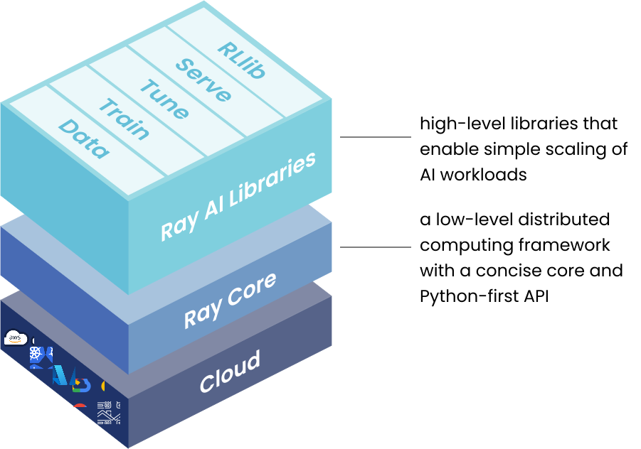

.. _data_quickstart:

Ray Data basics
===============

This page introduces the core capabilities of Ray Data and includes examples of using the Ray :class:`Dataset <ray.data.Dataset>` abstraction for the following tasks:

* :ref:`Loading data <loading_key_concept>`
* :ref:`Transforming data <transforming_key_concept>`
* :ref:`Consuming data <consuming_key_concept>`
* :ref:`Saving data <saving_key_concept>`

What is Ray Data?
=================

Ray Data is the Ray AI Library for loading, transforming, consuming, and saving data.

Ray AI libraries build on top of Ray Core primitives to provide developer-friendly APIs for completing common data, ML, and AI tasks. To learn about Ray Core primitives, see :ref:`Ray Core key concepts<core-key-concepts>`.

The follow diagram provides a high-level view of the Ray framework:

Common Ray Data tasks
=====================

Ray Data contains operators that focus on the following key tasks:

* Loading data from storage.
* Ingesting data from connected systems.
* Exchanging data from other frameworks and data structures.
* Transforming and preprocessing data.
* Performing offline batch inference.
* Persisting results to storage or integrated systems.
* Pipelining data for Ray Train.

What is a Ray Dataset?
----------------------

Ray Data's main abstraction is a :class:`Dataset <ray.data.Dataset>`, which represents a distributed collection of data. Datasets are specifically designed for machine learning workloads and can efficiently handle data collections that exceed a single machine's memory.

Ray Datasets are similar to DataFrames and Datasets in TensorFlow, PyTorch, pandas, and Apache Spark. Ray Data provides interoperatibility with these and other libraries. See :ref:`load_data_libraries`.

For details on how Ray Datasets represent data for distributed processing, see :ref:`data_key_concepts`

Most operations in Ray Data fall into one of the following categories:

+----------------+--------------------------------------------------------------------------------------------------------------------------------------------------------------+
| Operator type  |                                                                         Description                                                                          |
+================+==============================================================================================================================================================+
| Creation       | Creates a Dataset from the specified data source, such as data files, an external system, a Python data structure, or another data framework.                |
+----------------+--------------------------------------------------------------------------------------------------------------------------------------------------------------+
| Transformation | Applies specified logic on a Dataset and outputs the results as a new Dataset.                                                                               |
+----------------+--------------------------------------------------------------------------------------------------------------------------------------------------------------+
| Consumption    | Materializes results from a Dataset to write data as files, convert data to another framework, create an iterator, or return rows or results from a Dataset. |
+----------------+--------------------------------------------------------------------------------------------------------------------------------------------------------------+

Run Ray Data code examples
--------------------------

The following code examples build upon one another sequentially. You can run these commands interactively in a Jupyter notebook if you have :ref:`configured Ray<installation>`, or you can `run Ray on Anyscale <https://www.anyscale.com/ray-on-anyscale>`_.

These code examples materialize data at each step to show results. When preparing code for production, only include operations that materialize results if they are essential to your application. This allows Ray to optimize the logical and physical plans and efficently pipeline operations for concurrent execution. See :ref:`plans`.

Combine these steps to complete data preprocessing or ETL (extract, transform, and load) workloads. For an example of 

.. _loading_key_concept:

Load data to create a Dataset
-----------------------------

You can load data to create a Dataset from sources including local files, Python objects, and cloud storage services like S3 or GCS.   

Ray Data seamlessly integrates with any `filesystem supported by Arrow <http://arrow.apache.org/docs/python/generated/pyarrow.fs.FileSystem.html>`_.

The following code example loads CSV data from an S3 bucket and previews the data:

.. testcode::

    import ray

    # Load a CSV dataset directly from S3
    ds = ray.data.read_csv("s3://anonymous@air-example-data/iris.csv")
    
    # Preview the first record
    ds.show(limit=1)

.. testoutput::

    {'sepal length (cm)': 5.1, 'sepal width (cm)': 3.5, 'petal length (cm)': 1.4, 'petal width (cm)': 0.2, 'target': 0}

For an overview of creating Dataset from other sources, including Python data structures and other data processing frameworks, see :ref:`loading_data`.

.. _transforming_key_concept:

Transform data
--------------

You define transformations using user-defined functions (UDFs) and 

 to individual rows or batches of data. 

You write UDFs using Python. The following are examples of UDFs you might use as transformations:
- Arbitrary Python logic.
- ML model predictions.
- NumPy calculations.
- pandas operations.
- PyArrow operations.

Ray automatically optimizes these transformations for parallel and concurrent execution, allowing you to easily scale to large datasets.

The following code example applies a UDF to calculate the petal area for the CSV data loaded in the code example above.

.. testcode::

    from typing import Dict
    import numpy as np

    # Define a transformation to compute a "petal area" attribute
    def transform_batch(batch: Dict[str, np.ndarray]) -> Dict[str, np.ndarray]:
        vec_a = batch["petal length (cm)"]
        vec_b = batch["petal width (cm)"]
        batch["petal area (cm^2)"] = vec_a * vec_b
        return batch

    # Apply the transformation to our dataset
    transformed_ds = ds.map_batches(transform_batch)
    
    # View the updated schema with the new column
    # .materialize() will execute all the lazy transformations and
    # materialize the dataset into object store memory
    print(transformed_ds.materialize())

.. testoutput::

    MaterializedDataset(
       num_blocks=...,
       num_rows=150,
       schema={
          sepal length (cm): double,
          sepal width (cm): double,
          petal length (cm): double,
          petal width (cm): double,
          target: int64,
          petal area (cm^2): double
       }
    )

To explore more transformation capabilities, read :ref:`Transforming data <transforming_data>`.

.. _consuming_key_concept:

Consume data
------------

You consume 

Access Dataset contents through convenient methods like :meth:`~ray.data.Dataset.take_batch` and  :meth:`~ray.data.Dataset.iter_batches`. You can also pass Datasets directly to Ray Tasks or Actors for distributed processing.

.. testcode::

    # Extract the first 3 rows as a batch for processing
    print(transformed_ds.take_batch(batch_size=3))

.. testoutput::
    :options: +NORMALIZE_WHITESPACE

    {'sepal length (cm)': array([5.1, 4.9, 4.7]),
        'sepal width (cm)': array([3.5, 3. , 3.2]),
        'petal length (cm)': array([1.4, 1.4, 1.3]),
        'petal width (cm)': array([0.2, 0.2, 0.2]),
        'target': array([0, 0, 0]),
        'petal area (cm^2)': array([0.28, 0.28, 0.26])}

For more details on working with Dataset contents, see :ref:`iterating-over-data` and :ref:`saving-data`.

.. _saving_key_concept:

Save data
---------

Export processed datasets to a variety of formats and storage locations using methods
such as :meth:`~ray.data.Dataset.write_parquet`, :meth:`~ray.data.Dataset.write_csv`.

.. testcode::
    :hide:

    # The number of blocks can be non-determinstic. Repartition the dataset beforehand
    # so that the number of written files is consistent.
    transformed_ds = transformed_ds.repartition(2)

.. testcode::

    import os

    # Save the transformed dataset as Parquet files
    transformed_ds.write_parquet("/tmp/iris")

    # Verify the files were created
    print(os.listdir("/tmp/iris"))

.. testoutput::
    :options: +MOCK

    ['..._000000.parquet', '..._000001.parquet']

For more information on saving datasets, see :ref:`saving-data`.

.. _etl_example:

ETL with Ray Data
-----------------

The following code example loads CSV data from S3, applies a data transformation to calculate a new field, and saves results using Parquet. 

.. testcode::
    :hide:

    # The number of blocks can be non-determinstic. Repartition the dataset beforehand
    # so that the number of written files is consistent.
    transformed_ds = transformed_ds.repartition(2)

.. testcode::

    import os

    # Save the transformed dataset as Parquet files
    transformed_ds.write_parquet("/tmp/iris")

    # Verify the files were created
    print(os.listdir("/tmp/iris"))

.. testoutput::
    :options: +MOCK

    ['..._000000.parquet', '..._000001.parquet']

.. _preprocessing_example:

Data preprocessing with Ray Data
--------------------------------

The following code example loads CSV data from S3, applies a data transformation to calculate a new field, and returns the result as the Python variable `train_dataset`.

