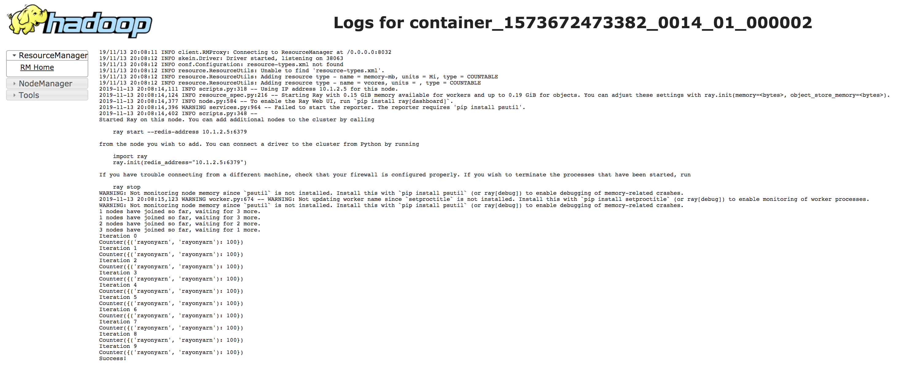

Deploying on YARN
=================

.. warning::

  Running Ray on YARN is still a work in progress. If you have a
  suggestion for how to improve this documentation or want to request
  a missing feature, please get in touch using one of the channels in the
  `Questions or Issues?`_ section below.

This document assumes that you have access to a YARN cluster and will walk
you through using `Skein`_ to deploy a YARN job that starts a Ray cluster and
runs an example script on it.

Skein uses a declarative specification (either written as a yaml file, or using the python api) and allows users to launch jobs and scale applications without the user ever touching java.

You will need to install Skein first: ``pip install skein``.

The Skein ``yaml`` file and example Ray program used here are provided in the
`Ray repository`_ to get you started. Refer to the provided ``yaml``
files to be sure that you maintain important configuration options for Ray to
function properly.

.. _`Ray repository`: https://github.com/ray-project/ray/tree/master/doc/yarn

Skein Configuration
-------------------

A Ray job is configured to run as two `Skein services`_. :

1. The ``ray-head`` service that starts the Ray head node and then runs the
   application.
2. The ``ray-worker`` service that starts worker nodes that join the Ray cluster.
   You can change the number of instances in this configuration or at runtime
   using ``skein scale`` to scale the cluster up/down.

Both are composed of what files are needed to run them and what commands are needed to start each service.

.. code-block:: yaml

    services:
        ray-head:
            # There should only be one instance of the head node per cluster.
            instances: 1
            resources:
                # The resources for the head node.
                vcores: 1
                memory: 2048
            files:
                ...
            script:
                ...
        ray-worker:
            # There should only be one instance of the head node per cluster.
            instances: 1
            resources:
                # The resources for the head node.
                vcores: 1
                memory: 2048
            files:
                ...
            script:
                ...

Resource Specification
~~~~~~~~~~~~~~~~~~~~~~

Packaging Dependencies
----------------------

Use the ``files`` to stage listed files for the application to use. See `the Skein file distribution page <https://jcrist.github.io/skein/distributing-files.html>`_ for more information.

.. code-block:: yaml

    services:
        ray-head:
            # There should only be one instance of the head node per cluster.
            instances: 1
            resources:
                # The resources for the head node.
                vcores: 1
                memory: 2048
            files:
                # ray/doc/yarn/example.py
                example.py: example.py
            #     # A packaged python environment using `conda-pack`. Note that Skein
            #     # doesn't require any specific way of distributing files, but this
            #     # is a good one for python projects.
            #     # See https://jcrist.github.io/skein/distributing-files.html
            #     environment: environment.tar.gz

Ray Setup in YARN
-----------------

Below is a walkthrough of the script we add to start the ``ray-head``. Note that this assumes each application is using a new Ray cluster rather than reusing the same cluster.

Head node commands
~~~~~~~~~~~~~~~~~~

We start by activating a pre-existing environment for dependency management.

.. code-block:: bash

    source /home/rayonyarn/miniconda3/bin/activate

Obtain the Skein Application ID which is used when pushing addresses to worker services.

.. code-block:: bash

    APP_ID=$(python -c 'import skein;print(skein.properties.application_id)')

Register the Ray head addresses needed by the workers with the Skein key-value store.

.. code-block:: bash

    skein kv put --key=RAY_HEAD_ADDRESS --value=$(hostname -i) $APP_ID

This command starts all the processes needed on the ray head node. By default, we set object store memory
and heap memory to roughly 200 MB. This is conservative and should be set according to application needs.

.. code-block:: bash

    ray start --head --redis-port=6379 --object-store-memory=200000000 --memory 200000000 --num-cpus=1

This executes the user script.

.. code-block:: bash

    python example.py

After the user script has executed, all started processes should also die. Note that we put this in the setup script of the service.

.. code-block:: bash

    ray stop
    skein application shutdown $APP_ID

Worker node commands
~~~~~~~~~~~~~~~~~~~~

This command gets any addresses it needs (e.g. the head node) from the skein key-value store.

.. code-block:: bash

    APP_ID=$(python -c 'import skein;print(skein.properties.application_id)')
    RAY_HEAD_ADDRESS=$(skein kv get --key=RAY_HEAD_ADDRESS "$APP_ID")

The below command starts all the processes needed on a ray worker node, blocking until killed with sigterm. After sigterm, all started processes should also die (ray stop).

.. code-block:: bash

    ray start --object-store-memory=200000000 --memory 200000000 --num-cpus=1 --address=$RAY_HEAD_ADDRESS:6379 --block; ray stop

Running a Job
-------------

Within your Ray script, use the following to connect to the started Ray cluster:

.. code-block:: python

    if __name__ == "__main__":
        DRIVER_MEMORY = 100 * 1024 * 1024  # 100MB, but set this to anything you want.
        ray.init(
            address="localhost:6379", driver_object_store_memory=DRIVER_MEMORY)
        main()

You can use the following command to launch the application as specified by the Skein YAML file.

.. code-block:: bash

    skein application submit [TEST.YAML]

You can see the job running on the YARN dashboard.

Cleaning Up
-----------

To clean up, use the following:

.. code-block:: bash

    skein application shutdown $appid

Questions or Issues?
--------------------

You can post questions or issues or feedback through the following channels:

1. `ray-dev@googlegroups.com`_: For discussions about development or any general
   questions and feedback.
2. `StackOverflow`_: For questions about how to use Ray.
3. `GitHub Issues`_: For bug reports and feature requests.

.. _`ray-dev@googlegroups.com`: https://groups.google.com/forum/#!forum/ray-dev
.. _`StackOverflow`: https://stackoverflow.com/questions/tagged/ray
.. _`GitHub Issues`: https://github.com/ray-project/ray/issues

.. _`Skein`: https://jcrist.github.io/skein/
