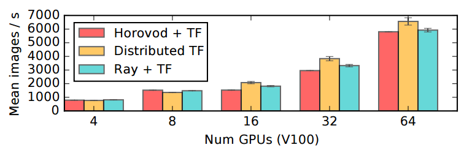

Distributed SGD (Experimental)
==============================

Ray includes an implementation of synchronous distributed stochastic gradient descent (SGD), which is competitive in performance with implementations in Horovod and Distributed TensorFlow.

Ray SGD is built on top of the Ray task and actor abstractions to provide seamless integration into existing Ray applications.

Interface
---------

To use Ray SGD, define a `model class <https://github.com/ray-project/ray/blob/master/python/ray/experimental/sgd/model.py>`__ with ``loss`` and ``optimizer`` attributes:

.. autoclass:: ray.experimental.sgd.Model

Then, pass a model creator function to the ``ray.experimental.sgd.DistributedSGD`` class. To drive the distributed training, ``sgd.step()`` can be called repeatedly:

.. code-block:: python

    model_creator = lambda worker_idx, device_idx: YourModelClass()

    sgd = DistributedSGD(
        model_creator,
        num_workers=2,
        devices_per_worker=4,
        gpu=True,
        strategy="ps")

    for i in range(NUM_ITERS):
        sgd.step()

Under the hood, Ray SGD will create *replicas* of your model onto each hardware device (GPU) allocated to workers (controlled by ``num_workers``). Multiple devices can be managed by each worker process (controlled by ``devices_per_worker``). Each model instance will be in a separate TF variable scope. The ``DistributedSGD`` class coordinates the distributed computation and application of gradients to improve the model.

There are two distributed SGD strategies available for use:
    - ``strategy="simple"``: Gradients are averaged centrally on the driver before being applied to each model replica. This is a reference implementation for debugging purposes.
    - ``strategy="ps"``: Gradients are computed and averaged within each node. Gradients are then averaged across nodes through a number of parameter server actors. To pipeline the computation of gradients and transmission across the network, we use a custom TensorFlow op that can read and write to the Ray object store directly.

Note that when ``num_workers=1``, only local allreduce will be used and the choice of distributed strategy is irrelevant.

The full documentation for ``DistributedSGD`` is as follows:

.. autoclass:: ray.experimental.sgd.DistributedSGD

Examples
--------

For examples of end-to-end usage, check out the `ImageNet synthetic data test <https://github.com/ray-project/ray/blob/master/python/ray/experimental/sgd/test_sgd.py>`__ and also the simple `MNIST training example <https://github.com/ray-project/ray/blob/master/python/ray/experimental/sgd/mnist_example.py>`__, which includes examples of how access the model weights and monitor accuracy as training progresses.

Performance
-----------

When using the new Ray backend (which will be enabled by default in Ray 0.6+), we `expect <https://github.com/ray-project/ray/pull/3033>`__ performance competitive with other synchronous SGD implementations on 25Gbps Ethernet.

    Images per second reached when distributing the training of a ResNet-101 TensorFlow model (from the official TF benchmark). All experiments were run on p3.16xl instances connected by 25Gbps Ethernet, and workers allocated 4 GPUs per node as done in Horovod.
