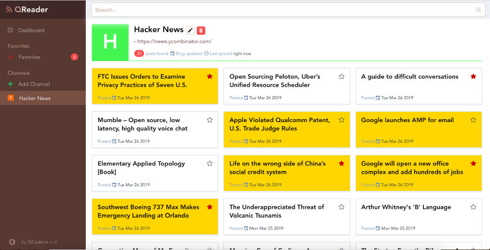

News Reader
===========

This document walks you through implementing a simple news reader using Ray.
The reader consists of a simple Vue.js frontend and a Ray backend.
It has a simple recommendation engine built in, which you will train on upvotes
from hackernews and which learns online as the user stars articles.

It looks like this (the frontend is based on `QReader`_), here the recommended
articles are in yellow:

View the `code for this example`_.

To run this example, you will need to install NPM and a few python dependencies.

.. code-block:: bash

  pip install atoma
  pip install flask
  pip install vowpalwabbit

Training the model
------------------

To train the model on the Hackernews dataset, run the following in the
``examples/newsreader`` folder:

.. code-block:: bash

  wget https://archive.org/download/14566367HackerNewsCommentsAndStoriesArchivedByGreyPanthersHacker/14m_hn_comments_sorted.json.bz2
  bunzip2 14m_hn_comments_sorted.json.bz2

Open a python interpreter and enter the following:

.. code-block:: python

  import pandas as pd
  import training

  records = training.load_hn_submissions("14m_hn_comments_sorted.json")
  df = pd.DataFrame(records, columns=["title", "score"])
  df.sort_values(by="score", ascending=False)

Which will output the following:

.. code-block

  title  score
  595312                         Steve Jobs has passed away.   4339
  753452                       Show HN: This up votes itself   3536
  1545633                                 Tim Cook Speaks Up   3086
  1359046                                               2048   2903
  1079441                                                      2751
  1191375                           Don't Fly During Ramadan   2744
  763347                                                       2738
  1182593                                          Hyperloop   2666
  754294    Poll: What's Your Favorite Programming Language?   2423
  1556451  Microsoft takes .NET open source and cross-pla...   2376

We can get the 0.7 quantile of scores by evaluating

.. code-block:: python
  df['score'].quantile(0.7)

which outputs 2.0, so having 2 comments is a good cutoff. We can now train the
model with

.. code-block:: python
  datapoints = training.create_datapoints(records, cutoff=2.0)
  model = training.learn_model(datapoints)
  model.save("hackernews.model")

Running the backend
-------------------

To use this example you need to

* In the ``ray/examples/newsreader`` directory, start the server with
  ``python server.py``.
* Clone the client code with ``git clone -b learning https://github.com/ray-project/qreader``
* Start the client with ``cd qreader;  npm install; npm run dev``
* You can now add a channel by clicking "Add channel" and for example pasting
  ``http://news.ycombinator.com/rss`` into the field.
* Star some of the articles and dump the database by running
  ``sqlite3 newsreader.db`` in a terminal in the ``ray/examples/newsreader``
  directory and entering ``SELECT * FROM news;``.

.. _`QReader`: https://github.com/saqueib/qreader
.. _`code for this example`: https://github.com/ray-project/ray/tree/master/examples/newsreader
