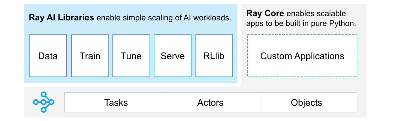

```{include} /_includes/overview/announcement.md
```

# Welcome to the Ray documentation

```{image} https://github.com/ray-project/ray/raw/master/doc/source/images/ray_header_logo.png
```

```{image} https://readthedocs.org/projects/ray/badge/?version=master
:target: http://docs.ray.io/en/master/?badge=master
```

```{image} https://img.shields.io/badge/Ray-Join%20Slack-blue
:target: https://forms.gle/9TSdDYUgxYs8SA9e8
```

```{image} https://img.shields.io/badge/Discuss-Ask%20Questions-blue
:target: https://discuss.ray.io/
```

```{image} https://img.shields.io/badge/Newsletter-Subscribe-blue
:target: https://share.hsforms.com/1Ee3Gh8c9TY69ZQib-yZJvgc7w85
```

```{image} https://img.shields.io/twitter/follow/raydistributed.svg?style=social&logo=twitter
:target: https://twitter.com/raydistributed
```

## What can you do with Ray?


````{panels}
:container: text-center
:column: col-lg-4 px-2 py-2
:card:

**Scale machine learning workloads with**\
**AIR**
^^^
Ray AI Runtime (AIR) is an open-source toolkit for building ML applications. 
It provides libraries for distributed 
[data processing](data/dataset.rst), 
[model training](train/train.rst), 
[tuning](tune/index.rst), 
[reinforcement learning](rllib/index.rst), 
[model serving](serve/index.rst), 
and [more](ray-more-libs/index.rst). 
+++
```{link-button} ray-air/getting-started
:type: ref
:text: Get Started
:classes: btn-outline-info btn-block
```
---

**Build distributed applications with**\
**Core**
^^^
Ray Core provides a [simple and flexible API](ray-core/walkthrough.rst) for building and running your distributed applications.
You can often [parallelize](ray-core/walkthrough.rst) single machine code with little to zero code changes.

+++
```{link-button} ray-core/walkthrough
:type: ref
:text: Get Started
:classes: btn-outline-info btn-block
```
---

**Deploy large-scale workloads with**\
**Clusters**
^^^
With a Ray cluster you can deploy your workloads on [AWS, GCP, Azure](cluster/getting-started) or 
[on premise](cluster/vms/user-guides/launching-clusters/on-premises).
You can also use Ray cluster managers to run Ray on your existing
[Kubernetes](cluster/kubernetes/index),
[YARN](cluster/vms/user-guides/community/yarn),
or [Slurm](cluster/vms/user-guides/community/slurm) clusters.
+++

```{link-button} cluster/getting-started
:type: ref
:text: Get Started
:classes: btn-outline-info btn-block
```
````

## What is Ray?

Ray is a unified framework for scaling AI and Python applications.
Ray consists of a core distributed runtime and a toolkit of libraries (Ray AIR) for
simplifying ML compute:



&nbsp;

Learn more about [Ray AIR](ray-air/getting-started) and its libraries:
- [Datasets](data/dataset): Distributed Data Preprocessing
- [Train](train/train): Distributed Training
- [Tune](tune/index): Scalable Hyperparameter Tuning
- [Serve](serve/index): Scalable and Programmable Serving
- [RLlib](rllib/index): Scalable Reinforcement Learning

Or more about [Ray Core](ray-core/walkthrough) and its key abstractions:
- [Tasks](ray-core/tasks): Stateless functions executed in the cluster.
- [Actors](ray-core/actors): Stateful worker processes created in the cluster.
- [Objects](ray-core/objects): Immutable values accessible across the cluster.

Ray runs on any machine, cluster, cloud provider, and Kubernetes, and features a growing
[ecosystem of community integrations](ray-overview/ray-libraries).

## Why Ray?

Today's ML workloads are increasingly compute-intensive. As convenient as they are, single-node development environments such as your laptop cannot scale to meet these demands.

Ray is a unified way to scale Python and AI applications from a laptop to a cluster.

With Ray, you can seamlessly scale the same code from a laptop to a cluster. Ray is designed to be general-purpose, meaning that it can performantly run any kind of workload. If your application is written in Python, you can scale it with Ray, no other infrastructure required.

## How to get involved?

Ray is more than a framework for distributed applications but also an active community of developers, researchers, and folks that love machine learning.
Here's a list of tips for getting involved with the Ray community:

```{include} _includes/_contribute.md
```

If you're interested in contributing to Ray, check out our
[contributing guide for this release](ray-contribute/getting-involved)
or see the
[latest version of our contributing guide](https://docs.ray.io/en/latest/ray-contribute/getting-involved.html)
to read about the contribution process and see what you can work on.

## What documentation resource is right for you?


````{panels}
:container: text-center
:column: col-lg-6 px-2 py-2
:card:

---
**Getting Started**


^^^^^^^^^^^^^^^

If you're new to Ray, check out the getting started guide.
You will learn how to install Ray, how to compute an example with the Ray Core API, and how to use each of Ray's ML libraries.
You will also understand where to go from there.

+++

{link-badge}`ray-overview/index.html,"Getting Started",cls=badge-light`

---
**User Guides**


^^^^^^^^^^^

Our user guides provide you with in-depth information about how to use Ray's libraries and tooling.
You will learn about the key concepts and features of Ray and how to use them in practice.
+++

{link-badge}`ray-core/user-guide.html,"Core",cls=badge-light`
{link-badge}`data/user-guide.html,"Data",cls=badge-light`
{link-badge}`train/user_guide.html,"Train",cls=badge-light`
{link-badge}`tune/user-guide.html,"Tune",cls=badge-light`
{link-badge}`serve/tutorial.html,"Serve",cls=badge-light`
{link-badge}`cluster/user-guide.html,"Clusters",cls=badge-light`
---
**API reference**


^^^^^^^^^^^^^

Our API reference guide provides you with a detailed description of the different Ray APIs.
It assumes familiarity with the key concepts and gives you information about functions, classes, and methods.

+++

{link-badge}`ray-references/api.html,"API References",cls=badge-light`

---
**Developer guides**


^^^^^^^^^^^^^^^

You need more information on how to debug or profile Ray?
You want more information about Ray's internals?
Maybe you saw a typo in the documentation, want to fix a bug or contribute a new feature? 
Our developer guides will help you get started.

+++

{link-badge}`https://docs.ray.io/en/master/ray-contribute/getting-involved.html,"Developer Guides",cls=badge-light`

````
