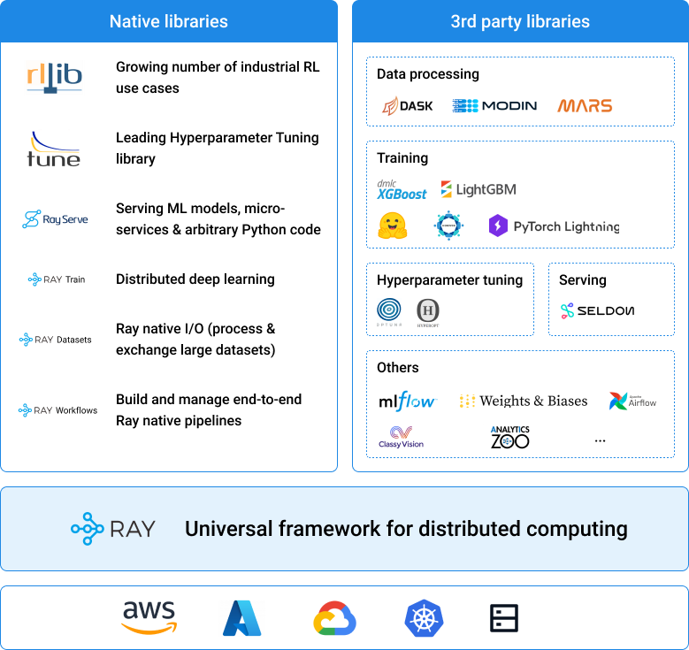

```{include} /_includes/overview/announcement.md
```

# Welcome to the Ray documentation

```{image} https://github.com/ray-project/ray/raw/master/doc/source/images/ray_header_logo.png
```

```{image} https://readthedocs.org/projects/ray/badge/?version=master
:target: http://docs.ray.io/en/master/?badge=master
```

```{image} https://img.shields.io/badge/Ray-Join%20Slack-blue
:target: https://forms.gle/9TSdDYUgxYs8SA9e8
```

```{image} https://img.shields.io/badge/Discuss-Ask%20Questions-blue
:target: https://discuss.ray.io/
```

```{image} https://img.shields.io/twitter/follow/raydistributed.svg?style=social&logo=twitter
:target: https://twitter.com/raydistributed
```

## What can you do with Ray?


````{panels}
:container: text-center
:column: col-lg-4 px-2 py-2
:card:

**Run machine learning workflows with**\
**ML**
^^^
Ray ML is a toolkit for distributed machine learning. 
It provides libraries for distributed 
[data processing](data/dataset.rst), 
[model training](train/train.rst), 
[tuning](tune/index.rst), 
[reinforcement learning](rllib/index.rst), 
[model serving](serve/index.rst), 
and [more](workflows/concepts.rst). 
+++
```{link-button} ray-overview/index
:type: ref
:text: Get Started
:classes: btn-outline-info btn-block
```
---

**Build distributed applications with**\
**Core**
^^^
Ray Core provides a [simple and flexible API](ray-core/walkthrough.rst) for building and running your distributed applications.
You can often [parallelize](ray-core/walkthrough.rst) single machine code with little to zero code changes.

+++
```{link-button} ray-core/walkthrough
:type: ref
:text: Get Started
:classes: btn-outline-info btn-block
```
---

**Deploy large-scale workloads with**\
**Clusters**
^^^
With a Ray cluster you can deploy your workloads on [AWS, GCP, Azure](cluster/quickstart) or 
[on premise](cluster/cloud.html#cluster-private-setup).
You can also use [Ray Cluster Managers](cluster/deploy) to run Ray on your existing
[Kubernetes](cluster/kubernetes),
[YARN](cluster/yarn),
or [Slurm](cluster/slurm) clusters.
+++

```{link-button} cluster/quickstart
:type: ref
:text: Get Started
:classes: btn-outline-info btn-block
```
````

## What is Ray?

Ray is an open-source project developed at UC Berkeley RISE Lab.
As a general-purpose and universal distributed compute framework, you can flexibly run any compute-intensive Python workload — from distributed training or hyperparameter tuning to deep reinforcement learning and production model serving.

- Ray Core provides a simple, universal API for building distributed applications.
- Ray's native libraries and tools enable you to run complex ML applications with Ray.
- You can deploy these applications on any of the major cloud providers, including AWS, GCP, and Azure, or run them on your own servers.
- Ray also has a growing [ecosystem of community integrations](ray-overview/ray-libraries), including [Dask](https://docs.ray.io/en/latest/data/dask-on-ray.html), [MARS](https://docs.ray.io/en/latest/data/mars-on-ray.html), [Modin](https://github.com/modin-project/modin), [Horovod](https://horovod.readthedocs.io/en/stable/ray_include.html), [Hugging Face](https://huggingface.co/transformers/main_classes/trainer.html#transformers.Trainer.hyperparameter_search), [Scikit-learn](ray-more-libs/joblib), [and others](ray-more-libs/index).
The following figure gives you an overview of the Ray ecosystem.




## How to get involved?

Ray is more than a framework for distributed applications but also an active community of developers, researchers, and folks that love machine learning.
Here's a list of tips for getting involved with the Ray community:

```{include} _includes/_contribute.md
```

If you're interested in contributing to Ray, check out our [contributing guide](ray-contribute/getting-involved)
to read about the contribution process and see what you can work on.

## What documentation resource is right for you?


````{panels}
:container: text-center
:column: col-lg-6 px-2 py-2
:card:

---
**Getting Started**


^^^^^^^^^^^^^^^

If you're new to Ray, check out the getting started guide.
You will learn how to install Ray, how to compute an example with the Ray Core API, and how to use each of Ray's ML libraries.
You will also understand where to go from there.

+++

{link-badge}`ray-overview/index.html,"Getting Started",cls=badge-light`

---
**User Guides**


^^^^^^^^^^^

Our user guides provide you with in-depth information about how to use Ray's libraries and tooling.
You will learn about the key concepts and features of Ray and how to use them in practice.
+++

{link-badge}`ray-core/user-guide.html,"Core",cls=badge-light`
{link-badge}`data/user-guide.html,"Data",cls=badge-light`
{link-badge}`train/user_guide.html,"Train",cls=badge-light`
{link-badge}`tune/user-guide.html,"Tune",cls=badge-light`
{link-badge}`serve/tutorial.html,"Serve",cls=badge-light`
{link-badge}`cluster/user-guide.html,"Clusters",cls=badge-light`
---
**API reference**


^^^^^^^^^^^^^

Our API reference guide provides you with a detailed description of the different Ray APIs.
It assumes familiarity with the key concepts and gives you information about functions, classes, and methods.

+++

{link-badge}`ray-references/api.html,"API References",cls=badge-light`

---
**Developer guides**


^^^^^^^^^^^^^^^

You need more information on how to debug or profile Ray?
You want more information about Ray's internals?
Maybe you saw a typo in the documentation, want to fix a bug or contribute a new feature? 
Our developer guides will help you get started.

+++

{link-badge}`ray-contribute/getting-involved.html,"Developer Guides",cls=badge-light`

````
