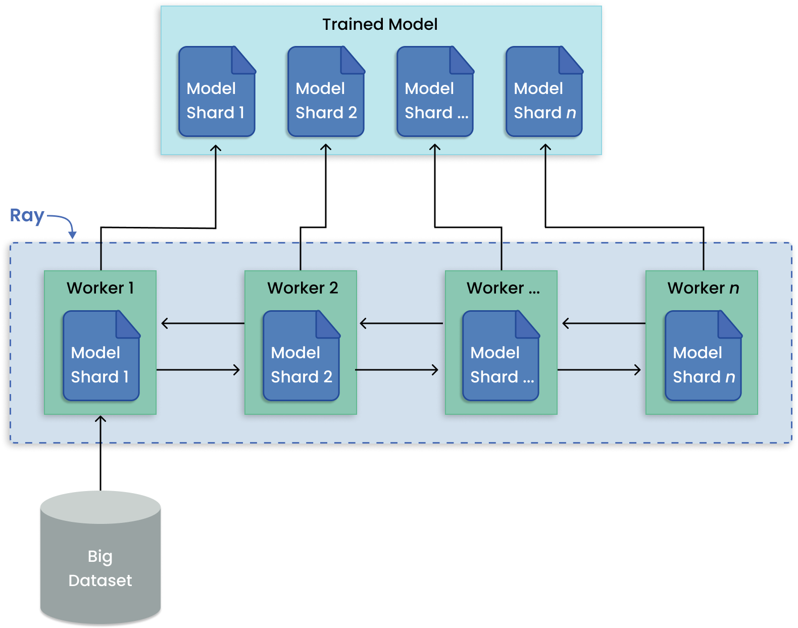
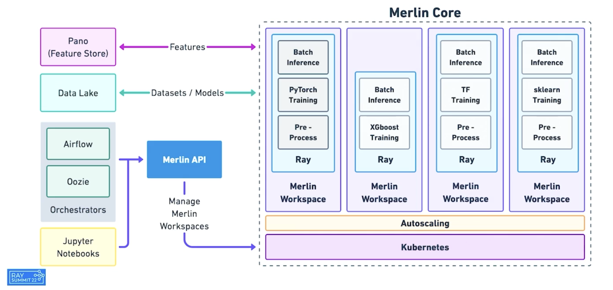

```{include} /_includes/overview/announcement.md
```

# Welcome to the Ray documentation
Today's ML workloads are increasingly compute-intensive. While convenient, single-node development environments such as your laptop cannot scale to meet these demands.

With Ray, you can seamlessly scale Python code from a laptop to a cluster. Ray is designed to be general-purpose, so it performantly runs any kind of workload. If your application is in Python, you can scale it with Ray, without any additional infrastructure.

## What is Ray?

Ray is a unified framework for scaling AI and Python applications. It provides the compute layer to scale applications without a distributed systems expert. Ray automatically handles these key processes:

* **Orchestration**--Managing the various components of a distributed system.
* **Scheduling**--Coordinating when and where tasks are executed.
* **Fault tolerance**--Ensuring tasks complete regardless of inevitable points of failure.
* **Auto-scaling**--Adjusting the number of resources allocated to dynamic demand.

To lower the effort needed to scale compute intensive workloads, Ray takes a Python-first approach and integrates with many common data science tools. ML practitioners can parallelize Python applications from a laptop to a cluster with minimal code changes.


## What you can do with Ray


````{panels}
:container: text-left
:column: col-lg-4 px-2 py-2
:card:

**Scale machine learning workloads**
^^^
Build ML applications with a toolkit of libraries for distributed 
[data processing](data/dataset.rst), 
[model training](train/train.rst), 
[tuning](tune/index.rst), 
[reinforcement learning](rllib/index.rst), 
[model serving](serve/index.rst), 
and [more](ray-more-libs/index.rst).
+++
```{link-button} ray-air/getting-started
:type: ref
:text: Ray AIR
:classes: btn-outline-info btn-block
```
---

**Build distributed applications**
^^^
Build and run distributed applications with a [simple and flexible API](ray-core/walkthrough.rst).
[Parallelize](ray-core/walkthrough.rst) single machine code with little to zero code changes.

+++
```{link-button} ray-core/walkthrough
:type: ref
:text: Ray Core
:classes: btn-outline-info btn-block
```
---

**Deploy large-scale workloads**
^^^
Deploy workloads on [AWS, GCP, Azure](cluster/getting-started) or 
[on premise](cluster/vms/user-guides/launching-clusters/on-premises).
Use Ray cluster managers to run Ray on existing
[Kubernetes](cluster/kubernetes/index),
[YARN](cluster/vms/user-guides/community/yarn),
or [Slurm](cluster/vms/user-guides/community/slurm) clusters.
+++

```{link-button} cluster/getting-started
:type: ref
:text: Ray Clusters
:classes: btn-outline-info btn-block
```
````

## Ray framework

||
|:--:|
|Stack of Ray libraries - unified toolkit for ML workloads.|

Ray's unified compute framework comprises of four layers:

1. **Integrations and ecosystem**--A common interface that unifies the most popular Python and machine learning libraries and frameworks to run ML tasks in a distributed way.
1. **Ray AI Runtime**--An open-source, Python, domain-specific set of libraries that equip ML engineers, data scientists, and researchers with a scalable and unified toolkit for ML applications.
1. **Ray Core**--An open-source, Python, general purpose, distributed computing library that enables ML engineers and Python developers to scale Python applications and accelerate machine learning workloads.
1. **Ray cluster**--A set of worker nodes connected to a common Ray head node. Ray clusters can be fixed-size, or they can autoscale up and down according to the resources requested by applications running on the cluster.

## Ray Core and Ray AIR

Ray consists of a core distributed runtime and a toolkit of libraries (Ray AIR) for
simplifying ML compute:


&nbsp;

[Ray Core](ray-core/walkthrough) is the foundation that Ray's ML libraries (Ray AIR) and third-party integrations (Ray ecosystem) are built on. This library enables Python developers to easily build scalable, distributed systems that can run on a laptop, cluster, cloud or Kubernetes.

Ray gives you flexibility with easy-to-use primitives in native Python code for composing distributed applications. Getting started with Ray Core involves a few key abstractions:

- [Tasks](ray-core/tasks): Stateless Python functions executed in the cluster.
- [Actors](ray-core/actors): Stateful Python classes (worker processes) created in the cluster.
- [Objects](ray-core/objects): Immutable values accessible across the cluster; cached in Ray's distributed [shared-memory](https://en.wikipedia.org/wiki/Shared_memory) object store.

[Ray AIR](ray-air/getting-started) is built on top of Ray Core and focuses on distributed individual and end-to-end machine learning workflows. Each of the five native libraries that Ray AIR wraps distributes a specific ML task:
- [Datasets](data/dataset): Scalable, framework-agnostic data loading and transformation across training, tuning, and prediction.
- [Serve](serve/index): Scalable and programmable serving to deploy models for online inference, with optional microbatching to improve performance.
- [RLlib](rllib/index): Scalable distributed reinforcement learning workloads that integrate with the other Ray AIR libraries.
- [Train](train/train): Distributed multi-node and multi-core model training with fault tolerance that integrates with popular training libraries.
- [Tune](tune/index): Scalable hyperparameter tuning to optimize model performance.

Ray runs on any machine, cluster, cloud provider, and Kubernetes, and features a growing
[ecosystem of community integrations](ray-overview/ray-libraries).


## Common ML workloads

###  Parallel training of many models
When any given model you want to train can fit on a single GPU, Ray can assign each training run to a separate Ray Task. In this way, all available workers are utilized to run independent remote training rather than one worker running jobs sequentially.

||
|:--:|
|Data parallelism pattern for distributed training on large datasets.|

 See [many model examples](https://docs.ray.io/en/latest/ray-overview/use-cases.html#many-model-training) for use cases.

### Distributed training of large models
In contrast to training many models, model parallelism partitions a large model across many machines for training. Ray Train has built-in abstractions for distributing shards of models and running training in parallel.

||
|:--:|
|Model parallelism pattern for distributed large model training.|

 See [distributed training examples](https://docs.ray.io/en/latest/ray-overview/use-cases.html#distributed-training) for use cases.

### Parallel hyperparameter tuning experiments
Running multiple hyperparameter tuning experiments is a pattern apt for distributed computing because each experiment is independent of one another. Ray Tune handles the hard bit of distributing hyperparameter optimization and makes available key features such as checkpointing the best result, optimizing scheduling, and specifying search patterns.

||
|:--:|
|Distributed tuning with distributed training per trial.|

 See [hyperparameter tuning examples](https://docs.ray.io/en/latest/ray-overview/use-cases.html#hyperparameter-tuning) for use cases.

### Reinforcement learning
Ray RLlib offers support for production-level, distributed reinforcement learning workloads while maintaining unified and simple APIs for a large variety of industry applications.

||
|:--:|
|Decentralized distributed proximal polixy optimiation (DD-PPO) architecture.|

 See [reinforcement learning examples](https://docs.ray.io/en/latest/ray-overview/use-cases.html#reinforcement-learning) for use cases.

### Batch inference on CPUs and GPUs
Performing inference on incoming batches of data can be parallelized by exporting the architecture and weights of a trained model to the shared object store. Using these model replicas, Ray scales predictions on batches across workers.

||
|:--:|
|Using Ray AIR's `BatchPredictor` for batch inference.|

 See [batch inference examples](https://docs.ray.io/en/latest/ray-overview/use-cases.html#batch-inference) for use cases.

### Multi-model composition for model serving

[Ray Serve](https://docs.ray.io/en/latest/serve/index.html) supports complex [model deployment patterns](https://www.youtube.com/watch?v=mM4hJLelzSw) requiring the orchestration of multiple Ray actors, where different actors provide inference for different models. Serve handles both batch and online inference and can scale to thousands of models in production.

||
|:--:|
|Deployment patterns with Ray Serve. (Click image to enlarge.)|

See [model serving examples](https://docs.ray.io/en/latest/ray-overview/use-cases.html#model-serving) for use cases.

### ML platform

[Merlin](https://shopify.engineering/merlin-shopify-machine-learning-platform) is Shopify's ML platform built on Ray. It enables fast-iteration and [scaling of distributed applications](https://www.youtube.com/watch?v=kbvzvdKH7bc) such as product categorization and recommendations.

||
|:--:|
|Shopify's Merlin architecture built on Ray.|

Spotify [uses Ray for advanced applications](https://www.anyscale.com/ray-summit-2022/agenda/sessions/180) that include personalizing content recommendations for home podcasts, and personalizing Spotify Radio track sequencing.

||
|:--:|
|How Ray ecosystem empowers ML scientists and engineers at Spotify.|

See [ML platform examples](https://docs.ray.io/en/latest/ray-overview/use-cases.html#ml-platform) for use cases.


## Getting involved

Ray is a framework for distributed applications and also an active community of developers, researchers, and folks that love machine learning.
Here's how to get involved with the Ray community:

```{include} _includes/_contribute.md
```

If you're interested in contributing to Ray, see the
[contributing guide for the current release](ray-contribute/getting-involved)
or the
[latest version of our contributing guide](https://docs.ray.io/en/latest/ray-contribute/getting-involved.html)
to read about the contribution process and see what you can work on.


```{image} https://github.com/ray-project/ray/raw/master/doc/source/images/ray_header_logo.png
```

```{image} https://readthedocs.org/projects/ray/badge/?version=master
:target: http://docs.ray.io/en/master/?badge=master
```

```{image} https://img.shields.io/badge/Ray-Join%20Slack-blue
:target: https://forms.gle/9TSdDYUgxYs8SA9e8
```

```{image} https://img.shields.io/badge/Discuss-Ask%20Questions-blue
:target: https://discuss.ray.io/
```

```{image} https://img.shields.io/badge/Newsletter-Subscribe-blue
:target: https://share.hsforms.com/1Ee3Gh8c9TY69ZQib-yZJvgc7w85
```

```{image} https://img.shields.io/twitter/follow/raydistributed.svg?style=social&logo=twitter
:target: https://twitter.com/raydistributed
```
