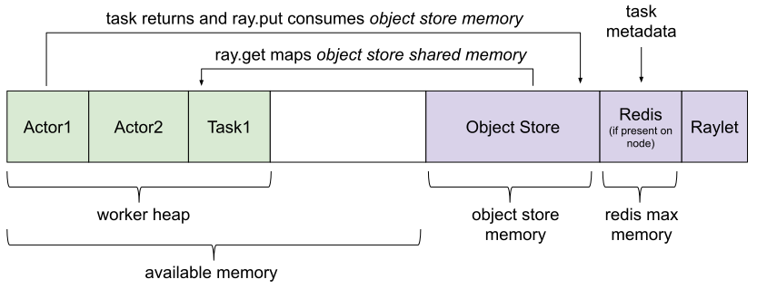

Memory Management
=================

This page describes how memory management works in Ray and how you can set memory quotas to ensure memory-intensive applications run predictably and reliably.

ObjectID Reference Counting
---------------------------

Ray implements distributed reference counting so that any ``ObjectID`` in scope in the cluster is pinned in the object store. This includes local python references, arguments to pending tasks, and IDs serialized inside of other objects.

Frequently Asked Questions (FAQ)
~~~~~~~~~~~~~~~~~~~~~~~~~~~~~~~~

**My application failed with ObjectStoreFullError. What happened?**

Ensure that you're removing ``ObjectID`` references when they're no longer needed. See `Debugging using 'ray memory'`_ for information on how to identify what objects are in scope in your application.

This exception is raised when the object store on a node was full of pinned objects when the application tried to create a new object (either by calling ``ray.put()`` or returning an object from a task). If you're sure that the configured object store size was large enough for your application to run, ensure that you're removing ``ObjectID`` references when they're no longer in use so their objects can be evicted from the object store. 

**I'm running Ray inside IPython or a Jupyter Notebook and there are ObjectID references causing problems even though I'm not storing them anywhere.**

Try `Enabling LRU Fallback`_, which will cause unused objects referenced by IPython to be LRU evicted when the object store is full instead of erroring.

IPython stores the output of every cell in a local Python variable indefinitely. This causes Ray to pin the objects even though your application may not actually be using them. 

**My application used to run on previous versions of Ray but now I'm getting ObjectStoreFullError.**

Either modify your application to remove ``ObjectID`` references when they're no longer needed or try `Enabling LRU Fallback`_ to revert to the old behavior.

In previous versions of Ray, there was no reference counting and instead objects in the object store were LRU evicted once the object store ran out of space. Some applications (e.g., applications that keep references to all objects ever created) may have worked with LRU eviction but do not with reference counting. 

Debugging using 'ray memory'
~~~~~~~~~~~~~~~~~~~~~~~~~~~~

The ``ray memory`` command can be used to help track down what ``ObjectID`` references are in scope and may be causing an ``ObjectStoreFullError``.

Running ``ray memory`` from the command line while a Ray application is running will give you a dump of all of the ``ObjectID`` references that are currently held by the driver, actors, and tasks in the cluster.

.. code-block::

  -----------------------------------------------------------------------------------------------------
  Object ID                                Reference Type       Object Size   Reference Creation Site
  =====================================================================================================
  ; worker pid=18301
  45b95b1c8bd3a9c4ffffffff010000c801000000  LOCAL_REFERENCE                ?   (deserialize task arg) __main__..f
  ; driver pid=18281
  f66d17bae2b0e765ffffffff010000c801000000  LOCAL_REFERENCE                ?   (task call) test.py:<module>:12
  45b95b1c8bd3a9c4ffffffff010000c801000000  USED_BY_PENDING_TASK           ?   (task call) test.py:<module>:10
  ef0a6c221819881cffffffff010000c801000000  LOCAL_REFERENCE                ?   (task call) test.py:<module>:11
  ffffffffffffffffffffffff0100008801000000  LOCAL_REFERENCE               77   (put object) test.py:<module>:9
  -----------------------------------------------------------------------------------------------------

Each entry in this output corresponds to an ``ObjectID`` that's currently pinning an object in the object store along with where the reference is (in the driver, in a worker, etc.), what type of reference it is (see below for details on the types of references), the size of the object in bytes, and where in the application the reference was created.

There are five types of references that can keep an object pinned:

**1. Local ObjectID references**

.. code-block:: python

  @ray.remote
  def f(arg):
      return arg

  a = ray.put(None)
  b = f.remote(None)

In this example, we create references to two objects: one that is ``ray.put()`` in the object store and another that's the return value from ``f.remote()``.

.. code-block::

  -----------------------------------------------------------------------------------------------------
  Object ID                                Reference Type       Object Size   Reference Creation Site
  =====================================================================================================
  ; driver pid=18867
  ffffffffffffffffffffffff0100008801000000  LOCAL_REFERENCE               77   (put object) ../test.py:<module>:9
  45b95b1c8bd3a9c4ffffffff010000c801000000  LOCAL_REFERENCE                ?   (task call) ../test.py:<module>:10
  -----------------------------------------------------------------------------------------------------

In the output from ``ray memory``, we can see that each of these is marked as a ``LOCAL_REFERENCE`` in the driver process, but the annotation in the "Reference Creation Site" indicates that the first was created as a "put object" and the second from a "task call."

**2. Objects pinned in memory**

.. code-block:: python

  import numpy as np

  a = ray.put(np.zeros(1))
  b = ray.get(a)
  del a

In this example, we create a ``numpy`` array and then store it in the object store. Then, we fetch the same numpy array from the object store and delete its ``ObjectID``. In this case, the object is still pinned in the object store because the deserialized copy (stored in ``b``) points directly to the memory in the object store.

.. code-block::

  -----------------------------------------------------------------------------------------------------
  Object ID                                Reference Type       Object Size   Reference Creation Site
  =====================================================================================================
  ; driver pid=25090
  ffffffffffffffffffffffff0100008801000000  PINNED_IN_MEMORY             229   test.py:<module>:7
  -----------------------------------------------------------------------------------------------------

The output from ``ray memory`` displays this as the object being ``PINNED_IN_MEMORY``. If we ``del b``, the reference can be freed.

**3. Pending task references**

.. code-block:: python

  @ray.remote
  def f(arg):
      while True:
          pass

  a = ray.put(None)
  b = f.remote(a)

In this example, we first create an object via ``ray.put()`` and then submit a task that depends on the object.

.. code-block::

  -----------------------------------------------------------------------------------------------------
  Object ID                                Reference Type       Object Size   Reference Creation Site
  =====================================================================================================
  ; worker pid=18971
  ffffffffffffffffffffffff0100008801000000  PINNED_IN_MEMORY              77   (deserialize task arg) __main__..f
  ; driver pid=18958
  ffffffffffffffffffffffff0100008801000000  USED_BY_PENDING_TASK          77   (put object) ../test.py:<module>:9
  45b95b1c8bd3a9c4ffffffff010000c801000000  LOCAL_REFERENCE                ?   (task call) ../test.py:<module>:10
  -----------------------------------------------------------------------------------------------------

While the task is running, we see that ``ray memory`` shows both a ``LOCAL_REFERENCE`` and a ``USED_BY_PENDING_TASK`` reference for the object in the driver process. The worker process also holds a reference to the object because it is ``PINNED_IN_MEMORY``, because the Python ``arg`` is directly referencing the memory in the plasma, so it can't be evicted.

**4. Serialized ObjectID references**

.. code-block:: python

  @ray.remote
  def f(arg):
      while True:
          pass

  a = ray.put(None)
  b = f.remote([a])

In this example, we again create an object via ``ray.put()``, but then pass it to a task wrapped in another object (in this case, a list).

.. code-block::

  -----------------------------------------------------------------------------------------------------
  Object ID                                Reference Type       Object Size   Reference Creation Site
  =====================================================================================================
  ; worker pid=19002
  ffffffffffffffffffffffff0100008801000000  LOCAL_REFERENCE               77   (deserialize task arg) __main__..f
  ; driver pid=18989
  ffffffffffffffffffffffff0100008801000000  USED_BY_PENDING_TASK          77   (put object) ../test.py:<module>:9
  45b95b1c8bd3a9c4ffffffff010000c801000000  LOCAL_REFERENCE                ?   (task call) ../test.py:<module>:10
  -----------------------------------------------------------------------------------------------------

Now, both the driver and the worker process running the task hold a ``LOCAL_REFERENCE`` to the object in addition to it being ``USED_BY_PENDING_TASK`` on the driver. If this was an actor task, the actor could even hold a ``LOCAL_REFERENCE`` after the task completes by storing the ``ObjectID`` in a member variable.

**5. Captured ObjectID references**

.. code-block:: python

  a = ray.put(None)
  b = ray.put([a])

In this example, we first create an object via ``ray.put()``, then capture its ``ObjectID`` inside of another ``ray.put()`` object, and delete the first ``ObjectID``. In this case, both objects are still pinned.

.. code-block::

  -----------------------------------------------------------------------------------------------------
  Object ID                                Reference Type       Object Size   Reference Creation Site
  =====================================================================================================
  ; driver pid=19047
  ffffffffffffffffffffffff0100008802000000  LOCAL_REFERENCE             1551   (put object) ../test.py:<module>:10
  ffffffffffffffffffffffff0100008801000000  CAPTURED_IN_OBJECT            77   (put object) ../test.py:<module>:9
  -----------------------------------------------------------------------------------------------------

In the output of ``ray memory``, we see that the second object displays as a normal ``LOCAL_REFERENCE``, but the first object is listed as ``CAPTURED_IN_OBJECT``.

Enabling LRU Fallback
~~~~~~~~~~~~~~~~~~~~~

By default, Ray will raise an exception if the object store is full of pinned objects when an application tries to create a new object. However, in some cases applications might keep references to objects much longer than they actually use them, so simply LRU evicting objects from the object store when it's full can prevent the application from failing.

Please note that relying on this is **not recommended** - instead, if possible you should try to remove references as they're no longer needed in your application to free space in the object store.

To enable LRU eviction when the object store is full, initialize ray with the ``lru_evict`` option set:

.. code-block:: python

  ray.init(lru_evict=True)

.. code-block:: bash

  ray start --lru-evict

Memory Quotas
-------------

You can set memory quotas to ensure your application runs predictably on any Ray cluster configuration. If you're not sure, you can start with a conservative default configuration like the following and see if any limits are hit.

For Ray initialization on a single node, consider setting the following fields:

.. code-block:: python

  ray.init(
      memory=2000 * 1024 * 1024,
      object_store_memory=200 * 1024 * 1024,
      driver_object_store_memory=100 * 1024 * 1024)

For Ray usage on a cluster, consider setting the following fields on both the command line and in your Python script:

.. tip:: 200 * 1024 * 1024 bytes is 200 MiB. Use double parentheses to evaluate math in Bash: ``$((200 * 1024 * 1024))``.

.. code-block:: bash

  # On the head node
  ray start --head --redis-port=6379 \
      --object-store-memory=$((200 * 1024 * 1024)) \
      --memory=$((200 * 1024 * 1024)) \
      --num-cpus=1

  # On the worker node
  ray start --object-store-memory=$((200 * 1024 * 1024)) \
      --memory=$((200 * 1024 * 1024)) \
      --num-cpus=1 \
      --address=$RAY_HEAD_ADDRESS:6379

.. code-block:: python

  # In your Python script connecting to Ray:
  ray.init(
      address="auto",  # or "<hostname>:<port>" if not using the default port
      driver_object_store_memory=100 * 1024 * 1024
  )

For any custom remote method or actor, you can set requirements as follows:

.. code-block:: python

  @ray.remote(
      memory=2000 * 1024 * 1024,
  )

Concept Overview
~~~~~~~~~~~~~~~~

There are several ways that Ray applications use memory:

Ray system memory: this is memory used internally by Ray
  - **Redis**: memory used for storing task lineage and object metadata. When Redis becomes full, lineage will start to be be LRU evicted, which makes the corresponding objects ineligible for reconstruction on failure.
  - **Raylet**: memory used by the C++ raylet process running on each node. This cannot be controlled, but is usually quite small.

Application memory: this is memory used by your application
  - **Worker heap**: memory used by your application (e.g., in Python code or TensorFlow), best measured as the *resident set size (RSS)* of your application minus its *shared memory usage (SHR)* in commands such as ``top``. The reason you need to subtract *SHR* is that object store shared memory is reported by the OS as shared with each worker. Not subtracting *SHR* will result in double counting memory usage.
  - **Object store memory**: memory used when your application creates objects in the objects store via ``ray.put`` and when returning values from remote functions. Objects are LRU evicted when the store is full, prioritizing objects that are no longer in scope on the driver or any worker. There is an object store server running on each node.
  - **Object store shared memory**: memory used when your application reads objects via ``ray.get``. Note that if an object is already present on the node, this does not cause additional allocations. This allows large objects to be efficiently shared among many actors and tasks.

By default, Ray will cap the memory used by Redis at ``min(30% of node memory, 10GiB)``, and object store at ``min(10% of node memory, 20GiB)``, leaving half of the remaining memory on the node available for use by worker heap. You can also manually configure this by setting ``redis_max_memory=<bytes>`` and ``object_store_memory=<bytes>`` on Ray init.

It is important to note that these default Redis and object store limits do not address the following issues:

* Actor or task heap usage exceeding the remaining available memory on a node.

* Heavy use of the object store by certain actors or tasks causing objects required by other tasks to be prematurely evicted.

To avoid these potential sources of instability, you can set *memory quotas* to reserve memory for individual actors and tasks.

Heap memory quota
~~~~~~~~~~~~~~~~~

When Ray starts, it queries the available memory on a node / container not reserved for Redis and the object store or being used by other applications. This is considered "available memory" that actors and tasks can request memory out of. You can also set ``memory=<bytes>`` on Ray init to tell Ray explicitly how much memory is available.

.. important::

  Setting available memory for the node does NOT impose any limits on memory usage
  unless you specify memory resource requirements in decorators. By default, tasks
  and actors request no memory (and hence have no limit).

To tell the Ray scheduler a task or actor requires a certain amount of available memory to run, set the ``memory`` argument. The Ray scheduler will then reserve the specified amount of available memory during scheduling, similar to how it handles CPU and GPU resources:

.. code-block:: python

  # reserve 500MiB of available memory to place this task
  @ray.remote(memory=500 * 1024 * 1024)
  def some_function(x):
      pass

  # reserve 2.5GiB of available memory to place this actor
  @ray.remote(memory=2500 * 1024 * 1024)
  class SomeActor(object):
      def __init__(self, a, b):
          pass

In the above example, the memory quota is specified statically by the decorator, but you can also set them dynamically at runtime using ``.options()`` as follows:

.. code-block:: python

  # override the memory quota to 100MiB when submitting the task
  some_function.options(memory=100 * 1024 * 1024).remote(x=1)

  # override the memory quota to 1GiB when creating the actor
  SomeActor.options(memory=1000 * 1024 * 1024).remote(a=1, b=2)

**Enforcement**: If an actor exceeds its memory quota, calls to it will throw ``RayOutOfMemoryError`` and it may be killed. Memory quota is currently enforced on a best-effort basis for actors only (but quota is taken into account during scheduling in all cases).

Object store memory quota
~~~~~~~~~~~~~~~~~~~~~~~~~

Use ``@ray.remote(object_store_memory=<bytes>)`` to cap the amount of memory an actor can use for ``ray.put`` and method call returns. This gives the actor its own LRU queue within the object store of the given size, both protecting its objects from eviction by other actors and preventing it from using more than the specified quota. This quota protects objects from unfair eviction when certain actors are producing objects at a much higher rate than others.

Ray takes this resource into account during scheduling, with the caveat that a node will always reserve ~30% of its object store for global shared use.

For the driver, you can set its object store memory quota with ``driver_object_store_memory``. Setting object store quota is not supported for tasks.

Object store shared memory
~~~~~~~~~~~~~~~~~~~~~~~~~~

Object store memory is also used to map objects returned by ``ray.get`` calls in shared memory. While an object is mapped in this way (i.e., there is a Python reference to the object), it is pinned and cannot be evicted from the object store. However, ray does not provide quota management for this kind of shared memory usage.

Questions or Issues?
--------------------

If you have a question or issue that wasn't covered by this page, please get in touch via on of the following channels:

1. `ray-dev@googlegroups.com`_: For discussions about development or any general
   questions and feedback.
2. `StackOverflow`_: For questions about how to use Ray.
3. `GitHub Issues`_: For bug reports and feature requests.

.. _`ray-dev@googlegroups.com`: https://groups.google.com/forum/#!forum/ray-dev
.. _`StackOverflow`: https://stackoverflow.com/questions/tagged/ray
.. _`GitHub Issues`: https://github.com/ray-project/ray/issues
