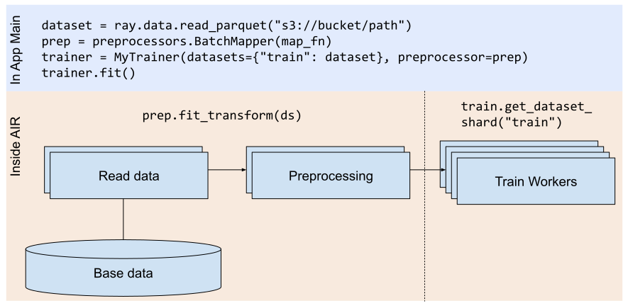

.. _air-ingest:

Configuring Training Datasets
=============================

AIR builds its training data pipeline on :ref:`Ray Datasets <datasets>`, which is a scalable, framework-agnostic data loading and preprocessing library. Datasets enables AIR to seamlessly load data for local and distributed training with Train.

This page describes how to setup and configure these datasets in Train under different scenarios and scales.

Overview
--------

.. _ingest_basics:

The following figure illustrates a simple Ray AIR training job that (1) loads parquet data from S3, (2) applies a simple
:ref:`user-defined function <transform_datasets_writing_udfs>` to preprocess batches of data, and (3) runs an AIR Trainer with the given dataset and preprocessor.

..
  https://docs.google.com/drawings/d/1FPta-TvaL7TQoSRp5ofts0dru6mw1Xes-35m5XuqCBc/edit

Let's walk through the stages of what happens when ``Trainer.fit()`` is called.

**Preprocessing**: First, AIR will ``fit`` the preprocessor (e.g., compute statistics) on the
``"train"`` dataset, and then ``transform`` all given datasets with the fitted preprocessor. This is done by calling
:py:meth:`prep.fit_transform() <ray.data.preprocessor.Preprocessor.fit_transform>`
on the train dataset passed to the Trainer, followed by :py:meth:`prep.transform() <ray.data.preprocessor.Preprocessor.transform>`
on remaining datasets.

**Training**: Then, AIR passes the preprocessed dataset to Train workers (Ray actors) launched by the Trainer. Each worker calls :py:func:`get_dataset_shard <ray.air.session.get_dataset_shard>` to get a handle to its assigned data shard.
This returns a :py:class:`DatasetIterator <ray.data.DatasetIterator>`, which can be used to loop over the data with :py:meth:`iter_batches() <ray.data.DatasetIterator.iter_batches>`, :py:meth:`iter_torch_batches() <ray.data.Dataset.iter_torch_batches>`, or :meth:`~ray.data.Dataset.to_tf`.
Each of these returns a batch iterator for one epoch (a full pass over the original dataset).

Getting Started
---------------

The following is a simple example of how to configure ingest for a dummy :py:class:`~ray.train.torch.TorchTrainer`. Below, we are passing a small tensor dataset to the Trainer via the ``datasets`` argument. In the Trainer's ``train_loop_per_worker``, we access the preprocessed dataset using
:py:func:`~ray.air.session.get_dataset_shard()`.

.. literalinclude:: doc_code/air_ingest.py
    :language: python
    :start-after: __config_4__
    :end-before: __config_4_end__

.. _air-configure-ingest:

For local development and testing, you can also use the helper function :py:meth:`~ray.air.util.check_ingest.make_local_dataset_iterator` to get a local :py:class:`DatasetIterator <ray.data.DatasetIterator>`.

Configuring Ingest
------------------
You can use the :py:class:`~ray.air.config.DatasetConfig` object to configure how Datasets are preprocessed and split across training workers.
Each :py:class:`~ray.train.data_parallel_trainer.DataParallelTrainer` takes in a ``dataset_config`` constructor argument that takes in a mapping
from Dataset name to a :py:class:`~ray.air.config.DatasetConfig` object. If no ``dataset_config`` is passed in,
the default configuration is used:

.. code:: python

    # The default DataParallelTrainer dataset config, which is inherited
    # by sub-classes such as TorchTrainer, HorovodTrainer, etc.
    _dataset_config = {
        # Fit preprocessors on the train dataset only. Split the dataset
        # across workers if scaling_config["num_workers"] > 1.
        "train": DatasetConfig(fit=True, split=True),
        # For all other datasets, use the defaults (don't fit, don't split).
        # The datasets will be transformed by the fitted preprocessor.
        "*": DatasetConfig(),
    }

Here are some examples of configuring Dataset ingest options and what they do:

.. _air-streaming-ingest:

Enabling Streaming Ingest
~~~~~~~~~~~~~~~~~~~~~~~~~

.. tabbed:: Bulk Ingest

    By default, AIR loads all datasets into the Ray object store at the start of training.
    This provides the best performance if the cluster can fit the datasets
    entirely in memory, or if the preprocessing step is expensive to run more than once.

    .. literalinclude:: doc_code/air_ingest.py
        :language: python
        :start-after: __config_4__
        :end-before: __config_4_end__

    You should use bulk ingest when:

    * you have enough memory to fit data blocks in cluster object store; or
    * your preprocessing transform is expensive to recompute on each epoch

.. tabbed:: Streaming Ingest (experimental)

    In streaming ingest mode, instead of loading the entire dataset into the
    Ray object store at once, AIR will load a fraction of the dataset at a
    time. This can be desirable when the dataset is very large, and caching it
    all at once would cause expensive disk spilling. The downside is that the
    dataset will have to be recomputed on each epoch, which can add overhead if
    the computation is expensive.

    To enable this mode, use the :py:meth:`max_object_store_memory_fraction
    <ray.air.config.DatasetConfig>` argument. This argument defaults to -1,
    meaning that bulk ingest should be used and the entire dataset should be
    computed and cached before execution.

    Use a float value between 0 and 1 to indicate the "window" size, i.e. the
    maximum fraction of object store memory that should be used at once. A
    reasonable value is 0.2, meaning 20% of available object store memory.
    Larger window sizes can improve performance by increasing parallelism.

    The value 1 means that the window size is the full dataset. In other words,
    Ray will compute a full copy of the dataset in parallel with the current
    copy that is being iterated upon.

    .. literalinclude:: doc_code/air_ingest.py
        :language: python
        :start-after: __config_5__
        :end-before: __config_5_end__

    Use streaming ingest when:

    * you have large datasets that don't fit into memory; and
    * reading the preprocessed dataset from disk is slower than re-executing the preprocessing step on each epoch

    Note that this feature is experimental and the actual object store memory
    usage may vary. Please file a `GitHub issue <https://github.com/ray-project/ray/issues>`_ if you run into problems.

.. _air-shuffle:

Shuffling Data
~~~~~~~~~~~~~~

Shuffling or data randomization is important for training high-quality models. By default, AIR will randomize the order the data files (blocks) are read from. AIR also offers options for further randomizing data records within each file:

.. tabbed:: Local Shuffling

    Local shuffling is the recommended approach for randomizing data order. To use local shuffle,
    simply specify a non-zero ``local_shuffle_buffer_size`` as an argument to :py:meth:`iter_batches() <ray.data.DatasetIterator.iter_batches>`.
    The iterator will then use a local buffer of the given size to randomize record order. The
    larger the buffer size, the more randomization will be applied, but it will also use more
    memory.

    See :meth:`ds.iter_batches() <ray.data.DatasetIterator.iter_batches>` for more details.

    .. literalinclude:: doc_code/air_ingest.py
        :language: python
        :start-after: __local_shuffling_start__
        :end-before: __local_shuffling_end__

    You should use local shuffling when:

     * a small in-memory buffer provides enough randomization; or
     * you want the highest possible ingest performance; or
     * your model is not overly sensitive to shuffle quality

.. tabbed:: Global Shuffling (slower)

    Global shuffling provides more uniformly random (decorrelated) samples and is carried
    out via a distributed map-reduce operation. This higher quality shuffle can often lead
    to more precision gain per training step, but it is also an expensive distributed
    operation and will decrease the ingest throughput. As long as the shuffled ingest
    throughput matches or exceeds the model training (forward pass, backward pass, gradient sync)
    throughput, this higher-quality shuffle shouldn't slow down the overall training.

    If global shuffling *is* causing the ingest throughput to become the training
    bottleneck, local shuffling may be a better option.

    .. literalinclude:: doc_code/air_ingest.py
        :language: python
        :start-after: __global_shuffling_start__
        :end-before: __global_shuffling_end__

    You should use global shuffling when:

     * you suspect high-quality shuffles may significantly improve model quality; and
     * absolute ingest performance is less of a concern

.. _air-splitting-aux-datasets:

Splitting Auxiliary Datasets
~~~~~~~~~~~~~~~~~~~~~~~~~~~~

During data parallel training, the datasets are split so that each model replica is training on a different shard of data.
By default, only the `"train"` dataset is split. All the other Datasets are not split and the entire dataset is returned by
:py:func:`~ray.air.session.get_dataset_shard`.

However, you may want to split a large validation dataset example to also do data parallel validation.
This example shows overriding the split config for the "valid" and "test" datasets. This means that
both the valid and test datasets here will be :py:meth:`.split() <ray.data.Dataset.split>` across the training workers.

.. literalinclude:: doc_code/air_ingest.py
    :language: python
    :start-after: __config_1__
    :end-before: __config_1_end__

Disabling Preprocessor Transforms
~~~~~~~~~~~~~~~~~~~~~~~~~~~~~~~~~

By default, the provided :py:class:`~ray.data.preprocessor.Preprocessor` is fit on the `"train"` dataset and is then used to
transform all the datasets. However, you may want to disable the preprocessor transforms for certain datasets.

This example shows overriding the transform config for the "side" dataset. This means that
the original dataset will be returned by ``.get_dataset_shard("side")``.

.. literalinclude:: doc_code/air_ingest.py
    :language: python
    :start-after: __config_2__
    :end-before: __config_2_end__

Dataset Resources
~~~~~~~~~~~~~~~~~

Datasets uses Ray tasks to execute data processing operations. These tasks use CPU resources in the cluster during execution, which may compete with resources needed for Training.

.. tabbed:: Unreserved CPUs

    By default, Dataset tasks use cluster CPU resources for execution. This can sometimes
    conflict with Trainer resource requests. For example, if Trainers allocate all CPU resources
    in the cluster, then no Datasets tasks can run.

    .. literalinclude:: ./doc_code/air_ingest.py
      :language: python
      :start-after: __resource_allocation_1_begin__
      :end-before: __resource_allocation_1_end__

    Unreserved CPUs work well when:

     * you are running only one Trainer and the cluster has enough CPUs; or
     * your Trainers are configured to use GPUs and not CPUs

.. tabbed:: Using Reserved CPUs (experimental)

    The ``_max_cpu_fraction_per_node`` option can be used to exclude CPUs from placement
    group scheduling. In the below example, setting this parameter to ``0.8`` enables Tune
    trials to run smoothly without risk of deadlock by reserving 20% of node CPUs for
    Dataset execution.

    .. literalinclude:: ./doc_code/air_ingest.py
      :language: python
      :start-after: __resource_allocation_2_begin__
      :end-before: __resource_allocation_2_end__

    You should use reserved CPUs when:

     * you are running multiple concurrent CPU Trainers using Tune; or
     * you want to ensure predictable Datasets performance

    .. warning::

        ``_max_cpu_fraction_per_node`` is experimental and not currently recommended for use with
        autoscaling clusters (scale-up will not trigger properly).

Debugging Ingest with the ``DummyTrainer``
------------------------------------------

Data ingest problems can be challenging to debug when combined in a full training pipeline. To isolate data
ingest issues from other possible training problems, we provide the :py:class:`~ray.air.util.check_ingest.DummyTrainer`
utility class that can be used to debug ingest problems.
You can also use the helper function :py:meth:`~ray.air.util.check_ingest.make_local_dataset_iterator` to get a local :py:class:`DatasetIterator <ray.data.DatasetIterator>` for debugging purposes.
Let's walk through using ``DummyTrainer`` to understand
and resolve an ingest misconfiguration.

Setting it up
~~~~~~~~~~~~~

First, let's create a synthetic in-memory dataset and setup a simple preprocessor pipeline. For this example,
we'll run it on a 3-node cluster with m5.4xlarge nodes. In practice we might want to use a single machine to
keep data local, but we'll use a cluster for illustrative purposes.

.. literalinclude:: doc_code/air_ingest.py
    :language: python
    :start-after: __check_ingest_1__
    :end-before: __check_ingest_1_end__

Next, we instantiate and fit a :py:class:`~ray.air.util.check_ingest.DummyTrainer` with a single training worker and no GPUs. You can customize
these parameters to simulate your use training use cases (e.g., 16 trainers each with GPUs enabled).

.. literalinclude:: doc_code/air_ingest.py
    :language: python
    :start-after: __check_ingest_2__
    :end-before: __check_ingest_2_end__

Understanding the output
~~~~~~~~~~~~~~~~~~~~~~~~

Let's walk through the output. First, the job starts and executes preprocessing. You can see that the
preprocessing runs in ``6.8s`` below. The dataset stats for the preprocessing is also printed:

.. code::

    Starting dataset preprocessing
    Preprocessed datasets in 6.874227493000035 seconds
    Preprocessor Chain(preprocessors=(BatchMapper(fn=<lambda>), BatchMapper(fn=<lambda>)))
    Preprocessor transform stats:

    Stage 1 read->map_batches: 100/100 blocks executed in 4.57s
    * Remote wall time: 120.68ms min, 522.36ms max, 251.53ms mean, 25.15s total
    * Remote cpu time: 116.55ms min, 278.08ms max, 216.38ms mean, 21.64s total
    * Output num rows: 500 min, 500 max, 500 mean, 50000 total
    * Output size bytes: 102400128 min, 102400128 max, 102400128 mean, 10240012800 total
    * Tasks per node: 16 min, 48 max, 33 mean; 3 nodes used

    Stage 2 map_batches: 100/100 blocks executed in 2.22s
    * Remote wall time: 89.07ms min, 302.71ms max, 175.12ms mean, 17.51s total
    * Remote cpu time: 89.22ms min, 207.53ms max, 137.5ms mean, 13.75s total
    * Output num rows: 500 min, 500 max, 500 mean, 50000 total
    * Output size bytes: 102400128 min, 102400128 max, 102400128 mean, 10240012800 total
    * Tasks per node: 30 min, 37 max, 33 mean; 3 nodes used

When the train job finishes running, it will print out some more statistics.

.. code::

    P50/P95/Max batch delay (s) 1.101227020500005 1.120024863100042 1.9424749629999951
    Num epochs read 1
    Num batches read 100
    Num bytes read 9765.64 MiB
    Mean throughput 116.59 MiB/s

Let's break it down:

* **Batch delay**: Time the trainer spents waiting for the next data batch to be fetched. Ideally
  this value is as close to zero as possible. If it is too high, Ray may be spending too much time
  downloading data from remote nodes to the trainer node.
* **Num epochs read**: The number of times the trainer read the dataset during the run.
* **Num batches read**: The number of batches read.
* **Num bytes read**: The number of bytes read.
* **Mean throughput**: The average read throughput.

Finally, we can query memory statistics (this can be run in the middle of a job) to get an idea of how this workload used the object store.

.. code::

    ray memory --stats-only

As you can see, this run used 18GiB of object store memory, which was 32% of the total memory available
on the cluster. No disk spilling was reported:

.. code::

    --- Aggregate object store stats across all nodes ---
    Plasma memory usage 18554 MiB, 242 objects, 32.98% full, 0.17% needed
    Objects consumed by Ray tasks: 38965 MiB.

Debugging the performance problem
~~~~~~~~~~~~~~~~~~~~~~~~~~~~~~~~~

So why was the data ingest only 116MiB/s above? That's sufficient for many models, but one would expect
faster if the trainer was doing nothing except read the data. Based on the stats above, there was no object
spilling, but there was a high batch delay.

We can guess that perhaps AIR was spending too much time loading blocks from other machines, since
we were using a multi-node cluster. We can test this by setting ``prefetch_blocks=10`` to prefetch
blocks more aggressively and rerunning training.

.. code::

    P50/P95/Max batch delay (s) 0.0006792084998323844 0.0009853049503362856 0.12657493300002898
    Num epochs read 47
    Num batches read 4700
    Num bytes read 458984.95 MiB
    Mean throughput 15136.18 MiB/s

That's much better! Now we can see that our DummyTrainer is ingesting data at a rate of 15000MiB/s,
and was able to read through many more epochs of training. This high throughput means
that all data was able to be fit into memory on a single node.

Going from DummyTrainer to your real Trainer
~~~~~~~~~~~~~~~~~~~~~~~~~~~~~~~~~~~~~~~~~~~~

Once you're happy with the ingest performance of with DummyTrainer with synthetic data, the next steps are to switch to adapting it for your real workload scenario. This involves:

* **Scaling the DummyTrainer**: Change the scaling config of the DummyTrainer and cluster configuration to reflect your target workload.
* **Switching the Dataset**: Change the dataset from synthetic tensor data to reading your real dataset.
* **Switching the Trainer**: Swap the DummyTrainer with your real trainer.

Switching these components one by one allows performance problems to be easily isolated and reproduced.

Performance Tips
----------------

**Memory availability**: To maximize ingest performance, consider using machines with sufficient memory to fit the dataset entirely in memory. This avoids the need for disk spilling, streamed ingest, or fetching data across the network. As a rule of thumb, a Ray cluster with fewer but bigger nodes will outperform a Ray cluster with more smaller nodes due to better memory locality.

**Autoscaling**: We generally recommend first trying out AIR training with a fixed size cluster. This makes it easier to understand and debug issues. Autoscaling can be enabled after you are happy with performance to autoscale experiment sweeps with Tune, etc. We also recommend starting with autoscaling with a single node type. Autoscaling with hetereogeneous clusters can optimize costs, but may complicate performance debugging.

**Partitioning**: By default, Datasets will automatically select the read parallelism based on the current cluster size and number of files. If you run into out-of-memory errors during preprocessing, consider increasing the number of blocks to reduce their size. To increase the max number of partitions, you can manually set the ``parallelism`` option when calling ``ray.data.read_*()``. To change the number of partitions at runtime, use ``ds.repartition(N)``. As a rule of thumb, blocks should be no more than 1-2GiB each.

Dataset Sharing
~~~~~~~~~~~~~~~

When you pass Datasets to a Tuner, Datasets are executed independently per-trial. This could potentially duplicate data reads in the cluster. To share Dataset blocks between trials, call ``ds = ds.fully_executed()`` prior to passing the Dataset to the Tuner. This ensures that the initial read operation will not be repeated per trial.

FAQ
---

How do I pass in a :py:class:`~ray.data.dataset_pipeline.DatasetPipeline` to my ``Trainer``?
~~~~~~~~~~~~~~~~~~~~~~~~~~~~~~~~~~~~~~~~~~~~~~~~~~~~~~~~~~~~~~~~~~~~~~~~~~~~~~~~~~~~~~~~~~~~

The Trainer interface only accepts a standard :py:class:`~ray.data.dataset.Dataset` and not a :py:class:`~ray.data.dataset_pipeline.DatasetPipeline`.
Instead, you can configure the ingest via the ``dataset_config`` that is passed to your ``Trainer``. Internally, Ray AIR will
convert the provided :py:class:`~ray.data.dataset.Dataset` into a :py:class:`~ray.data.dataset_pipeline.DatasetPipeline` with the specified configurations.

See the :ref:`Enabling Streaming Ingest <air-streaming-ingest>` and :ref:`Shuffling Data <air-shuffle>` sections for full examples.

How do I shard validation and test datasets?
~~~~~~~~~~~~~~~~~~~~~~~~~~~~~~~~~~~~~~~~~~~~

By default only the `"train"` Dataset is sharded. To also shard validation and test datasets, you can configure the ``dataset_config``
that is passed to your ``Trainer``.
See the :ref:`Splitting Auxiliary Datasets <air-splitting-aux-datasets>` section for a full example.
