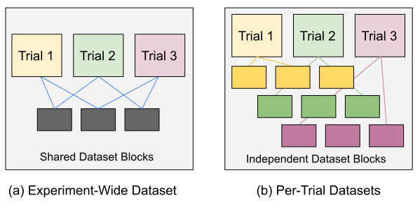

.. _air-ingest:

Setting up Data Ingest
======================

This page is a guide for setting up, understanding, and diagnosing data ingest problems in Ray AIR.

Data ingest is the process of loading data from storage, apply preprocessing steps, and feeding the data into Trainers in AIR.
For datasets that are small, ingest is usually not an issue. However, ingest can be tricky to set up when datasets grow
large enough so that they may not fit fully in memory on a single node, or even in aggregate cluster memory.

AIR builds its ingest pipeline on :ref:`Ray Datasets <datasets>`, which is a framework-agnostic distributed data loading library. If you have
an existing ingest pipeline (e.g., based on TF data), there is some upfront effort porting your loading code to Datasets.
In return, AIR provides portability across ML frameworks as well as advanced capabilities such as global random shuffles,
which are not possible in less general ML data preprocessing libraries.

Ingest Basics
-------------

The following figure illustrates a simple Ray AIR training job that (1) loads parquet data from S3, (2) applies a simple
user-defined function to preprocess batches of data, and (3) runs an AIR Trainer with the given dataset and preprocessor.

.. figure:: images/ingest.svg

..
  https://docs.google.com/drawings/d/1FPta-TvaL7TQoSRp5ofts0dru6mw1Xes-35m5XuqCBc/edit

Let's walk through the stages of what happens when ``Trainer.fit()`` is called.

**Read**: First, AIR will read the Dataset into the Ray object store by calling ``ds.fully_executed()`` on the datasets
that you pass to the Trainer. Dataset blocks that don't fit into memory will be spilled to disk. Note that when you create
the dataset initially, typically only the first block and block metadata is read into memory. The rest of the blocks are
not loaded until ``fit`` is called.

**Preprocessing**: Next, if a preprocessor is defined, AIR will ``fit`` the preprocessor (e.g., for stateful preprocessors) on the
``"train"`` dataset, and then ``transform`` all given datasets with the fitted preprocessor. This is done by calling ``prep.fit_transform()``
on the train dataset passed to the Trainer, followed by ``prep.transform()`` on remaining datasets. Preprocessors use Dataset APIs to execute
preprocessing in a parallelized way across the cluster. Both read and preprocessing stages use Ray tasks under the hood.

**Training**: Finally, AIR passes a reference to the preprocessed dataset to Train workers (Ray actors) launched by the Trainer. Each worker then
typically calls ``iter_batches``, ``to_tf``, or ``to_torch`` to iterate over the dataset reference retrieved by ``get_dataset_shard``.
These read methods load blocks of the dataset into the local worker's memory in a streaming fashion, only fetching / prefetching a
limited number of blocks at once. Workers loop over the dataset blocks repeatedly until training completes.

Bulk Ingest
~~~~~~~~~~~

By default, AIR loads all Dataset blocks into the object store at the start of training. This provides the best performance if the
cluster has enough aggregate memory to fit all the data blocks in object store memory. Note that data often requires more space
when loaded uncompressed in memory than when resident in storage.

If there is insufficient object store memory, blocks may be spilled to disk during reads or preprocessing. Ray will print log messages
if spilling is occuring, and you can check this as well with the ``ray memory --stats-only`` utility. If spilling is happening, take
care to ensure the cluster has enough disk space to handle the spilled blocks. Alternatively, consider using machine with more memory /
more machines to avoid spilling.

Streamed Ingest
~~~~~~~~~~~~~~~

This section is a placeholder.

AIR will support streamed ingest and enable it by default by Beta. Streamed ingest is preferable when you are using large
datasets that don't fit into memory, and also don't need advanced training quality features such as global random shuffle.

Ingest and Ray Tune
-------------------

.. note::

    Train always uses Tune as the execution backend under the hood, even when running just ``Trainer.fit()`` directly (this is treated as a single-trial experiment). This ensures consistency of execution.

When using ``Ray Tune`` with AIR training jobs, you can choose to either provide an experiment-wide Dataset that is shared among all trials,
or have per-trial datasets. Trials will always run its preprocessing separately, so Dataset sharing will only deduplicate
the initial data reads from the external storage. The below figure illustrates. In case (a), initial blocks are shared between trials. In case (b), each trial loads its own data blocks and trials are fully independent:

..
  https://docs.google.com/drawings/d/15F_a61UhRo2fa-UZKiOfNPgSRfNpG06M0GEIhFLMxIM/edit

Let's look at code examples for both cases. Generally, you'd prefer to use "Experiment-Wide Datasets" if possible since this reduces memory usage and can speed up trial starts. However, in some use cases you may want to do a hyperparameter sweep over the datasets themselves, which would require configuring "Per-Trial Datasets".

.. tabbed:: Experiment-Wide Dataset

    .. literalinclude:: doc_code/air_ingest.py
        :language: python
        :start-after: __shared_dataset_start__
        :end-before: __shared_dataset_end__

.. tabbed:: Per-Trial Dataset

    .. literalinclude:: doc_code/air_ingest.py
        :language: python
        :start-after: __indep_dataset_start__
        :end-before: __indep_dataset_end__

Placement Group Behavior
~~~~~~~~~~~~~~~~~~~~~~~~

Tune typically creates a placement group reserving resource for each of its trials. These placement groups only reserve resources for the Train actors, however. Dataset preprocessing tasks run using "spare" CPU resources in the cluster, which enables better autoscaling and utilization of resources.

.. warning::

    If trial placement groups reserve all the CPUs in the cluster, then it may be that no CPUs are left for Datasets to use, and trials can hang. This doesn't occur frequently in real clusters since workers typically use GPUs only and leave spare CPUs in the cluster, but can easily happen when using CPU-only trainers. For example, if you can change the above example to ``ray.init(num_cpus=2)``, such a hang will happen.

In the future, Tune will support reserving resources that can be used for per-trial Dataset processing as well.

Debugging Ingest with the ``DummyTrainer``
------------------------------------------

Data ingest problems can be challenging to debug when combined in a full training pipeline. To isolate data
ingest issues from other possible training problems, we provide the ``ray.ml.util.check_ingest.DummyTrainer``
utility class that can be used to debug ingest problems. Let's walk through using DummyTrainer to understand
and resolve an ingest misconfiguration.

Setting it up
~~~~~~~~~~~~~

First, let's create a synthetic in-memory dataset and setup a simple preprocessor pipeline. For this example,
we'll run it on a 3-node cluster with m5.4xlarge nodes. In practice we might want to use a single machine to
keep data local, but we'll use a cluster for illustrative purposes.

.. literalinclude:: doc_code/air_ingest.py
    :language: python
    :start-after: __check_ingest_1__
    :end-before: __check_ingest_1_end__

Next, we instantiate and fit a ``DummyTrainer`` with a single training worker and no GPUs. You can customize
these parameters to simulate your use training use cases (e.g., 16 trainers each with GPUs enabled).

.. literalinclude:: doc_code/air_ingest.py
    :language: python
    :start-after: __check_ingest_2__
    :end-before: __check_ingest_2_end__

Understanding the output
~~~~~~~~~~~~~~~~~~~~~~~~

Let's walk through the output. First, the job starts and executes preprocessing. You can see that the
preprocessing runs in ``6.8s`` below. The dataset stats for the preprocessing is also printed:

.. code::

    Starting dataset preprocessing
    Preprocessed datasets in 6.874227493000035 seconds
    Preprocessor Chain(preprocessors=(BatchMapper(fn=<lambda>), BatchMapper(fn=<lambda>)))
    Preprocessor transform stats:

    Stage 1 read->map_batches: 100/100 blocks executed in 4.57s
    * Remote wall time: 120.68ms min, 522.36ms max, 251.53ms mean, 25.15s total
    * Remote cpu time: 116.55ms min, 278.08ms max, 216.38ms mean, 21.64s total
    * Output num rows: 500 min, 500 max, 500 mean, 50000 total
    * Output size bytes: 102400128 min, 102400128 max, 102400128 mean, 10240012800 total
    * Tasks per node: 16 min, 48 max, 33 mean; 3 nodes used

    Stage 2 map_batches: 100/100 blocks executed in 2.22s
    * Remote wall time: 89.07ms min, 302.71ms max, 175.12ms mean, 17.51s total
    * Remote cpu time: 89.22ms min, 207.53ms max, 137.5ms mean, 13.75s total
    * Output num rows: 500 min, 500 max, 500 mean, 50000 total
    * Output size bytes: 102400128 min, 102400128 max, 102400128 mean, 10240012800 total
    * Tasks per node: 30 min, 37 max, 33 mean; 3 nodes used

When the train job finishes running, it will print out some more statistics.

.. code::

    P50/P95/Max batch delay (s) 1.101227020500005 1.120024863100042 1.9424749629999951
    Num epochs read 1
    Num batches read 100
    Num bytes read 9765.64 MiB
    Mean throughput 116.59 MiB/s

Let's break it down:

* **Batch delay**: Time the trainer spents waiting for the next data batch to be fetched. Ideally
  this value is as close to zero as possible. If it is too high, Ray may be spending too much time
  loading data from disk.
* **Num epochs read**: The number of times the trainer read the dataset during the run.
* **Num batches read**: The number of batches read.
* **Num bytes read**: The number of bytes read.
* **Mean throughput**: The average read throughput.

Finally, we can query memory statistics (this can be run in the middle of a job) to get an idea of how this workload used the object store.

.. code::

    ray memory --stats-only

As you can see, this run used 18GiB of object store memory, which was 32% of the total memory available
on the cluster. No disk spilling was reported:

.. code::

    --- Aggregate object store stats across all nodes ---
    Plasma memory usage 18554 MiB, 242 objects, 32.98% full, 0.17% needed
    Objects consumed by Ray tasks: 38965 MiB.

Debugging the performance problem
~~~~~~~~~~~~~~~~~~~~~~~~~~~~~~~~~

So why was the data ingest only 116MiB/s above? That's sufficient for many models, but one would expect
faster if the trainer was doing nothing except read the data. Based on the stats above, there was no object
spilling, but there was a high batch delay.

We can guess that perhaps AIR was spending too much time loading blocks from other machines, since
we were using a multi-node cluster. We can test this by setting ``prefetch_blocks=10`` to prefetch
blocks more aggressively and rerunning training.

.. code::

    P50/P95/Max batch delay (s) 0.0006792084998323844 0.0009853049503362856 0.12657493300002898
    Num epochs read 47
    Num batches read 4700
    Num bytes read 458984.95 MiB
    Mean throughput 15136.18 MiB/s

That's much better! Now we can see that our DummyTrainer is ingesting data at a rate of 15000MiB/s,
and was able to read through many more epochs of training. This high throughput means
that all data was able to be fit into memory on a single node.

Going from DummyTrainer to your real Trainer
~~~~~~~~~~~~~~~~~~~~~~~~~~~~~~~~~~~~~~~~~~~~

Once you're happy with the ingest performance of with DummyTrainer with synthetic data, the next steps are to switch to adapting it for your real workload scenario. This involves:

* **Scaling the DummyTrainer**: Change the scaling config of the DummyTrainer and cluster configuration to reflect your target workload.
* **Switching the Dataset**: Change the dataset from synthetic tensor data to reading your real dataset.
* **Switching the Trainer**: Swap the DummyTrainer with your real trainer.

Switching these components one by one allows performance problems to be easily isolated and reproduced.

Performance Tips
----------------

**Memory availability**: To maximize ingest performance, consider using machines with sufficient memory to fit the dataset entirely in memory. This avoids the need for disk spilling, streamed ingest, or fetching data across the network. As a rule of thumb, a Ray cluster with fewer but bigger nodes will outperform a Ray cluster with more smaller nodes due to better memory locality.

**Autoscaling**: We generally recommend first trying out AIR training with a fixed size cluster. This makes it easier to understand and debug issues. Autoscaling can be enabled after you are happy with performance to autoscale experiment sweeps with Tune, etc. We also recommend starting with autoscaling with a single node type. Autoscaling with hetereogeneous clusters can optimize costs, but may complicate performance debugging.

**Partitioning**: By default, Datasets will create up to 200 blocks per Dataset, or less if there are fewer base files for the Dataset. If you run into out-of-memory errors during preprocessing, consider increasing the number of blocks to reduce their size. To increase the max number of partitions, set the ``parallelism`` option when calling ``ray.data.read_*()``. To change the number of partitions at runtime, use ``ds.repartition(N)``. As a rule of thumb, blocks should be not more than 1-2GiB each.
