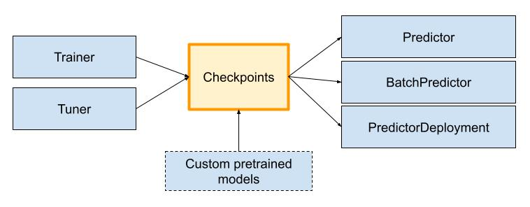

Checkpoints
===========

Checkpoints are the common format for models that are used across different components of the Ray AI Runtime.

What exactly is a checkpoint?
-----------------------------

The Checkpoint object is a serializable reference to a model. The model can represented in one of three ways:

- a directory located on local (on-disk) storage
- a directory located on external storage (e.g. cloud storage)
- an in-memory dictionary

The flexibility provided in the Checkpoint model representation is useful in distributed environments,
where you may want to recreate the same model on multiple nodes in your Ray cluster for inference
or across different Ray clusters.

Creating a checkpoint
---------------------

There are two ways of generating a checkpoint.

The first way is to generate it from a pretrained model. Each framework that AIR supports has a ``to_air_checkpoint`` method that can be used to generate an AIR checkpoint:

.. literalinclude:: doc_code/checkpoint_usage.py
    :language: python
    :start-after: __checkpoint_quick_start__
    :end-before: __checkpoint_quick_end__

Another way is to retrieve it from the results of a Trainer or a Tuner.

.. literalinclude:: doc_code/checkpoint_usage.py
    :language: python
    :start-after: __use_trainer_checkpoint_start__
    :end-before: __use_trainer_checkpoint_end__

What can I do with a checkpoint?
--------------------------------

Checkpoints can be used to instantiate a :class:`Predictor`, :class:`BatchPredictor`, or :class:`PredictorDeployment`.
Upon usage, the model held by the Checkpoint will be instantiated in memory and used for inference.

Below is an example using a checkpoint in the :class:`BatchPredictor` for scalable batch inference:

.. literalinclude:: doc_code/checkpoint_usage.py
    :language: python
    :start-after: __batch_pred_start__
    :end-before: __batch_pred_end__

Below is an example using a checkpoint in a service for online inference via :class:`PredictorDeployment`:

.. literalinclude:: doc_code/checkpoint_usage.py
    :language: python
    :start-after: __online_inference_start__
    :end-before: __online_inference_end__

The Checkpoint object has methods to translate between different checkpoint storage locations.
With this flexibility, Checkpoint objects can be serialized and used in different contexts
(e.g., on a different process or a different machine):

.. literalinclude:: doc_code/checkpoint_usage.py
    :language: python
    :start-after: __basic_checkpoint_start__
    :end-before: __basic_checkpoint_end__

Example: Using Checkpoints with MLflow
--------------------------------------

MLflow has its own `checkpoint format <https://www.mlflow.org/docs/latest/models.html>`__ called the "MLflow Model". It is a standard format for packaging machine learning models that can be used in a variety of downstream tools.

Below is an example of using MLflow models as a Ray AIR Checkpoint.

.. literalinclude:: doc_code/checkpoint_mlflow.py
    :language: python
    :start-after: __mlflow_checkpoint_start__
    :end-before: __mlflow_checkpoint_end__

