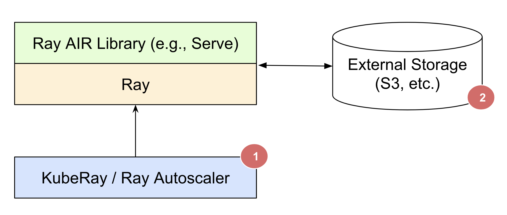
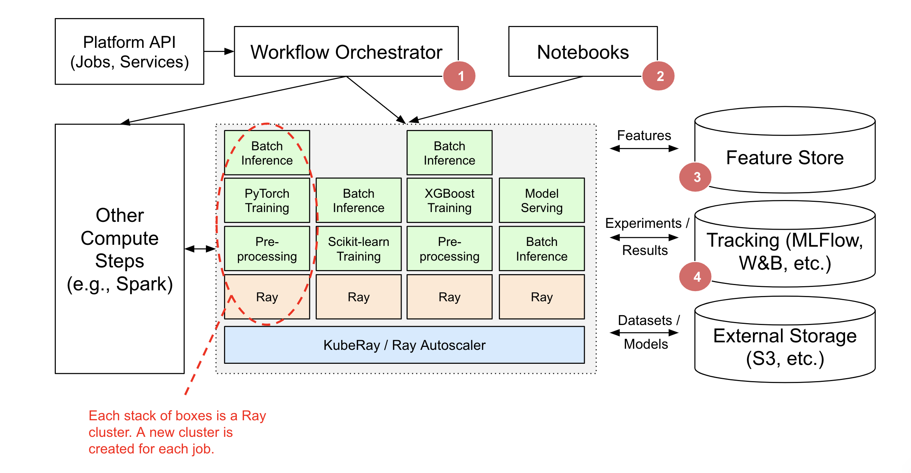

.. _air-deployment:

Deployment Guide
================

Here, we describe how you might use or deploy AIR in your infrastructure. There are two main deployment patterns -- pick and choose and within existing platforms.

The core idea is that AIR can be **complementary** to your existing infrastructure and integration tools.

Design Principles
-----------------

* Ray AIR handles the heavyweight compute aspects of AI apps and services.
* Ray AIR relies on external integrations (e.g., Tecton, MLFlow, W&B) for Storage and Tracking.
* Workflow Orchestrators (e.g., AirFlow) are an optional component that can be used for scheduling recurring jobs, launching new Ray clusters for jobs, and running non-Ray compute steps.
* Lightweight orchestration of task graphs within a single Ray AIR app can be handled using Ray tasks.
* Ray AIR libraries can be used independently, within an existing ML platform, or to build a Ray-native ML platform.

Pick and choose your own libraries
----------------------------------

You can pick and choose which Ray AIR libraries you want to use.

This is applicable if you are an ML engineer who wants to independently use a Ray AIR library for a specific AI app or service use case and do not need to integrate with existing ML platforms.

For example, Alice wants to use RLlib to train models for her work project. Bob wants to use Ray Serve to deploy his model pipeline. In both cases, Alice and Bob can leverage these libraries independently without any coordination.

This scenario describes most usages of Ray libraries today.

In the above diagram:

* Only one library is used -- showing that you can pick and choose and do not need to replace all of your ML infrastructure to use Ray AIR.
* You can use one of :ref:`Ray's many deployment modes <ref-deployment-guide>` to launch and manage Ray clusters and Ray applications.
* AIR libraries can read data from external storage systems such as Amazon S3 / Google Cloud Storage, as well as store results there.

Existing ML Platform integration
--------------------------------

You may already have an existing machine learning platform but want to use some subset of Ray AIR. For example, an ML engineer wants to use Ray AIR within the ML Platform their organization has purchased (e.g., SageMaker, Vertex).

Ray AIR can complement existing machine learning platforms by integrating with existing pipeline/workflow orchestrators, storage, and tracking services, without requiring a replacement of your entire ML platform.

In the above diagram:

1. A workflow orchestrator such as AirFlow, Oozie, SageMaker Pipelines, etc. is responsible for scheduling and creating Ray clusters and running Ray AIR apps and services. The Ray AIR app may be part of a larger orchestrated workflow (e.g., Spark ETL, then Training on Ray).
2. Lightweight orchestration of task graphs can be handled entirely within Ray AIR. External workflow orchestrators will integrate nicely but are only needed if running non-Ray steps.
3. Ray AIR clusters can also be created for interactive use (e.g., Jupyter notebooks, Google Colab, Databricks Notebooks, etc.).
4. Ray Train, Datasets, and Serve provide integration with Feature Stores like Feast for Training and Serving.
5. Ray Train and Tune provide integration with tracking services such as MLFlow and Weights & Biases.
