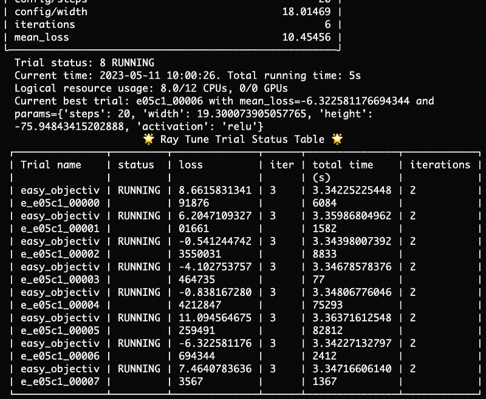

.. _air-experimental-features:

================================
Experimental features in Ray AIR
================================

The Ray Team is testing a number of experimental features in Ray AIR.

During development, the features
are disabled per default. You can opt-in by setting a
feature-specific environment variable.

After some time, the Ray Team enables the feature by default to gather
more feedback from the community. In that case, you can still
disable the feature using the same environment variable to
fully revert to the old behavior.

If you run into issues with experimental features,
`open an issue <https://github.com/ray-project/ray/issues/>`_
on GitHub. The Ray Team considers feedback before removing
the old implementation and making the new implementation the
default.

.. note::

    Experimental features can undergo frequent changes,
    especially on the master branch and the nightly wheels.

.. _air-experimental-new-output:

Context-aware progress reporting
--------------------------------

.. note::

    This feature is *enabled by default* in Ray 2.6.

    To disable, set the environment variable ``RAY_AIR_NEW_OUTPUT=0``.

A context-aware output engine is available for Ray Train and Ray Tune runs.

This output engine affects how the training progress
is printed in the console. The output changes depending on the execution
context: Ray Tune runs will be displayed differently to Ray Train runs.

The features include:

- Ray Train runs report status relevant to the single training run.
  It does not use the default Ray Tune table layout from previous versions.
- The table format has been updated.
- The format of reporting configurations and observed metrics is different from pervious versions.
- Significant reduction in the default metrics displayed in the console output for runs (e.g., RLlib runs).
- Decluttered the output to improve readability.
 

This output feature only works for the regular console.
It is automatically disabled when you use Jupyter Notebooks
or Ray client.

.. _air-experimental-rich:

Rich layout (sticky status)
---------------------------

.. note::

    This feature is *disabled by default*.

    To enable, set the environment variable ``RAY_AIR_RICH_LAYOUT=1``.

The :ref:`context-aware output engine <air-experimental-new-output>`
exposes an advanced layout using the
`rich <https://github.com/Textualize/rich>`_ library.

The *rich* layout provides a sticky
status table: The regular console logs are still printed
as before, but the trial overview table (in Ray Tune) is stuck to the bottom of the
screen and periodically updated.

This feature is still in development. You can opt-in to try
it out.

To opt-in, set the ``RAY_AIR_RICH_LAYOUT=1`` environment variable
and install rich (``pip install rich``).

.. _air-experimental-execution:

Event-based trial execution engine
----------------------------------

.. note::

    This feature is *enabled by default* starting Ray 2.5.

    To disable, set the environment variable ``TUNE_NEW_EXECUTION=0``.

Ray Tune has an updated trial execution engine.
Since Ray Tune is also the execution backend for
Ray Train, the updated engine affects both tuning and training runs.

The update is a refactor of the :ref:`TrialRunner <trialrunner-docstring>`
which uses a generic Ray actor and future manager instead of
the previous ``RayTrialExecutor``. This manager exposes an
interface to react to scheduling and task execution events, which makes
it easier to maintain and develop.

This is a drop-in replacement of an internal class, and you shouldn't see
any change to the previous behavior.

However, if you notice any odd behavior, you can opt out of
the event-based execution engine and see if it resolves your problem.

In that case, please `open an issue <https://github.com/ray-project/ray/issues/>`_
on GitHub, ideally with a reproducible script.

Things to look out for:

- Less trials are running in parallel than before
- It takes longer to start new trials (or goes much faster)
- The tuning run finishes, but the script does not exit
- The end-to-end runtime is much slower than before
- The CPU load on the head node is high,
  even though the training jobs don't
  require many resources or don't run on the head node
- Any exceptions are raised that indicate an error in starting or
  stopping trials or the experiment

Note that some edge cases may not be captured in the regression tests. Your feedback is welcome.
