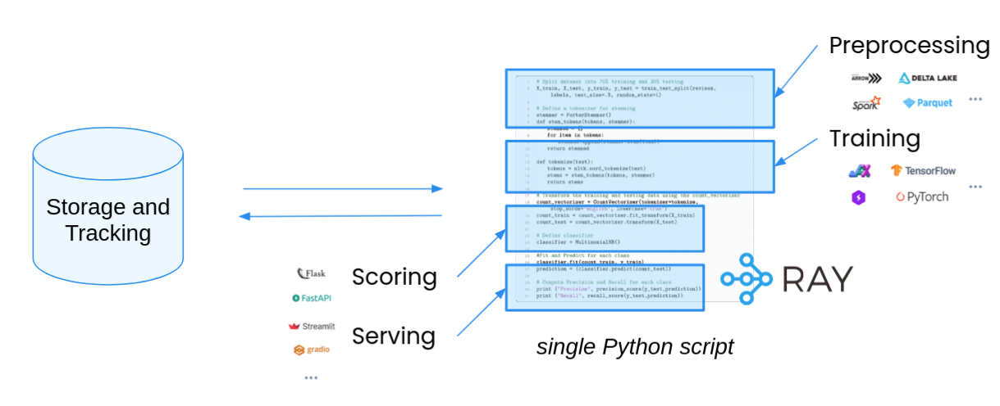

.. _air:

Ray AI Runtime (AIR)
====================

.. tip::

    AIR is currently in **beta**. Fill out `this short form <https://forms.gle/wCCdbaQDtgErYycT6>`__ to get involved. We'll be holding office hours, development sprints, and other activities as we get closer to the GA release. Join us!

Ray AI Runtime (AIR) is a scalable and unified toolkit for ML applications. AIR enables easy scaling of individual workloads, end-to-end workflows, and popular ecosystem frameworks, all in just Python.

.. image:: images/ray-air.svg

AIR comes with ready-to-use libraries for :ref:`Preprocessing <datasets>`, :ref:`Training <train-docs>`, :ref:`Tuning <tune-main>`, :ref:`Scoring <air-predictors>`, :ref:`Serving <rayserve>`, and :ref:`Reinforcement Learning <rllib-index>`, as well as an ecosystem of integrations.

Ray AIR focuses on the compute aspects of ML:
 * It provides scalability by leveraging Ray’s distributed compute layer for ML workloads.
 * It is designed to interoperate with other systems for storage and metadata needs.

Get started by installing Ray AIR:

.. code:: bash

    pip install -U "ray[air]"

Quick Start
-----------

Below, we demonstrate how AIR enables simple scaling of end-to-end ML workflows, focusing on
a few of the popular frameworks AIR integrates with (XGBoost, Pytorch, and Tensorflow):

Preprocessing
~~~~~~~~~~~~~

Below, let's start by preprocessing your data with Ray AIR's ``Preprocessors``:

.. literalinclude:: examples/xgboost_starter.py
    :language: python
    :start-after: __air_generic_preprocess_start__
    :end-before: __air_generic_preprocess_end__

If using Tensorflow or Pytorch, format your data for use with your training framework:

.. tabbed:: XGBoost

    .. code-block:: python
        
        # No extra preprocessing is required for XGBoost.
        # The data is already in the correct format.

.. tabbed:: Pytorch

    .. literalinclude:: examples/pytorch_tabular_starter.py
        :language: python
        :start-after: __air_pytorch_preprocess_start__
        :end-before: __air_pytorch_preprocess_end__

.. tabbed:: Tensorflow

    .. literalinclude:: examples/tf_tabular_starter.py
        :language: python
        :start-after: __air_tf_preprocess_start__
        :end-before: __air_tf_preprocess_end__

Training
~~~~~~~~

Train a model with a ``Trainer`` with common ML frameworks:

.. tabbed:: XGBoost

    .. literalinclude:: examples/xgboost_starter.py
        :language: python
        :start-after: __air_xgb_train_start__
        :end-before: __air_xgb_train_end__

.. tabbed:: Pytorch

    .. literalinclude:: examples/pytorch_tabular_starter.py
        :language: python
        :start-after: __air_pytorch_train_start__
        :end-before: __air_pytorch_train_end__

.. tabbed:: Tensorflow

    .. literalinclude:: examples/tf_tabular_starter.py
        :language: python
        :start-after: __air_tf_train_start__
        :end-before: __air_tf_train_end__

Hyperparameter Tuning
~~~~~~~~~~~~~~~~~~~~~

You can specify a hyperparameter space to search over for each trainer:

.. tabbed:: XGBoost

    .. literalinclude:: examples/xgboost_starter.py
        :language: python
        :start-after: __air_xgb_tuner_start__
        :end-before: __air_xgb_tuner_end__

.. tabbed:: Pytorch

    .. literalinclude:: examples/pytorch_tabular_starter.py
        :language: python
        :start-after: __air_pytorch_tuner_start__
        :end-before: __air_pytorch_tuner_end__

.. tabbed:: Tensorflow

    .. literalinclude:: examples/tf_tabular_starter.py
        :language: python
        :start-after: __air_tf_tuner_start__
        :end-before: __air_tf_tuner_end__

Then use the ``Tuner`` to run the search:

.. literalinclude:: examples/pytorch_tabular_starter.py
    :language: python
    :start-after: __air_tune_generic_start__
    :end-before: __air_tune_generic_end__

Batch Inference
~~~~~~~~~~~~~~~

Use the trained model for scalable batch prediction with a ``BatchPredictor``.

.. tabbed:: XGBoost

    .. literalinclude:: examples/xgboost_starter.py
        :language: python
        :start-after: __air_xgb_batchpred_start__
        :end-before: __air_xgb_batchpred_end__

.. tabbed:: Pytorch

    .. literalinclude:: examples/pytorch_tabular_starter.py
        :language: python
        :start-after: __air_pytorch_batchpred_start__
        :end-before: __air_pytorch_batchpred_end__

.. tabbed:: Tensorflow

    .. literalinclude:: examples/tf_tabular_starter.py
        :language: python
        :start-after: __air_tf_batchpred_start__
        :end-before: __air_tf_batchpred_end__

Why Ray AIR?
------------

Ray AIR aims to simplify the ecosystem of machine learning frameworks, platforms, and tools. It does this by taking a scalable, single-system approach to ML infrastructure (i.e., leveraging Ray as a unified compute framework):

**1. Seamless Dev to Prod**: AIR reduces friction going from development to production. Traditional orchestration approaches introduce separate systems and operational overheads. With Ray and AIR, the same Python code scales seamlessly from a laptop to a large cluster.

**2. Unified API**: Want to switch between frameworks like XGBoost and PyTorch, or try out a new library like HuggingFace? Thanks to the flexibility of AIR, you can do this by just swapping out a single class, without needing to set up new systems or change other aspects of your workflow.

**3. Open and Evolvable**: Ray core and libraries are fully open-source and can run on any cluster, cloud, or Kubernetes, reducing the costs of platform lock-in. Want to go out of the box? Run any framework you want using AIR's integration APIs, or build advanced use cases directly on Ray core.

  AIR enables a single-system / single-script approach to scaling ML. Ray's
  distributed Python APIs enable scaling of ML workloads without the burden of
  setting up or orchestrating separate distributed systems.

AIR is for both data scientists and ML engineers. Consider using AIR when you want to:
 * Scale a single workload.
 * Scale end-to-end ML applications.
 * Build a custom ML platform for your organization.

AIR Ecosystem
-------------

AIR comes with built-in integrations with the most popular ecosystem libraries. The following diagram provides an overview of the AIR libraries, ecosystem integrations, and their readiness.
AIR's developer APIs also enable *custom integrations* to be easily created.

..
  https://docs.google.com/drawings/d/1pZkRrkAbRD8jM-xlGlAaVo3T66oBQ_HpsCzomMT7OIc/edit

.. image:: images/air-ecosystem.svg

Next Steps
----------

- :ref:`air-key-concepts`
- `Examples <https://github.com/ray-project/ray/tree/master/python/ray/air/examples>`__
- :ref:`Deployment Guide <air-deployment>`
- :ref:`API reference <air-api-ref>`
