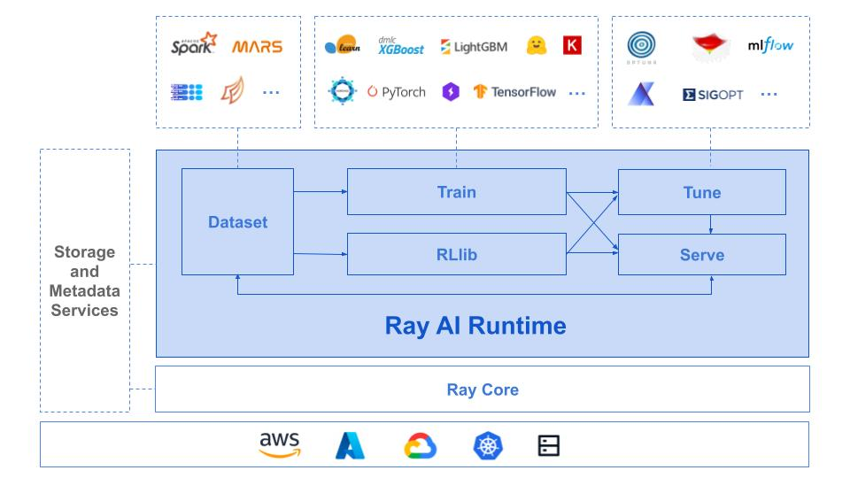

.. _air:

Ray AI Runtime (AIR)
====================

Ray AI Runtime (AIR) is an open-source toolkit for building end-to-end ML applications. By leveraging Ray and its library ecosystem, it brings scalability and programmability to ML platforms.

.. tip::
    **Getting involved with Ray AIR.** Fill out `this short form <https://forms.gle/wCCdbaQDtgErYycT6>`__ to get involved. We'll be holding office hours, development sprints, and other activities as we get closer to the Ray AIR Beta/GA release. Join us!

The main focuses of the Ray AI Runtime:

* Ray AIR focuses on providing the compute layer for ML workloads.
* It is designed to interoperate with other systems for storage and metadata needs.

Ray AIR consists of 5 key components:

- Data processing (:ref:`Ray Data <datasets>`)
- Model Training (:ref:`Ray Train <train-docs>`)
- Reinforcement Learning (:ref:`Ray RLlib <rllib-index>`)
- Hyperparameter Tuning (:ref:`Ray Tune <tune-main>`)
- Model Serving (:ref:`Ray Serve <rayserve>`).

Users can use these libraries interchangeably to scale different parts of standard ML workflows.

To get started, install Ray AIR via ``pip install -U "ray[air]"``

Quick Start
-----------

.. tabbed:: XGBoost

    Preprocess your data with a ``Preprocessor``.

    .. literalinclude:: doc_code/xgboost_starter.py
        :language: python
        :start-after: __air_xgb_preprocess_start__
        :end-before: __air_xgb_preprocess_end__

    Train a model with an ``XGBoostTrainer``.

    .. literalinclude:: doc_code/xgboost_starter.py
        :language: python
        :start-after: __air_xgb_train_start__
        :end-before: __air_xgb_train_end__

    Use the trained model for batch prediction with a ``BatchPredictor``.

    .. literalinclude:: doc_code/xgboost_starter.py
        :language: python
        :start-after: __air_xgb_batchpred_start__
        :end-before: __air_xgb_batchpred_end__

.. tabbed:: Pytorch

    Create your dataset.

    .. literalinclude:: doc_code/pytorch_starter.py
        :language: python
        :start-after: __air_pytorch_preprocess_start__
        :end-before: __air_pytorch_preprocess_end__

    Train a model with a ``TorchTrainer``.

    .. literalinclude:: doc_code/pytorch_starter.py
        :language: python
        :start-after: __air_pytorch_train_start__
        :end-before: __air_pytorch_train_end__

.. tabbed:: Tensorflow

    Create your ``Ray Dataset``.

    .. literalinclude:: doc_code/tf_starter.py
        :language: python
        :start-after: __air_tf_preprocess_start__
        :end-before: __air_tf_preprocess_end__

    Train a model with a ``TensorflowTrainer``.

    .. literalinclude:: doc_code/tf_starter.py
        :language: python
        :start-after: __air_tf_train_start__
        :end-before: __air_tf_train_end__

    Use the trained model for batch prediction with a ``BatchPredictor``.

    .. literalinclude:: doc_code/tf_starter.py
        :language: python
        :start-after: __air_tf_batchpred_start__
        :end-before: __air_tf_batchpred_end__

See the :ref:`Key Concepts <air-key-concepts>` for more that Ray AIR has to offer.

Why Ray AIR?
------------

There are so many machine learning frameworks, platforms, and tools nowadays. What makes Ray AIR different?

We believe Ray AIR provides unique value deriving from Ray.

.. dropdown:: Seamless development to production
    :animate: fade-in-slide-down

    Ray AIR reduces development friction going from development to production. Unlike in other frameworks, scaling Ray applications from a laptop to large clusters doesn't require a separate way of running -- the same code scales up seamlessly.
    This means data scientists and ML practitioners spend less time fighting YAMLs and refactoring code. Smaller teams and companies that don’t have the resources to invest heavily on MLOps can now deploy ML models at a much faster rate with Ray AIR.

.. dropdown:: Multi-cloud and Framework-interoperable
    :animate: fade-in-slide-down

    Ray AIR is multi-cloud and framework-interoperable. The Ray compute layer and libraries freely operate with Cloud platforms and frameworks in the ecosystem, reducing lock-in to any particular choices of ML tech.
    Ex: why framework interoperability is unique to Ray--- it's easy to run Torch distributed or elastic Horovod within Ray, but not vice versa.

.. dropdown:: Future-proof via flexibility and scalability
    :animate: fade-in-slide-down

    Ray's scalability and flexibility makes Ray AIR future-proof. Advanced serving pipelines, elastic training, online learning, reinforcement learning applications are being built and scaled today on Ray. Common patterns are being incorporated into libraries like Ray Serve.

Next Steps
----------

- :ref:`air-key-concepts`
- `Examples <https://github.com/ray-project/ray/tree/master/python/ray/air/examples>`__
- :ref:`Deployment Guide <air-deployment>`
- :ref:`API reference <air-api-ref>`

