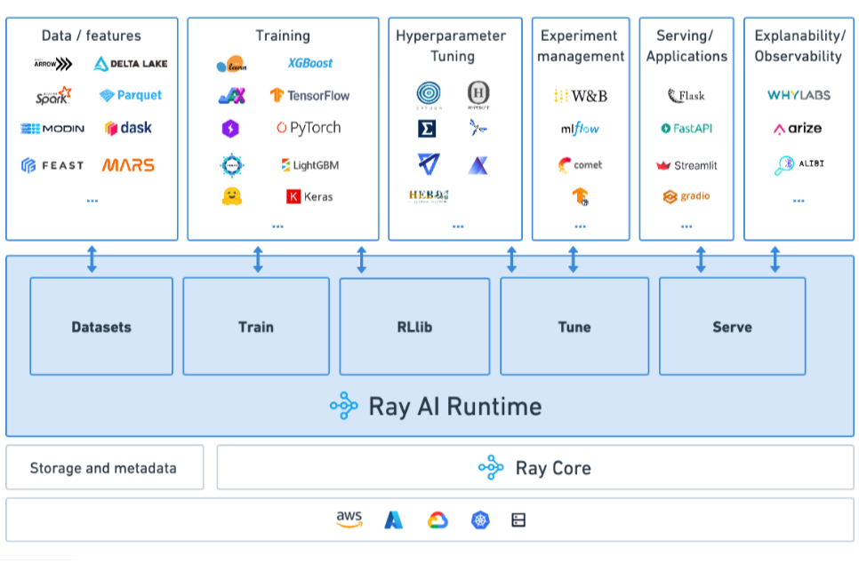

.. _air:

Ray AI Runtime (AIR)
====================

Ray AI Runtime (AIR) is a scalable and unified toolkit for ML applications. AIR enables easy scaling of individual ML workloads, end-to-end ML workflows, and popular ecosystem frameworks, all in just Python.

AIR comes with built-in libraries for :ref:`Preprocessing <datasets>`, :ref:`Training <train-docs>`, :ref:`Tuning <tune-main>`, :ref:`Reinforcement Learning <rllib-index>`, and :ref:`Serving <rayserve>`, as well as ecosystem integrations.

To get started, install Ray AIR via ``pip install -U "ray[air]"``

Why Ray AIR?
------------

Ray AIR aims to simplify the ecosystem of machine learning frameworks, platforms, and tools. It does this by enabling a simple, scalable approach to ML infrastructure:

**1. Seamless Dev to Prod**: AIR reduces friction going from development to production. Traditional orchestration approaches introduce separate systems and operational overheads. With Ray and AIR, the same Python code scales seamlessly from a laptop to a large cluster.

**2. Unified API**: Want to switch between frameworks like XGBoost and PyTorch, or try out a new framework like HuggingFace? AIR lets you accomplish this by just swapping out a single class. This level of flexibility and integration is only possible with a general-purpose distributed system like Ray.

**3. Open and Evolvable**: Ray core and libraries are fully open-source and can run on any cluster, cloud, or Kubernetes, reducing the costs of platform lock-in. Want to go out of the box? Run any framework you want using AIR's integration APIs, or build advanced use cases directly on Ray core.

Quick Start
-----------

Below, we demonstrate how you can use the Ray libraries in a seamless flow
between distributed frameworks (e.g., XGBoost, Pytorch, and Tensorflow):

Preprocessing
~~~~~~~~~~~~~

Below, let's start by preprocessing your data with Ray AIR's ``Preprocessors``:

.. literalinclude:: examples/xgboost_starter.py
    :language: python
    :start-after: __air_generic_preprocess_start__
    :end-before: __air_generic_preprocess_end__

If using Tensorflow or Pytorch, format your data for use with your training framework:

.. tabbed:: XGBoost

    .. code-block:: python
        
        # No extra preprocessing is required for XGBoost.
        # The data is already in the correct format.

.. tabbed:: Pytorch

    .. literalinclude:: examples/pytorch_tabular_starter.py
        :language: python
        :start-after: __air_pytorch_preprocess_start__
        :end-before: __air_pytorch_preprocess_end__

.. tabbed:: Tensorflow

    .. literalinclude:: examples/tf_tabular_starter.py
        :language: python
        :start-after: __air_tf_preprocess_start__
        :end-before: __air_tf_preprocess_end__

Training
~~~~~~~~

Train a model with a ``Trainer`` with common ML frameworks:

.. tabbed:: XGBoost

    .. literalinclude:: examples/xgboost_starter.py
        :language: python
        :start-after: __air_xgb_train_start__
        :end-before: __air_xgb_train_end__

.. tabbed:: Pytorch

    .. literalinclude:: examples/pytorch_tabular_starter.py
        :language: python
        :start-after: __air_pytorch_train_start__
        :end-before: __air_pytorch_train_end__

.. tabbed:: Tensorflow

    .. literalinclude:: examples/tf_tabular_starter.py
        :language: python
        :start-after: __air_tf_train_start__
        :end-before: __air_tf_train_end__

Hyperparameter Tuning
~~~~~~~~~~~~~~~~~~~~~

You can specify a hyperparameter space to search over for each trainer:

.. tabbed:: XGBoost

    .. literalinclude:: examples/xgboost_starter.py
        :language: python
        :start-after: __air_xgb_tuner_start__
        :end-before: __air_xgb_tuner_end__

.. tabbed:: Pytorch

    .. literalinclude:: examples/pytorch_tabular_starter.py
        :language: python
        :start-after: __air_pytorch_tuner_start__
        :end-before: __air_pytorch_tuner_end__

.. tabbed:: Tensorflow

    .. literalinclude:: examples/tf_tabular_starter.py
        :language: python
        :start-after: __air_tf_tuner_start__
        :end-before: __air_tf_tuner_end__

Then use the ``Tuner`` to run the search:

.. literalinclude:: examples/pytorch_tabular_starter.py
    :language: python
    :start-after: __air_tune_generic_start__
    :end-before: __air_tune_generic_end__

Batch Inference
~~~~~~~~~~~~~~~

Use the trained model for scalable batch prediction with a ``BatchPredictor``.

.. tabbed:: XGBoost

    .. literalinclude:: examples/xgboost_starter.py
        :language: python
        :start-after: __air_xgb_batchpred_start__
        :end-before: __air_xgb_batchpred_end__

.. tabbed:: Pytorch

    .. literalinclude:: examples/pytorch_tabular_starter.py
        :language: python
        :start-after: __air_pytorch_batchpred_start__
        :end-before: __air_pytorch_batchpred_end__

.. tabbed:: Tensorflow

    .. literalinclude:: examples/tf_tabular_starter.py
        :language: python
        :start-after: __air_tf_batchpred_start__
        :end-before: __air_tf_batchpred_end__

See the :ref:`Key Concepts <air-key-concepts>` for more that Ray AIR has to offer.

AIR Ecosystem
-------------

AIR is currently in *beta*, but some components are more stable. The following diagram provides an overview of the AIR components, ecosystem integrations, and their readiness.

..
  https://docs.google.com/drawings/d/1pZkRrkAbRD8jM-xlGlAaVo3T66oBQ_HpsCzomMT7OIc/edit

.. image:: images/air-ecosystem.svg

Next Steps
----------

- :ref:`air-key-concepts`
- `Examples <https://github.com/ray-project/ray/tree/master/python/ray/air/examples>`__
- :ref:`Deployment Guide <air-deployment>`
- :ref:`API reference <air-api-ref>`
