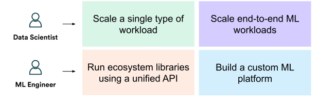

.. _air:

Ray AI Runtime (AIR)
====================

.. tip::

    AIR is currently in **beta**. Fill out `this short form <https://forms.gle/wCCdbaQDtgErYycT6>`__ to get involved. We'll be holding office hours, development sprints, and other activities as we get closer to the GA release. Join us!

Ray AI Runtime (AIR) is a scalable and unified toolkit for ML applications. AIR enables simple scaling of individual workloads, end-to-end workflows, and popular ecosystem frameworks, all in just Python.

..
  https://docs.google.com/drawings/d/1atB1dLjZIi8ibJ2-CoHdd3Zzyl_hDRWyK2CJAVBBLdU/edit

.. image:: images/ray-air.svg

AIR builds on Ray's best-in-class libraries for :ref:`Preprocessing <air-preprocessors>`, :ref:`Training <train-docs>`, :ref:`Tuning <tune-main>`, :ref:`Scoring <air-predictors>`, :ref:`Serving <rayserve>`, and :ref:`Reinforcement Learning <rllib-index>` to bring together an ecosystem of integrations.

ML Compute, Simplified
----------------------

Ray AIR aims to simplify the ecosystem of machine learning frameworks, platforms, and tools. It does this by leveraging Ray to provide a seamless, unified, and open experience for scalable ML:

.. image:: images/why-air-2.svg

..
  https://docs.google.com/drawings/d/1oi_JwNHXVgtR_9iTdbecquesUd4hOk0dWgHaTaFj6gk/edit

**1. Seamless Dev to Prod**: AIR reduces friction going from development to production. With Ray and AIR, the same Python code scales seamlessly from a laptop to a large cluster.

**2. Unified ML API**: AIR's unified ML API enables swapping between popular frameworks, such as XGBoost, PyTorch, and HuggingFace, with just a single class change in your code.

**3. Open and Extensible**: AIR and Ray are fully open-source and can run on any cluster, cloud, or Kubernetes. Build custom components and integrations on top of scalable developer APIs.

When to use AIR?
----------------

AIR is for both data scientists and ML engineers alike.

..
  https://docs.google.com/drawings/d/1Qw_h457v921jWQkx63tmKAsOsJ-qemhwhCZvhkxWrWo/edit

For data scientists, AIR can be used to scale individual workloads, and also end-to-end ML applications. For ML Engineers, AIR provides scalable platform abstractions that can be used to easily onboard and integrate tooling from the broader ML ecosystem.

Quick Start
-----------

Below, we walk through how AIR's unified ML API enables scaling of end-to-end ML workflows, focusing on
a few of the popular frameworks AIR integrates with (XGBoost, Pytorch, and Tensorflow). The ML workflow we're going to build is summarized by the following diagram:

..
  https://docs.google.com/drawings/d/1z0r_Yc7-0NAPVsP2jWUkLV2jHVHdcJHdt9uN1GDANSY/edit

.. figure:: images/why-air.svg

  AIR provides a unified API for the ML ecosystem.
  This diagram shows how AIR enables an ecosystem of libraries to be run at scale in just a few lines of code.

Get started by installing Ray AIR:

.. code:: bash

    pip install -U "ray[air]"

    # The below Ray AIR tutorial was written with the following libraries.
    # Consider running the following to ensure that the code below runs properly:
    pip install -U pandas>=1.3.5
    pip install -U torch>=1.12
    pip install -U numpy>=1.19.5
    pip install -U tensorflow>=2.6.2
    pip install -U pyarrow>=6.0.1

Preprocessing
~~~~~~~~~~~~~

First, let's start by loading a dataset from storage:

.. literalinclude:: examples/xgboost_starter.py
    :language: python
    :start-after: __air_generic_preprocess_start__
    :end-before: __air_generic_preprocess_end__

Then, we define a ``Preprocessor`` pipeline for our task:

.. tabbed:: XGBoost

    .. literalinclude:: examples/xgboost_starter.py
        :language: python
        :start-after: __air_xgb_preprocess_start__
        :end-before: __air_xgb_preprocess_end__

.. tabbed:: Pytorch

    .. literalinclude:: examples/pytorch_tabular_starter.py
        :language: python
        :start-after: __air_pytorch_preprocess_start__
        :end-before: __air_pytorch_preprocess_end__

.. tabbed:: Tensorflow

    .. literalinclude:: examples/tf_tabular_starter.py
        :language: python
        :start-after: __air_tf_preprocess_start__
        :end-before: __air_tf_preprocess_end__

Training
~~~~~~~~

Train a model with a ``Trainer`` with common ML frameworks:

.. tabbed:: XGBoost

    .. literalinclude:: examples/xgboost_starter.py
        :language: python
        :start-after: __air_xgb_train_start__
        :end-before: __air_xgb_train_end__

.. tabbed:: Pytorch

    .. literalinclude:: examples/pytorch_tabular_starter.py
        :language: python
        :start-after: __air_pytorch_train_start__
        :end-before: __air_pytorch_train_end__

.. tabbed:: Tensorflow

    .. literalinclude:: examples/tf_tabular_starter.py
        :language: python
        :start-after: __air_tf_train_start__
        :end-before: __air_tf_train_end__

Hyperparameter Tuning
~~~~~~~~~~~~~~~~~~~~~

You can specify a hyperparameter space to search over for each trainer:

.. tabbed:: XGBoost

    .. literalinclude:: examples/xgboost_starter.py
        :language: python
        :start-after: __air_xgb_tuner_start__
        :end-before: __air_xgb_tuner_end__

.. tabbed:: Pytorch

    .. literalinclude:: examples/pytorch_tabular_starter.py
        :language: python
        :start-after: __air_pytorch_tuner_start__
        :end-before: __air_pytorch_tuner_end__

.. tabbed:: Tensorflow

    .. literalinclude:: examples/tf_tabular_starter.py
        :language: python
        :start-after: __air_tf_tuner_start__
        :end-before: __air_tf_tuner_end__

Then use the ``Tuner`` to run the search:

.. literalinclude:: examples/pytorch_tabular_starter.py
    :language: python
    :start-after: __air_tune_generic_start__
    :end-before: __air_tune_generic_end__

Batch Inference
~~~~~~~~~~~~~~~

Use the trained model for scalable batch prediction with a ``BatchPredictor``.

.. tabbed:: XGBoost

    .. literalinclude:: examples/xgboost_starter.py
        :language: python
        :start-after: __air_xgb_batchpred_start__
        :end-before: __air_xgb_batchpred_end__

.. tabbed:: Pytorch

    .. literalinclude:: examples/pytorch_tabular_starter.py
        :language: python
        :start-after: __air_pytorch_batchpred_start__
        :end-before: __air_pytorch_batchpred_end__

.. tabbed:: Tensorflow

    .. literalinclude:: examples/tf_tabular_starter.py
        :language: python
        :start-after: __air_tf_batchpred_start__
        :end-before: __air_tf_batchpred_end__

Project Status
--------------

AIR is currently in **beta**. If you have questions for the team or are interested in getting involved in the development process, fill out `this short form <https://forms.gle/wCCdbaQDtgErYycT6>`__.

For an overview of the AIR libraries, ecosystem integrations, and their readiness, check out the latest :ref:`AIR ecosystem map <air-ecosystem-map>`.

Next Steps
----------

- :ref:`air-key-concepts`
- :ref:`air-examples-ref`
- :ref:`API reference <air-api-ref>`
- :ref:`Technical whitepaper <whitepaper>`
