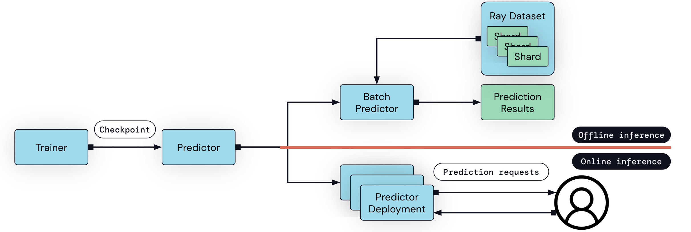

.. _air-predictors:

Inference with trained models
=============================

After you train a model, you will often want to use the model to do inference and prediction.

Ray AIR Predictors are a class that loads models from :class:`Checkpoints` to perform inference. 
Predictors are used by `BatchPredictors` and `PredictorDeployments` to do large-scale scoring or online inference.

Predictors Basics
-----------------

Let's walk through a basic usage of the Predictor. In the below example, we create `Checkpoint` object from a model definition. 
Checkpoints can be generated from a variety of different ways -- 
see the Checkpoints user guide for more details.
.. TODO: link to Checkpoint user guide

The checkpoint then is used to create a framework specific Predictor (in our example, a `TensorflowPredictor`), which then can be used for inference:

.. literalinclude:: doc_code/use_pretrained_model.py
    :language: python
    :start-after: __use_predictor_start__
    :end-before: __use_predictor_end__

Predictors expose a ``predict`` method that accepts an input batch of type ``DataBatchType`` (which is a typing union of different standard Python ecosystem data types, such as Pandas Dataframe or Numpy Array) and outputs predictions of the same type as the input batch.

**Life of a prediction:** Underneath the hood, when the ``Predictor.predict`` method is called the following occurs:

- The input batch is converted into a Pandas DataFrame. Tensor input (like a ``np.ndarray``) will be converted into a single column Pandas Dataframe.
- If there is a :ref:`Preprocessor <air-preprocessor-ref>` saved in the provided :ref:`Checkpoint <air-checkpoint-ref>`, the preprocessor will be used to transform the DataFrame.
- The transformed DataFrame will be passed to the model for inference.
- The predictions will be outputted by ``predict`` in the same type as the original input.

Batch Prediction
----------------

Ray AIR provides a ``BatchPredictor`` utility for large-scale batch inference.

The BatchPredictor takes in a checkpoint and a predictor class and executes large-scale batch prediction on a given dataset in a parallel/distributed fashion when calling ``predict()``.

.. literalinclude:: doc_code/use_pretrained_model.py
    :language: python
    :start-after: __batch_prediction_start__
    :end-before: __batch_prediction_end__

There are different things you need in order to do batch prediction on different data types.

**Tabular**

.. tabbed:: XGBoost

    .. literalinclude:: doc_code/xgboost_starter.py
        :language: python
        :start-after: __air_xgb_batchpred_start__
        :end-before: __air_xgb_batchpred_end__

    .. TODO: include py files as orphans so that we can do a versioned link?
    .. See the full script here: `Code <doc_code/xgboost_starter.py>`_.

.. tabbed:: Pytorch

    .. literalinclude:: doc_code/pytorch_tabular_starter.py
        :language: python
        :start-after: __air_pytorch_batchpred_start__
        :end-before: __air_pytorch_batchpred_end__

    .. TODO: include py files as orphans so that we can do a versioned link?

.. tabbed:: Tensorflow

    Coming soon!
    .. TODO: include py files as orphans so that we can do a versioned link?

**Image**

.. tabbed:: Torch

    .. literalinclude:: doc_code/torch_image_batch_pretrained.py
        :language: python
        :start-after: __batch_prediction_start__
        :end-before: __batch_prediction_end__

.. tabbed:: TensorFlow

    .. literalinclude:: doc_code/tf_image_batch_pretrained.py
        :language: python
        :start-after: __batch_prediction_start__
        :end-before: __batch_prediction_end__

**Text**

Coming soon!

Configuring Batch Prediction
~~~~~~~~~~~~~~~~~~~~~~~~~~~~

**Resources (enabling GPU Prediction)**:

**Batch Size**:

**Worker Pool**: 

Lazy/Pipelined Prediction
~~~~~~~~~~~~~~~~~~~~~~~~~
Show ``.predict_pipelined()`` method.

.. literalinclude:: doc_code/use_pretrained_model.py
    :language: python
    :start-after: __pipelined_prediction_start__
    :end-before: __pipelined_prediction_end__

Examples
--------

TODO Coming soon!

Developer Guide: Implementing your own Predictor
------------------------------------------------
To implement a new Predictor for your particular framework, you should subclass the base ``Predictor`` and implement the following two methods:

    1. ``_predict_pandas``: Given a pandas.DataFrame input, return a
        pandas.DataFrame containing predictions.
    2. ``from_checkpoint``: Logic for creating a Predictor from an
       :ref:`AIR Checkpoint <air-checkpoint-ref>`.
    3. Optionally ``_predict_arrow`` for better performance when working with
       tensor data to avoid extra copies from Pandas conversions.

