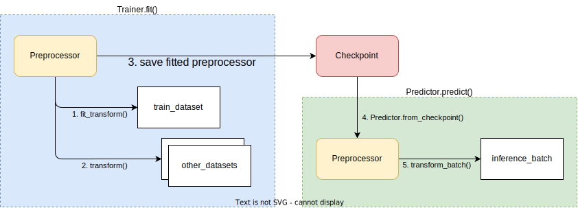

.. _air-preprocessors:

Preprocessing Data
==================

This page describes how to perform data preprocessing in Ray AIR.

Data preprocessing is a common technique for transforming raw data into features that will be input to a machine learning model.
In general, you may want to apply the same preprocessing logic to your offline training data and online inference data.
Ray AIR provides several common preprocessors out of the box as well as interfaces that enable you to define your own custom logic.

Overview
--------

Ray AIR exposes a ``Preprocessor`` class for preprocessing. The ``Preprocessor`` has four methods that make up its core interface.

#. ``fit()``: Compute state information about a :class:`Dataset <ray.data.Dataset>` (e.g. the mean or standard deviation of a column)
   and save it to the ``Preprocessor``. This information should then be used to perform ``transform()``.
   *This is typically called on the training dataset.*
#. ``transform()``: Apply a transformation to a ``Dataset``.
   If the ``Preprocessor`` is stateful, then ``fit()`` must be called first.
   *This is typically called on the training, validation, test datasets.*
#. ``transform_batch()``: Apply a transformation to a single :class:`batch <ray.air.predictor.DataBatchType>` of data.
   *This is typically called on online or offline inference data.*
#. ``fit_transform()``: Syntactic sugar for calling both ``fit()`` and ``transform()`` on a ``Dataset``.

To show these in action, let's walk through a basic example. First we'll set up two simple Ray ``Dataset``\s.

.. literalinclude:: doc_code/preprocessors.py
    :language: python
    :start-after: __preprocessor_setup_start__
    :end-before: __preprocessor_setup_end__

Next, ``fit`` the ``Preprocessor`` on one ``Dataset``, and ``transform`` both ``Dataset``\s with this fitted information.

.. literalinclude:: doc_code/preprocessors.py
    :language: python
    :start-after: __preprocessor_fit_transform_start__
    :end-before: __preprocessor_fit_transform_end__

Finally, call ``transform_batch`` on a single batch of data.

.. literalinclude:: doc_code/preprocessors.py
    :language: python
    :start-after: __preprocessor_transform_batch_start__
    :end-before: __preprocessor_transform_batch_end__

Life of an AIR Preprocessor
---------------------------

Now that we've gone over the basics, let's dive into how ``Preprocessor``\s fit into an end-to-end application built with AIR.
The diagram below depicts an overview of the main steps of a ``Preprocessor``:

#. Passed into a ``Trainer`` to ``fit`` and ``transform`` input ``Dataset``\s.
#. Saved as a ``Checkpoint``.
#. Reconstructed in a ``Predictor`` to ``fit_batch`` on batches of data.

Throughout this section we'll go through this workflow in more detail, with code examples using XGBoost.
The same logic is applicable to other integrations as well.

Trainer
~~~~~~~

The journey of the ``Preprocessor`` starts with the :class:`Trainer <ray.air.trainer.Trainer>`.
If the ``Trainer`` is instantiated with a ``Preprocessor``, then the following logic will be executed when ``Trainer.fit()`` is called:

#. If a ``"train"`` ``Dataset`` is passed in, then the ``Preprocessor`` will call ``fit()`` on it.
#. The ``Preprocessor`` will then call ``transform()`` on *all* ``Dataset``\s, including the ``"train"`` ``Dataset``.
#. The ``Trainer`` will then perform training on the preprocessed ``Dataset``\s.

.. literalinclude:: doc_code/preprocessors.py
    :language: python
    :start-after: __trainer_start__
    :end-before: __trainer_end__

.. note::

    If you're passing a ``Preprocessor`` that is already fitted, it will be refitted on the ``"train"`` ``Dataset``.
    Adding the functionality to support passing in a fitted Preprocessor is being tracked
    `here <https://github.com/ray-project/ray/issues/25299>`__.

.. TODO: Remove the note above once the issue is resolved.

Tune
~~~~

If you're using ``Ray Tune`` for hyperparameter optimization, be aware that each ``Trial`` will instantiate its own copy of
the ``Preprocessor`` and the fitting and transformation logic will occur once per ``Trial``.

Checkpoint
~~~~~~~~~~

``Trainer.fit()`` returns a ``Results`` object which contains a ``Checkpoint``.
If a ``Preprocessor`` was passed into the ``Trainer``, then it will be saved in the ``Checkpoint`` along with any fitted state.

As a sanity check, let's confirm the ``Preprocessor`` is available in the ``Checkpoint``. In practice you should not need to do this.

.. literalinclude:: doc_code/preprocessors.py
    :language: python
    :start-after: __checkpoint_start__
    :end-before: __checkpoint_end__

Predictor
~~~~~~~~~

A ``Predictor`` can be constructed from a saved ``Checkpoint``. If the ``Checkpoint`` contains a ``Preprocessor``,
then the ``Preprocessor`` will be used to call ``transform_batch`` on input batches prior to performing inference.

In the following example, we show the Batch Predictor flow. The same logic applies to the :ref:`Online Inference flow <air-key-concepts-online-inference>`.

.. literalinclude:: doc_code/preprocessors.py
    :language: python
    :start-after: __predictor_start__
    :end-before: __predictor_end__

Types of Preprocessors
----------------------

Basic Preprocessors
~~~~~~~~~~~~~~~~~~~

Ray AIR provides a handful of ``Preprocessor``\s that you can use out of the box, and more will be added over time.
`Contributions <https://docs.ray.io/en/master/getting-involved.html>`__ are welcome!

.. tabbed:: Common APIs

    #. :class:`Preprocessor <ray.air.preprocessor.Preprocessor>`
    #. :class:`BatchMapper <ray.air.preprocessors.BatchMapper>`
    #. :class:`Chain <ray.air.preprocessors.Chain>`

.. tabbed:: Tabular

    #. :class:`Categorizer <ray.air.preprocessors.Categorizer>`
    #. :class:`FeatureHasher <ray.air.preprocessors.FeatureHasher>`
    #. :class:`LabelEncoder <ray.air.preprocessors.LabelEncoder>`
    #. :class:`MaxAbsScaler <ray.air.preprocessors.MaxAbsScaler>`
    #. :class:`MinMaxScaler <ray.air.preprocessors.MinMaxScaler>`
    #. :class:`Normalizer <ray.air.preprocessors.Normalizer>`
    #. :class:`OneHotEncoder <ray.air.preprocessors.OneHotEncoder>`
    #. :class:`OrdinalEncoder <ray.air.preprocessors.OrdinalEncoder>`
    #. :class:`PowerTransformer <ray.air.preprocessors.PowerTransformer>`
    #. :class:`RobustScaler <ray.air.preprocessors.RobustScaler>`
    #. :class:`SimpleImputer <ray.air.preprocessors.SimpleImputer>`
    #. :class:`StandardScaler <ray.air.preprocessors.StandardScaler>`
    #. :class:`SimpleImputer <ray.air.preprocessors.SimpleImputer>`

.. tabbed:: Text

    #. :class:`CountVectorizer <ray.air.preprocessors.CountVectorizer>`
    #. :class:`HashingVectorizer <ray.air.preprocessors.HashingVectorizer>`
    #. :class:`Tokenizer <ray.air.preprocessors.Tokenizer>`

.. tabbed:: Image

    Coming soon!

.. tabbed:: Utilities

    #. :func:`train_test_split <ray.air.train_test_split>`

Chaining Preprocessors
~~~~~~~~~~~~~~~~~~~~~~

More often than not, your preprocessing logic will contain multiple logical steps or apply different transformations to each column.
A simple ``Chain`` ``Preprocessor`` is provided which can be used to apply individual ``Preprocessor`` operations sequentially.

.. literalinclude:: doc_code/preprocessors.py
    :language: python
    :start-after: __chain_start__
    :end-before: __chain_end__

.. tip::

    Keep in mind that the operations are sequential. For example, if you define a ``Preprocessor``
    ``Chain([preprocessorA, preprocessorB])``, then ``preprocessorB.transform()`` will be applied
    to the result of ``preprocessorA.transform()``.

Custom Preprocessors
~~~~~~~~~~~~~~~~~~~~

**Stateless Preprocessors:** Stateless preprocessors can be implemented with the ``BatchMapper``.

.. literalinclude:: doc_code/preprocessors.py
    :language: python
    :start-after: __custom_stateless_start__
    :end-before: __custom_stateless_end__

**Stateful Preprocessors:** Coming soon!

