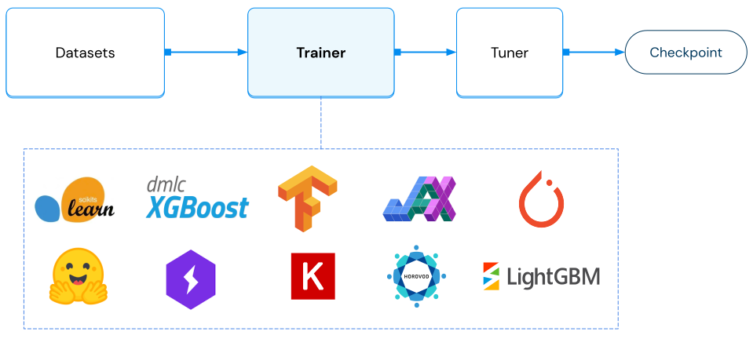

.. _air-trainers:

Using Trainers
==============

.. https://docs.google.com/drawings/d/1anmT0JVFH9abR5wX5_WcxNHJh6jWeDL49zWxGpkfORA/edit

Ray AIR Trainers provide a way to scale out training with popular machine learning frameworks. As part of Ray Train, Trainers enable users to run distributed multi-node training with fault tolerance.
Fully integrated with the Ray ecosystem, Trainers leverage :ref:`Ray Data <air-ingest>` to enable scalable preprocessing
and performant distributed data ingestion. Also, Trainers can be composed with :class:`Tuners <ray.tune.Tuner>` for distributed hyperparameter tuning.

After executing training, Trainers output the trained model in the form of
a :class:`Checkpoint <ray.air.checkpoint.Checkpoint>`, which can be used for batch or online prediction inference.

There are three broad categories of Trainers that AIR offers:

* :ref:`Deep Learning Trainers <air-trainers-dl>` (Pytorch, Tensorflow, Horovod)
* :ref:`Tree-based Trainers <air-trainers-tree>` (XGboost, LightGBM)
* :ref:`Other ML frameworks <air-trainers-other>` (HuggingFace, Scikit-Learn, RLlib)

Trainer Basics
--------------

All trainers inherit from the :class:`BaseTrainer <ray.train.base_trainer.BaseTrainer>` interface. To
construct a Trainer, you can provide:

* A :class:`scaling_config <ray.air.config.ScalingConfig>`, which specifies how many parallel training workers and what type of resources (CPUs/GPUs) to use per worker during training.
* A :class:`run_config <ray.air.config.RunConfig>`, which configures a variety of runtime parameters such as fault tolerance, logging, and callbacks.
* A collection of :ref:`datasets <air-ingest>` and a :ref:`preprocessor <air-preprocessors>` for the provided datasets, which configures preprocessing and the datasets to ingest from.
* ``resume_from_checkpoint``, which is a checkpoint path to resume from, should your training run be interrupted.

After instantiating a Trainer, you can invoke it by calling :meth:`Trainer.fit() <ray.air.trainer.BaseTrainer.fit>`.

.. literalinclude:: doc_code/xgboost_trainer.py
    :language: python

.. _air-trainers-dl:

Deep Learning Trainers
----------------------

Ray Train offers 3 main deep learning trainers:
:class:`TorchTrainer <ray.train.torch.TorchTrainer>`,
:class:`TensorflowTrainer <ray.train.tensorflow.TensorflowTrainer>`, and
:class:`HorovodTrainer <ray.train.horovod.HorovodTrainer>`.

These three trainers all take a ``train_loop_per_worker`` parameter, which is a function that defines
the main training logic that runs on each training worker.

Under the hood, Ray AIR will use the provided ``scaling_config`` to instantiate
the correct number of workers.

Upon instantiation, each worker will be able to reference a global :ref:`Session <air-session-ref>` object,
which provides functionality for reporting metrics, saving checkpoints, and more.

You can provide multiple datasets to a trainer via the ``datasets`` parameter.
If ``datasets`` includes a training dataset (denoted by the "train" key), then it will be split into multiple dataset
shards, with each worker training on a single shard. All other datasets will not be split.
You can access the data shard within a worker via :func:`~ray.air.session.get_dataset_shard()`, and use 
:meth:`~ray.data.Dataset.to_tf` or `iter_torch_batches` to generate batches of Tensorflow or Pytorch tensors.
You can read more about :ref:`data ingest <air-ingest>` here.

Read more about :ref:`Ray Train's Deep Learning Trainers <train-dl-guide>`.

.. dropdown:: Code examples

    .. tabbed:: Torch

        .. literalinclude:: doc_code/torch_trainer.py
            :language: python

    .. tabbed:: Tensorflow

        .. literalinclude:: doc_code/tf_starter.py
            :language: python
            :start-after: __air_tf_train_start__
            :end-before: __air_tf_train_end__

    .. tabbed:: Horovod

        .. literalinclude:: doc_code/hvd_trainer.py
            :language: python

How to report metrics and checkpoints?
~~~~~~~~~~~~~~~~~~~~~~~~~~~~~~~~~~~~~~

During model training, you may want to save training metrics and checkpoints for downstream processing (e.g., serving the model).

Use the :ref:`Session <air-session-ref>` API to gather metrics and save checkpoints.
Checkpoints are synced to driver or the cloud storage based on user's configurations,
as specified in ``Trainer(run_config=...)``.

.. dropdown:: Code example

    .. literalinclude:: doc_code/report_metrics_and_save_checkpoints.py
        :language: python
        :start-after: __air_session_start__
        :end-before: __air_session_end__

.. _air-trainers-tree:

Tree-based Trainers
-------------------

Ray Train offers 2 main tree-based trainers:
:class:`XGBoostTrainer <ray.train.xgboost.XGBoostTrainer>` and
:class:`LightGBMTrainer <ray.train.lightgbm.LightGBMTrainer>`.

See :ref:`here for a more detailed user-guide <train-gbdt-guide>`.

XGBoost Trainer
~~~~~~~~~~~~~~~

Ray AIR also provides an easy to use :class:`XGBoostTrainer <ray.train.xgboost.XGBoostTrainer>`
for training XGBoost models at scale.

To use this trainer, you will need to first run: ``pip install -U xgboost-ray``.

.. literalinclude:: doc_code/xgboost_trainer.py
    :language: python

LightGBMTrainer
~~~~~~~~~~~~~~~

Similarly, Ray AIR comes with a :class:`LightGBMTrainer <ray.train.lightgbm.LightGBMTrainer>`
for training LightGBM models at scale.

To use this trainer, you will need to first run ``pip install -U lightgbm-ray``.

.. literalinclude:: doc_code/lightgbm_trainer.py
    :language: python

.. _air-trainers-other:

Other Trainers
--------------

HuggingFace Trainer
~~~~~~~~~~~~~~~~~~~

:class:`HuggingFaceTrainer <ray.train.huggingface.HuggingFaceTrainer>` further extends :class:`TorchTrainer <ray.train.torch.TorchTrainer>`, built
for interoperability with the HuggingFace Transformers library.

Users are required to provide a ``trainer_init_per_worker`` function which returns a
``transformers.Trainer`` object. The ``trainer_init_per_worker`` function
will have access to preprocessed train and evaluation datasets.

Upon calling `HuggingFaceTrainer.fit()`, multiple workers (ray actors) will be spawned,
and each worker will create its own copy of a ``transformers.Trainer``.

Each worker will then invoke ``transformers.Trainer.train()``, which will perform distributed
training via Pytorch DDP.

.. dropdown:: Code example

    .. literalinclude:: doc_code/hf_trainer.py
        :language: python
        :start-after: __hf_trainer_start__
        :end-before: __hf_trainer_end__

Scikit-Learn Trainer
~~~~~~~~~~~~~~~~~~~~

.. note:: This trainer is not distributed.

The Scikit-Learn Trainer is a thin wrapper to launch scikit-learn training within Ray AIR.
Even though this trainer is not distributed, you can still benefit from its integration with Ray Tune for distributed hyperparameter tuning
and scalable batch/online prediction.

.. literalinclude:: doc_code/sklearn_trainer.py
    :language: python

RLlib Trainer
~~~~~~~~~~~~~

RLTrainer provides an interface to RL Trainables. This enables you to use the same abstractions
as in the other trainers to define the scaling behavior, and to use Ray Data for offline training.

Please note that some scaling behavior still has to be defined separately.
The :class:`scaling_config <ray.air.config.ScalingConfig>` will set the number of
training workers ("Rollout workers"). To set the number of e.g. evaluation workers, you will
have to specify this in the ``config`` parameter of the ``RLTrainer``:

.. literalinclude:: doc_code/rl_trainer.py
    :language: python

How to interpret training results?
----------------------------------

Calling ``Trainer.fit()`` returns a :class:`Result <ray.air.Result>`, providing you access to metrics, checkpoints, and errors.
You can interact with a `Result` object as follows:

.. code-block:: python

    result = trainer.fit()

    # returns the last saved checkpoint
    result.checkpoint

    # returns the N best saved checkpoints, as configured in ``RunConfig.CheckpointConfig``
    result.best_checkpoints

    # returns the final metrics as reported
    result.metrics

    # returns the Exception if training failed.
    result.error

    # Returns a pandas dataframe of all reported results
    result.metrics_dataframe

See :class:`the Result docstring <ray.air.result.Result>` for more details.
