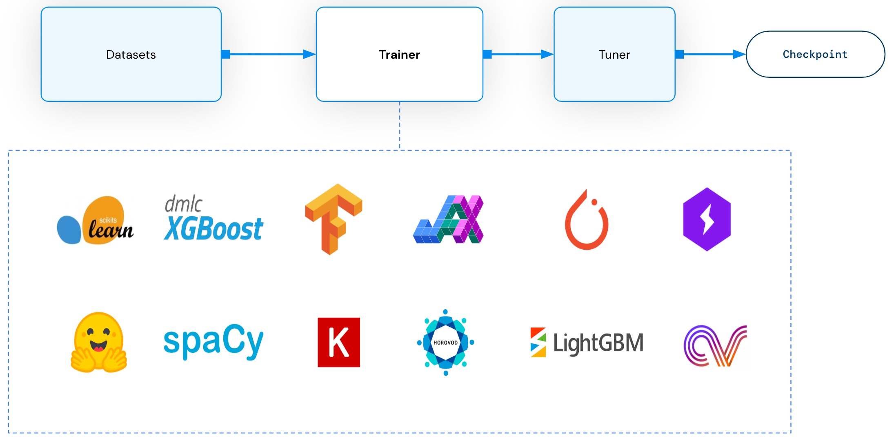

.. _air-trainers:

Ray AIR Trainers
================

.. https://docs.google.com/presentation/d/1uCEJANVSszC1WIu8USOd94eT2keH1Ct5ISEdY_v9IDo/edit?usp=sharing

Ray AIR offers integration with popular machine learning training framework through a variety of Trainers,
including Pytorch, Tensorflow, Horovod, XGBoost, as well as Scikit Learn and HuggingFace. It also offers a RLTrainer
with RLlib integration.
See :ref:`doc <air-trainer-ref>` for more information.

Within Ray AIR, a user can choose different models/frameworks in a composable manner.
Ray AIR trainer is also designed with interoperability in mind. It has built in support for Ray Dataset as
input to fully leverage Ray for data ingestion. It also has ``ray.air.Checkpoint`` for seamless transition
to batch prediction and inference. Moreover, Ray AIR trainer can be readily supplied to Tuner
for hyperparameter tuning with minimal boilerplate code.

Following we will give examples of how to use each type of trainers.

Distributed Dataparallel Training
---------------------------------
Within this category we mainly have TorchTrainer, TensorflowTrainer and HorovodTrainer.

User needs to supply ``train_loop_per_worker``, which is the main training logic that runs on each training worker.
User also needs to specify ``ScalingConfig`` which determines the number of workers and the resources for each worker.

Under the hood, Ray AIR will start training workers per specification. The input training dataset is automatically
split across all the workers through ``session.get_dataset_shard()``.

Tabular
~~~~~~~

.. tabbed:: Torch

    .. literalinclude:: examples/torch_trainer.py
        :language: python

.. tabbed:: Tensorflow

    .. literalinclude:: examples/tf_trainer.py
        :language: python

.. tabbed:: Horovod

    .. literalinclude:: examples/hvd_trainer.py
        :language: python

Report metrics and checkpoint through ``Session``
~~~~~~~~~~~~~~~~~~~~~~~~~~~~~~~~~~~~~~~~~~~~~~~~~
To be filled in

HuggingFace Trainer
~~~~~~~~~~~~~~~~~~~
To be filled in

XGBoost Trainer
---------------
To be filled in

ScikitLearn Trainer
-------------------
To be filled in

RLlib Trainer
-------------
To be filled in

How to interprete training result
---------------------------------
To be filled in
