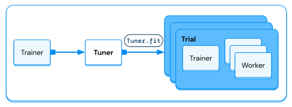

.. _air-tuner:

Configuring Hyperparameter Tuning
=================================

The Ray AIR :class:`Tuner <ray.tune.Tuner>` is the recommended way to tune hyperparameters in Ray AIR.

.. https://docs.google.com/drawings/d/1yMd12iMkyo6DGrFoET1TIlKfFnXX9dfh2u3GSdTz6W4/edit

    The `Tuner` will take in a `Trainer` and execute multiple training runs, each with different hyperparameter configurations.

As part of Ray Tune, the `Tuner` provides an interface that works with AIR Trainers to perform distributed
hyperparameter tuning. It provides a variety of state-of-the-art hyperparameter tuning algorithms for optimizing model
performance.

What follows next is basic coverage of what a Tuner is and how you can use it for basic examples. If you are interested in
reading more, please take a look at the :ref:`Ray Tune documentation <tune-main>`.

Key Concepts
------------

There are a number of key concepts that dictate proper use of a Tuner:

* A set of hyperparameters you want to tune in a `search space`.
* A `search algorithm` to effectively optimize your parameters and optionally use a
  `scheduler` to stop searches early and speed up your experiments.
* The `search space`, `search algorithm`, `scheduler`, and `Trainer` are passed to a `Tuner`,
  which runs the hyperparameter tuning workload by evaluating multiple hyperparameters in parallel.
* Each individual hyperparameter evaluation run is called a `trial`.
* The `Tuner` returns its results in a `ResultGrid`.

.. note::
   Tuners can also be used to launch hyperparameter tuning without using Ray AIR Trainers. See
   :ref:`the Ray Tune documentation <tune-main>` for more guides and examples.

Basic usage
-----------

Below, we demonstrate how you can use a Trainer object with a Tuner.

.. literalinclude:: doc_code/tuner.py
    :language: python
    :start-after: __basic_start__
    :end-before: __basic_end__

.. _air-tuner-search-space:

How to configure a search space?
--------------------------------

A `Tuner` takes in a `param_space` argument where you can define the search space
from which hyperparameter configurations will be sampled.

Depending on the model and dataset, you may want to tune:

- The training batch size
- The learning rate for deep learning training (e.g., image classification)
- The maximum depth for tree-based models (e.g., XGBoost)

The following shows some example code on how to specify the ``param_space``.

.. tabbed:: XGBoost

    .. literalinclude:: doc_code/tuner.py
        :language: python
        :start-after: __xgboost_start__
        :end-before: __xgboost_end__

.. tabbed:: Pytorch

    .. literalinclude:: doc_code/tuner.py
        :language: python
        :start-after: __torch_start__
        :end-before: __torch_end__

Read more about :ref:`Tune search spaces here <tune-search-space-tutorial>`.

You can use a Tuner to tune most arguments and configurations in Ray AIR, including but
not limited to:

- Ray Datasets
- Preprocessors
- Scaling configurations
- and other hyperparameters.

There are a couple gotchas about parameter specification when using Tuners with Trainers:

- By default, configuration dictionaries and config objects will be deep-merged.
- Parameters that are duplicated in the Trainer and Tuner will be overwritten by the Tuner ``param_space``.
- **Exception:** all arguments of the :class:`RunConfig <ray.air.config.RunConfig>` and :class:`TuneConfig <ray.tune.tune_config.TuneConfig>` are inherently un-tunable.

How to configure a Tuner?
-------------------------

There are two main configuration objects that can be passed into a Tuner: the :class:`TuneConfig <ray.tune.tune_config.TuneConfig>` and the :class:`RunConfig <ray.air.config.RunConfig>`.

The :class:`TuneConfig <ray.tune.tune_config.TuneConfig>` contains tuning specific settings, including:

- the tuning algorithm to use
- the metric and mode to rank results
- the amount of parallelism to use

Here are some common configurations for `TuneConfig`:

.. literalinclude:: doc_code/tuner.py
    :language: python
    :start-after: __tune_config_start__
    :end-before: __tune_config_end__

See the :class:`TuneConfig API reference <ray.tune.tune_config.TuneConfig>` for more details.

The :class:`RunConfig <ray.air.config.RunConfig>` contains configurations that are more generic than tuning specific settings.
This may include:

- failure/retry configurations
- verbosity levels
- the name of the experiment
- the logging directory
- checkpoint configurations
- custom callbacks
- integration with cloud storage

Below we showcase some common configurations of :class:`RunConfig <ray.air.config.RunConfig>`.

.. literalinclude:: doc_code/tuner.py
    :language: python
    :start-after: __run_config_start__
    :end-before: __run_config_end__

See the :class:`RunConfig API reference <ray.air.config.RunConfig>` for more details.

How to specify parallelism?
---------------------------

You can specify parallelism via the :class:`TuneConfig <ray.tune.tune_config.TuneConfig>` by setting the following flags:

- `num_samples` which specifies the number of trials to run in total
- `max_concurrent_trials` which specifies the max number of trials to run concurrently

Note that actual parallelism can be less than `max_concurrent_trials` and will be determined by how many trials
can fit in the cluster at once (i.e., if you have a trial that requires 16 GPUs, your cluster has 32 GPUs,
and `max_concurrent_trials=10`, the `Tuner` can only run 2 trials concurrently).

.. literalinclude:: doc_code/tuner.py
    :language: python
    :start-after: __tune_parallelism_start__
    :end-before: __tune_parallelism_end__

Read more about this in :ref:`tune-parallelism` section.

How to specify an optimization algorithm?
-----------------------------------------

You can specify your hyperparameter optimization method via the :class:`TuneConfig <ray.tune.tune_config.TuneConfig>` by setting the following flags:

- `search_alg` which provides an optimizer for selecting the optimal hyperparameters
- `scheduler` which provides a scheduling/resource allocation algorithm for accelerating the search process

.. literalinclude:: doc_code/tuner.py
    :language: python
    :start-after: __tune_optimization_start__
    :end-before: __tune_optimization_end__

Read more about this in the :ref:`Search Algorithm <search-alg-ref>` and :ref:`Scheduler <schedulers-ref>` section.

How to analyze results?
-----------------------

``Tuner.fit()`` generates a :ref:`ResultGrid <result-grid-docstring>` object.
This object contains metrics, results, and checkpoints of each trial.
Below is a simple example:

.. literalinclude:: doc_code/tuner.py
    :language: python
    :start-after: __result_grid_inspection_start__
    :end-before: __result_grid_inspection_end__

See :doc:`/tune/examples/tune_analyze_results` for more usage examples.

Advanced Tuning
---------------

Tuners also offer the ability to tune different data preprocessing steps, as shown in the following snippet.

.. literalinclude:: doc_code/tuner.py
    :language: python
    :start-after: __tune_preprocess_start__
    :end-before: __tune_preprocess_end__

Additionally, you can sample different train/validation datasets:

.. literalinclude:: doc_code/tuner.py
    :language: python
    :start-after: __tune_dataset_start__
    :end-before: __tune_dataset_end__

Restoring and resuming
----------------------
A Tuner regularly saves its state, so that a tuning run can be resumed after being interrupted.

Additionally, if trials fail during a tuning run, they can be retried - either from scratch or
from the latest available checkpoint.

To restore the Tuner state, pass the path to the experiment directory as an argument to ``Tuner.restore(...)``.

This path is obtained from the output of a tuning run, namely "Result logdir".
However, if you specify a ``name`` in the :class:`RunConfig <ray.air.config.RunConfig>`, it is located
under ``~/ray_results/<name>``.

.. literalinclude:: doc_code/tuner.py
    :language: python
    :start-after: __tune_restore_start__
    :end-before: __tune_restore_end__

For more resume options, please see the documentation of
:meth:`Tuner.restore() <ray.tune.tuner.Tuner.restore>`.
