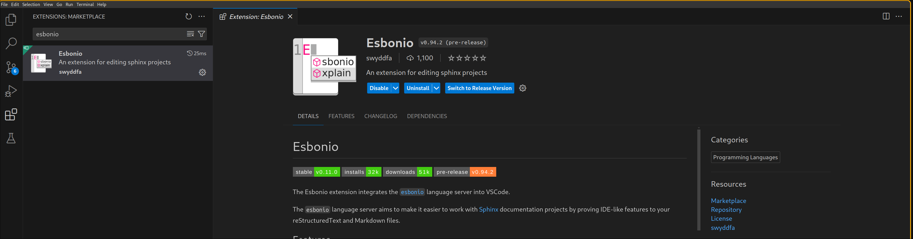
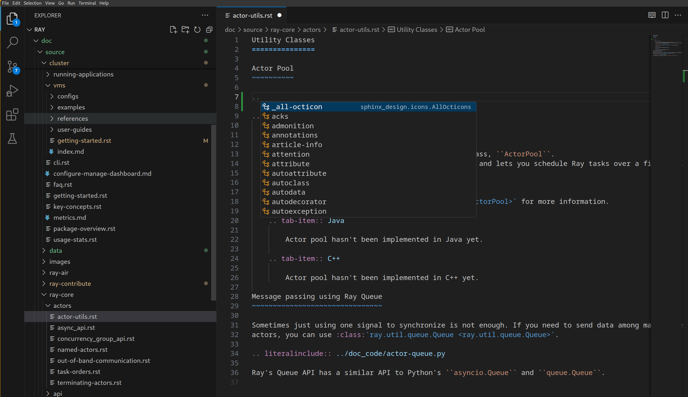
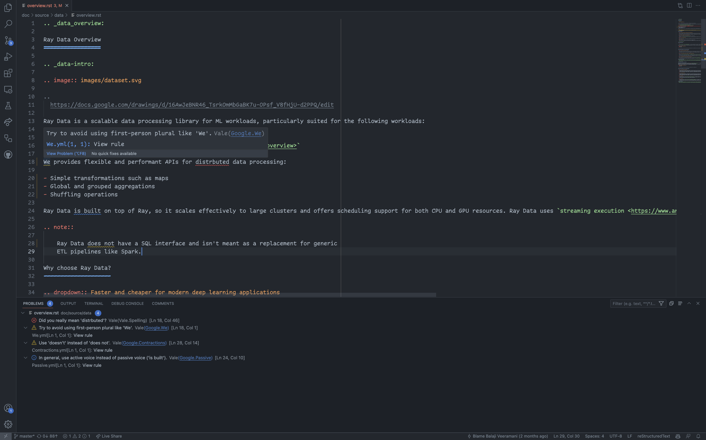

# Contributing to the Ray Documentation

There are many ways to contribute to the Ray documentation, and we're always looking for new contributors.
Even if you just want to fix a typo or expand on a section, please feel free to do so!

This document walks you through everything you need to do to get started.


## Editorial style

We follow the [Google developer documentation style guide](https://developers.google.com/style).
Here are some highlights:

* [Use present tense](https://developers.google.com/style/tense)
* [Use second person](https://developers.google.com/style/person)
* [Use contractions](https://developers.google.com/style/contractions)
* [Use active voice](https://developers.google.com/style/voice)
* [Use sentence case](https://developers.google.com/style/capitalization)

The editorial style is enforced in CI by Vale. For more information, see
[How to use Vale](vale).

## Building the Ray documentation

If you want to contribute to the Ray documentation, you need a way to build it.
Don't install Ray in the environment you plan to use to build documentation. The requirements for the docs build system are generally not compatible with those you need to run Ray itself.

Follow the these instructions to build the documentation:

### Fork Ray
1. [Fork the Ray repository](https://docs.ray.io/en/master/ray-contribute/development.html#fork-the-ray-repository)
2. [Clone the forked repository](https://docs.ray.io/en/master/ray-contribute/development.html#fork-the-ray-repository) to your local machine

Next, change into the `ray/doc` directory:

```shell
cd ray/doc
```

### Install dependencies

If you haven't done so already, create a Python environment separate from the one you use to build and run Ray, preferably using the latest version of Python. For example, if you're using `conda`:
```shell
conda create -n docs python=3.12
```
Next, activate the Python environment you are using (e.g., venv, conda, etc.). With `conda` this would be:
```shell
conda activate docs
```
Install the documentation dependencies with the following command:

```shell
pip install -r requirements-doc.txt
```

Don't use `-U` in this step. You don't want to upgrade dependencies because `requirements-doc.txt` pins exact versions you need to build the docs.

### Build documentation
Before building, clean your environment first by running:
```shell
make clean
```

Choose from the following 2 options to build documentation locally:

- Incremental build
- Full build

#### 1. Incremental build with global cache and live rendering

To use this option, you can run:
```shell
make local
```

This option is recommended if you need to make frequent uncomplicated and small changes like editing text, adding things within existing files, etc. 

In this approach, Sphinx only builds the changes you made in your branch compared to your last pull from upstream master. The rest of doc is cached with pre-built doc pages from your last commit from upstream (for every new commit pushed to Ray, CI builds all the documentation pages from that commit and store them on S3 as cache).

The build first traces your commit tree to find the latest commit that CI already cached on S3. 
Once the build finds the commit, it fetches the corresponding cache from S3 and extracts it into the `doc/` directory. Simultaneously, CI tracks all the files that have changed from that commit to current `HEAD`, including any un-staged changes.

Sphinx then rebuilds only the pages that your changes affect, leaving the rest untouched from the cache.

When build finishes, the doc page would automatically pop up on your browser. If any change is made in the `doc/` directory, Sphinx would automatically rebuild and reload your doc page. You can stop it by interrupting with `Ctrl+C`.

For more complicated changes that involve adding or removing files, always use `make develop` first, then you can start using `make local` afterwards to iterate on the cache that `make develop` produces.

#### 2. Full build from scratch
In the full build option, Sphinx rebuilds all files in `doc/` directory, ignoring all cache and saved environment.
Because of this behavior, you get a really clean build but it's much slower.

```shell
make develop
```

Find the documentation build in the `_build` directory.
After the build finishes, you can simply open the `_build/html/index.html` file in your browser.
It's considered good practice to check the output of your build to make sure everything is working as expected.

Before committing any changes, make sure you run the
[linter](https://docs.ray.io/en/latest/ray-contribute/getting-involved.html#lint-and-formatting)
with `../scripts/format.sh` from the `doc` folder,
to make sure your changes are formatted correctly.

### Code completion and other developer tooling

If you find yourself working with documentation often, you might find the [esbonio](https://github.com/swyddfa/esbonio) language server to be useful. Esbonio provides context-aware syntax completion, definitions, diagnostics, document links, and other information for RST documents. If you're unfamiliar with [language servers](https://en.wikipedia.org/wiki/Language_Server_Protocol), they are important pieces of a modern developer's toolkit; if you've used `pylance` or `python-lsp-server` before, you'll know how useful these tools can be.

Esbonio also provides a vscode extension which includes a live preview. Simply install the `esbonio` vscode extension to start using the tool:



As an example of Esbonio's autocompletion capabilities, you can type `..` to pull up an autocomplete menu for all RST directives:



Esbonio also can be used with neovim - [see the lspconfig repository for installation instructions](https://github.com/neovim/nvim-lspconfig/blob/master/doc/server_configurations.md#esbonio).


## The basics of our build system

The Ray documentation is built using the [`sphinx`](https://www.sphinx-doc.org/) build system.
We're using the [PyData Sphinx Theme](https://pydata-sphinx-theme.readthedocs.io/en/stable/) for the documentation.

We use [`myst-parser`](https://myst-parser.readthedocs.io/en/latest/) to allow you to write Ray documentation in either Sphinx's native
[reStructuredText (rST)](https://www.sphinx-doc.org/en/master/usage/restructuredtext/index.html) or in
[Markedly Structured Text (MyST)](https://myst-parser.readthedocs.io/en/latest/).
The two formats can be converted to each other, so the choice is up to you.
Having said that, it's important to know that MyST is
[common markdown compliant](https://myst-parser.readthedocs.io/en/latest/syntax/reference.html#commonmark-block-tokens). Past experience has shown that most developers are familiar with `md` syntax, so
if you intend to add a new document, we recommend starting from an `.md` file.

The Ray documentation also fully supports executable formats like [Jupyter Notebooks](https://jupyter.org/).
Many of our examples are notebooks with [MyST markdown cells](https://myst-nb.readthedocs.io/en/latest/index.html).

## What to contribute?

If you take Ray Tune as an example, you can see that our documentation is made up of several types of documentation,
all of which you can contribute to:

- [a project landing page](https://docs.ray.io/en/latest/tune/index.html),
- [a getting started guide](https://docs.ray.io/en/latest/tune/getting-started.html),
- [a key concepts page](https://docs.ray.io/en/latest/tune/key-concepts.html),
- [user guides for key features](https://docs.ray.io/en/latest/tune/tutorials/overview.html),
- [practical examples](https://docs.ray.io/en/latest/tune/examples/index.html),
- [a detailed FAQ](https://docs.ray.io/en/latest/tune/faq.html),
- [and API references](https://docs.ray.io/en/latest/tune/api/api.html).

This structure is reflected in the
[Ray documentation source code](https://github.com/ray-project/ray/tree/master/doc/source/tune) as well, so you
should have no problem finding what you're looking for.
All other Ray projects share a similar structure, but depending on the project there might be minor differences.

Each type of documentation listed above has its own purpose, but at the end our documentation
comes down to _two types_ of documents:

- Markup documents, written in MyST or rST. If you don't have a lot of (executable) code to contribute or
  use more complex features such as
  [tabbed content blocks](https://docs.ray.io/en/latest/ray-core/walkthrough.html#starting-ray), this is the right
  choice. Most of the documents in Ray Tune are written in this way, for instance the
  [key concepts](https://github.com/ray-project/ray/blob/master/doc/source/tune/key-concepts.rst) or
  [API documentation](https://github.com/ray-project/ray/blob/master/doc/source/tune/api/api.rst).
- Notebooks, written in `.ipynb` format. All Tune examples are written as notebooks. These notebooks render in
  the browser like `.md` or `.rst` files, but have the added benefit that users can easily run the code themselves.

## Fixing typos and improving explanations

If you spot a typo in any document, or think that an explanation is not clear enough, please consider
opening a pull request.
In this scenario, just run the linter as described above and submit your pull request.

## Adding API references

We use [Sphinx's autodoc extension](https://www.sphinx-doc.org/en/master/usage/extensions/autodoc.html) to generate
our API documentation from our source code.
In case we're missing a reference to a function or class, please consider adding it to the respective document in question.

For example, here's how you can add a function or class reference using `autofunction` and `autoclass`:

```markdown
.. autofunction:: ray.tune.integration.docker.DockerSyncer

.. autoclass:: ray.tune.integration.keras.TuneReportCallback
```

The above snippet was taken from the
[Tune API documentation](https://github.com/ray-project/ray/blob/master/doc/source/tune/api/integration.rst),
which you can look at for reference.

If you want to change the content of the API documentation, you will have to edit the respective function or class
signatures directly in the source code.
For example, in the above `autofunction` call, to change the API reference for `ray.tune.integration.docker.DockerSyncer`,
you would have to [change the following source file](https://github.com/ray-project/ray/blob/7f1bacc7dc9caf6d0ec042e39499bbf1d9a7d065/python/ray/tune/integration/docker.py#L15-L38).

To show the usage of APIs, it is important to have small usage examples embedded in the API documentation. These should be self-contained and run out of the box, so a user can copy and paste them into a Python interpreter and play around with them (e.g., if applicable, they should point to example data). Users often rely on these examples to build their applications. To learn more about writing examples, read [How to write code snippets](writing-code-snippets).

## Adding code to an `.rST` or `.md` file

Modifying text in an existing documentation file is easy, but you need to be careful when it comes to adding code.
The reason is that we want to ensure every code snippet on our documentation is tested.
This requires us to have a process for including and testing code snippets in documents. To learn how to write testable code
snippets, read [How to write code snippets](writing-code-snippets).

```python
from ray import train


def objective(x, a, b):  # Define an objective function.
    return a * (x ** 0.5) + b


def trainable(config):  # Pass a "config" dictionary into your trainable.

    for x in range(20):  # "Train" for 20 iterations and compute intermediate scores.
        score = objective(x, config["a"], config["b"])

        train.report({"score": score})  # Send the score to Tune.
```

This code is imported by `literalinclude` from a file called `doc_code/key_concepts.py`.
Every Python file in the `doc_code` directory will automatically get tested by our CI system,
but make sure to run scripts that you change (or new scripts) locally first.
You do not need to run the testing framework locally.

In rare situations, when you're adding _obvious_ pseudo-code to demonstrate a concept, it is ok to add it
literally into your `.rST` or `.md` file, e.g. using a `.. code-cell:: python` directive.
But if your code is supposed to run, it needs to be tested.

## Creating a new document from scratch

Sometimes you might want to add a completely new document to the Ray documentation, like adding a new
user guide or a new example.

For this to work, you need to make sure to add the new document explicitly to a parent document's toctree,
which determines the structure of the Ray documentation. See
[the sphinx documentation](https://www.sphinx-doc.org/en/master/usage/restructuredtext/directives.html#directive-toctree)
for more information.

Depending on the type of document you're adding, you might also have to make changes to an existing overview
page that curates the list of documents in question.
For instance, for Ray Tune each user guide is added to the
[user guide overview page](https://docs.ray.io/en/latest/tune/tutorials/overview.html) as a panel, and the same
goes for [all Tune examples](https://docs.ray.io/en/latest/tune/examples/index.html).
Always check the structure of the Ray sub-project whose documentation you're working on to see how to integrate
it within the existing structure.
In some cases you may be required to choose an image for the panel. Images are located in
`doc/source/images`.

## Creating a notebook example

To add a new executable example to the Ray documentation, you can start from our
[MyST notebook template](https://github.com/ray-project/ray/tree/master/doc/source/_templates/template.md) or
[Jupyter notebook template](https://github.com/ray-project/ray/tree/master/doc/source/_templates/template.ipynb).
You could also simply download the document you're reading right now (click on the respective download button at the
top of this page to get the `.ipynb` file) and start modifying it.
All the example notebooks in Ray Tune get automatically tested by our CI system, provided you place them in the
[`examples` folder](https://github.com/ray-project/ray/tree/master/doc/source/tune/examples).
If you have questions about how to test your notebook when contributing to other Ray sub-projects, please make
sure to ask a question in [the Ray community Slack](https://www.ray.io/join-slack) or directly on GitHub,
when opening your pull request.

To work off of an existing example, you could also have a look at the
[Ray Tune Hyperopt example (`.ipynb`)](https://github.com/ray-project/ray/blob/master/doc/source/tune/examples/hyperopt_example.ipynb)
or the [Ray Serve guide for text classification (`.md`)](https://github.com/ray-project/ray/blob/master/doc/source/serve/tutorials/text-classification.md).
We recommend that you start with an `.md` file and convert your file to an `.ipynb` notebook at the end of the process.
We'll walk you through this process below.

What makes these notebooks different from other documents is that they combine code and text in one document,
and can be launched in the browser.
We also make sure they are tested by our CI system, before we add them to our documentation.
To make this work, notebooks need to define a _kernel specification_ to tell a notebook server how to interpret
and run the code.
For instance, here's the kernel specification of a Python notebook:

```markdown
---
jupytext:
    text_representation:
        extension: .md
        format_name: myst
kernelspec:
    display_name: Python 3
    language: python
    name: python3
---
```

If you write a notebook in `.md` format, you need this YAML front matter at the top of the file.
To add code to your notebook, you can use the `code-cell` directive.
Here's an example:

````markdown
```python

import ray
import ray.rllib.agents.ppo as ppo
from ray import serve

def train_ppo_model():
    trainer = ppo.PPOTrainer(
        config={"framework": "torch", "num_workers": 0},
        env="CartPole-v0",
    )
    # Train for one iteration
    trainer.train()
    trainer.save("/tmp/rllib_checkpoint")
    return "/tmp/rllib_checkpoint/checkpoint_000001/checkpoint-1"


checkpoint_path = train_ppo_model()
```
````

Putting this markdown block into your document will render as follows in the browser:

```python
import ray
import ray.rllib.agents.ppo as ppo
from ray import serve

def train_ppo_model():
    trainer = ppo.PPOTrainer(
        config={"framework": "torch", "num_workers": 0},
        env="CartPole-v0",
    )
    # Train for one iteration
    trainer.train()
    trainer.save("/tmp/rllib_checkpoint")
    return "/tmp/rllib_checkpoint/checkpoint_000001/checkpoint-1"


checkpoint_path = train_ppo_model()
```

### Tags for your notebook

What makes this work is the `:tags: [hide-cell]` directive in the `code-cell`.
The reason we suggest starting with `.md` files is that it's much easier to add tags to them, as you've just seen.
You can also add tags to `.ipynb` files, but you'll need to start a notebook server for that first, which may
not want to do to contribute a piece of documentation.

Apart from `hide-cell`, you also have `hide-input` and `hide-output` tags that hide the input and output of a cell.
Also, if you need code that gets executed in the notebook, but you don't want to show it in the documentation,
you can use the `remove-cell`, `remove-input`, and `remove-output` tags in the same way.

### Reference section labels

[Reference sections labels](https://jupyterbook.org/en/stable/content/references.html#reference-section-labels) are a way to link to specific parts of the documentation from within a notebook. Creating one inside a markdown cell is simple:

```markdown
(my-label)=
# The thing to label
```

Then, you can link it in .rst files with the following syntax:

```rst
See {ref}`the thing that I labeled <my-label>` for more information.
```

### Testing notebooks

Removing cells can be particularly interesting for compute-intensive notebooks.
We want you to contribute notebooks that use _realistic_ values, not just toy examples.
At the same time we want our notebooks to be tested by our CI system, and running them should not take too long.
What you can do to address this is to have notebook cells with the parameters you want the users to see first:

````markdown
```{code-cell} python3
num_workers = 8
num_gpus = 2
```
````

which will render as follows in the browser:

```python
num_workers = 8
num_gpus = 2
```

But then in your notebook you follow that up with a _removed_ cell that won't get rendered, but has much smaller
values and make the notebook run faster:

````markdown
```{code-cell} python3
:tags: [remove-cell]
num_workers = 0
num_gpus = 0
```
````

### Converting markdown notebooks to ipynb

Once you're finished writing your example, you can convert it to an `.ipynb` notebook using `jupytext`:

```shell
jupytext your-example.md --to ipynb
```

In the same way, you can convert `.ipynb` notebooks to `.md` notebooks with `--to myst`.
And if you want to convert your notebook to a Python file, e.g. to test if your whole script runs without errors,
you can use `--to py` instead.

(vale)=

## How to use Vale
### What is Vale?

[Vale](https://vale.sh/) checks if your writing adheres to the
[Google developer documentation style guide](https://developers.google.com/style).
It's only enforced on the Ray Data documentation.

Vale catches typos and grammatical errors. It also enforces stylistic rules like
“use contractions” and “use second person.” For the full list of rules, see the
[configuration in the Ray repository](https://github.com/ray-project/ray/tree/master/.vale/styles/Google).

### How do you run Vale?

#### How to use the VSCode extension

1. Install Vale. If you use macOS, use Homebrew.

    ```bash
    brew install vale
    ```

    Otherwise, use PyPI.

    ```bash
    pip install vale
    ```

    For more information on installation, see the [Vale documentation](https://vale.sh/docs/vale-cli/installation/).

2. Install the Vale VSCode extension by following these
[installation instructions](https://marketplace.visualstudio.com/items?itemName=ChrisChinchilla.vale-vscode).

3. VSCode should show warnings in your code editor and in the “Problems” panel.

    

#### How to run Vale on the command-line

1. Install Vale. If you use macOS, use Homebrew.

    ```bash
    brew install vale
    ```

    Otherwise, use PyPI.

    ```bash
    pip install vale
    ```

    For more information on installation, see the [Vale documentation](https://vale.sh/docs/vale-cli/installation/).

2. Run Vale in your terminal

    ```bash
    vale doc/source/data/overview.rst
    ```

3. Vale should show warnings in your terminal.

    ```
    ❯ vale doc/source/data/overview.rst

        doc/source/data/overview.rst
        18:1   warning     Try to avoid using              Google.We
                        first-person plural like 'We'.
        18:46  error       Did you really mean             Vale.Spelling
                        'distrbuted'?
        24:10  suggestion  In general, use active voice    Google.Passive
                        instead of passive voice ('is
                        built').
        28:14  warning     Use 'doesn't' instead of 'does  Google.Contractions
                        not'.

    ✖ 1 error, 2 warnings and 1 suggestion in 1 file.
    ```


### How to handle false Vale.Spelling errors

To add custom terminology, complete the following steps:

1. If it doesn’t already exist, create a directory for your team in
`.vale/styles/Vocab`. For example, `.vale/styles/Vocab/Data`.
2. If it doesn’t already exist, create a text file named `accept.txt`. For example,
`.vale/styles/Vocab/Data/accept.txt`.
3. Add your term to `accept.txt`. Vale accepts Regex.

For more information, see [Vocabularies](https://vale.sh/docs/topics/vocab/) in the Vale
documentation.

### How to handle false Google.WordList errors

Vale errors if you use a word that isn't on [Google's word list](https://developers.google.com/style/word-list).

```
 304:52   error       Use 'select' instead of         Google.WordList
                      'check'.
```

If you want to use the word anyway, modify the appropriate field in the [WordList configuration](https://github.com/ray-project/ray/blob/81c169bde2414fe4237f3d2f05fc76fccfd52dee/.vale/styles/Google/WordList.yml#L41).

## Troubleshooting

If you run into a problem building the docs, following these steps can help isolate or eliminate most issues:

1. **Clean out build artifacts.** Use `make clean` to clean out docs build artifacts in the working directory. Sphinx uses caching to avoid doing work, and this sometimes causes problems. This is particularly true if you build the docs, then `git pull origin master` to pull in recent changes, and then try to build docs again.
2. **Check your environment.** Use `pip list` to check the installed dependencies. Compare them to `doc/requirements-doc.txt`. The documentation build system doesn't have the same dependency requirements as Ray. You don't need to run ML models or execute code on distributed systems in order to build the docs. In fact, it's best to use a completely separate docs build environment from the environment you use to run Ray to avoid dependency conflicts.  When installing requirements, do `pip install -r doc/requirements-doc.txt`. Don't use `-U` because you don't want to upgrade any dependencies during the installation.
3. **Ensure a modern version of Python.** The docs build system doesn't keep the same dependency and Python version requirements as Ray. Use a modern version of Python when building docs. Newer versions of Python can be substantially faster than preceding versions. Consult <https://endoflife.date/python> for the latest version support information.
4. **Enable breakpoints in Sphinx**. Add -P to the `SPHINXOPTS` in `doc/Makefile` to tell `sphinx` to stop when it encounters a breakpoint, and remove `-j auto` to disable parallel builds. Now you can put breakpoints in the modules you're trying to import, or in `sphinx` code itself, which can help isolate build stubborn build issues.
5. **[Incremental build] Side navigation bar doesn't reflect new pages** If you are adding new pages, they should always show up in the side navigation bar on index pages. However, incremental builds with `make local` skips rebuilding many other pages, so Sphinx doesn't update the side navigation bar on those pages. To build docs with correct side navigation bar on all pages, consider using `make develop`.

## Where to go from here?

There are many other ways to contribute to Ray other than documentation.
See [our contributor guide](./getting-involved.rst) for more information.
