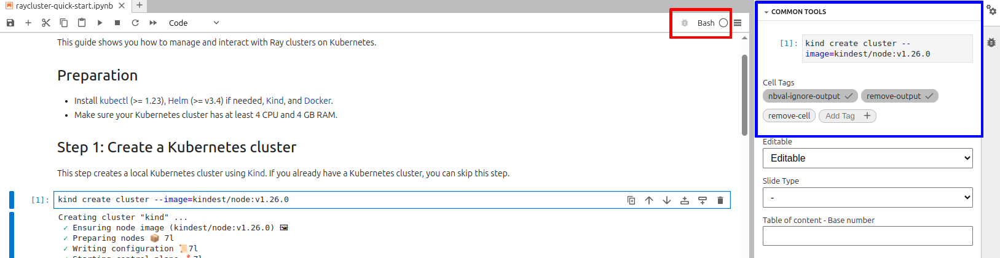
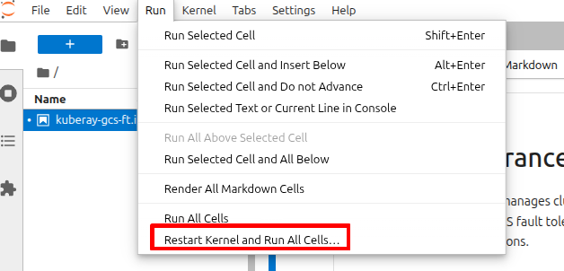

# How to write KubeRay doctests

KubeRay doctests require you to write the doc using a Jupyter notebook with the Bash kernel.

## Prerequisites

```shell
pip install pytest nbval bash_kernel jupyterlab
python -m bash_kernel.install
```

## Writing docs

```shell
cd doc/source/cluster/kubernetes
jupyter lab
```



Write the doc using a Jupyter notebook. Make sure you select the Bash kernel (red box in the preceding image).

While editing code blocks, use the "Common Tools" side panel to manage tags (blue box in the preceding image).

Some tags control whether the code block appears in the final document. See [this doc](jupyter-notebook-tags) for details.

Other tags control whether the code block runs during the doctest. See [nbval documentation][nbval-doc] for details.

For example, the `kind create cluster` code block in the image above uses the `nbval-ignore-output` and `remove-output` tags. `remove-output` hides the block's output in the final document. `nbval-ignore-output` skips output validation during the doctest run.

Before exiting Jupyter Lab, use "Restart Kernel and Run All Cells..." to re-run all cells. The output gets saved in the notebook file and will be compared with the output when running the doctest. Don't forget to save the notebook file.



```{eval-rst}
.. note::

   Limitations: You cannot use ``tab-set`` containing code blocks in Jupyter notebooks.
```

## Running doctests locally

Run this command to execute the doctests. Replace `getting-started/raycluster-quick-start.ipynb` with the path to the notebook file you want to test.

```shell
py.test --nbval getting-started/raycluster-quick-start.ipynb --nbval-kernel-name bash --sanitize-with doc_sanitize.cfg
```

The `doc/source/cluster/kubernetes/doc_sanitize.cfg` file lists patterns to replace in the code block output before comparing it with the saved output. This helps when the output includes dynamic values like timestamps. If the output changes each time you run the doctest, add the relevant patterns to this file.

## Running doctests in CI

Add the notebook filename to the `ci/k8s/run-kuberay-doc-tests.sh` file.

## References

- [nbval documentation][nbval-doc]

[nbval-doc]: https://nbval.readthedocs.io/en/latest/
