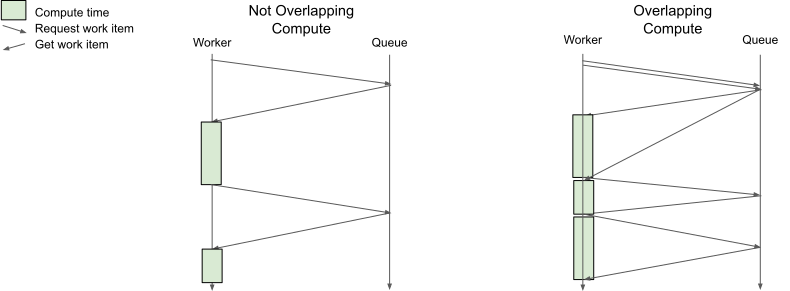

Pattern: Overlapping computation and communication
==================================================

Sometimes a component of your application will need to do both compute-intensive work and communicate with other processes. Ideally, you want to overlap computation and communication to minimize the time spent not doing compute-intensive work.

If you block waiting for remote tasks to return, that blocking process will be idle, thereby likely reducing the overall throughput of the system.

Notes
-----
There are some cases where this behavior is not desirable. For example:
- If computing a work item takes much longer than the RTT time in the system, this is unlikely to have significant benefits.
- If the time to compute each task (or work item in this example) is highly variable, you may increase the latency for small tasks by blocking them behind large ones.

Code example
------------

In the example below, a worker actor pulls work off of a queue and then does some computation on it. In the “bad” code example, we call ray.get() immediately after requesting a work item, so we block while that RPC is in flight, causing idle CPU time. In the corrected example, we instead preemptively request the next work item before processing the current one, so we can use the CPU while the RPC is in flight.

.. code-block:: python

    # Bad: No overlapping of computation with communication.
    @ray.remote
    class Worker:
        def __init__(self, work_queue):
            self.work_queue = work_queue

        def run(self):
            while True:
                # Get work from the queue.
                work_item = ray.get(self.work_queue.get_work_item.remote())

                # Do work.
                self.process(work_item)

    # Good: Overlapping computation with communication.
    @ray.remote
    class Worker:
        def __init__(self, work_queue):
            self.work_queue = work_queue

        def run(self):
            self.work_future = self.work_queue.get_work_item.remote()
            while True:
                # Get work from the queue.
                work_item = ray.get(self.work_future)
                self.work_future = self.work_queue.get_work_item.remote()

                # Do work.
                self.process(work_item)

    Overlapping computation with communication

On the left we have the first code example where we synchronously call ``ray.get(get_work_item.remote())`` to get a new work item to process. Because we have to wait for the RPC to return the next item, we have idle periods where we are not performing computation (represented as gaps in the green boxes).

On the right, we overlap the communication and computation by spawning a task to fetch the next work item as we work on the current one. This allows us to more efficiently use the CPU because we don’t have idle periods waiting for RPCs to return.
