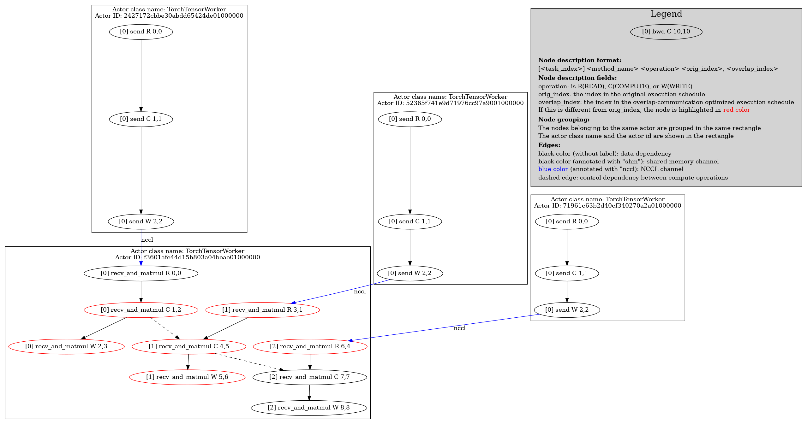

Overlap Communication and Computation
======================================

Compiled Graph currently provides experimental support for GPU communication and computation overlap. When turning
on this feature, it automatically overlaps the GPU communication with computation operations, therefore
can hide the communication overhead and improve performance.

To enable this feature, specify ``_overlap_gpu_communication=True`` when calling ``dag.experimental_compile()``.

The following code has GPU communication and computation operations that benefit
from overlap.

.. testcode::

    import ray
    import time
    import torch
    from ray.dag import InputNode, MultiOutputNode
    from ray.experimental.channel.torch_tensor_type import TorchTensorType
    from ray.air._internal import torch_utils

    @ray.remote(num_cpus=0, num_gpus=1)
    class TorchTensorWorker:
        def __init__(self):
            self.device = torch_utils.get_devices()[0]

        def send(self, shape, dtype, value: int, send_tensor=True):
            if not send_tensor:
                return 1
            return torch.ones(shape, dtype=dtype, device=self.device) * value

        def recv_and_matmul(self, two_d_tensor):
            """
            Receive the tensor and do some expensive computation (matmul).

            Args:
                two_d_tensor: a 2D tensor that has the same size for its dimensions
            """
            # Check that tensor got loaded to the correct device.
            assert two_d_tensor.dim() == 2
            assert two_d_tensor.size(0) == two_d_tensor.size(1)
            assert two_d_tensor.device == self.device
            torch.matmul(two_d_tensor, two_d_tensor)
            return (two_d_tensor[0][0].item(), two_d_tensor.shape, two_d_tensor.dtype)
            
    def test(overlap_gpu_communication):
        num_senders = 3
        senders = [TorchTensorWorker.remote() for _ in range(num_senders)]
        receiver = TorchTensorWorker.remote()

        shape = (10000, 10000)
        dtype = torch.float16

        with InputNode() as inp:
            branches = [sender.send.bind(shape, dtype, inp) for sender in senders]
            branches = [
                branch.with_type_hint(
                    TorchTensorType(
                        transport="nccl", _static_shape=True, _direct_return=True
                    )
                )
                for branch in branches
            ]
            branches = [receiver.recv_and_matmul.bind(branch) for branch in branches]
            dag = MultiOutputNode(branches)

        compiled_dag = dag.experimental_compile(
            _overlap_gpu_communication=overlap_gpu_communication
        )

        start = time.monotonic()
        for i in range(5):
            ref = compiled_dag.execute(i)
            result = ray.get(ref)
            assert result == [(i, shape, dtype)] * num_senders
        duration = time.monotonic() - start
        print(f"{overlap_gpu_communication=}, {duration=}")

    if __name__ == "__main__":
        for overlap_gpu_communication in [False, True]:
            test(overlap_gpu_communication)

The output of preceding code includes the following two lines (with somewhat different duration values):

.. testoutput::

    overlap_gpu_communication=False, duration=1.0670117866247892
    overlap_gpu_communication=True, duration=0.9211348341777921

This indicates a 14% performance improvement when enabling ``_overlap_gpu_communication``.

To verify Compiled Graph overlaps the communication and computation operations,
`visualize the execution schedule <execution-schedule>` by setting environment variable
``RAY_CGRAPH_VISUALIZE_SCHEDULE=1``.

Red nodes denote the operations that have different execution order in the optimized schedule
compared to the original order, due to enabling overlap of communication and computation.
