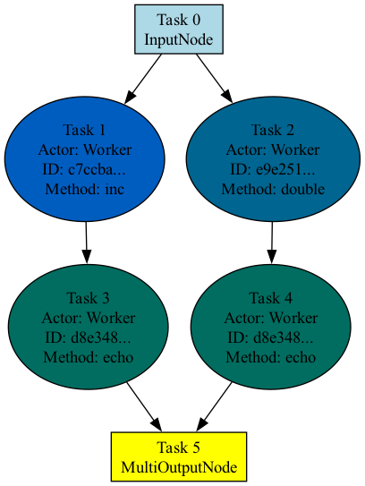

Profiling
=========

Ray Compiled Graph provides both PyTorch-based and Nsight-based profiling functionalities to better understand the performance
of individual tasks, systems overhead, and performance bottlenecks. You can pick your favorite profiler based on your preference.

PyTorch profiler
----------------

To run PyTorch Profiling on Compiled Graph, simply set the environment variable ``RAY_CGRAPH_ENABLE_TORCH_PROFILING=1``
when running the script. For example, for a Compiled Graph script in ``example.py``, run the following command:

.. testcode::

    RAY_CGRAPH_ENABLE_TORCH_PROFILING=1 python3 example.py

After execution, Compiled Graph generates the profiling results in the `compiled_graph_torch_profiles` directory
under the current working directory. Compiled Graph generates one trace file per actor.

You can visualize traces by using https://ui.perfetto.dev/.

Nsight system profiler
----------------------

Compiled Graph builds on top of Ray's profiling capabilities, and leverages Nsight
system profiling. 

To run Nsight Profiling on Compiled Graph, specify the runtime_env for the involved actors
as described in :ref:`Run Nsight on Ray <run-nsight-on-ray>`. For example,

.. literalinclude:: ../doc_code/cgraph_profiling.py
    :language: python
    :start-after: __profiling_setup_start__
    :end-before: __profiling_setup_end__

Then, create a Compiled Graph as usual.

.. literalinclude:: ../doc_code/cgraph_profiling.py
    :language: python
    :start-after: __profiling_execution_start__
    :end-before: __profiling_execution_end__

Finally, run the script as usual.

.. testcode::

    python3 example.py

After execution, Compiled Graph generates the profiling results under the `/tmp/ray/session_*/logs/{profiler_name}`
directory.

For fine-grained performance analysis of method calls and system overhead, set the environment variable
``RAY_CGRAPH_ENABLE_NVTX_PROFILING=1`` when running the script:

.. testcode::

    RAY_CGRAPH_ENABLE_NVTX_PROFILING=1 python3 example.py

This command leverages the `NVTX library <https://nvtx.readthedocs.io/en/latest/index.html#>`_ under the hood to automatically
annotate all methods called in the execution loops of compiled graph.

To visualize the profiling results, follow the same instructions as described in 
:ref:`Nsight Profiling Result <profiling-result>`.

Visualization
-------------
To visualize the graph structure, call the :func:`visualize <ray.dag.compiled_dag_node.CompiledDAG.visualize>` method after calling :func:`experimental_compile <ray.dag.DAGNode.experimental_compile>`
on the graph.

.. literalinclude:: ../doc_code/cgraph_visualize.py
    :language: python
    :start-after: __cgraph_visualize_start__
    :end-before: __cgraph_visualize_end__

By default, Ray generates a PNG image named ``compiled_graph.png`` and saves it in the current working directory.
Note that this requires ``graphviz``.

The following image shows the visualization for the preceding code.
Tasks that belong to the same actor are the same color.

