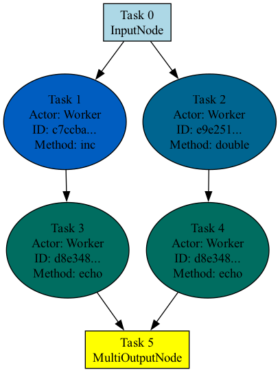

Profiling
=========

Ray Compiled Graph provides profiling functionalities to better understand the performance
of individual tasks, systems overhead, and performance bottlenecks.

Nsight system profiler
----------------------

Compiled Graph build on top of Ray's profiling capabilities, and leverage Nsight
system profiling. 

To run Nsight Profiling on Compiled Graph, specify the runtime_env for the involved actors
as described in :ref:`Run Nsight on Ray <run-nsight-on-ray>`.

After execution, Compiled Graph generates the profiling results under the `/tmp/ray/session_*/logs/{profiler_name}`
directory.

For fine-grained performance analysis of method calls and system overhead, set the environment variable
``RAY_CGRAPH_ENABLE_NVTX_PROFILING=1`` when running the script. For example, for a Compiled Graph script
in ``example.py``, run the following command:

.. testcode::

    RAY_CGRAPH_ENABLE_NVTX_PROFILING=1 python3 example.py

This command leverages the `NVTX library <https://nvtx.readthedocs.io/en/latest/index.html#>`_ to automatically
annotate all methods called in the execution loops of compiled graph.

To visualize the profiling results, follow the same instructions as described in 
:ref:`Nsight Profiling Result <profiling-result>`.

Visualization
-------------
To visualize the graph structure, call the :func:`visualize <ray.dag.compiled_dag_node.CompiledDAG.visualize>` method after calling :func:`experimental_compile <ray.dag.DAGNode.experimental_compile>`
on the graph.

.. literalinclude:: doc_code/cgraph_visualize.py
    :language: python
    :start-after: __cgraph_visualize_start__
    :end-before: __cgraph_visualize_end__

By default, Ray generates a PNG image named ``compiled_graph.png`` and saves it in the current working directory.
Note that this requires ``graphviz``.

The visualization for the preceding code is shown below.
Tasks of the same actor are shown in the same color.

