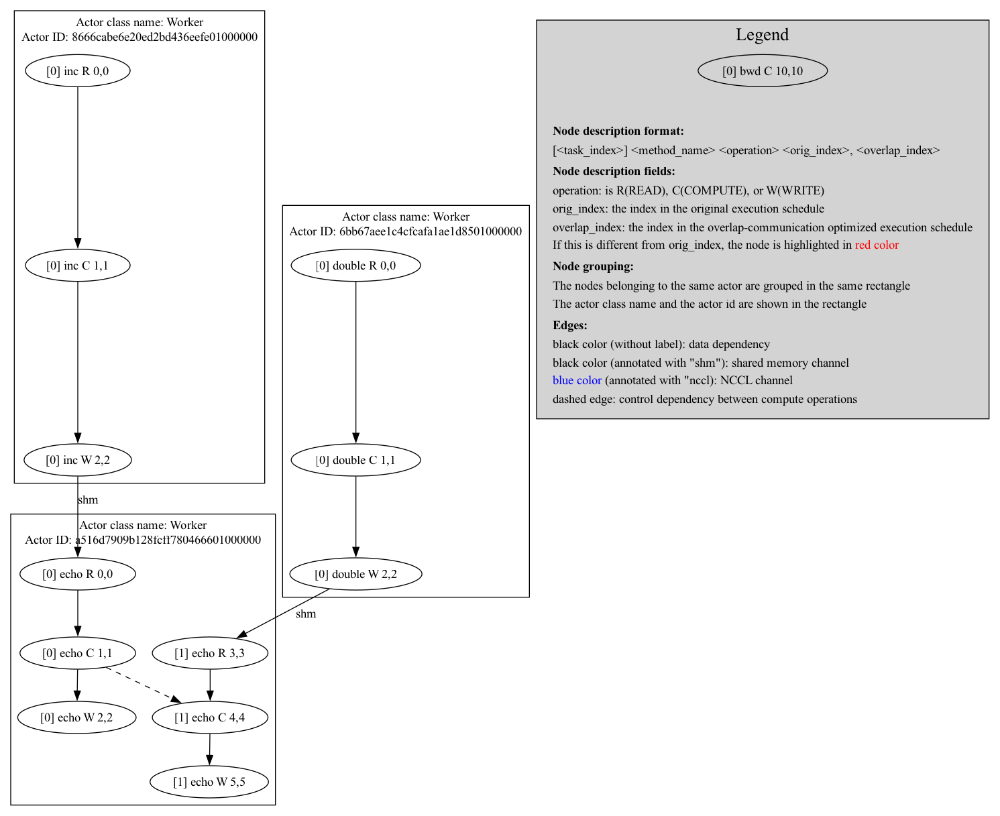

Visualization
=============

Ray Compiled Graph provides visualization functionalities to help users with development and debugging.

Graph Structure
---------------

To visualize the graph structure, users can call the ``visualize`` method after calling ``experimental_compile``
on the DAG.

.. testcode::

    import ray
    from ray.dag import InputNode

    @ray.remote
    class Actor:
        def inc_and_send(self, x):
            return x + 1

        def double_and_send(self, x):
            return x * 2

        def echo(self, x):
            return x

    sender1 = Actor.remote()
    sender2 = Actor.remote()
    receiver = Actor.remote()

    # Test normal execution.
    with InputNode() as inp:
        w1 = sender1.inc_and_send.bind(inp)
        w1 = receiver.echo.bind(w1)
        w2 = sender2.double_and_send.bind(inp)
        w2 = receiver.echo.bind(w2)
        dag = MultiOutputNode([w1, w2])

    compiled_dag = dag.experimental_compile()
    compiled_dag.visualize()

By default, a PNG image named ``compiled_graph.png`` is generated and saved in the current working directory.
Note that this requires ``pydot`` to be installed.

The example visualization of the above code is shown below:

.. image:: ../../images/compiled_graph.png
    :alt: Visualization of Graph Structure
    :align: center

Execution Schedule
------------------

Compiled Graph generates an execution schedule for each of the participating actors. This is very useful information
to understand how the graph is executed at runtime.

To visualize the execution schedule, users can set the environment variable ``RAY_CGRAPH_VISUALIZE_SCHEDULE=1``.
And when ``experimental_compile`` is called, a PNG image named ``compiled_graph_schedule.png`` is generated and
saved in the current working directory. The example visualization of the same code is shown below:

