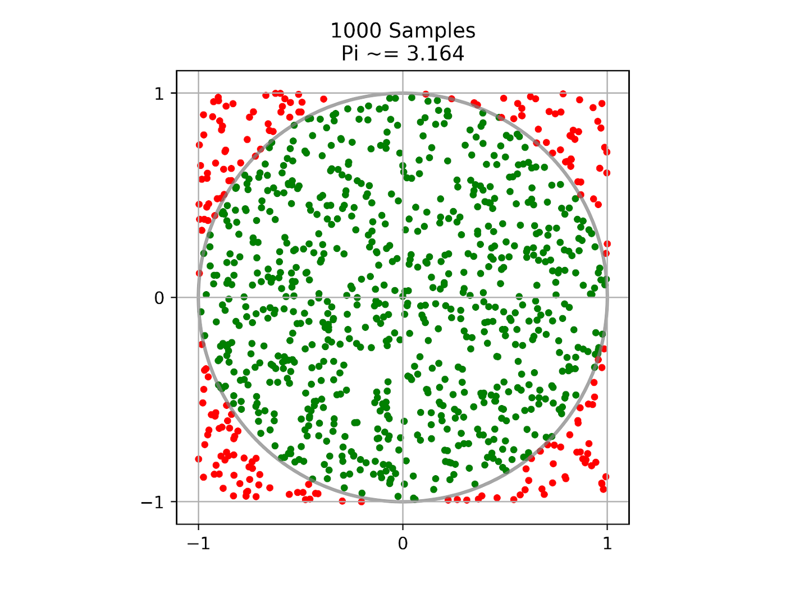

.. _monte-carlo-pi:

Monte Carlo Estimation of π
===========================

.. raw:: html

    <a id="try-anyscale-quickstart-monte_carlo_pi" target="_blank" href="https://console.anyscale.com/register/ha?render_flow=ray&utm_source=ray_docs&utm_medium=docs&utm_campaign=monte_carlo_pi">
      
        
    </a>

This tutorial shows you how to estimate the value of π using a `Monte Carlo method <https://en.wikipedia.org/wiki/Monte_Carlo_method>`_
that works by randomly sampling points within a 2x2 square.
The proportion of the points that are contained within the unit circle centered at the origin
is used to estimate the ratio of the area of the circle to the area of the square.
Given that the true ratio is π/4, multiply the estimated ratio by 4 to approximate the value of π.
The more points sampled to calculate this approximation, the closer the value should be to the true value of π.

Ray :ref:`tasks <ray-remote-functions>` distribute the work of sampling and Ray :ref:`actors <ray-remote-classes>` track the progress of these distributed sampling tasks.
The code can run on your laptop and can be easily scaled to large :ref:`clusters <cluster-index>` to increase the accuracy of the estimate.

To get started, install Ray through ``pip install -U ray``. See :ref:`Installing Ray <installation>` for more installation options.

Starting Ray
------------
First, include all modules needed for this tutorial and start a local Ray cluster with :func:`ray.init() <ray.init>`:

.. literalinclude:: ../doc_code/monte_carlo_pi.py
    :language: python
    :start-after: __starting_ray_start__
    :end-before: __starting_ray_end__

Defining the Progress Actor
---------------------------
Next, define a Ray actor that can be called by sampling tasks to update progress.
Ray actors are essentially stateful services that anyone with an instance (a handle) of the actor can call its methods.

.. literalinclude:: ../doc_code/monte_carlo_pi.py
    :language: python
    :start-after: __defining_actor_start__
    :end-before: __defining_actor_end__

A Ray actor is defined by decorating a normal Python class with :func:`ray.remote <ray.remote>`.
The progress actor has ``report_progress()`` method that's called by sampling tasks to update their progress individually
and ``get_progress()`` method to get the overall progress.

Defining the Sampling Task
--------------------------
After the actor is defined, define a Ray task that does the sampling up to ``num_samples`` and returns the number of samples that are inside the circle.
Ray tasks are stateless functions. They execute asynchronously, and run in parallel.

.. literalinclude:: ../doc_code/monte_carlo_pi.py
    :language: python
    :start-after: __defining_task_start__
    :end-before: __defining_task_end__

To convert a normal Python function as a Ray task, decorate the function with :func:`ray.remote <ray.remote>`.
The sampling task takes a progress actor handle as an input and reports progress to it.
The preceding code shows an example of calling actor methods from tasks.

Creating a Progress Actor
-------------------------
Once the actor is defined, create an instance of it.

.. literalinclude:: ../doc_code/monte_carlo_pi.py
    :language: python
    :start-after: __creating_actor_start__
    :end-before: __creating_actor_end__

To create an instance of the progress actor, simply call ``ActorClass.remote()`` method with arguments to the constructor.
This creates and runs the actor on a remote worker process.
The return value of ``ActorClass.remote(...)`` is an actor handle that can be used to call its methods.

Executing Sampling Tasks
------------------------
Now the task is defined, execute it asynchronously.

.. literalinclude:: ../doc_code/monte_carlo_pi.py
    :language: python
    :start-after: __executing_task_start__
    :end-before: __executing_task_end__

Execute the sampling task by calling ``remote()`` method with arguments to the function.
This immediately returns an ``ObjectRef`` as a future
and then executes the function asynchronously on a remote worker process.

Calling the Progress Actor
--------------------------
While sampling tasks are running, periodically query the progress by calling the actor ``get_progress()`` method.

.. literalinclude:: ../doc_code/monte_carlo_pi.py
    :language: python
    :start-after: __calling_actor_start__
    :end-before: __calling_actor_end__

To call an actor method, use ``actor_handle.method.remote()``.
This invocation immediately returns an ``ObjectRef`` as a future
and then executes the method asynchronously on the remote actor process.
To fetch the actual returned value of ``ObjectRef``, use the blocking :func:`ray.get() <ray.get>`.

Calculating π
-------------
Finally, get number of samples inside the circle from the remote sampling tasks and calculate π.

.. literalinclude:: ../doc_code/monte_carlo_pi.py
    :language: python
    :start-after: __calculating_pi_start__
    :end-before: __calculating_pi_end__

As shown in the preceding code, besides a single ``ObjectRef``, :func:`ray.get() <ray.get>` can also take a list of ``ObjectRef`` and return a list of results.

If you run this tutorial, you see output like:

.. code-block:: text

 Progress: 0%
 Progress: 15%
 Progress: 28%
 Progress: 40%
 Progress: 50%
 Progress: 60%
 Progress: 70%
 Progress: 80%
 Progress: 90%
 Progress: 100%
 Estimated value of π is: 3.1412202
