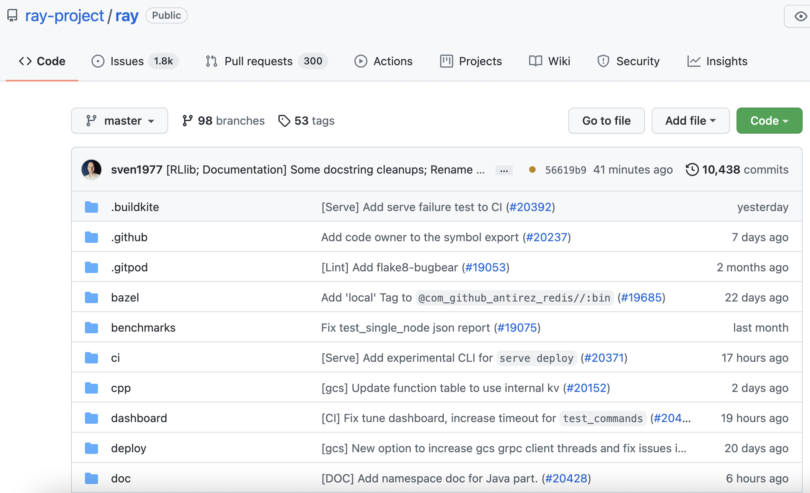
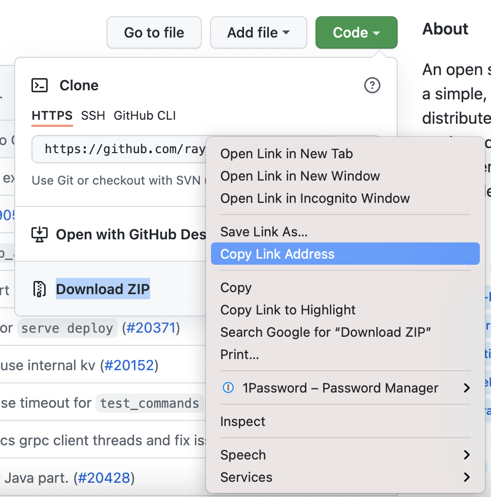

.. _handling_dependencies:

Environment Dependencies
========================

Your Ray application may have dependencies that exist outside of your Ray script. For example:

* Your Ray script may import/depend on some Python packages.
* Your Ray script may be looking for some specific environment variables to be available.
* Your Ray script may import some files outside of the script.

One frequent problem when running on a cluster is that Ray expects these "dependencies" to exist on each Ray node. If these are not present, you may run into issues such as ``ModuleNotFoundError``, ``FileNotFoundError`` and so on.

To address this problem, you can (1) prepare your dependencies on the cluster in advance (e.g. using a container image) using the Ray :ref:`Cluster Launcher <vm-cluster-quick-start>`, or (2) use Ray's :ref:`runtime environments <runtime-environments>` to install them on the fly.

For production usage or non-changing environments, we recommend installing your dependencies into a container image and specifying the image using the Cluster Launcher.
For dynamic environments (e.g. for development and experimentation), we recommend using runtime environments.

Concepts
--------

- **Ray Application**.  A program including a Ray script that calls ``ray.init()`` and uses Ray tasks or actors.

- **Dependencies**, or **Environment**.  Anything outside of the Ray script that your application needs to run, including files, packages, and environment variables.

- **Files**. Code files, data files or other files that your Ray application needs to run.

- **Packages**. External libraries or executables required by your Ray application, often installed via ``pip`` or ``conda``.

- **Local machine** and **Cluster**.  Usually, you may want to separate the Ray cluster compute machines/pods from the machine/pod that handles and submits the application. You can submit a Ray Job via :ref:`the Ray Job Submission mechanism <jobs-overview>`, or use `ray attach` to connect to a cluster interactively. We call the machine submitting the job your *local machine*.

- **Job**. A :ref:`Ray job <cluster-clients-and-jobs>` is a single application: it is the collection of Ray tasks, objects, and actors that originate from the same script.

.. _using-the-cluster-launcher:

Preparing an environment using the Ray Cluster launcher
-------------------------------------------------------

The first way to set up dependencies is to is to prepare a single environment across the cluster before starting the Ray runtime.

- You can build all your files and dependencies into a container image and specify this in your your :ref:`Cluster YAML Configuration <cluster-config>`.

- You can also install packages using ``setup_commands`` in the Ray Cluster configuration file (:ref:`reference <cluster-configuration-setup-commands>`); these commands will be run as each node joins the cluster.
  Note that for production settings, it is recommended to build any necessary packages into a container image instead.

- You can push local files to the cluster using ``ray rsync_up`` (:ref:`reference<ray-rsync>`).

.. _runtime-environments:

Runtime environments
--------------------

.. note::

    This feature requires a full installation of Ray using ``pip install "ray[default]"``. This feature is available starting with Ray 1.4.0 and is currently supported on macOS and Linux, with beta support on Windows.

The second way to set up dependencies is to install them dynamically while Ray is running.

A **runtime environment** describes the dependencies your Ray application needs to run, including :ref:`files, packages, environment variables, and more <runtime-environments-api-ref>`.
It is installed dynamically on the cluster at runtime and cached for future use (see :ref:`Caching and Garbage Collection <runtime-environments-caching>` for details about the lifecycle).

Runtime environments can be used on top of the prepared environment from :ref:`the Ray Cluster launcher <using-the-cluster-launcher>` if it was used.
For example, you can use the Cluster launcher to install a base set of packages, and then use runtime environments to install additional packages.
In contrast with the base cluster environment, a runtime environment will only be active for Ray processes.  (For example, if using a runtime environment specifying a ``pip`` package ``my_pkg``, the statement ``import my_pkg`` will fail if called outside of a Ray task, actor, or job.)

Runtime environments also allow you to set dependencies per-task, per-actor, and per-job on a long-running Ray cluster.

..
  TODO(architkulkarni): run working_dir doc example in CI

.. code-block:: python

    import ray
    import requests

    runtime_env = {"working_dir": "/data/my_files", "pip": ["requests", "pendulum==2.1.2"]}

    ray.init(runtime_env=runtime_env)

    @ray.remote
    def f():
      open("my_datafile.txt").read()
      return requests.get("https://www.ray.io")

A runtime environment can be described by a Python `dict`:

.. literalinclude:: /ray-core/doc_code/runtime_env_example.py
   :language: python
   :start-after: __runtime_env_pip_def_start__
   :end-before: __runtime_env_pip_def_end__

Alternatively, you can use :class:`ray.runtime_env.RuntimeEnv <ray.runtime_env.RuntimeEnv>`:

.. literalinclude:: /ray-core/doc_code/runtime_env_example.py
   :language: python
   :start-after: __strong_typed_api_runtime_env_pip_def_start__
   :end-before: __strong_typed_api_runtime_env_pip_def_end__

For more examples, jump to the :ref:`API Reference <runtime-environments-api-ref>`.

There are two primary scopes for which you can specify a runtime environment:

* :ref:`Per-Job <rte-per-job>`, and
* :ref:`Per-Task/Actor, within a job <rte-per-task-actor>`.

.. _rte-per-job:

Specifying a Runtime Environment Per-Job
^^^^^^^^^^^^^^^^^^^^^^^^^^^^^^^^^^^^^^^^

You can specify a runtime environment for your whole job, whether running a script directly on the cluster, using the :ref:`Ray Jobs API <jobs-overview>`:

.. literalinclude:: /ray-core/doc_code/runtime_env_example.py
   :language: python
   :start-after: __ray_init_start__
   :end-before: __ray_init_end__

.. code-block:: python

    # Option 2: Using Ray Jobs API (Python SDK)
    from ray.job_submission import JobSubmissionClient

    client = JobSubmissionClient("http://<head-node-ip>:8265")
    job_id = client.submit_job(
        entrypoint="python my_ray_script.py",
        runtime_env=runtime_env,
    )

.. code-block:: bash
    
    # Option 3: Using Ray Jobs API (CLI). (Note: can use --runtime-env to pass a YAML file instead of an inline JSON string.)
    $ ray job submit --address="http://<head-node-ip>:8265" --runtime-env-json='{"working_dir": "/data/my_files", "pip": ["emoji"]}' -- python my_ray_script.py

.. warning::

    If using the Ray Jobs API (either the Python SDK or the CLI), specify the ``runtime_env`` argument in the ``submit_job`` call or the ``ray job submit``, not in the ``ray.init()`` call in the entrypoint script (in this example, ``my_ray_script.py``). 
    
    This ensures the runtime environment is installed on the cluster before the entrypoint script is run.

.. note::

  There are two options for when to install the runtime environment:

  1. As soon as the job starts (i.e., as soon as ``ray.init()`` is called), the dependencies are eagerly downloaded and installed.
  2. The dependencies are installed only when a task is invoked or an actor is created.

  The default is option 1. To change the behavior to option 2, add ``"eager_install": False`` to the ``config`` of ``runtime_env``.

.. _rte-per-task-actor:

Specifying a Runtime Environment Per-Task or Per-Actor
^^^^^^^^^^^^^^^^^^^^^^^^^^^^^^^^^^^^^^^^^^^^^^^^^^^^^^

You can specify different runtime environments per-actor or per-task using ``.options()`` or the ``@ray.remote`` decorator:

.. literalinclude:: /ray-core/doc_code/runtime_env_example.py
   :language: python
   :start-after: __per_task_per_actor_start__
   :end-before: __per_task_per_actor_end__

This allows you to have actors and tasks running in their own environments, independent of the surrounding environment. (The surrounding environment could be the job's runtime environment, or the system environment of the cluster.)

.. warning::

  Ray does not guarantee compatibility between tasks and actors with conflicting runtime environments.
  For example, if an actor whose runtime environment contains a ``pip`` package tries to communicate with an actor with a different version of that package, it can lead to unexpected behavior such as unpickling errors.

Common Workflows
^^^^^^^^^^^^^^^^

This section describes some common use cases for runtime environments. These use cases are not mutually exclusive; all of the options described below can be combined in a single runtime environment.

.. _workflow-local-files:

Using Local Files
"""""""""""""""""

Your Ray application might depend on source files or data files.
For a development workflow, these might live on your local machine, but when it comes time to run things at scale, you will need to get them to your remote cluster.

The following simple example explains how to get your local files on the cluster.

.. code-block:: python

  # /path/to/files is a directory on the local machine.
  # /path/to/files/hello.txt contains the string "Hello World!"

  import ray

  # Specify a runtime environment for the entire Ray job
  ray.init(runtime_env={"working_dir": "/path/to/files"})

  # Create a Ray task, which inherits the above runtime env.
  @ray.remote
  def f():
      # The function will have its working directory changed to its node's
      # local copy of /path/to/files.
      return open("hello.txt").read()

  print(ray.get(f.remote())) # Hello World!

.. note::
  The example above is written to run on a local machine, but as for all of these examples, it also works when specifying a Ray cluster to connect to
  (e.g., using ``ray.init("ray://123.456.7.89:10001", runtime_env=...)`` or ``ray.init(address="auto", runtime_env=...)``).

The specified local directory will automatically be pushed to the cluster nodes when ``ray.init()`` is called.

You can also specify files via a remote cloud storage URI; see :ref:`remote-uris` for details.

Using ``conda`` or ``pip`` packages
"""""""""""""""""""""""""""""""""""

Your Ray application might depend on Python packages (for example, ``pendulum`` or ``requests``) via ``import`` statements.

Ray ordinarily expects all imported packages to be preinstalled on every node of the cluster; in particular, these packages are not automatically shipped from your local machine to the cluster or downloaded from any repository.

However, using runtime environments you can dynamically specify packages to be automatically downloaded and installed in a virtual environment for your Ray job, or for specific Ray tasks or actors.

.. code-block:: python

  import ray
  import requests

  # This example runs on a local machine, but you can also do
  # ray.init(address=..., runtime_env=...) to connect to a cluster.
  ray.init(runtime_env={"pip": ["requests"]})

  @ray.remote
  def reqs():
      return requests.get("https://www.ray.io/")

  print(ray.get(reqs.remote())) # <Response [200]>

You may also specify your ``pip`` dependencies either via a Python list or a local ``requirements.txt`` file.
Alternatively, you can specify a ``conda`` environment, either as a Python dictionary or via a local ``environment.yml`` file.  This conda environment can include ``pip`` packages.
For details, head to the :ref:`API Reference <runtime-environments-api-ref>`.

.. warning::

  Since the packages in the ``runtime_env`` are installed at runtime, be cautious when specifying ``conda`` or ``pip`` packages whose installations involve building from source, as this can be slow.

.. note:: 

  When using the ``"pip"`` field, the specified packages will be installed "on top of" the base environment using ``virtualenv``, so existing packages on your cluster will still be importable.  By contrast, when using the ``conda`` field, your Ray tasks and actors will run in an isolated environment.  The ``conda`` and ``pip`` fields cannot both be used in a single ``runtime_env``.

.. note::

  The ``ray[default]`` package itself will automatically be installed in the environment.  For the ``conda`` field only, if you are using any other Ray libraries (for example, Ray Serve), then you will need to specify the library in the runtime environment (e.g. ``runtime_env = {"conda": {"dependencies": ["pytorch", "pip", {"pip": ["requests", "ray[serve]"]}]}}``.)

.. note:: 

  ``conda`` environments must have the same Python version as the Ray cluster.  Do not list ``ray`` in the ``conda`` dependencies, as it will be automatically installed.

Library Development
"""""""""""""""""""

Suppose you are developing a library ``my_module`` on Ray.

A typical iteration cycle will involve

1. Making some changes to the source code of ``my_module``
2. Running a Ray script to test the changes, perhaps on a distributed cluster.

To ensure your local changes show up across all Ray workers and can be imported properly, use the ``py_modules`` field.

.. code-block:: python

  import ray
  import my_module

  ray.init("ray://123.456.7.89:10001", runtime_env={"py_modules": [my_module]})

  @ray.remote
  def test_my_module():
      # No need to import my_module inside this function.
      my_module.test()

  ray.get(f.remote())

Note: This feature is currently limited to modules that are packages with a single directory containing an ``__init__.py`` file.  For single-file modules, you may use ``working_dir``.

.. _runtime-environments-api-ref:

API Reference
^^^^^^^^^^^^^

The ``runtime_env`` is a Python dictionary or a Python class :class:`ray.runtime_env.RuntimeEnv <ray.runtime_env.RuntimeEnv>` including one or more of the following fields:

- ``working_dir`` (str): Specifies the working directory for the Ray workers. This must either be (1) an local existing directory with total size at most 100 MiB, (2) a local existing zipped file with total unzipped size at most 100 MiB (Note: ``excludes`` has no effect), or (3) a URI to a remotely-stored zip file containing the working directory for your job. See :ref:`remote-uris` for details.
  The specified directory will be downloaded to each node on the cluster, and Ray workers will be started in their node's copy of this directory.

  - Examples

    - ``"."  # cwd``

    - ``"/src/my_project"``

    - ``"/src/my_project.zip"``

    - ``"s3://path/to/my_dir.zip"``

  Note: Setting a local directory per-task or per-actor is currently unsupported; it can only be set per-job (i.e., in ``ray.init()``).

  Note: If the local directory contains a ``.gitignore`` file, the files and paths specified there are not uploaded to the cluster.  You can disable this by setting the environment variable `RAY_RUNTIME_ENV_IGNORE_GITIGNORE=1` on the machine doing the uploading.

- ``py_modules`` (List[str|module]): Specifies Python modules to be available for import in the Ray workers.  (For more ways to specify packages, see also the ``pip`` and ``conda`` fields below.)
  Each entry must be either (1) a path to a local directory, (2) a URI to a remote zip file (see :ref:`remote-uris` for details), (3) a Python module object, or (4) a path to a local `.whl` file.

  - Examples of entries in the list:

    - ``"."``

    - ``"/local_dependency/my_module"``

    - ``"s3://bucket/my_module.zip"``

    - ``my_module # Assumes my_module has already been imported, e.g. via 'import my_module'``

    - ``my_module.whl``

  The modules will be downloaded to each node on the cluster.

  Note: Setting options (1) and (3) per-task or per-actor is currently unsupported, it can only be set per-job (i.e., in ``ray.init()``).

  Note: For option (1), if the local directory contains a ``.gitignore`` file, the files and paths specified there are not uploaded to the cluster.  You can disable this by setting the environment variable `RAY_RUNTIME_ENV_IGNORE_GITIGNORE=1` on the machine doing the uploading.

  Note: This feature is currently limited to modules that are packages with a single directory containing an ``__init__.py`` file.  For single-file modules, you may use ``working_dir``.

- ``excludes`` (List[str]): When used with ``working_dir`` or ``py_modules``, specifies a list of files or paths to exclude from being uploaded to the cluster.
  This field uses the pattern-matching syntax used by ``.gitignore`` files: see `<https://git-scm.com/docs/gitignore>`_ for details.
  Note: In accordance with ``.gitignore`` syntax, if there is a separator (``/``) at the beginning or middle (or both) of the pattern, then the pattern is interpreted relative to the level of the ``working_dir``.
  In particular, you shouldn't use absolute paths (e.g. `/Users/my_working_dir/subdir/`) with `excludes`; rather, you should use the relative path `/subdir/` (written here with a leading `/` to match only the top-level `subdir` directory, rather than all directories named `subdir` at all levels.)

  - Example: ``{"working_dir": "/Users/my_working_dir/", "excludes": ["my_file.txt", "/subdir/, "path/to/dir", "*.log"]}``

- ``pip`` (dict | List[str] | str): Either (1) a list of pip `requirements specifiers <https://pip.pypa.io/en/stable/cli/pip_install/#requirement-specifiers>`_, (2) a string containing the path to a local pip
  `“requirements.txt” <https://pip.pypa.io/en/stable/user_guide/#requirements-files>`_ file, or (3) a python dictionary that has three fields: (a) ``packages`` (required, List[str]): a list of pip packages,
  (b) ``pip_check`` (optional, bool): whether to enable `pip check <https://pip.pypa.io/en/stable/cli/pip_check/>`_ at the end of pip install, defaults to ``False``.
  (c) ``pip_version`` (optional, str): the version of pip; Ray will spell the package name "pip" in front of the ``pip_version`` to form the final requirement string.
  The syntax of a requirement specifier is defined in full in `PEP 508 <https://www.python.org/dev/peps/pep-0508/>`_.
  This will be installed in the Ray workers at runtime.  Packages in the preinstalled cluster environment will still be available.
  To use a library like Ray Serve or Ray Tune, you will need to include ``"ray[serve]"`` or ``"ray[tune]"`` here.
  The Ray version must match that of the cluster.

  - Example: ``["requests==1.0.0", "aiohttp", "ray[serve]"]``

  - Example: ``"./requirements.txt"``

  - Example: ``{"packages":["tensorflow", "requests"], "pip_check": False, "pip_version": "==22.0.2;python_version=='3.8.11'"}``

  When specifying a path to a ``requirements.txt`` file, the file must be present on your local machine and it must be a valid absolute path or relative filepath relative to your local current working directory, *not* relative to the `working_dir` specified in the `runtime_env`.
  Furthermore, referencing local files `within` a `requirements.txt` file is not supported (e.g., ``-r ./my-laptop/more-requirements.txt``, ``./my-pkg.whl``).

- ``conda`` (dict | str): Either (1) a dict representing the conda environment YAML, (2) a string containing the path to a local
  `conda “environment.yml” <https://conda.io/projects/conda/en/latest/user-guide/tasks/manage-environments.html#create-env-file-manually>`_ file,
  or (3) the name of a local conda environment already installed on each node in your cluster (e.g., ``"pytorch_p36"``).
  In the first two cases, the Ray and Python dependencies will be automatically injected into the environment to ensure compatibility, so there is no need to manually include them.
  The Python and Ray version must match that of the cluster, so you likely should not specify them manually.
  Note that the ``conda`` and ``pip`` keys of ``runtime_env`` cannot both be specified at the same time---to use them together, please use ``conda`` and add your pip dependencies in the ``"pip"`` field in your conda ``environment.yaml``.

  - Example: ``{"dependencies": ["pytorch", "torchvision", "pip", {"pip": ["pendulum"]}]}``

  - Example: ``"./environment.yml"``

  - Example: ``"pytorch_p36"``

  When specifying a path to a ``environment.yml`` file, the file must be present on your local machine and it must be a valid absolute path or a relative filepath relative to your local current working directory, *not* relative to the `working_dir` specified in the `runtime_env`.
  Furthermore, referencing local files `within` a `environment.yml` file is not supported.

- ``env_vars`` (Dict[str, str]): Environment variables to set.  Environment variables already set on the cluster will still be visible to the Ray workers; so there is
  no need to include ``os.environ`` or similar in the ``env_vars`` field.   
  By default, these environment variables override the same name environment variables on the cluster. 
  You can also reference existing environment variables using ${ENV_VAR} to achieve the appending behavior.
  Only PATH, LD_LIBRARY_PATH, DYLD_LIBRARY_PATH, and LD_PRELOAD are supported. See below for an example:

  - Example: ``{"OMP_NUM_THREADS": "32", "TF_WARNINGS": "none"}``

  - Example: ``{"LD_LIBRARY_PATH": "${LD_LIBRARY_PATH}:/home/admin/my_lib"}``

- ``container`` (dict): Require a given (Docker) image, and the worker process will run in a container with this image.
  The `worker_path` is the default_worker.py path. It is required only if ray installation directory in the container is different from raylet host.
  The `run_options` list spec is `here <https://docs.docker.com/engine/reference/run/>`__.

  - Example: ``{"image": "anyscale/ray-ml:nightly-py38-cpu", "worker_path": "/root/python/ray/workers/default_worker.py", "run_options": ["--cap-drop SYS_ADMIN","--log-level=debug"]}``

  Note: ``container`` is experimental now. If you have some requirements or run into any problems, raise issues in `github <https://github.com/ray-project/ray/issues>`__.

- ``config`` (dict | :class:`ray.runtime_env.RuntimeEnvConfig <ray.runtime_env.RuntimeEnvConfig>`): config for runtime environment. Either a dict or a RuntimeEnvConfig.
  Fields:
  (1) setup_timeout_seconds, the timeout of runtime environment creation, timeout is in seconds.

  - Example: ``{"setup_timeout_seconds": 10}``

  - Example: ``RuntimeEnvConfig(setup_timeout_seconds=10)``

  (2) ``eager_install`` (bool): Indicates whether to install the runtime environment on the cluster at ``ray.init()`` time, before the workers are leased. This flag is set to ``True`` by default.
  If set to ``False``, the runtime environment will be only installed when the first task is invoked or when the first actor is created.
  Currently, specifying this option per-actor or per-task is not supported.

  - Example: ``{"eager_install": False}``

  - Example: ``RuntimeEnvConfig(eager_install=False)``

.. _runtime-environments-caching:

Caching and Garbage Collection
""""""""""""""""""""""""""""""
Runtime environment resources on each node (such as conda environments, pip packages, or downloaded ``working_dir`` or ``py_modules`` directories) will be cached on the cluster to enable quick reuse across different runtime environments within a job.  Each field (``working_dir``, ``py_modules``, etc.) has its own cache whose size defaults to 10 GB.  To change this default, you may set the environment variable ``RAY_RUNTIME_ENV_<field>_CACHE_SIZE_GB`` on each node in your cluster before starting Ray e.g. ``export RAY_RUNTIME_ENV_WORKING_DIR_CACHE_SIZE_GB=1.5``.

When the cache size limit is exceeded, resources not currently used by any actor, task or job will be deleted.

Inheritance
"""""""""""

The runtime environment is inheritable, so it will apply to all tasks/actors within a job and all child tasks/actors of a task or actor once set, unless it is overridden.

If an actor or task specifies a new ``runtime_env``, it will override the parent’s ``runtime_env`` (i.e., the parent actor/task's ``runtime_env``, or the job's ``runtime_env`` if there is no parent actor or task) as follows:

* The ``runtime_env["env_vars"]`` field will be merged with the ``runtime_env["env_vars"]`` field of the parent.
  This allows for environment variables set in the parent's runtime environment to be automatically propagated to the child, even if new environment variables are set in the child's runtime environment.
* Every other field in the ``runtime_env`` will be *overridden* by the child, not merged.  For example, if ``runtime_env["py_modules"]`` is specified, it will replace the ``runtime_env["py_modules"]`` field of the parent.

Example:

.. code-block:: python

  # Parent's `runtime_env`
  {"pip": ["requests", "chess"],
  "env_vars": {"A": "a", "B": "b"}}

  # Child's specified `runtime_env`
  {"pip": ["torch", "ray[serve]"],
  "env_vars": {"B": "new", "C", "c"}}

  # Child's actual `runtime_env` (merged with parent's)
  {"pip": ["torch", "ray[serve]"],
  "env_vars": {"A": "a", "B": "new", "C", "c"}}

.. _runtime-env-faq:

Frequently Asked Questions
^^^^^^^^^^^^^^^^^^^^^^^^^^

Are environments installed on every node?
"""""""""""""""""""""""""""""""""""""""""

If a runtime environment is specified in ``ray.init(runtime_env=...)``, then the environment will be installed on every node.  See :ref:`Per-Job <rte-per-job>` for more details.
(Note, by default the runtime environment will be installed eagerly on every node in the cluster. If you want to lazily install the runtime environment on demand, set the ``eager_install`` option to false: ``ray.init(runtime_env={..., "config": {"eager_install": False}}``.)

When is the environment installed?
""""""""""""""""""""""""""""""""""

When specified per-job, the environment is installed when you call ``ray.init()`` (unless ``"eager_install": False`` is set).
When specified per-task or per-actor, the environment is installed when the task is invoked or the actor is instantiated (i.e. when you call ``my_task.remote()`` or ``my_actor.remote()``.)
See :ref:`Per-Job <rte-per-job>` :ref:`Per-Task/Actor, within a job <rte-per-task-actor>` for more details.

Where are the environments cached?
""""""""""""""""""""""""""""""""""

Any local files downloaded by the environments are cached at ``/tmp/ray/session_latest/runtime_resources``.

How long does it take to install or to load from cache?
"""""""""""""""""""""""""""""""""""""""""""""""""""""""

The install time usually mostly consists of the time it takes to run ``pip install`` or ``conda create`` / ``conda activate``, or to upload/download a ``working_dir``, depending on which ``runtime_env`` options you're using. 
This could take seconds or minutes.  

On the other hand, loading a runtime environment from the cache should be nearly as fast as the ordinary Ray worker startup time, which is on the order of a few seconds. A new Ray worker is started for every Ray actor or task that requires a new runtime environment.
(Note that loading a cached ``conda`` environment could still be slow, since the ``conda activate`` command sometimes takes a few seconds.)

You can set ``setup_timeout_seconds`` config to avoid the installation hanging for a long time. If the installation is not finished within this time, your tasks or actors will fail to start.

What is the relationship between runtime environments and Docker?
"""""""""""""""""""""""""""""""""""""""""""""""""""""""""""""""""

They can be used independently or together.  
A container image can be specified in the :ref:`Cluster Launcher <vm-cluster-quick-start>` for large or static dependencies, and runtime environments can be specified per-job or per-task/actor for more dynamic use cases.
The runtime environment will inherit packages, files, and environment variables from the container image.

My ``runtime_env`` was installed, but when I log into the node I can't import the packages.
"""""""""""""""""""""""""""""""""""""""""""""""""""""""""""""""""""""""""""""""""""""""""""

The runtime environment is only active for the Ray worker processes; it does not install any packages "globally" on the node.

.. _remote-uris:

Remote URIs
-----------

The ``working_dir`` and ``py_modules`` arguments in the ``runtime_env`` dictionary can specify either local path(s) or remote URI(s).

A local path must be a directory path. The directory's contents will be directly accessed as the ``working_dir`` or a ``py_module``.
A remote URI must be a link directly to a zip file. **The zip file must contain only a single top-level directory.**
The contents of this directory will be directly accessed as the ``working_dir`` or a ``py_module``.

For example, suppose you want to use the contents in your local ``/some_path/example_dir`` directory as your ``working_dir``.
If you want to specify this directory as a local path, your ``runtime_env`` dictionary should contain:

.. code-block:: python

    runtime_env = {..., "working_dir": "/some_path/example_dir", ...}

Suppose instead you want to host your files in your ``/some_path/example_dir`` directory remotely and provide a remote URI.
You would need to first compress the ``example_dir`` directory into a zip file.

There should be no other files or directories at the top level of the zip file, other than ``example_dir``.
You can use the following command in the Terminal to do this:

.. code-block:: bash

    cd /some_path
    zip -r zip_file_name.zip example_dir

Note that this command must be run from the *parent directory* of the desired ``working_dir`` to ensure that the resulting zip file contains a single top-level directory.
In general, the zip file's name and the top-level directory's name can be anything.
The top-level directory's contents will be used as the ``working_dir`` (or ``py_module``).

You can check that the zip file contains a single top-level directory by running the following command in the Terminal:

.. code-block:: bash

  zipinfo -1 zip_file_name.zip
  # example_dir/
  # example_dir/my_file_1.txt
  # example_dir/subdir/my_file_2.txt

Suppose you upload the compressed ``example_dir`` directory to AWS S3 at the S3 URI ``s3://example_bucket/example.zip``.
Your ``runtime_env`` dictionary should contain:

.. code-block:: python

    runtime_env = {..., "working_dir": "s3://example_bucket/example.zip", ...}

.. warning::

  Check for hidden files and metadata directories in zipped dependencies.
  You can inspect a zip file's contents by running the ``zipinfo -1 zip_file_name.zip`` command in the Terminal.
  Some zipping methods can cause hidden files or metadata directories to appear in the zip file at the top level.
  To avoid this, use the ``zip -r`` command directly on the directory you want to compress from its parent's directory. For example, if you have a directory structure such as: ``a/b`` and you what to compress ``b``, issue the ``zip -r b`` command from the directory ``a.``
  If Ray detects more than a single directory at the top level, it will use the entire zip file instead of the top-level directory, which may lead to unexpected behavior.

Currently, three types of remote URIs are supported for hosting ``working_dir`` and ``py_modules`` packages:

- ``HTTPS``: ``HTTPS`` refers to URLs that start with ``https``.
  These are particularly useful because remote Git providers (e.g. GitHub, Bitbucket, GitLab, etc.) use ``https`` URLs as download links for repository archives.
  This allows you to host your dependencies on remote Git providers, push updates to them, and specify which dependency versions (i.e. commits) your jobs should use.
  To use packages via ``HTTPS`` URIs, you must have the ``smart_open`` library (you can install it using ``pip install smart_open``).

  - Example:

    - ``runtime_env = {"working_dir": "https://github.com/example_username/example_respository/archive/HEAD.zip"}``

- ``S3``: ``S3`` refers to URIs starting with ``s3://`` that point to compressed packages stored in `AWS S3 <https://aws.amazon.com/s3/>`_.
  To use packages via ``S3`` URIs, you must have the ``smart_open`` and ``boto3`` libraries (you can install them using ``pip install smart_open`` and ``pip install boto3``).
  Ray does not explicitly pass in any credentials to ``boto3`` for authentication.
  ``boto3`` will use your environment variables, shared credentials file, and/or AWS config file to authenticate access.
  See the `AWS boto3 documentation <https://boto3.amazonaws.com/v1/documentation/api/latest/guide/credentials.html>`_ to learn how to configure these.

  - Example:

    - ``runtime_env = {"working_dir": "s3://example_bucket/example_file.zip"}``

- ``GS``: ``GS`` refers to URIs starting with ``gs://`` that point to compressed packages stored in `Google Cloud Storage <https://cloud.google.com/storage>`_.
  To use packages via ``GS`` URIs, you must have the ``smart_open`` and ``google-cloud-storage`` libraries (you can install them using ``pip install smart_open`` and ``pip install google-cloud-storage``).
  Ray does not explicitly pass in any credentials to the ``google-cloud-storage``'s ``Client`` object.
  ``google-cloud-storage`` will use your local service account key(s) and environment variables by default.
  Follow the steps on Google Cloud Storage's `Getting started with authentication <https://cloud.google.com/docs/authentication/getting-started>`_ guide to set up your credentials, which allow Ray to access your remote package.

  - Example:

    - ``runtime_env = {"working_dir": "gs://example_bucket/example_file.zip"}``

Note that the ``smart_open``, ``boto3``, and ``google-cloud-storage`` packages are not installed by default, and it is not sufficient to specify them in the ``pip`` section of your ``runtime_env``.
The relevant packages must already be installed on all nodes of the cluster when Ray starts.

Hosting a Dependency on a Remote Git Provider: Step-by-Step Guide
-----------------------------------------------------------------

You can store your dependencies in repositories on a remote Git provider (e.g. GitHub, Bitbucket, GitLab, etc.), and you can periodically push changes to keep them updated.
In this section, you will learn how to store a dependency on GitHub and use it in your runtime environment.

.. note::
  These steps will also be useful if you use another large, remote Git provider (e.g. BitBucket, GitLab, etc.).
  For simplicity, this section refers to GitHub alone, but you can follow along on your provider.

First, create a repository on GitHub to store your ``working_dir`` contents or your ``py_module`` dependency.
By default, when you download a zip file of your repository, the zip file will already contain a single top-level directory that holds the repository contents,
so you can directly upload your ``working_dir`` contents or your ``py_module`` dependency to the GitHub repository.

Once you have uploaded your ``working_dir`` contents or your ``py_module`` dependency, you need the HTTPS URL of the repository zip file, so you can specify it in your ``runtime_env`` dictionary.

You have two options to get the HTTPS URL.

Option 1: Download Zip (quicker to implement, but not recommended for production environments)
^^^^^^^^^^^^^^^^^^^^^^^^^^^^^^^^^^^^^^^^^^^^^^^^^^^^^^^^^^^^^^^^^^^^^^^^^^^^^^^^^^^^^^^^^^^^^^

The first option is to use the remote Git provider's "Download Zip" feature, which provides an HTTPS link that zips and downloads your repository.
This is quick, but it is **not recommended** because it only allows you to download a zip file of a repository branch's latest commit.
To find a GitHub URL, navigate to your repository on `GitHub <https://github.com/>`_, choose a branch, and click on the green "Code" drop down button:

This will drop down a menu that provides three options: "Clone" which provides HTTPS/SSH links to clone the repository,
"Open with GitHub Desktop", and "Download ZIP."
Right-click on "Download Zip."
This will open a pop-up near your cursor. Select "Copy Link Address":

Now your HTTPS link is copied to your clipboard. You can paste it into your ``runtime_env`` dictionary.

.. warning::

  Using the HTTPS URL from your Git provider's "Download as Zip" feature is not recommended if the URL always points to the latest commit.
  For instance, using this method on GitHub generates a link that always points to the latest commit on the chosen branch.

  By specifying this link in the ``runtime_env`` dictionary, your Ray Cluster always uses the chosen branch's latest commit.
  This creates a consistency risk: if you push an update to your remote Git repository while your cluster's nodes are pulling the repository's contents,
  some nodes may pull the version of your package just before you pushed, and some nodes may pull the version just after.
  For consistency, it is better to specify a particular commit, so all the nodes use the same package.
  See "Option 2: Manually Create URL" to create a URL pointing to a specific commit.

Option 2: Manually Create URL (slower to implement, but recommended for production environments)
^^^^^^^^^^^^^^^^^^^^^^^^^^^^^^^^^^^^^^^^^^^^^^^^^^^^^^^^^^^^^^^^^^^^^^^^^^^^^^^^^^^^^^^^^^^^^^^^

The second option is to manually create this URL by pattern-matching your specific use case with one of the following examples.
**This is recommended** because it provides finer-grained control over which repository branch and commit to use when generating your dependency zip file.
These options prevent consistency issues on Ray Clusters (see the warning above for more info).
To create the URL, pick a URL template below that fits your use case, and fill in all parameters in brackets (e.g. [username], [repository], etc.) with the specific values from your repository.
For instance, suppose your GitHub username is ``example_user``, the repository's name is ``example_repository``, and the desired commit hash is ``abcdefg``.
If ``example_repository`` is public and you want to retrieve the ``abcdefg`` commit (which matches the first example use case), the URL would be:

.. code-block:: python

    runtime_env = {"working_dir": ("https://github.com"
                                   "/example_user/example_repository/archive/abcdefg.zip")}

Here is a list of different use cases and corresponding URLs:

- Example: Retrieve package from a specific commit hash on a public GitHub repository

.. code-block:: python

    runtime_env = {"working_dir": ("https://github.com"
                                   "/[username]/[repository]/archive/[commit hash].zip")}

- Example: Retrieve package from a private GitHub repository using a Personal Access Token

.. code-block:: python

    runtime_env = {"working_dir": ("https://[username]:[personal access token]@github.com"
                                   "/[username]/[private repository]/archive/[commit hash].zip")}

- Example: Retrieve package from a public GitHub repository's latest commit

.. code-block:: python

    runtime_env = {"working_dir": ("https://github.com"
                                   "/[username]/[repository]/archive/HEAD.zip")}

- Example: Retrieve package from a specific commit hash on a public Bitbucket repository

.. code-block:: python

    runtime_env = {"working_dir": ("https://bitbucket.org"
                                   "/[owner]/[repository]/get/[commit hash].tar.gz")}

.. tip::

  It is recommended to specify a particular commit instead of always using the latest commit.
  This prevents consistency issues on a multi-node Ray Cluster.
  See the warning below "Option 1: Download Zip" for more info.

Once you have specified the URL in your ``runtime_env`` dictionary, you can pass the dictionary
into a ``ray.init()`` or ``.options()`` call. Congratulations! You have now hosted a ``runtime_env`` dependency
remotely on GitHub!

Debugging
---------
If runtime_env cannot be set up (e.g., network issues, download failures, etc.), Ray will fail to schedule tasks/actors
that require the runtime_env. If you call ``ray.get``, it will raise ``RuntimeEnvSetupError`` with
the error message in detail.

.. code-block:: python

    @ray.remote
    def f():
        pass

    @ray.remote
    class A:
        def f(self):
            pass

    start = time.time()
    bad_env = {"conda": {"dependencies": ["this_doesnt_exist"]}}

    # [Tasks] will raise `RuntimeEnvSetupError`.
    ray.get(f.options(runtime_env=bad_env).remote())

    # [Actors] will raise `RuntimeEnvSetupError`.
    a = A.options(runtime_env=bad_env).remote()
    ray.get(a.f.remote())

Full logs can always be found in the file ``runtime_env_setup-[job_id].log`` for per-actor, per-task and per-job environments, or in
``runtime_env_setup-ray_client_server_[port].log`` for per-job environments when using Ray Client.

You can also enable ``runtime_env`` debugging log streaming by setting an environment variable ``RAY_RUNTIME_ENV_LOG_TO_DRIVER_ENABLED=1`` on each node before starting Ray, for example using ``setup_commands`` in the Ray Cluster configuration file (:ref:`reference <cluster-configuration-setup-commands>`).
This will print the full ``runtime_env`` setup log messages to the driver (the script that calls ``ray.init()``).

Example log output:

.. code-block:: text

    >>> ray.init(runtime_env={"pip" ["requests"]})

    (pid=runtime_env) 2022-02-28 14:12:33,653       INFO pip.py:188 -- Creating virtualenv at /tmp/ray/session_2022-02-28_14-12-29_909064_87908/runtime_resources/pip/0cc818a054853c3841171109300436cad4dcf594/virtualenv, current python dir /Users/user/anaconda3/envs/ray-py38
    (pid=runtime_env) 2022-02-28 14:12:33,653       INFO utils.py:76 -- Run cmd[1] ['/Users/user/anaconda3/envs/ray-py38/bin/python', '-m', 'virtualenv', '--app-data', '/tmp/ray/session_2022-02-28_14-12-29_909064_87908/runtime_resources/pip/0cc818a054853c3841171109300436cad4dcf594/virtualenv_app_data', '--reset-app-data', '--no-periodic-update', '--system-site-packages', '--no-download', '/tmp/ray/session_2022-02-28_14-12-29_909064_87908/runtime_resources/pip/0cc818a054853c3841171109300436cad4dcf594/virtualenv']
    (pid=runtime_env) 2022-02-28 14:12:34,267       INFO utils.py:97 -- Output of cmd[1]: created virtual environment CPython3.8.11.final.0-64 in 473ms
    (pid=runtime_env)   creator CPython3Posix(dest=/private/tmp/ray/session_2022-02-28_14-12-29_909064_87908/runtime_resources/pip/0cc818a054853c3841171109300436cad4dcf594/virtualenv, clear=False, no_vcs_ignore=False, global=True)
    (pid=runtime_env)   seeder FromAppData(download=False, pip=bundle, setuptools=bundle, wheel=bundle, via=copy, app_data_dir=/private/tmp/ray/session_2022-02-28_14-12-29_909064_87908/runtime_resources/pip/0cc818a054853c3841171109300436cad4dcf594/virtualenv_app_data)
    (pid=runtime_env)     added seed packages: pip==22.0.3, setuptools==60.6.0, wheel==0.37.1
    (pid=runtime_env)   activators BashActivator,CShellActivator,FishActivator,NushellActivator,PowerShellActivator,PythonActivator
    (pid=runtime_env)
    (pid=runtime_env) 2022-02-28 14:12:34,268       INFO utils.py:76 -- Run cmd[2] ['/tmp/ray/session_2022-02-28_14-12-29_909064_87908/runtime_resources/pip/0cc818a054853c3841171109300436cad4dcf594/virtualenv/bin/python', '-c', 'import ray; print(ray.__version__, ray.__path__[0])']
    (pid=runtime_env) 2022-02-28 14:12:35,118       INFO utils.py:97 -- Output of cmd[2]: 3.0.0.dev0 /Users/user/ray/python/ray
    (pid=runtime_env)
    (pid=runtime_env) 2022-02-28 14:12:35,120       INFO pip.py:236 -- Installing python requirements to /tmp/ray/session_2022-02-28_14-12-29_909064_87908/runtime_resources/pip/0cc818a054853c3841171109300436cad4dcf594/virtualenv
    (pid=runtime_env) 2022-02-28 14:12:35,122       INFO utils.py:76 -- Run cmd[3] ['/tmp/ray/session_2022-02-28_14-12-29_909064_87908/runtime_resources/pip/0cc818a054853c3841171109300436cad4dcf594/virtualenv/bin/python', '-m', 'pip', 'install', '--disable-pip-version-check', '--no-cache-dir', '-r', '/tmp/ray/session_2022-02-28_14-12-29_909064_87908/runtime_resources/pip/0cc818a054853c3841171109300436cad4dcf594/requirements.txt']
    (pid=runtime_env) 2022-02-28 14:12:38,000       INFO utils.py:97 -- Output of cmd[3]: Requirement already satisfied: requests in /Users/user/anaconda3/envs/ray-py38/lib/python3.8/site-packages (from -r /tmp/ray/session_2022-02-28_14-12-29_909064_87908/runtime_resources/pip/0cc818a054853c3841171109300436cad4dcf594/requirements.txt (line 1)) (2.26.0)
    (pid=runtime_env) Requirement already satisfied: idna<4,>=2.5 in /Users/user/anaconda3/envs/ray-py38/lib/python3.8/site-packages (from requests->-r /tmp/ray/session_2022-02-28_14-12-29_909064_87908/runtime_resources/pip/0cc818a054853c3841171109300436cad4dcf594/requirements.txt (line 1)) (3.2)
    (pid=runtime_env) Requirement already satisfied: certifi>=2017.4.17 in /Users/user/anaconda3/envs/ray-py38/lib/python3.8/site-packages (from requests->-r /tmp/ray/session_2022-02-28_14-12-29_909064_87908/runtime_resources/pip/0cc818a054853c3841171109300436cad4dcf594/requirements.txt (line 1)) (2021.10.8)
    (pid=runtime_env) Requirement already satisfied: urllib3<1.27,>=1.21.1 in /Users/user/anaconda3/envs/ray-py38/lib/python3.8/site-packages (from requests->-r /tmp/ray/session_2022-02-28_14-12-29_909064_87908/runtime_resources/pip/0cc818a054853c3841171109300436cad4dcf594/requirements.txt (line 1)) (1.26.7)
    (pid=runtime_env) Requirement already satisfied: charset-normalizer~=2.0.0 in /Users/user/anaconda3/envs/ray-py38/lib/python3.8/site-packages (from requests->-r /tmp/ray/session_2022-02-28_14-12-29_909064_87908/runtime_resources/pip/0cc818a054853c3841171109300436cad4dcf594/requirements.txt (line 1)) (2.0.6)
    (pid=runtime_env)
    (pid=runtime_env) 2022-02-28 14:12:38,001       INFO utils.py:76 -- Run cmd[4] ['/tmp/ray/session_2022-02-28_14-12-29_909064_87908/runtime_resources/pip/0cc818a054853c3841171109300436cad4dcf594/virtualenv/bin/python', '-c', 'import ray; print(ray.__version__, ray.__path__[0])']
    (pid=runtime_env) 2022-02-28 14:12:38,804       INFO utils.py:97 -- Output of cmd[4]: 3.0.0.dev0 /Users/user/ray/python/ray

See :ref:`Logging Directory Structure <logging-directory-structure>` for more details.
