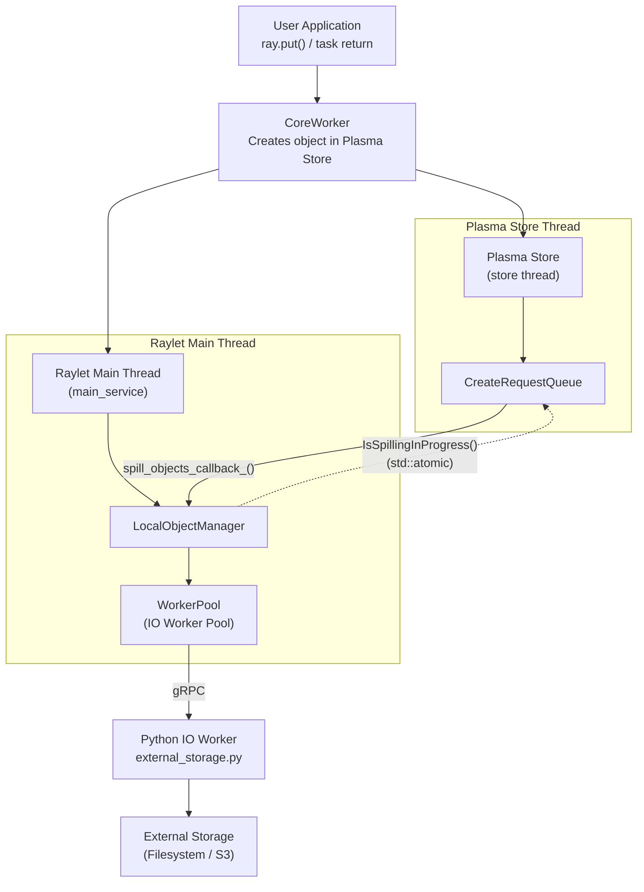
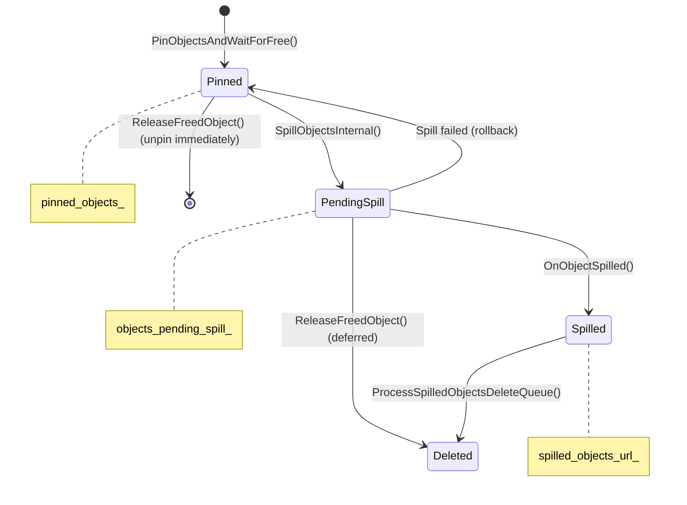
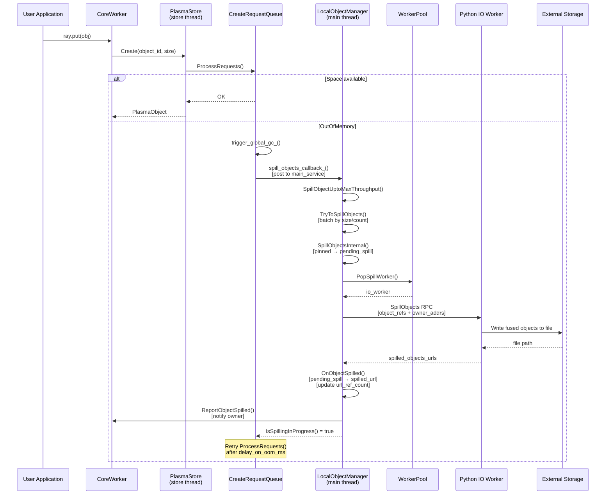
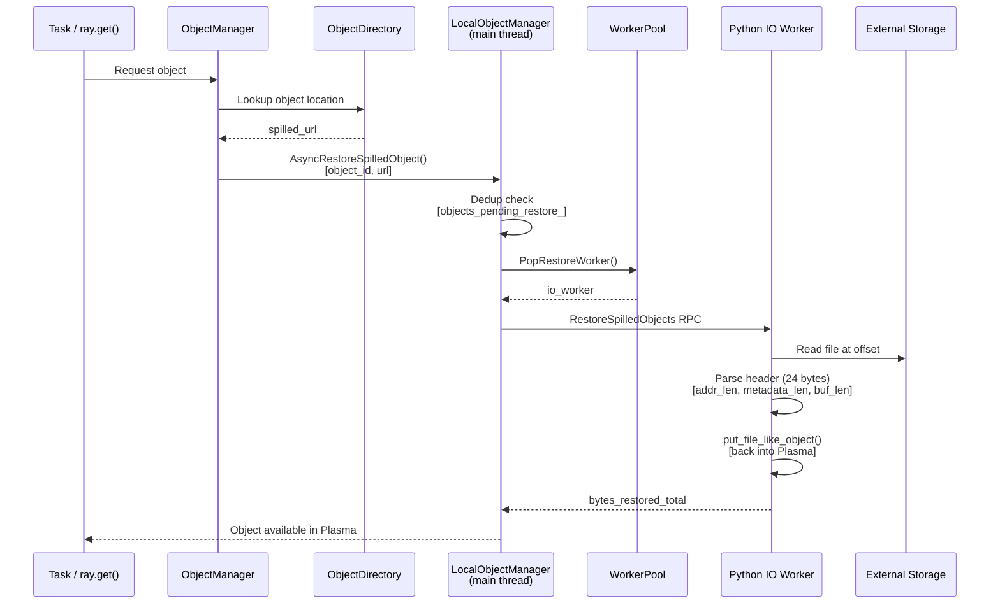
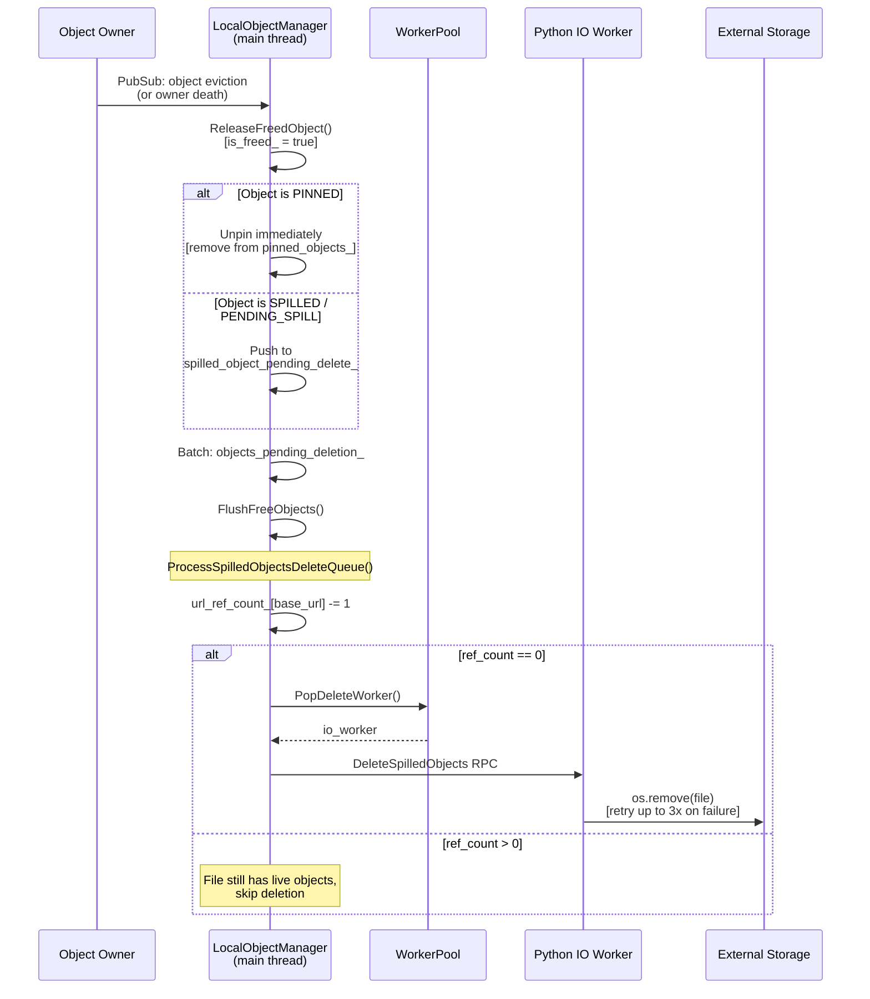

# Object Spilling

This document explains how Ray's object spilling mechanism works and outlines its high-level architecture, components, and end-to-end data flow.

## Overview

Object spilling is Ray's mechanism for handling memory pressure in the Plasma object store. When the object store is full and new objects need to be created (for example, via `ray.put()` or task return values), Ray automatically *spills* existing objects from shared memory to external storage (local disk or cloud storage such as S3). When a spilled object is needed again, it is transparently restored back into the object store.

The mechanism involves four major components:

1. **CreateRequestQueue** (Plasma store thread): detects memory pressure and triggers spilling.
2. **LocalObjectManager** (Raylet main thread): orchestrates object pinning, spill scheduling, restore, and deletion.
3. **WorkerPool** (Raylet main thread): manages a pool of IO worker processes for spill/restore/delete operations.
4. **External Storage** (Python IO worker processes): performs the actual I/O against the storage backend.

> **Note:** Object spilling is fully transparent to user applications. No application-level code changes are required to handle memory pressure.

## Architecture

The following diagram shows the high-level architecture and data flow:



> **Note:** The Plasma store and the Raylet main event loop run in **separate threads**. The spill callback bridges them by posting work from the store thread to the main thread. Only `IsSpillingInProgress()` is called cross-thread (using `std::atomic`).

## Triggering Spilling: CreateRequestQueue

When a `ray.put()` or task return creates an object, the CoreWorker asks the Plasma store to allocate space. If the store is full, the [`CreateRequestQueue`](https://github.com/ray-project/ray/blob/master/src/ray/object_manager/plasma/create_request_queue.h#L34) manages queued creation requests and triggers spilling.

The key decision logic lives in [`ProcessRequests`](https://github.com/ray-project/ray/blob/master/src/ray/object_manager/plasma/create_request_queue.cc#L85):

1. **Try to allocate** the object in Plasma (without fallback allocator).
2. If allocation fails with `OutOfMemory` and the disk is full (checked via `FileSystemMonitor`), return `OutOfDisk` immediately.
3. **Trigger global GC** if configured.
4. **Call** `spill_objects_callback_()`: this is the critical trigger that bridges the Plasma store thread and the Raylet main thread.
   - If it returns `true` (spilling is in progress), the OOM timer is reset, and the request is retried later (`TransientObjectStoreFull`).
   - If it returns `false` (nothing to spill), the system waits through a grace period.
5. If the **grace period expires** without progress, try the **fallback allocator** (mmap-based allocation to disk). If that also fails, return `OutOfDisk`.

The callback is registered in [`main.cc`](https://github.com/ray-project/ray/blob/master/src/ray/raylet/main.cc#L782):

```cpp
/*spill_objects_callback=*/
[&]() {
  // Posted from plasma store thread to raylet main thread
  main_service.post(
      [&]() { local_object_manager->SpillObjectUptoMaxThroughput(); },
      "NodeManager.SpillObjects");
  return local_object_manager->IsSpillingInProgress();
}
```

The Plasma store retries `ProcessCreateRequests()` periodically (controlled by `delay_on_oom_ms`) as long as the queue is non-empty and status is not OK. See [`PlasmaStore::ProcessCreateRequests`](https://github.com/ray-project/ray/blob/master/src/ray/object_manager/plasma/store.cc#L508).

## Object Pinning

Before objects can be spilled, they must be *pinned* by the Raylet. Pinning ensures the Raylet holds a reference to the object so it is not prematurely evicted from the object store.

When the CoreWorker creates an object in Plasma, it sends a `PinObjectIDs` RPC to the Raylet. The Raylet's [`HandlePinObjectIDs`](https://github.com/ray-project/ray/blob/master/src/ray/raylet/node_manager.cc#L2588) fetches the objects from Plasma and calls [`PinObjectsAndWaitForFree`](https://github.com/ray-project/ray/blob/master/src/ray/raylet/local_object_manager.cc#L30), which:

1. Stores object metadata (owner address, generator ID, size) in `local_objects_`.
2. Holds the `std::unique_ptr<RayObject>` in `pinned_objects_`, preventing Plasma eviction.
3. Subscribes to eviction notifications via pub/sub: when the object owner says the object can be freed (or the owner process dies), `ReleaseFreedObject()` is called.

Every object tracked by `LocalObjectManager` is in exactly one of three states:



The `local_objects_` map tracks metadata for objects across all three states.

## Spill Scheduling

The [`LocalObjectManager`](https://github.com/ray-project/ray/blob/master/src/ray/raylet/local_object_manager.h#L44) orchestrates all spill operations.

### SpillObjectUptoMaxThroughput

[`SpillObjectUptoMaxThroughput`](https://github.com/ray-project/ray/blob/master/src/ray/raylet/local_object_manager.cc#L168) is the entry point called when memory pressure is detected. It tries to saturate all available IO workers by calling `TryToSpillObjects()` in a loop until either no more objects can be spilled or all workers are busy (`num_active_workers_ >= max_active_workers_`).

### TryToSpillObjects

[`TryToSpillObjects`](https://github.com/ray-project/ray/blob/master/src/ray/raylet/local_object_manager.cc#L185) selects which objects to spill in a single batch:

1. Iterates through `pinned_objects_`, checking `is_plasma_object_spillable_(id)` for each (this ensures the object is not actively used by a worker process).
2. Accumulates objects until either `max_fused_object_count_` objects are collected or all pinned objects have been checked.
3. **Batching optimization**: if the accumulated bytes are less than `min_spilling_size_` and other spills are already in progress, it returns `false` to wait for current spills to complete before starting a small batch. This gives the system time to accumulate more objects for better batching.
4. Calls `SpillObjectsInternal()` with the selected batch.

### SpillObjectsInternal

[`SpillObjectsInternal`](https://github.com/ray-project/ray/blob/master/src/ray/raylet/local_object_manager.cc#L274) performs the actual spill:

1. Filters out objects that have already been freed or are already pending spill.
2. Moves objects from `pinned_objects_` to `objects_pending_spill_` (updates size counters).
3. Increments `num_active_workers_` and pops a spill worker from the IO worker pool.
4. Constructs a `SpillObjectsRequest` RPC with object refs and owner addresses, then sends it to the IO worker.
5. On RPC response: moves failed objects back to `pinned_objects_`, and calls `OnObjectSpilled()` for successful ones.

> **Note:** Spilling is ordered: if object N succeeds, all objects before N in the request are guaranteed to have succeeded as well. Failed objects (from the first failure onward) are moved back to pinned state.

## Python IO Workers and External Storage

IO workers are specialized Python processes that perform the actual I/O operations. They are spawned and managed by the [`WorkerPool`](https://github.com/ray-project/ray/blob/master/src/ray/raylet/worker_pool.h#L132).

### Worker Types and Pool Management

There are two dedicated IO worker types:

- `SPILL_WORKER`: handles `SpillObjects` RPCs.
- `RESTORE_WORKER`: handles `RestoreSpilledObjects` RPCs.
- Delete operations reuse idle spill or restore workers (whichever pool has more idle workers).

When [`PopSpillWorker`](https://github.com/ray-project/ray/blob/master/src/ray/raylet/worker_pool.cc#L990) is called:

- If an idle worker is available, it is returned immediately via the callback.
- If no idle workers exist, the callback is queued and [`TryStartIOWorkers`](https://github.com/ray-project/ray/blob/master/src/ray/raylet/worker_pool.cc#L1750) starts new Python worker processes up to `max_io_workers`.

When the spill operation completes, the worker is returned to the pool via `PushSpillWorker`. If pending tasks are queued, the worker is immediately assigned to the next task instead of going idle.

### Object Fusion Format

Multiple objects are fused into a single file to reduce I/O overhead and filesystem fragmentation. The [`_write_multiple_objects`](https://github.com/ray-project/ray/blob/master/python/ray/_private/external_storage.py#L133) method writes each object with a 24-byte header:

```
┌─────────────────────────────────────────────────────┐
│                    Spill File                        │
│                                                      │
│  Object 1:                                           │
│  ┌──────────┬──────────────┬──────────┐              │
│  │ addr_len │ metadata_len │ buf_len  │  (24 bytes)  │
│  │ (8 bytes)│ (8 bytes)    │ (8 bytes)│              │
│  ├──────────┴──────────────┴──────────┤              │
│  │ owner_address │ metadata │ buffer  │              │
│  └───────────────┴──────────┴─────────┘              │
│                                                      │
│  Object 2: [same format...]                          │
│  ...                                                 │
└─────────────────────────────────────────────────────┘
```

Each object's location is tracked via a URL with offset and size:

```
/tmp/ray/spill/ray_spilled_objects_<node_id>/<uuid>-multi-<count>?offset=<N>&size=<M>
```

### Storage Backends

The [`ExternalStorage`](https://github.com/ray-project/ray/blob/master/python/ray/_private/external_storage.py#L72) abstract class defines the interface for all backends. Two production implementations are provided:

- [`FileSystemStorage`](https://github.com/ray-project/ray/blob/master/python/ray/_private/external_storage.py#L271) (default): writes to local filesystem. Supports multiple directories with round-robin distribution for I/O parallelism across mount points. Files are named `{directory}/ray_spilled_objects_{node_id}/{uuid}-multi-{count}`.

- [`ExternalStorageSmartOpenImpl`](https://github.com/ray-project/ray/blob/master/python/ray/_private/external_storage.py#L398): uses the `smart_open` library for cloud storage (S3, GCS, etc.). Reuses boto3 sessions and uses deferred seek for performance.

The backend is selected by [`setup_external_storage`](https://github.com/ray-project/ray/blob/master/python/ray/_private/external_storage.py#L577) based on the `object_spilling_config` JSON configuration.

## Post-Spill Processing

After the IO worker successfully writes objects to external storage, [`OnObjectSpilled`](https://github.com/ray-project/ray/blob/master/src/ray/raylet/local_object_manager.cc#L391) is called for each spilled object:

1. Parses the returned URL to extract the `base_url` (the file path without offset/size query parameters).
2. Increments `url_ref_count_[base_url]`. Since multiple objects can be fused into one file, this ref count tracks how many live objects reference each file.
3. Records the `object_id → url_with_offset` mapping in `spilled_objects_url_`.
4. Removes the object from `objects_pending_spill_` (releases the in-memory copy).
5. Updates spill metrics (`spilled_bytes_total_`, `spilled_objects_total_`, etc.).
6. If the object has not already been freed, reports the spilled URL to the object owner via `object_directory_->ReportObjectSpilled()` so that other nodes in the cluster can locate the spilled object.

## Object Restore

When a spilled object is needed again (for example, a task on this or another node reads it), the object directory returns the spilled URL, and [`AsyncRestoreSpilledObject`](https://github.com/ray-project/ray/blob/master/src/ray/raylet/local_object_manager.cc#L456) is called:

1. **Deduplication**: if the same object is already being restored (`objects_pending_restore_` contains the ID), the call is a no-op to avoid duplicate restores.
2. Pops a restore worker from the IO worker pool.
3. Sends a `RestoreSpilledObjectsRequest` RPC with the spilled URL and object ID.
4. The Python IO worker reads the file at the specified offset, parses the header, and puts the object back into the Plasma store via `core_worker.put_file_like_object()`.
5. On completion, updates restore metrics and invokes the callback.

> **Note:** For filesystem-based spilling, restores can only happen from the node that spilled the object (since the file is local). For cloud storage (S3), any node can restore the object directly from the remote storage.

## Object Deletion and Cleanup

Object deletion is a two-phase process that handles the complexity of objects being freed while they are still being spilled, and multiple objects sharing a single spill file.

### Phase 1: Marking Objects as Freed

When the object owner frees the object (via pub/sub eviction notification or owner death), [`ReleaseFreedObject`](https://github.com/ray-project/ray/blob/master/src/ray/raylet/local_object_manager.cc#L110) is called:

1. Marks `local_objects_[id].is_freed_ = true`.
2. If the object is **pinned**: removes it from `pinned_objects_` and erases the `local_objects_` entry immediately.
3. If the object is **being spilled or already spilled**: pushes it onto `spilled_object_pending_delete_` for deferred cleanup (cannot delete while spilling is in progress).
4. Adds the object ID to `objects_pending_deletion_` for batch eviction from Plasma across the cluster.

### Phase 2: Batch Cleanup of Spilled Files

[`ProcessSpilledObjectsDeleteQueue`](https://github.com/ray-project/ray/blob/master/src/ray/raylet/local_object_manager.cc#L515) processes the delete queue in batches:

1. For each object in `spilled_object_pending_delete_`:
   - If the object is **still being spilled**: stop processing (preserves FIFO order; the spill will complete eventually).
   - If the object **has a spilled URL**: decrement `url_ref_count_[base_url]`. If the ref count reaches zero, add the URL to the delete list.
   - Remove the object from `local_objects_` and `spilled_objects_url_`.

2. If there are URLs to delete, call [`DeleteSpilledObjects`](https://github.com/ray-project/ray/blob/master/src/ray/raylet/local_object_manager.cc#L571), which pops a delete worker and sends a `DeleteSpilledObjectsRequest` RPC. Failed deletions are retried up to 3 times.

> **Note:** The URL ref counting mechanism is critical for correctness: since multiple objects can be fused into a single file, the file must not be deleted until **all** objects within it have gone out of scope.

## Complete Lifecycle

The following sequence diagrams show the end-to-end interactions between components during spill, restore, and delete:

### Spill Path (triggered by memory pressure)



### Restore Path (spilled object needed again)



### Delete Path (object goes out of scope)



## Configuration

Object spilling is controlled by the following configuration parameters:

- `object_spilling_config`: JSON string specifying the storage backend. Empty string disables spilling.
- `min_spilling_size`: minimum bytes to accumulate before triggering a spill batch.
- `max_fused_object_count`: maximum number of objects fused into a single spill file.
- `max_io_workers`: maximum number of concurrent spill/restore IO worker processes.
- `oom_grace_period_s`: seconds to wait after OOM before using the fallback allocator.
- `free_objects_batch_size`: number of freed objects to batch before flushing.
- `free_objects_period_milliseconds`: interval for flushing freed objects.
- `verbose_spill_logs`: byte threshold for error-level spill log messages (uses exponential backoff).

Example configuration:

```python
ray.init(
    _system_config={
        "object_spilling_config": json.dumps({
            "type": "filesystem",
            "params": {
                "directory_path": ["/mnt/ssd1/spill", "/mnt/ssd2/spill"],
                "buffer_size": 1048576,
            }
        }),
        "min_spilling_size": 100 * 1024 * 1024,    # 100 MB
        "max_io_workers": 4,
    }
)
```

## Key Source Files

| File | Role |
|------|------|
| `src/ray/object_manager/plasma/create_request_queue.cc` | Decides when to trigger spilling on OOM |
| `src/ray/object_manager/plasma/store.cc` | Plasma store; retries create requests periodically |
| `src/ray/raylet/main.cc` | Wires up the spill callback between Plasma and LocalObjectManager |
| `src/ray/raylet/node_manager.cc` | Handles `PinObjectIDs` RPC; integrates LocalObjectManager |
| `src/ray/raylet/local_object_manager.h` | Class definition, state tracking, and member variables |
| `src/ray/raylet/local_object_manager.cc` | Spill/restore/delete orchestration logic |
| `src/ray/raylet/worker_pool.cc` | IO worker pool management (pop/push/start workers) |
| `python/ray/_private/external_storage.py` | Storage backends (FileSystemStorage, SmartOpenImpl) |
