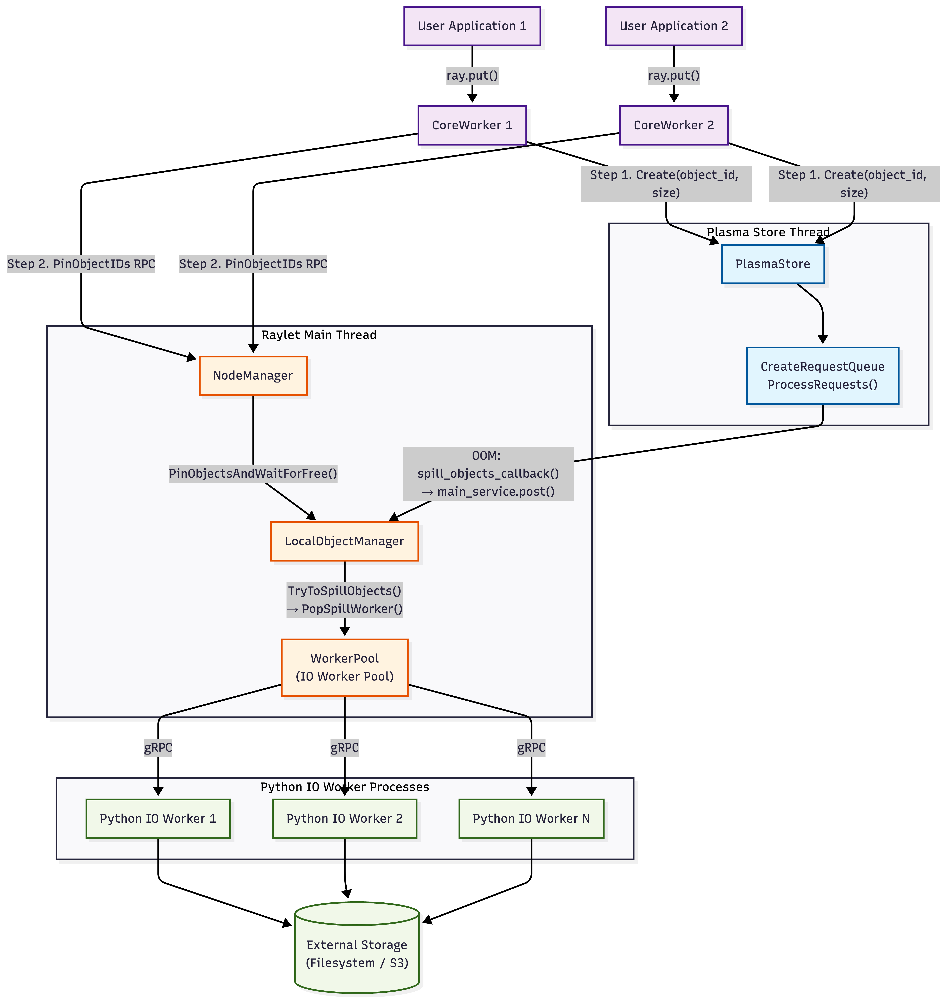
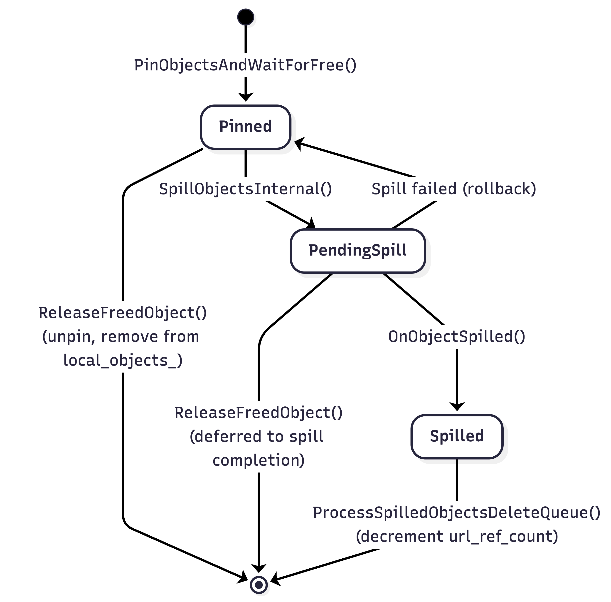
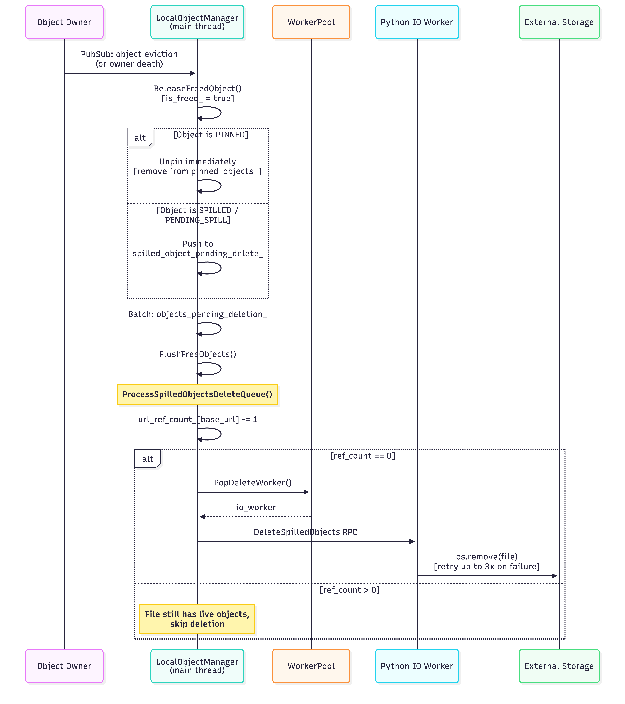

.. _object-spilling-internals:

Object Spilling
===============

This document explains how Ray's object spilling mechanism works and outlines its high-level architecture, components, and end-to-end data flow.

Overview
--------

Ray stores task outputs and ``ray.put()`` values as **objects** in the Plasma object store, a shared-memory region on each node. An object goes through the following lifecycle:

1. **Creation**: ``ray.put()`` or a task return triggers a ``Create`` RPC to the Plasma store, which allocates space in shared memory for the serialized object.
2. **Pinning**: After the object is created in Plasma, the CoreWorker sends a ``PinObjectIDs`` RPC to the local Raylet. This ensures the Raylet holds a reference to the object (preventing eviction) for as long as it may be needed (e.g., until it is consumed or spilled).
3. **Consumption**: Other tasks and ``ray.get()`` calls read the pinned object directly from shared memory via zero-copy access.
4. **Deletion**: When the object owner determines the object is no longer referenced, the Raylet unpins it and frees the shared memory.

This works well when the working set fits in memory. However, when the Plasma store is **full** and new objects need to be created, allocation fails — blocking ``ray.put()`` and task returns until space is freed.

**Object spilling** solves this by extending the object lifecycle with an external storage tier: when memory pressure is detected, pinned objects are automatically *spilled* from shared memory to external storage (local disk or S3). When a spilled object is needed again, it is transparently *restored* back into Plasma. This allows the effective object store capacity to exceed physical memory, at the cost of I/O latency for accessing spilled objects.

.. note::

   Object spilling is fully abstracted away to user applications. No application-level code changes are needed to automatically spill pinned objects to disk when under plasma store memory pressure.

Architecture
------------

The object spilling architecture is designed to minimize interference with the critical path of task execution. It decouples **memory pressure detection** (which happens in the latency-sensitive Plasma store) from **spill orchestration** (managed by the Raylet) and **I/O execution** (offloaded to separate worker processes).

The system consists of three main interaction layers:

1. **Detection (Plasma Store Thread)**: The ``CreateRequestQueue`` within the Plasma store monitors memory usage. When an allocation fails (OOM), it triggers a callback to the Raylet. This ensures that the single-threaded object store is never blocked by I/O operations.

2. **Orchestration (Raylet Main Thread)**: The ``LocalObjectManager`` in the Raylet receives the spill request. It decides *what* to spill (based on LRU and pinning status) and *when* to spill (batching requests for efficiency). It manages the state of all local objects (Pinned, PendingSpill, Spilled).

3. **Execution (IO Worker Processes)**: Actual disk or network I/O is performed by a pool of Python ``IO Workers``. The Raylet communicates with these workers via gRPC. This separation ensures that even if I/O is slow (e.g., writing to S3), the Raylet's main loop remains responsive to other cluster events (heartbeats, scheduling).

The following diagram illustrates this layered architecture and the data flow:

..
   Mermaid source (generate image from this):

   flowchart TD
       %% Node Definitions for Parallelism
       A1["User Application 1"]
       A2["User Application 2"]
       B1["CoreWorker 1"]
       B2["CoreWorker 2"]

       %% Entry point connections
       A1 -- "ray.put()" --> B1
       A2 -- "ray.put()" --> B2

       %% Main Logic paths (Parallel)
       B1 -- "Step 1. Create" --> C["PlasmaStore"]
       B2 -- "Step 1. Create" --> C

       B1 -- "Step 2. Pin RPC" --> NM["NodeManager"]
       B2 -- "Step 2. Pin RPC" --> NM

       %% Alignment constraint
       C ~~~ NM

       %% Left: Memory Allocation Logic
       subgraph PlasmaThread["Plasma Store Thread"]
           C --> E["CreateRequestQueue ProcessRequests()"]
       end

       %% Right: Scheduling & Management
       subgraph RayletThread["Raylet Main Thread"]
           NM -- "PinObjectsAndWaitForFree()" --> F["LocalObjectManager"]
           F -- "TryToSpillObjects() → PopSpillWorker()" --> G["WorkerPool (IO Worker Pool)"]
       end

       %% Spilling Link (Cross-thread callback)
       E -- "OOM: spill_objects_callback() → main_service.post()" --> F

       %% Parallel IO Workers
       subgraph IOWorkerProcesses["Python IO Worker Processes"]
           H1["Python IO Worker 1"]
           H2["Python IO Worker 2"]
           Hn["Python IO Worker N"]
       end
       G -- "gRPC" --> H1
       G -- "gRPC" --> H2
       G -- "gRPC" --> Hn

       %% Storage Destination
       H1 & H2 & Hn --> I[("External Storage (Filesystem / S3)")]

       %% Styling
       classDef memory fill:#e1f5fe,stroke:#01579b,stroke-width:2px;
       classDef logic fill:#fff3e0,stroke:#e65100,stroke-width:2px;
       classDef storage fill:#f1f8e9,stroke:#33691e,stroke-width:2px;
       classDef core fill:#f3e5f5,stroke:#4a148c,stroke-width:2px;

       class C,E memory;
       class NM,F,G logic;
       class H1,H2,Hn,I storage;
       class A1,A2,B1,B2 core;

.. note::

    The Plasma store and the Raylet main event loop run in **separate threads**. The spill callback bridges them by posting work from the store thread to the main thread. Only ``IsSpillingInProgress()`` is called cross-thread (using ``std::atomic``).

Primary vs. Secondary Copies
----------------------------

Ray distinguishes between two types of object copies in the cluster, which determines how they are handled under memory pressure:

- **Primary Copy**: The initial copy of an object, created by a task or ``ray.put``. The owner of the object (the CoreWorker that created it) manages its lifetime. The primary copy is the "source of truth" and cannot be evicted; it needs to be **spilled** to external storage if memory is needed.
- **Secondary Copy**: A copy of an object transferred to another node (e.g., as a dependency for a remote task or via ``ray.get``). These are treated as cached replicas.

In the context of spilling, "primary copy" and "pinned object" are closely related but distinct concepts:

*   A **Primary Copy** is the initial object created by the owner. The owner explicitly registers it with the **Raylet's LocalObjectManager** (`source <https://github.com/ray-project/ray/blob/master/src/ray/raylet/local_object_manager.cc#L31>`__) (via ``PinObjectIDs``), making it a **pinned object** eligible for spilling.
*   A **Secondary Copy** (cached replica) is pinned in the Plasma store only *while actively referenced* (`source <https://github.com/ray-project/ray/blob/master/src/ray/object_manager/plasma/eviction_policy.cc#L136>`__) (e.g., by a running task or a worker). It is **not managed by the LocalObjectManager** and is evicted by the Plasma Store's LRU policy (`source <https://github.com/ray-project/ray/blob/master/src/ray/object_manager/plasma/eviction_policy.cc#L82>`__) once the reference count drops.

Therefore, the Raylet's spilling mechanism **only** sees and operates on primary copies.

When memory pressure built up from objects being created or moved into the Plasma store, Ray prioritizes **evicting** secondary copies (which can be re-fetched from the primary) to free up space. If memory pressure persists, Ray then resorts to **spilling** primary copies to external storage.

Triggering Spilling
-------------------

Object spilling can be triggered by any operation that adds objects to the Plasma store. At the user API level, this includes:

- ``ray.put(obj)`` — explicitly places an object into the object store.
- **Task return values** — the return value of a remote task is serialized and stored in Plasma.
- **Object transfer** — when ``ray.get()`` fetches a remote object, the object is copied into the local Plasma store on the receiving node.

Internally, there are **three code paths** that trigger spilling. The first is *reactive* — spilling is triggered because allocation has already failed. The other two are *proactive* — they check a memory threshold and spill preemptively to avoid OOM in the first place.

.. list-table::
   :widths: 15 30 55
   :header-rows: 1

   * - Trigger
     - When it fires
     - Condition
   * - **OOM on Create**
     - A ``Create`` RPC to Plasma fails with ``OutOfMemory`` (`source <https://github.com/ray-project/ray/blob/master/src/ray/object_manager/plasma/create_request_queue.cc#L117>`__)
     - Reactive: allocation already failed, must spill to make room
   * - **Periodic threshold**
     - Every ``free_objects_period_milliseconds`` (default 1000 ms) (`source <https://github.com/ray-project/ray/blob/master/src/ray/raylet/node_manager.cc#L427>`__)
     - Proactive: primary object bytes / capacity >= ``object_spilling_threshold`` (default 0.8)
   * - **Object sealed**
     - Whenever a new object is sealed in Plasma (`SealObjects <https://github.com/ray-project/ray/blob/master/src/ray/object_manager/plasma/store.cc#L278>`__ → `HandleObjectLocal <https://github.com/ray-project/ray/blob/master/src/ray/raylet/node_manager.cc#L2451>`__)
     - Proactive: same threshold check as above, triggered immediately on the new object

All three paths converge on ``LocalObjectManager::SpillObjectUptoMaxThroughput()``.

Reactive: OOM on Object Creation
~~~~~~~~~~~~~~~~~~~~~~~~~~~~~~~~~

When the Plasma store cannot allocate space for a new object, the `CreateRequestQueue <https://github.com/ray-project/ray/blob/master/src/ray/object_manager/plasma/create_request_queue.h#L34>`__ manages the queued request and kicks off a recovery sequence. The key decision logic lives in `ProcessRequests <https://github.com/ray-project/ray/blob/master/src/ray/object_manager/plasma/create_request_queue.cc#L85>`__:

1. **Try to allocate** the object in shared memory.
2. If allocation fails with ``OutOfMemory`` and the disk is full (checked via ``FileSystemMonitor``), return ``OutOfDisk`` immediately — there is nowhere to spill to.
3. **Trigger global GC** if configured — this may free Python-side references, allowing Plasma objects to be unpinned.
4. **Call** ``spill_objects_callback_()``. This callback is registered in `main.cc <https://github.com/ray-project/ray/blob/master/src/ray/raylet/main.cc#L752>`__ and runs **on the Plasma store thread**. It does two things:

   .. code-block:: cpp

      /*spill_objects_callback=*/
      [&]() {
        // 1) Post spill task to Raylet main thread (non-blocking, enqueue only)
        main_service.post(
            [&]() { local_object_manager->SpillObjectUptoMaxThroughput(); },
            "NodeManager.SpillObjects");
        // 2) Return whether spilling is active (std::atomic, safe to read cross-thread)
        return local_object_manager->IsSpillingInProgress();
      }

   Based on the return value, ``CreateRequestQueue`` decides what to do next:

   - ``true`` (spilling is in progress): The **LocalObjectManager** has identified eligible **pinned primary copies** (objects with reference count == 1, meaning only the owner holds a reference and no task is actively using it, see `PlasmaStore::IsObjectSpillable <https://github.com/ray-project/ray/blob/master/src/ray/object_manager/plasma/store.cc#L560>`__) and spill workers are actively writing them to external storage.
   - ``false`` (no active spills): The **LocalObjectManager** has no ongoing spills. This occurs if:
     
     *   No eligible objects were found (e.g., all pinned objects are currently **in use** by running tasks).
     *   The total size of spillable objects is too small (below ``min_spilling_size``) to justify an immediate spill, so Ray waits to batch more objects.
     *   Spilling is disabled in the configuration.
     
     In this case, the queue enters the **grace period** (``oom_grace_period_s``). During the grace period, retries continue — this accounts for global GC latency and the delay between spilling completing and space actually being freed in the object store.

5. If the **grace period expires** without progress, try the **fallback allocator** as a last resort. The fallback allocator uses ``mmap`` to allocate the object directly on the local filesystem instead of shared memory — this is slower but avoids blocking the caller indefinitely. If that also fails (e.g. disk full), return ``OutOfDisk``.

The Plasma store retries ``ProcessCreateRequests()`` periodically (controlled by ``delay_on_oom_ms``) as long as the queue is non-empty and status is not OK. See `PlasmaStore::ProcessCreateRequests <https://github.com/ray-project/ray/blob/master/src/ray/object_manager/plasma/store.cc#L508>`__.

Proactive: Threshold-Based Spilling
~~~~~~~~~~~~~~~~~~~~~~~~~~~~~~~~~~~~

The reactive OOM path only fires *after* the store is already full. To avoid hitting that cliff, Ray also **proactively** spills objects before the store is full. `NodeManager::SpillIfOverPrimaryObjectsThreshold <https://github.com/ray-project/ray/blob/master/src/ray/raylet/node_manager.cc#L2400>`__ checks whether the fraction of primary object bytes in the store exceeds ``object_spilling_threshold`` (default 0.8), and if so, calls ``SpillObjectUptoMaxThroughput()``.

This check is invoked from two places:

1. **Periodic timer** (`node_manager.cc <https://github.com/ray-project/ray/blob/master/src/ray/raylet/node_manager.cc#L427>`__): runs every ``free_objects_period_milliseconds`` (default 1000 ms). This is the steady-state proactive spilling path — even without any new object creation, the system periodically checks and spills if needed.

2. **Object sealed event** (`HandleObjectLocal <https://github.com/ray-project/ray/blob/master/src/ray/raylet/node_manager.cc#L2451>`__): every time a new object is sealed in Plasma (via `SealObjects <https://github.com/ray-project/ray/blob/master/src/ray/object_manager/plasma/store.cc#L278>`__), the ``add_object_callback_`` posts ``HandleObjectLocal()`` to the Raylet main thread, which calls ``SpillIfOverPrimaryObjectsThreshold()`` at the end. This ensures that spilling reacts immediately when a large object pushes memory usage over the threshold, rather than waiting up to 1 second for the next periodic check.

Alternatives to Spilling
------------------------

Ray includes other mechanisms to handle memory pressure aside from spilling:

1. **Eviction (Secondary Copies)**: As mentioned above, Ray creates replicas of objects on other nodes when they are needed for tasks or ``ray.get``. These **secondary copies** are evictable. When the object store is full, Ray deletes these copies (LRU) to free space before attempting to spill primary objects.

2. **Fallback Allocation (Mmap)**: If spilling is too slow or the object store is fragmented, Ray may use **fallback allocation**. This occurs when a create request fails with OOM even after attempting to spill. The object is allocated directly on the filesystem (using ``mmap``) rather than in the shared memory pool. This avoids application deadlock but offers lower performance than shared memory.

Object Pinning
--------------

Before objects can be spilled, they must be *pinned* by the Raylet. Pinning ensures the Raylet holds a reference to the object so it is not prematurely evicted from the object store.

When the CoreWorker creates an object in Plasma, it sends a ``PinObjectIDs`` RPC to the Raylet. The Raylet's `HandlePinObjectIDs <https://github.com/ray-project/ray/blob/master/src/ray/raylet/node_manager.cc#L2588>`__ fetches the objects from Plasma and calls `PinObjectsAndWaitForFree <https://github.com/ray-project/ray/blob/master/src/ray/raylet/local_object_manager.cc#L31>`__, which:

1. Stores object metadata (owner address, generator ID, size) in ``local_objects_``.
2. Holds the ``std::unique_ptr<RayObject>`` in ``pinned_objects_``, preventing Plasma eviction.
3. Subscribes to eviction notifications via pub/sub: when the object owner says the object can be freed (or the owner process dies), ``ReleaseFreedObject()`` is called.

Every object tracked by ``LocalObjectManager`` is registered in ``local_objects_`` (metadata map) and simultaneously in exactly one of three sub-maps, corresponding to its current state:

.. list-table::
   :widths: 20 30 50
   :header-rows: 1

   * - State
     - Sub-map
     - Meaning
   * - **Pinned**
     - ``pinned_objects_``
     - Object is held in shared memory, eligible for spilling
   * - **PendingSpill**
     - ``objects_pending_spill_``
     - Object has been handed to an IO worker, spill in progress
   * - **Spilled**
     - ``spilled_objects_url_``
     - Object has been written to external storage, in-memory copy released

When an object is **deleted** (freed by owner), it is removed from ``local_objects_`` and its corresponding sub-map — it is no longer tracked by ``LocalObjectManager``.

..
   Mermaid source (generate image from this):

   stateDiagram-v2
       [*] --> Pinned : PinObjectsAndWaitForFree()
       Pinned --> PendingSpill : SpillObjectsInternal()
       PendingSpill --> Spilled : OnObjectSpilled()
       PendingSpill --> Pinned : Spill failed (rollback)

       Pinned --> [*] : ReleaseFreedObject() (unpin, remove from local_objects_)
       PendingSpill --> [*] : ReleaseFreedObject() (deferred to spill completion)
       Spilled --> [*] : ProcessSpilledObjectsDeleteQueue() (decrement url_ref_count)

Spill Scheduling
----------------

The `LocalObjectManager <https://github.com/ray-project/ray/blob/master/src/ray/raylet/local_object_manager.h#L46>`__ orchestrates all spill operations.

Strategy: Optimistic Batching
~~~~~~~~~~~~~~~~~~~~~~~~~~~~~

The core tension in spill scheduling is between **latency** and **efficiency**:

- Spilling should start as soon as possible when memory is under pressure — delaying risks blocking object creation.
- But fusing multiple objects into a single spill file amortizes I/O overhead (fewer syscalls, sequential writes), so larger batches are more efficient.

Ray resolves this with an **optimistic batching** strategy: spill immediately with whatever objects are available, but defer tiny batches when other spills are already in flight. The reasoning is:

- In-flight spills will soon free memory, reducing the urgency.
- Waiting gives time for more objects to accumulate, improving the next batch's efficiency.
- When **no** spills are in progress, even a small batch is dispatched immediately — there is nothing to wait for.

The entry point is `SpillObjectUptoMaxThroughput <https://github.com/ray-project/ray/blob/master/src/ray/raylet/local_object_manager.cc#L169>`__, called when memory pressure is detected. It aggressively tries to saturate all available IO workers by calling ``TryToSpillObjects()`` in a loop until either no more objects can be spilled or all workers are busy (``num_active_workers_ >= max_active_workers_``).

Batch Construction
~~~~~~~~~~~~~~~~~~

`TryToSpillObjects <https://github.com/ray-project/ray/blob/master/src/ray/raylet/local_object_manager.cc#L186>`__ constructs a single spill batch. It iterates through ``pinned_objects_``, skipping objects that are not currently spillable (``is_plasma_object_spillable_`` checks that the object is not actively used by a worker process), and accumulates candidates until one of the following limits is reached:

- ``max_fused_object_count_`` objects have been collected, **or**
- ``max_spilling_file_size_bytes_`` would be exceeded by adding the next object (when enabled, i.e. > 0; the first object is always included even if it alone exceeds the limit), **or**
- all pinned objects have been checked.

Deferral Decision
~~~~~~~~~~~~~~~~~

After constructing the candidate batch, ``TryToSpillObjects`` decides whether to spill now or defer. Spilling is **deferred** (returns ``false``) when **all three** of the following conditions hold simultaneously (see `source <https://github.com/ray-project/ray/blob/master/src/ray/raylet/local_object_manager.cc#L220>`__):

1. The scan visited all pinned objects without hitting ``max_fused_object_count_`` — the candidate batch is small, not limited by fusion constraints.
2. The total bytes to spill (``bytes_to_spill``) is below ``min_spilling_size_``.
3. There are already objects being spilled (``objects_pending_spill_`` is non-empty).

In other words: the batch is small, smaller than the minimum threshold, and other spills are already making progress — so waiting is safe. If **any** condition is not met — the batch hit a fusion limit (indicating enough objects to justify a spill), or the batch is large enough, or no other spills are in progress — spilling proceeds immediately.

Once the decision is to spill, ``SpillObjectsInternal()`` is called with the selected batch.

SpillObjectsInternal
~~~~~~~~~~~~~~~~~~~~

`SpillObjectsInternal <https://github.com/ray-project/ray/blob/master/src/ray/raylet/local_object_manager.cc#L282>`__ performs the actual spill:

1. Filters out objects that have already been freed or are already pending spill.
2. Moves objects from ``pinned_objects_`` to ``objects_pending_spill_`` (updates size counters).
3. Increments ``num_active_workers_`` and pops a spill worker from the IO worker pool.
4. Constructs a ``SpillObjectsRequest`` RPC with object refs and owner addresses, then sends it to the IO worker.
5. On RPC response: moves failed objects back to ``pinned_objects_``, and calls ``OnObjectSpilled()`` for successful ones.

.. note::

   Spilling is ordered: if object N succeeds, all objects before N in the request are guaranteed to have succeeded as well. Failed objects (from the first failure onward) are moved back to pinned state.

Python IO Workers and External Storage
---------------------------------------

IO workers are specialized Python processes that perform the actual I/O operations. They are spawned and managed by the `WorkerPool <https://github.com/ray-project/ray/blob/master/src/ray/raylet/worker_pool.h#L280>`__.

The ``WorkerPool`` manages all worker processes on a node, including regular task workers, driver processes, and IO workers. Regular workers and IO workers are tracked in separate data structures: regular task workers go into the ``State::idle`` set, while IO workers have their own dedicated ``IOWorkerState`` (`source <https://github.com/ray-project/ray/blob/master/src/ray/raylet/worker_pool.h#L619>`__), each of which maintains an ``idle_io_workers`` set, a ``pending_io_tasks`` queue, and a ``started_io_workers`` count. This separation ensures that IO workers are never assigned regular tasks and vice versa.

Worker Types and Pool Management
~~~~~~~~~~~~~~~~~~~~~~~~~~~~~~~~

IO workers handle three types of operations:

- **Spill**: write objects from Plasma to external storage.
- **Restore**: read a previously spilled object from external storage back into Plasma.
- **Delete**: remove spill files from external storage when all objects within them have gone out of scope.

Each operation type maps to an ``IOWorkerState``:

- ``SPILL_WORKER`` (`spill_io_worker_state <https://github.com/ray-project/ray/blob/master/src/ray/raylet/worker_pool.h#L658>`__): a dedicated pool that handles ``SpillObjects`` RPCs.
- ``RESTORE_WORKER`` (`restore_io_worker_state <https://github.com/ray-project/ray/blob/master/src/ray/raylet/worker_pool.h#L660>`__): a dedicated pool that handles ``RestoreSpilledObjects`` RPCs.
- Delete operations do not have a dedicated pool. `PopDeleteWorker <https://github.com/ray-project/ray/blob/master/src/ray/raylet/worker_pool.cc#L1063>`__ compares the number of idle workers in the spill and restore pools, and borrows a worker from whichever pool has more idle workers available. After the delete completes, the worker is returned to its original pool.

When `PopSpillWorker <https://github.com/ray-project/ray/blob/master/src/ray/raylet/worker_pool.cc#L990>`__ (or ``PopRestoreWorker``) is called:

- If an idle IO worker of the matching type is available in its ``idle_io_workers`` set, it is returned immediately via the callback.
- If no idle IO workers exist, the callback is queued in ``pending_io_tasks`` and `TryStartIOWorkers <https://github.com/ray-project/ray/blob/master/src/ray/raylet/worker_pool.cc#L1750>`__ spawns new Python IO worker processes up to ``max_io_workers`` per type.

When the operation completes, the worker is returned to its pool via ``PushSpillWorker`` (or ``PushRestoreWorker``). If pending tasks are queued, the worker is immediately assigned to the next task instead of going idle.

Object Fusion Format
~~~~~~~~~~~~~~~~~~~~

Rather than writing each object to its own file, multiple objects from a single spill batch are **fused** into a single file. This reduces I/O overhead (fewer ``open``/``close`` syscalls) and filesystem fragmentation. The `_write_multiple_objects <https://github.com/ray-project/ray/blob/master/python/ray/_private/external_storage.py#L133>`__ method writes objects sequentially, each prefixed with a 24-byte header:

.. code-block:: text

   ┌──────────────────────────────────────────────────────┐
   │                      Spill File                      │
   │                                                      │
   │  Object 1:                                           │
   │  ┌──────────┬──────────────┬──────────┐              │
   │  │ addr_len │ metadata_len │ buf_len  │  (24 bytes)  │
   │  │ (8 bytes)│ (8 bytes)    │ (8 bytes)│              │
   │  ├──────────┴──────────────┴──────────┤              │
   │  │ owner_address │ metadata │ buffer  │              │
   │  └───────────────┴──────────┴─────────┘              │
   │                                                      │
   │  Object 2: [same format...]                          │
   │  ...                                                 │
   └──────────────────────────────────────────────────────┘

The header's three 8-byte fields (``addr_len``, ``metadata_len``, ``buf_len``) encode the sizes of the three variable-length sections that follow: the serialized owner address (needed for ``ReportObjectSpilled``), the object metadata, and the object data buffer. During restore, the IO worker reads this header first to determine how many bytes to read for each section.

Since multiple objects share a single file, each individual object needs to be addressable independently — for example, object 3 in a fused file might be restored while objects 1 and 2 are still alive. Ray solves this with a **spill URL** that encodes the object's position within the file:

.. code-block:: text

   /tmp/ray/spill/ray_spilled_objects_<node_id>/<uuid>-multi-<count>?offset=<N>&size=<M>

The URL has two parts:

- **Base URL** (the path before ``?``): identifies the spill file. This is the same for all objects fused into the same file. It is also the key used by ``url_ref_count_`` to track how many live objects reference the file — the file is only deleted when this count reaches zero.
- **Query parameters** (``offset`` and ``size``): the byte offset and total size (header + data) of this specific object within the file. The restore IO worker seeks to the offset and reads exactly ``size`` bytes.

This URL is stored in ``spilled_objects_url_`` on the spilling node and reported to the object directory via ``ReportObjectSpilled()``, making it discoverable by any node in the cluster that needs to restore the object.

Storage Backends
~~~~~~~~~~~~~~~~

The `ExternalStorage <https://github.com/ray-project/ray/blob/master/python/ray/_private/external_storage.py#L72>`__ abstract class defines the interface for all backends. Two production implementations are provided:

- `FileSystemStorage <https://github.com/ray-project/ray/blob/master/python/ray/_private/external_storage.py#L271>`__ (default): writes to local filesystem. Supports multiple directories with round-robin distribution for I/O parallelism across mount points. Files are named ``{directory}/ray_spilled_objects_{node_id}/{uuid}-multi-{count}``.

- `ExternalStorageSmartOpenImpl <https://github.com/ray-project/ray/blob/master/python/ray/_private/external_storage.py#L398>`__: uses the ``smart_open`` library for cloud storage (S3, GCS, etc.). Reuses boto3 sessions and uses deferred seek for performance.

The backend is selected by `setup_external_storage <https://github.com/ray-project/ray/blob/master/python/ray/_private/external_storage.py#L577>`__ based on the ``object_spilling_config`` JSON configuration.

Post-Spill Processing
---------------------

After the IO worker successfully writes objects to external storage, `OnObjectSpilled <https://github.com/ray-project/ray/blob/master/src/ray/raylet/local_object_manager.cc#L399>`__ is called for each spilled object:

1. Parses the returned URL to extract the ``base_url`` (the file path without offset/size query parameters).
2. Increments ``url_ref_count_[base_url]``. Since multiple objects can be fused into one file, this ref count tracks how many live objects reference each file.
3. Records the ``object_id → url_with_offset`` mapping in ``spilled_objects_url_``.
4. Removes the object from ``objects_pending_spill_`` (releases the in-memory copy).
5. Updates spill metrics (``spilled_bytes_total_``, ``spilled_objects_total_``, etc.).
6. If the object has not already been freed, reports the spilled URL to the object owner via ``object_directory_->ReportObjectSpilled()`` so that other nodes in the cluster can locate the spilled object.

Object Restore
--------------

When a spilled object is needed again, it must be restored back into the Plasma store (or streamed directly over the network) before it can be used. Restore is triggered whenever a node determines that a required object is not available in any node's in-memory Plasma store but has a known spilled URL.

Triggering Restore
~~~~~~~~~~~~~~~~~~

At the user API level, the following operations can trigger a restore if the referenced object has been spilled:

- ``ray.get(ref)`` — blocking get on a spilled object.
- ``ray.wait(refs)`` — waiting for spilled objects to become available.
- **Task scheduling** — a task's input arguments are spilled; the scheduler must restore them before the task can run.
- **Actor task arguments** — an actor receives a task whose arguments are spilled.
- ``await ref`` — async Python get on a spilled object.

All of these operations go through the same internal path: the Raylet's `LeaseDependencyManager <https://github.com/ray-project/ray/blob/master/src/ray/raylet/lease_dependency_manager.cc>`__ issues an ``ObjectManager::Pull`` request for the missing object. The `PullManager <https://github.com/ray-project/ray/blob/master/src/ray/object_manager/pull_manager.cc#L446>`__ then consults the object directory for the object's location. If the object has been spilled, the directory returns the spilled URL (reported earlier by ``OnObjectSpilled`` → ``ReportObjectSpilled``), and the ``PullManager`` decides how to restore it based on the storage backend.

Additionally, a **periodic retry timer** (`ObjectManager::Tick <https://github.com/ray-project/ray/blob/master/src/ray/object_manager/object_manager.cc#L828>`__) re-evaluates all active pull requests, retrying restores that previously failed.

Two Restore Paths
~~~~~~~~~~~~~~~~~

The restore path depends on the storage backend:

**Filesystem storage** (spilled to local disk): the spill file only exists on the node that spilled the object. If the requesting node is the same node, it restores locally via `AsyncRestoreSpilledObject <https://github.com/ray-project/ray/blob/master/src/ray/raylet/local_object_manager.cc#L464>`__. If the requesting node is a *different* node, it sends a pull request to the spilling node; the spilling node reads the object directly from disk and streams it over the network via `PushFromFilesystem <https://github.com/ray-project/ray/blob/master/src/ray/object_manager/object_manager.cc#L409>`__ — **without** restoring the object into its own Plasma store. This avoids unnecessary memory pressure on the spilling node.

**Cloud storage** (S3, GCS, etc.): the spill file is accessible from any node. The requesting node restores the object locally via ``AsyncRestoreSpilledObject`` using the cloud URL directly. No cross-node RPC is needed.

Restore Mechanics
~~~~~~~~~~~~~~~~~

`AsyncRestoreSpilledObject <https://github.com/ray-project/ray/blob/master/src/ray/raylet/local_object_manager.cc#L464>`__ performs the local restore:

1. **Deduplication**: if the same object is already being restored (``objects_pending_restore_`` contains the ID), the call is a no-op to avoid duplicate restores.
2. Pops a restore worker from the IO worker pool.
3. Sends a ``RestoreSpilledObjectsRequest`` RPC with the spilled URL and object ID.
4. The Python IO worker reads the file at the specified offset, parses the 24-byte header, and puts the object back into the Plasma store via ``core_worker.put_file_like_object()``.
5. On completion, updates restore metrics and invokes the callback.

Object Deletion and Cleanup
----------------------------

Object deletion is a two-phase process that handles the complexity of objects being freed while they are still being spilled, and multiple objects sharing a single spill file.

Phase 1: Marking Objects as Freed
~~~~~~~~~~~~~~~~~~~~~~~~~~~~~~~~~~

When the object owner frees the object (via pub/sub eviction notification or owner death), `ReleaseFreedObject <https://github.com/ray-project/ray/blob/master/src/ray/raylet/local_object_manager.cc#L111>`__ is called:

1. Marks ``local_objects_[id].is_freed_ = true``.
2. If the object is **pinned**: removes it from ``pinned_objects_`` and erases the ``local_objects_`` entry immediately.
3. If the object is **being spilled or already spilled**: pushes it onto ``spilled_object_pending_delete_`` for deferred cleanup (cannot delete while spilling is in progress).
4. Adds the object ID to ``objects_pending_deletion_`` for batch eviction from Plasma across the cluster.

Phase 2: Batch Cleanup of Spilled Files
~~~~~~~~~~~~~~~~~~~~~~~~~~~~~~~~~~~~~~~~

`ProcessSpilledObjectsDeleteQueue <https://github.com/ray-project/ray/blob/master/src/ray/raylet/local_object_manager.cc#L523>`__ drains the ``spilled_object_pending_delete_`` queue up to a batch size limit. For each object:

1. If the object is **still being spilled** (``objects_pending_spill_`` contains the ID): **break out of the loop entirely** — the queue is FIFO, so no subsequent entries are processed either. The object is not removed from the queue; it remains at the front and will be retried next time the function is called. This is a deliberate simplification: deletion is low priority compared to spilling, and the spill will eventually complete, at which point the next call will make progress. No data structures are modified for this object.

2. If the object **has a spilled URL** (found in ``spilled_objects_url_``): parse the URL to extract the ``base_url`` (the file path without offset/size query parameters) and decrement ``url_ref_count_[base_url]``. If the ref count reaches zero, add the URL to the list of files to delete and remove the ref count entry. Remove the object from ``spilled_objects_url_`` and ``local_objects_``.

3. If the object **does not have a spilled URL** (it was freed while still being spilled, and the spill has since completed without recording a URL for it — or was rolled back): remove it from ``pinned_objects_`` (if present) and ``local_objects_`` to prevent a memory leak.

**Note on Delete Workers**: Ray does not maintain a dedicated pool of workers for deleting spilled objects. Instead, deletion tasks **borrow** an idle worker from either the **spill** or **restore** worker pools. The ``WorkerPool`` dynamically selects a worker from the pool with more idle capacity (to minimize impact on critical path operations, see `WorkerPool::PopDeleteWorker <https://github.com/ray-project/ray/blob/master/src/ray/raylet/worker_pool.cc#L1071>`__). Once the delete operation completes, the worker is returned to its original pool.

After processing the queue, if there are any URLs to delete (i.e., one or more files have had their ref counts drop to zero), `DeleteSpilledObjects <https://github.com/ray-project/ray/blob/master/src/ray/raylet/local_object_manager.cc#L579>`__ is called. This function pops a delete worker from the IO worker pool and sends a ``DeleteSpilledObjectsRequest`` RPC containing the list of URLs to delete. The delete worker receives the full list of file URLs and deletes each one — for filesystem storage, this is a simple ``os.remove(path)`` call per file (`source <https://github.com/ray-project/ray/blob/master/python/ray/_private/external_storage.py#L364>`__). The decision of *which* files to delete has already been made by the C++ side (via ref counting); the Python IO worker unconditionally deletes every URL it receives. If the RPC fails (e.g., worker crash), the entire batch is retried up to 3 times.

.. note::

   The URL ref counting mechanism is critical for correctness: since multiple objects can be fused into a single file, the file must not be deleted until **all** objects within it have gone out of scope.

Complete Lifecycle
------------------

The following sequence diagram shows the end-to-end interactions between components during spill, restore, and delete:

**Spill Path** (triggered by memory pressure):

.. image:: ../images/object_spilling_spill_sequence.png
   :alt: Spill Path Sequence Diagram

..
   Mermaid source (generate image from this):

   sequenceDiagram
       participant App as User Application
       participant CW as CoreWorker
       participant PS as PlasmaStore (store thread)
       participant CRQ as CreateRequestQueue
       participant LOM as LocalObjectManager (main thread)
       participant WP as WorkerPool
       participant IO as Python IO Worker
       participant FS as External Storage

       App->>CW: ray.put(obj)
       CW->>PS: Create(object_id, size)
       PS->>CRQ: ProcessRequests()

       alt Space available
           CRQ-->>PS: OK
           PS-->>CW: PlasmaObject
       else OutOfMemory
           CRQ->>CRQ: trigger_global_gc_()
           CRQ->>LOM: spill_objects_callback_() [post to main_service]
           LOM->>LOM: SpillObjectUptoMaxThroughput()
           LOM->>LOM: TryToSpillObjects() [batch by size/count]
           LOM->>LOM: SpillObjectsInternal() [pinned → pending_spill]
           LOM->>WP: PopSpillWorker()
           WP-->>LOM: io_worker
           LOM->>IO: SpillObjects RPC [object_refs + owner_addrs]
           IO->>FS: Write fused objects to file
           FS-->>IO: file path
           IO-->>LOM: spilled_objects_urls
           LOM->>LOM: OnObjectSpilled() [pending_spill → spilled_url] [update url_ref_count]
           LOM->>CW: ReportObjectSpilled() [notify owner]
           LOM-->>CRQ: IsSpillingInProgress() = true
           Note over CRQ: Retry ProcessRequests() after delay_on_oom_ms
       end

**Restore Path** (spilled object needed again):

.. image:: ../images/object_spilling_restore_sequence.png
   :alt: Restore Path Sequence Diagram

..
   Mermaid source (generate image from this):

   sequenceDiagram
       participant Task as Task / ray.get()
       participant OM as ObjectManager
       participant OD as ObjectDirectory
       participant LOM as LocalObjectManager (main thread)
       participant WP as WorkerPool
       participant IO as Python IO Worker
       participant FS as External Storage

       Task->>OM: Request object
       OM->>OD: Lookup object location
       OD-->>OM: spilled_url
       OM->>LOM: AsyncRestoreSpilledObject() [object_id, url]
       LOM->>LOM: Dedup check [objects_pending_restore_]
       LOM->>WP: PopRestoreWorker()
       WP-->>LOM: io_worker
       LOM->>IO: RestoreSpilledObjects RPC
       IO->>FS: Read file at offset
       IO->>IO: Parse header (24 bytes) [addr_len, metadata_len, buf_len]
       IO->>IO: put_file_like_object() [back into Plasma]
       IO-->>LOM: bytes_restored_total
       LOM-->>Task: Object available in Plasma

**Delete Path** (object goes out of scope):

..
   Mermaid source (generate image from this):

   sequenceDiagram
       participant Owner as Object Owner
       participant LOM as LocalObjectManager (main thread)
       participant WP as WorkerPool
       participant IO as Python IO Worker
       participant FS as External Storage

       Owner->>LOM: PubSub: object eviction (or owner death)
       LOM->>LOM: ReleaseFreedObject() [is_freed_ = true]

       alt Object is PINNED
           LOM->>LOM: Unpin immediately [remove from pinned_objects_]
       else Object is SPILLED / PENDING_SPILL
           LOM->>LOM: Push to spilled_object_pending_delete_
       end

       LOM->>LOM: Batch: objects_pending_deletion_
       LOM->>LOM: FlushFreeObjects()

       Note over LOM: ProcessSpilledObjectsDeleteQueue()
       LOM->>LOM: url_ref_count_[base_url] -= 1
       alt ref_count == 0
           LOM->>WP: PopDeleteWorker()
           WP-->>LOM: io_worker
           LOM->>IO: DeleteSpilledObjects RPC
           IO->>FS: os.remove(file) [retry up to 3x on failure]
       else ref_count > 0
           Note over LOM: File still has live objects, skip deletion
       end

Configuration
-------------

Object spilling is controlled by the following configuration parameters:

- ``object_spilling_config``: JSON string specifying the storage backend. Empty string disables spilling.
- ``object_spilling_threshold``: fraction (0.0–1.0) of available object store memory at which spilling begins. Default: ``0.8``.
- ``min_spilling_size``: minimum bytes to accumulate before triggering a spill batch.
- ``max_spilling_file_size_bytes``: maximum bytes allowed in a single fused spill file. When enabled (> 0), ``TryToSpillObjects`` stops fusing objects once adding the next object would exceed this limit (the first object is always included). Must be >= ``min_spilling_size`` when enabled. Set to ``-1`` (default) to disable.
- ``max_fused_object_count``: maximum number of objects fused into a single spill file. Default: ``2000``.
- ``max_io_workers``: maximum number of concurrent spill/restore IO worker processes.
- ``oom_grace_period_s``: seconds to wait after OOM before using the fallback allocator.
- ``free_objects_batch_size``: number of freed objects to batch before flushing.
- ``free_objects_period_milliseconds``: interval for flushing freed objects.
- ``verbose_spill_logs``: byte threshold for error-level spill log messages (uses exponential backoff).

Example configuration:

.. code-block:: python

   import json
   import ray

   ray.init(
       _system_config={
           "object_spilling_config": json.dumps({
               "type": "filesystem",
               "params": {
                   "directory_path": ["/mnt/ssd1/spill", "/mnt/ssd2/spill"],
                   "buffer_size": 1048576,
               }
           }),
           "min_spilling_size": 100 * 1024 * 1024,  # 100 MB
           "max_spilling_file_size_bytes": 1024 * 1024 * 1024,  # 1 GB cap per file
           "max_io_workers": 4,
       }
   )

Key Source Files
----------------

.. list-table::
   :widths: 40 60
   :header-rows: 1

   * - File
     - Role
   * - ``src/ray/object_manager/plasma/create_request_queue.cc``
     - Decides when to trigger spilling on OOM
   * - ``src/ray/object_manager/plasma/store.cc``
     - Plasma store; retries create requests periodically
   * - ``src/ray/raylet/main.cc``
     - Wires up the spill callback between Plasma and LocalObjectManager
   * - ``src/ray/raylet/node_manager.cc``
     - Handles ``PinObjectIDs`` RPC; integrates LocalObjectManager
   * - ``src/ray/raylet/local_object_manager.h``
     - Class definition, state tracking, and member variables
   * - ``src/ray/raylet/local_object_manager.cc``
     - Spill/restore/delete orchestration logic
   * - ``src/ray/raylet/worker_pool.cc``
     - IO worker pool management (pop/push/start workers)
   * - ``python/ray/_private/external_storage.py``
     - Storage backends (FileSystemStorage, SmartOpenImpl)
