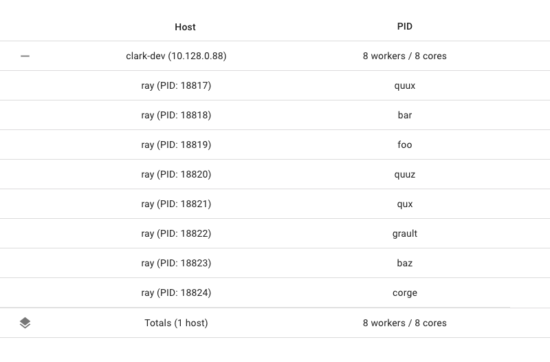

Miscellaneous Topics
====================

This page will cover some miscellaneous topics in Ray.

.. contents::
  :local:

Dynamic Remote Parameters
-------------------------

You can dynamically adjust resource requirements or return values of ``ray.remote`` during execution with ``.options``.

For example, here we instantiate many copies of the same actor with varying resource requirements. Note that to create these actors successfully, Ray will need to be started with sufficient CPU resources and the relevant custom resources:

.. code-block:: python

  @ray.remote(num_cpus=4)
  class Counter(object):
      def __init__(self):
          self.value = 0

      def increment(self):
          self.value += 1
          return self.value

  a1 = Counter.options(num_cpus=1, resources={"Custom1": 1}).remote()
  a2 = Counter.options(num_cpus=2, resources={"Custom2": 1}).remote()
  a3 = Counter.options(num_cpus=3, resources={"Custom3": 1}).remote()

You can specify different resource requirements for tasks (but not for actor methods):

.. code-block:: python

    @ray.remote
    def g():
        return ray.get_gpu_ids()

    object_gpu_ids = g.remote()
    assert ray.get(object_gpu_ids) == [0]

    dynamic_object_gpu_ids = g.options(num_cpus=1, num_gpus=1).remote()
    assert ray.get(dynamic_object_gpu_ids) == [0]

And vary the number of return values for tasks (and actor methods too):

.. code-block:: python

    @ray.remote
    def f(n):
        return list(range(n))

    id1, id2 = f.options(num_returns=2).remote(2)
    assert ray.get(id1) == 0
    assert ray.get(id2) == 1

And specify a name for tasks (and actor methods too) at task submission time:

.. code-block:: python

   import setproctitle

   @ray.remote
   def f(x):
      assert setproctitle.getproctitle() == "ray::special_f"
      return x + 1

   obj = f.options(name="special_f").remote(3)
   assert ray.get(obj) == 4

This name will appear as the task name in the machine view of the dashboard, will appear
as the worker process name when this task is executing (if a Python task), and will
appear as the task name in the logs.

.. _accelerator-types:

Accelerator Types
------------------

Ray supports resource specific accelerator types. The `accelerator_type` field can be used to force to a task to run on a node with a specific type of accelerator. Under the hood, the accelerator type option is implemented as a custom resource demand of ``"accelerator_type:<type>": 0.001``. This forces the task to be placed on a node with that particular accelerator type available. This also lets the multi-node-type autoscaler know that there is demand for that type of resource, potentially triggering the launch of new nodes providing that accelerator.

.. code-block:: python

    from ray.accelerators import NVIDIA_TESLA_V100

    @ray.remote(num_gpus=1, accelerator_type=NVIDIA_TESLA_V100)
    def train(data):
        return "This function was run on a node with a Tesla V100 GPU"

See `ray.util.accelerators` to see available accelerator types. Current automatically detected accelerator types include Nvidia GPUs.

Overloaded Functions
--------------------
Ray Java API supports calling overloaded java functions remotely. However, due to the limitation of Java compiler type inference, one must explicitly cast the method reference to the correct function type. For example, consider the following.

Overloaded normal task call:

.. code:: java

    public static class MyRayApp {

      public static int overloadFunction() {
        return 1;
      }

      public static int overloadFunction(int x) {
        return x;
      }
    }

    // Invoke overloaded functions.
    Assert.assertEquals((int) Ray.task((RayFunc0<Integer>) MyRayApp::overloadFunction).remote().get(), 1);
    Assert.assertEquals((int) Ray.task((RayFunc1<Integer, Integer>) MyRayApp::overloadFunction, 2).remote().get(), 2);

Overloaded actor task call:

.. code:: java

    public static class Counter {
      protected int value = 0;

      public int increment() {
        this.value += 1;
        return this.value;
      }
    }

    public static class CounterOverloaded extends Counter {
      public int increment(int diff) {
        super.value += diff;
        return super.value;
      }

      public int increment(int diff1, int diff2) {
        super.value += diff1 + diff2;
        return super.value;
      }
    }

.. code:: java

    ActorHandle<CounterOverloaded> a = Ray.actor(CounterOverloaded::new).remote();
    // Call an overloaded actor method by super class method reference.
    Assert.assertEquals((int) a.task(Counter::increment).remote().get(), 1);
    // Call an overloaded actor method, cast method reference first.
    a.task((RayFunc1<CounterOverloaded, Integer>) CounterOverloaded::increment).remote();
    a.task((RayFunc2<CounterOverloaded, Integer, Integer>) CounterOverloaded::increment, 10).remote();
    a.task((RayFunc3<CounterOverloaded, Integer, Integer, Integer>) CounterOverloaded::increment, 10, 10).remote();
    Assert.assertEquals((int) a.task(Counter::increment).remote().get(), 33);

Inspecting Cluster State
------------------------

Applications written on top of Ray will often want to have some information
or diagnostics about the cluster. Some common questions include:

    1. How many nodes are in my autoscaling cluster?
    2. What resources are currently available in my cluster, both used and total?
    3. What are the objects currently in my cluster?

For this, you can use the global state API.

Node Information
~~~~~~~~~~~~~~~~

To get information about the current nodes in your cluster, you can use ``ray.nodes()``:

.. autofunction:: ray.nodes
    :noindex:

.. code-block:: python

    import ray

    ray.init()

    print(ray.nodes())

    """
    [{'NodeID': '2691a0c1aed6f45e262b2372baf58871734332d7',
      'Alive': True,
      'NodeManagerAddress': '192.168.1.82',
      'NodeManagerHostname': 'host-MBP.attlocal.net',
      'NodeManagerPort': 58472,
      'ObjectManagerPort': 52383,
      'ObjectStoreSocketName': '/tmp/ray/session_2020-08-04_11-00-17_114725_17883/sockets/plasma_store',
      'RayletSocketName': '/tmp/ray/session_2020-08-04_11-00-17_114725_17883/sockets/raylet',
      'MetricsExportPort': 64860,
      'alive': True,
      'Resources': {'CPU': 16.0, 'memory': 100.0, 'object_store_memory': 34.0, 'node:192.168.1.82': 1.0}}]
    """

The above information includes:

  - `NodeID`: A unique identifier for the raylet.
  - `alive`: Whether the node is still alive.
  - `NodeManagerAddress`: PrivateIP of the node that the raylet is on.
  - `Resources`: The total resource capacity on the node.
  - `MetricsExportPort`: The port number at which metrics are exposed to through a `Prometheus endpoint <ray-metrics.html>`_.

Resource Information
~~~~~~~~~~~~~~~~~~~~

To get information about the current total resource capacity of your cluster, you can use ``ray.cluster_resources()``.

.. autofunction:: ray.cluster_resources
    :noindex:

To get information about the current available resource capacity of your cluster, you can use ``ray.available_resources()``.

.. autofunction:: ray.available_resources
    :noindex:
