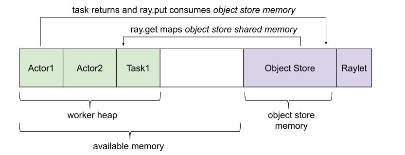

.. _memory:

Memory Management
=================

This page describes how memory management works in Ray.

Concepts
~~~~~~~~

There are several ways that Ray applications use memory:

..
  https://docs.google.com/drawings/d/1wHHnAJZ-NsyIv3TUXQJTYpPz6pjB6PUm2M40Zbfb1Ak/edit

Ray system memory: this is memory used internally by Ray
  - **GCS**: memory used for storing the list of nodes and actors present in the cluster. The amount of memory used for these purposes is typically quite small.
  - **Raylet**: memory used by the C++ raylet process running on each node. This cannot be controlled, but is typically quite small.

Application memory: this is memory used by your application
  - **Worker heap**: memory used by your application (e.g., in Python code or TensorFlow), best measured as the *resident set size (RSS)* of your application minus its *shared memory usage (SHR)* in commands such as ``top``. The reason you need to subtract *SHR* is that object store shared memory is reported by the OS as shared with each worker. Not subtracting *SHR* will result in double counting memory usage.
  - **Object store memory**: memory used when your application creates objects in the object store via ``ray.put`` and when returning values from remote functions. Objects are reference counted and evicted when they fall out of scope. There is an object store server running on each node. In Ray 1.3+, objects will be `spilled to disk <object-spilling.html>`__ if the object store fills up.
  - **Object store shared memory**: memory used when your application reads objects via ``ray.get``. Note that if an object is already present on the node, this does not cause additional allocations. This allows large objects to be efficiently shared among many actors and tasks.

ObjectRef Reference Counting
----------------------------

Ray implements distributed reference counting so that any ``ObjectRef`` in scope in the cluster is pinned in the object store. This includes local python references, arguments to pending tasks, and IDs serialized inside of other objects.

Debugging using 'ray memory'
~~~~~~~~~~~~~~~~~~~~~~~~~~~~

The ``ray memory`` command can be used to help track down what ``ObjectRef`` references are in scope and may be causing an ``ObjectStoreFullError``.

Running ``ray memory`` from the command line while a Ray application is running will give you a dump of all of the ``ObjectRef`` references that are currently held by the driver, actors, and tasks in the cluster.

.. code-block:: text

  ======== Object references status: 2021-02-23 22:02:22.072221 ========
  Grouping by node address...        Sorting by object size...

  --- Summary for node address: 192.168.0.15 ---
  Mem Used by Objects  Local References  Pinned Count  Pending Tasks  Captured in Objects  Actor Handles
  287 MiB              4                 0             0              1                    0            

  --- Object references for node address: 192.168.0.15 ---
  IP Address    PID    Type    Object Ref                                                Size    Reference Type      Call Site             
  192.168.0.15  6465   Driver  ffffffffffffffffffffffffffffffffffffffff0100000001000000  15 MiB  LOCAL_REFERENCE     (put object)
                                                                                                                    | test.py:
                                                                                                                    <module>:17           

  192.168.0.15  6465   Driver  a67dc375e60ddd1affffffffffffffffffffffff0100000001000000  15 MiB  LOCAL_REFERENCE     (task call)
                                                                                                                    | test.py:
                                                                                                                    :<module>:18          

  192.168.0.15  6465   Driver  ffffffffffffffffffffffffffffffffffffffff0100000002000000  18 MiB  CAPTURED_IN_OBJECT  (put object)  |
                                                                                                                     test.py:
                                                                                                                    <module>:19           

  192.168.0.15  6465   Driver  ffffffffffffffffffffffffffffffffffffffff0100000004000000  21 MiB  LOCAL_REFERENCE     (put object)  |
                                                                                                                     test.py:
                                                                                                                    <module>:20           

  192.168.0.15  6465   Driver  ffffffffffffffffffffffffffffffffffffffff0100000003000000  218 MiB  LOCAL_REFERENCE     (put object)  |
                                                                                                                    test.py:
                                                                                                                    <module>:20           

  --- Aggregate object store stats across all nodes ---
  Plasma memory usage 0 MiB, 4 objects, 0.0% full

Each entry in this output corresponds to an ``ObjectRef`` that's currently pinning an object in the object store along with where the reference is (in the driver, in a worker, etc.), what type of reference it is (see below for details on the types of references), the size of the object in bytes, the process ID and IP address where the object was instantiated, and where in the application the reference was created.

``ray memory`` comes with features to make the memory debugging experience more effective. For example, you can add arguments ``sort-by=OBJECT_SIZE`` and ``group-by=STACK_TRACE``, which may be particularly helpful for tracking down the line of code where a memory leak occurs. You can see the full suite of options by running ``ray memory --help``.  

There are five types of references that can keep an object pinned:

**1. Local ObjectRef references**

.. code-block:: python

  @ray.remote
  def f(arg):
      return arg

  a = ray.put(None)
  b = f.remote(None)

In this example, we create references to two objects: one that is ``ray.put()`` in the object store and another that's the return value from ``f.remote()``.

.. code-block:: text

  --- Summary for node address: 192.168.0.15 ---
  Mem Used by Objects  Local References  Pinned Count  Pending Tasks  Captured in Objects  Actor Handles
  30 MiB               2                 0             0              0                    0            

  --- Object references for node address: 192.168.0.15 ---
  IP Address    PID    Type    Object Ref                                                Size    Reference Type      Call Site             
  192.168.0.15  6867   Driver  ffffffffffffffffffffffffffffffffffffffff0100000001000000  15 MiB  LOCAL_REFERENCE     (put object)  |
                                                                                                                    test.py:
                                                                                                                    <module>:12           

  192.168.0.15  6867   Driver  a67dc375e60ddd1affffffffffffffffffffffff0100000001000000  15 MiB  LOCAL_REFERENCE     (task call)
                                                                                                                    | test.py:
                                                                                                                    :<module>:13

In the output from ``ray memory``, we can see that each of these is marked as a ``LOCAL_REFERENCE`` in the driver process, but the annotation in the "Reference Creation Site" indicates that the first was created as a "put object" and the second from a "task call."

**2. Objects pinned in memory**

.. code-block:: python

  import numpy as np

  a = ray.put(np.zeros(1))
  b = ray.get(a)
  del a

In this example, we create a ``numpy`` array and then store it in the object store. Then, we fetch the same numpy array from the object store and delete its ``ObjectRef``. In this case, the object is still pinned in the object store because the deserialized copy (stored in ``b``) points directly to the memory in the object store.

.. code-block:: text

  --- Summary for node address: 192.168.0.15 ---
  Mem Used by Objects  Local References  Pinned Count  Pending Tasks  Captured in Objects  Actor Handles
  243 MiB              0                 1             0              0                    0            

  --- Object references for node address: 192.168.0.15 ---
  IP Address    PID    Type    Object Ref                                                Size    Reference Type      Call Site             
  192.168.0.15  7066   Driver  ffffffffffffffffffffffffffffffffffffffff0100000001000000  243 MiB  PINNED_IN_MEMORY   test.
                                                                                                                    py:<module>:19

The output from ``ray memory`` displays this as the object being ``PINNED_IN_MEMORY``. If we ``del b``, the reference can be freed.

**3. Pending task references**

.. code-block:: python

  @ray.remote
  def f(arg):
      while True:
          pass

  a = ray.put(None)
  b = f.remote(a)

In this example, we first create an object via ``ray.put()`` and then submit a task that depends on the object.

.. code-block:: text

  --- Summary for node address: 192.168.0.15 ---
  Mem Used by Objects  Local References  Pinned Count  Pending Tasks  Captured in Objects  Actor Handles
  25 MiB               1                 1             1              0                    0            

  --- Object references for node address: 192.168.0.15 ---
  IP Address    PID    Type    Object Ref                                                Size    Reference Type      Call Site             
  192.168.0.15  7207   Driver  a67dc375e60ddd1affffffffffffffffffffffff0100000001000000  ?       LOCAL_REFERENCE     (task call) 
                                                                                                                      | test.py:
                                                                                                                    :<module>:29          

  192.168.0.15  7241   Worker  ffffffffffffffffffffffffffffffffffffffff0100000001000000  10 MiB  PINNED_IN_MEMORY    (deserialize task arg)
                                                                                                                      __main__.f           

  192.168.0.15  7207   Driver  ffffffffffffffffffffffffffffffffffffffff0100000001000000  15 MiB  USED_BY_PENDING_TASK  (put object)  |
                                                                                                                    test.py:
                                                                                                                    <module>:28

While the task is running, we see that ``ray memory`` shows both a ``LOCAL_REFERENCE`` and a ``USED_BY_PENDING_TASK`` reference for the object in the driver process. The worker process also holds a reference to the object because it is ``PINNED_IN_MEMORY``, because the Python ``arg`` is directly referencing the memory in the plasma, so it can't be evicted.

**4. Serialized ObjectRef references**

.. code-block:: python

  @ray.remote
  def f(arg):
      while True:
          pass

  a = ray.put(None)
  b = f.remote([a])

In this example, we again create an object via ``ray.put()``, but then pass it to a task wrapped in another object (in this case, a list).

.. code-block:: text

  --- Summary for node address: 192.168.0.15 ---
  Mem Used by Objects  Local References  Pinned Count  Pending Tasks  Captured in Objects  Actor Handles
  15 MiB               2                 0             1              0                    0            

  --- Object references for node address: 192.168.0.15 ---
  IP Address    PID    Type    Object Ref                                                Size    Reference Type      Call Site             
  192.168.0.15  7411   Worker  ffffffffffffffffffffffffffffffffffffffff0100000001000000  ?       LOCAL_REFERENCE     (deserialize task arg)
                                                                                                                      __main__.f           

  192.168.0.15  7373   Driver  a67dc375e60ddd1affffffffffffffffffffffff0100000001000000  ?       LOCAL_REFERENCE     (task call)  
                                                                                                                    | test.py:
                                                                                                                    :<module>:38          

  192.168.0.15  7373   Driver  ffffffffffffffffffffffffffffffffffffffff0100000001000000  15 MiB  USED_BY_PENDING_TASK  (put object) 
                                                                                                                    | test.py:
                                                                                                                    <module>:37

Now, both the driver and the worker process running the task hold a ``LOCAL_REFERENCE`` to the object in addition to it being ``USED_BY_PENDING_TASK`` on the driver. If this was an actor task, the actor could even hold a ``LOCAL_REFERENCE`` after the task completes by storing the ``ObjectRef`` in a member variable.

**5. Captured ObjectRef references**

.. code-block:: python

  a = ray.put(None)
  b = ray.put([a])
  del a

In this example, we first create an object via ``ray.put()``, then capture its ``ObjectRef`` inside of another ``ray.put()`` object, and delete the first ``ObjectRef``. In this case, both objects are still pinned.

.. code-block:: text

  --- Summary for node address: 192.168.0.15 ---
  Mem Used by Objects  Local References  Pinned Count  Pending Tasks  Captured in Objects  Actor Handles
  233 MiB              1                 0             0              1                    0            

  --- Object references for node address: 192.168.0.15 ---
  IP Address    PID    Type    Object Ref                                                Size    Reference Type      Call Site             
  192.168.0.15  7473   Driver  ffffffffffffffffffffffffffffffffffffffff0100000001000000  15 MiB  CAPTURED_IN_OBJECT  (put object)  |
                                                                                                                    test.py:
                                                                                                                    <module>:41           

  192.168.0.15  7473   Driver  ffffffffffffffffffffffffffffffffffffffff0100000002000000  218 MiB  LOCAL_REFERENCE     (put object)  |
                                                                                                                    test.py:
                                                                                                                    <module>:42 

In the output of ``ray memory``, we see that the second object displays as a normal ``LOCAL_REFERENCE``, but the first object is listed as ``CAPTURED_IN_OBJECT``.

Memory Aware Scheduling
~~~~~~~~~~~~~~~~~~~~~~~

By default, Ray does not take into account the potential memory usage of a task or actor when scheduling. This is simply because it cannot estimate ahead of time how much memory is required. However, if you know how much memory a task or actor requires, you can specify it in the resource requirements of its ``ray.remote`` decorator to enable memory-aware scheduling:

.. important::

  Specifying a memory requirement does NOT impose any limits on memory usage. The requirements are used for admission control during scheduling only (similar to how CPU scheduling works in Ray). It is up to the task itself to not use more memory than it requested.

To tell the Ray scheduler a task or actor requires a certain amount of available memory to run, set the ``memory`` argument. The Ray scheduler will then reserve the specified amount of available memory during scheduling, similar to how it handles CPU and GPU resources:

.. code-block:: python

  # reserve 500MiB of available memory to place this task
  @ray.remote(memory=500 * 1024 * 1024)
  def some_function(x):
      pass

  # reserve 2.5GiB of available memory to place this actor
  @ray.remote(memory=2500 * 1024 * 1024)
  class SomeActor(object):
      def __init__(self, a, b):
          pass

In the above example, the memory quota is specified statically by the decorator, but you can also set them dynamically at runtime using ``.options()`` as follows:

.. code-block:: python

  # override the memory quota to 100MiB when submitting the task
  some_function.options(memory=100 * 1024 * 1024).remote(x=1)

  # override the memory quota to 1GiB when creating the actor
  SomeActor.options(memory=1000 * 1024 * 1024).remote(a=1, b=2)

Questions or Issues?
--------------------

.. include:: /_includes/_help.rst
