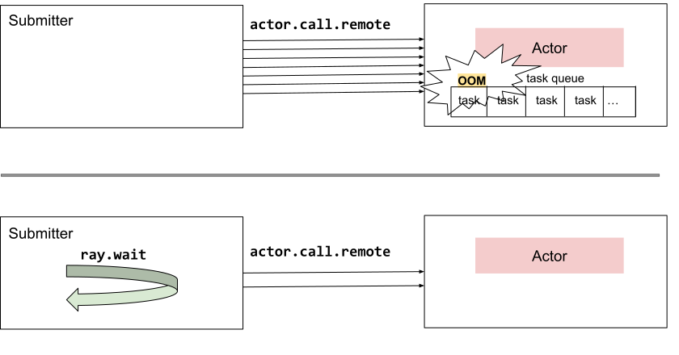

.. _core-patterns-limit-pending-tasks:

Pattern: Using ray.wait to limit the number of pending tasks
============================================================

In this pattern, we use :ref:`ray.wait() <ray-wait-ref>` to limit the number of pending tasks.

If we continuously submit tasks faster than their process time, we will accumulate tasks in the pending task queue, which can eventually cause OOM.
With ``ray.wait()``, we can apply backpressure and limit the number of pending tasks so that the pending task queue won't grow indefinitely and cause OOM.

.. note::

   If we submit a finite number of tasks, it's unlikely that we will hit the issue mentioned above since each task only uses a small amount of memory for bookkeeping in the queue.
   It's more likely to happen when we have an infinite stream of tasks to run.

.. note::

   This method is meant primarily to limit how many tasks should be in flight at the same time.
   It can also be used to limit how many tasks can run *concurrently*, but it is not recommended, as it can hurt scheduling performance.
   Ray automatically decides task parallelism based on resource availability, so the recommended method for adjusting how many tasks can run concurrently is to :ref:`modify each task's resource requirements <core-patterns-limit-running-tasks>` instead.

Example use case
----------------

You have a worker actor that process tasks at a rate of X tasks per second and you want to submit tasks to it at a rate lower than X to avoid OOM.

For example, Ray Serve uses this pattern to limit the number of pending queries for each worker.

    Limit number of pending tasks

Code example
------------

**Without backpressure:**

.. literalinclude:: ../doc_code/limit_pending_tasks.py
    :language: python
    :start-after: __without_backpressure_start__
    :end-before: __without_backpressure_end__

**With backpressure:**

.. literalinclude:: ../doc_code/limit_pending_tasks.py
    :language: python
    :start-after: __with_backpressure_start__
    :end-before: __with_backpressure_end__
