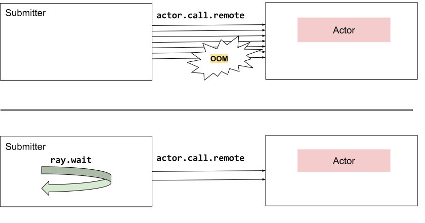

Pattern: Using ray.wait to limit the number of in-flight tasks
==============================================================

In this pattern, we use :ref:`ray.wait() <ray-wait-ref>` to limit the number of in-flight tasks.

If we submit tasks faster than their process time, we will have tasks accumulated in the pending task queue, which will eventually cause OOM.
With ``ray.wait()``, we can apply backpressure and limit the number of in-flight tasks so that the pending task queue won't grow indefinitely and cause OOM.

Example use case
----------------

You have a worker actor that process tasks at a rate of X tasks per second and you want to submit tasks to it at a rate lower than X to avoid OOM.

Ray Serve uses this pattern to limit the number of in-flight queries for each worker.

    Limit number of in-flight tasks

Code example
------------

**Without backpressure:**

.. literalinclude:: ../doc_code/limit_tasks.py
    :language: python
    :start-after: __without_backpressure_start__
    :end-before: __without_backpressure_end__

**With backpressure:**

.. literalinclude:: ../doc_code/limit_tasks.py
    :language: python
    :start-after: __with_backpressure_start__
    :end-before: __with_backpressure_end__
