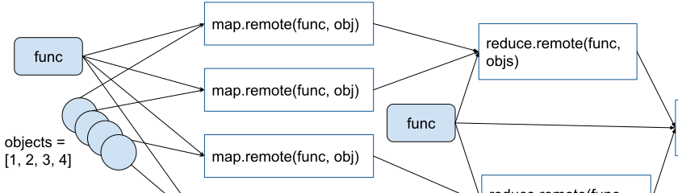

Pattern: Using tasks to execute MapReduce
=========================================

In this pattern, Ray remote tasks can be used to implement the MapReduce paradigm.
For the ``map`` stage, we can submit multiple tasks to process data in a distributed and parallel fashion.
For the ``reduce`` stage, we use task arguments to fetch the results of each of these map tasks implicitly and aggregate on them.

.. note::

  It's generally recommended to use the high level Ray :ref:`Datasets <datasets>` library to do MapReduce than the low level Ray tasks.
  The relevant APIs are :meth:`map_batches <ray.data.Dataset.map_batches>`, :meth:`aggregate <ray.data.Dataset.aggregate>` and :meth:`groupby <ray.data.Dataset.groupby>`.

Example use case
----------------

Use Ray tasks to calculate the sum of a doubled list of integers in a MapReduce fasion.

    Map and reduce

Code examples
-------------

**Single-threaded MapReduce:**

.. literalinclude:: ../doc_code/pattern_map_reduce.py
    :language: python
    :start-after: __single_threaded_map_reduce_start__
    :end-before: __single_threaded_map_reduce_end__

**Ray parallel MapReduce:**

.. literalinclude:: ../doc_code/pattern_map_reduce.py
    :language: python
    :start-after: __parallel_map_reduce_start__
    :end-before: __parallel_map_reduce_end__
