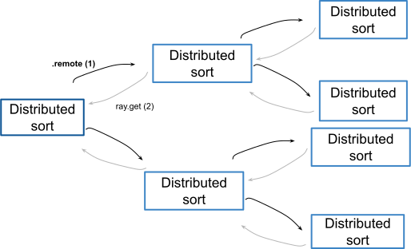

.. _task-pattern-nested-tasks:

Pattern: Using nested tasks to achieve nested parallelism
=========================================================

In this pattern, a remote task can dynamically call other remote tasks (including itself) for nested parallelism.
This is useful when sub-tasks can be parallelized.

Keep in mind, though, that nested tasks come with their own cost: extra worker processes, scheduling overhead, bookkeeping overhead, etc.
To achieve speedup with nested parallelism, make sure each of your nested tasks does significant work. See :doc:`too-fine-grained-tasks` for more details.

Example use case
----------------

You want to quick-sort a large list of numbers.
By using nested tasks, we can sort the list in a distributed and parallel fashion.

    Tree of tasks

Code example
------------

.. literalinclude:: ../doc_code/pattern_nested_tasks.py
    :language: python
    :start-after: __pattern_start__
    :end-before: __pattern_end__

We call :ref:`ray.get() <ray-get-ref>` after both ``quick_sort_distributed`` function invocations take place.
This allows you to maximize parallelism in the workload. See :doc:`ray-get-loop` for more details.

Notice in the execution times above that with smaller tasks, the non-distributed version is faster. However, as the task execution
time increases, i.e. because the lists to sort are larger, the distributed version is faster.
